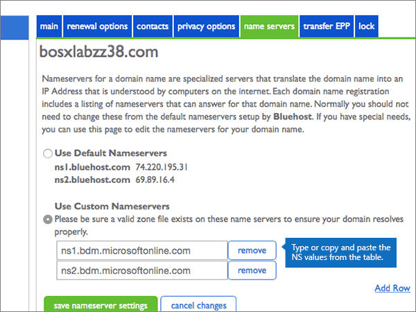
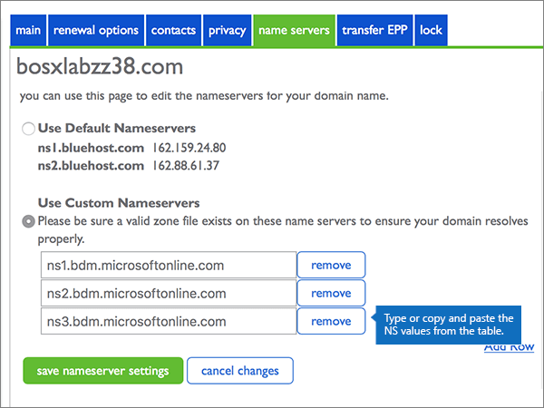

# Cambiar los servidores DNS para configurar Office 365 con BluehostChange nameservers to set up Office 365 with Bluehost

 **[Consulte Preguntas más frecuentes acerca de los dominios](../setup/domains-faq.md)** si no encuentra lo que busca.**[Check the Domains FAQ](../setup/domains-faq.md)** if you don't find what you're looking for. 
  
Siga estas instrucciones si quiere que Office 365 administre automáticamente los registros DNS de Office 365. (Si lo prefiere, puede [administrar todos los registros DNS de Office 365 en Bluehost](create-dns-records-at-bluehost.md)).Follow these instructions if you want Office 365 to manage your Office 365 DNS records for you. (If you prefer, you can [manage all your Office 365 DNS records at Bluehost](create-dns-records-at-bluehost.md).)
  
## Agregar un registro TXT para verificaciónAdd a TXT record for verification

Para que pueda usar el dominio con Office 365, tenemos que asegurarnos de que es de su propiedad. Si puede iniciar sesión en la cuenta en su registrador de dominios y crear el registro DNS, Office 365 sabrá que es el propietario del dominio.Before you use your domain with Office 365, we have to make sure that you own it. Your ability to log in to your account at your domain registrar and create the DNS record proves to Office 365 that you own the domain.
  
> [!NOTE]
> Este registro se usa exclusivamente para verificar si se es el propietario de un dominio; no afecta a nada más. Puede eliminarlo más adelante, si lo desea.This record is used only to verify that you own your domain; it doesn't affect anything else. You can delete it later, if you like. 
  
1. Para empezar, vaya a su página de dominios en Bluehost a través de [este vínculo](https://my.bluehost.com/cgi/dm).To get started, go to your domains page at Bluehost by using [this link](https://my.bluehost.com/cgi/dm). Se le pedirá que inicie sesión primero .You'll be prompted to log in first.
    
2. En la página **dominios**, en el área **dominio**, encuentre la fila del dominio que quiere cambiar y, a continuación, seleccione la casilla que corresponde a ese dominio.On the **domains** page, in the **domain** area, find the row for the domain that you're changing, and then select the check box for that domain. 
    
    (Es posible que tenga que desplazarse hacia abajo).(You may have to scroll down.) 
    
3. En el área **domain_name** , en la fila editor de la **zona DNS** , seleccione **administrar registros DNS**.In the **domain_name** area, on the **DNS Zone Editor** row, select **Manage DNS records**.
    
4. On the **DNS Zone Editor** page, in the Add DNS Record area, in the boxes for the new record, type or copy and paste the values from the following table.On the **DNS Zone Editor** page, in the Add DNS Record area, in the boxes for the new record, type or copy and paste the values from the following table. 
    
    (Choose the **Type** value from the drop-down list.)(Choose the **Type** value from the drop-down list.) 
    
|||||
|:-----|:-----|:-----|:-----|
|**Host Record****Host Record**   |**TTL****TTL**   |**Tipo****Type**   |**TXT Value****TXT Value**   |
|@    |1440014400    |TXTTXT    |MS=ms *XXXXXXXX*MS=ms *XXXXXXXX*   **Nota:** esto es un ejemplo.**Note:** This is an example. Use su valor **Dirección de destino** específico aquí, de la tabla de Office 365.Use your specific **Destination or Points to Address** value here, from the table in Office 365. [¿Cómo puedo encontrar esto?How do I find this?](../get-help-with-domains/information-for-dns-records.md)   |

   
5. Seleccione **Agregar registro**.Select **add record**.
    
6. Espere unos minutos antes de continuar para que el registro que acaba de crear pueda actualizarse en Internet.Wait a few minutes before you continue, so that the record you just created can update across the Internet.
    
Ahora que ha agregado el registro en el sitio de su registrador de dominios, volverá a Office 365 y solicitará que Office 365 lo busque.Now that you've added the record at your domain registrar's site, you'll go back to Office 365 and request Office 365 to look for the record.
  
Cuando Office 365 encuentre el registro TXT correcto, se comprobará su dominio.When Office 365 finds the correct TXT record, your domain is verified.
  
1. En el centro de administración, diríjase a la página **configuración** \> <a href="https://go.microsoft.com/fwlink/p/?linkid=834818" target="_blank">dominios</a>.In the admin center, go to the **Settings** \> <a href="https://go.microsoft.com/fwlink/p/?linkid=834818" target="_blank">Domains</a> page.

    
2. En la página **Dominios**, elija el dominio que está verificando.On the **Domains** page, select the domain that you are verifying. 
    
3. En la página de **Configuración**, elija \*\* Iniciar configuración\*\*.On the **Setup** page, select **Start setup**.
    
4. En la página**Verificar dominio**, elija **Verificar**.On the **Verify domain** page, select **Verify**.
    
> [!NOTE]
> Normalmente, se necesitan unos 15 minutos para que los cambios de DNS surtan efecto.Typically it takes about 15 minutes for DNS changes to take effect. Sin embargo, a veces los cambios pueden necesitar más tiempo para aplicarse en todo el sistema DNS de Internet.However, it can occasionally take longer for a change you've made to update across the Internet's DNS system. Si tiene problemas con el flujo de correo u otros problemas después de agregar registros DNS, consulte [Encontrar y solucionar problemas después de agregar el dominio o registros DNS en Office 365](../get-help-with-domains/find-and-fix-issues.md).If you're having trouble with mail flow or other issues after adding DNS records, see [Find and fix issues after adding your domain or DNS records in Office 365](../get-help-with-domains/find-and-fix-issues.md). 
  
## Cambiar los registros del servidor de nombres (o NS) de su dominioChange your domain's nameserver (NS) records

Para completar la configuración del dominio con Office 365, debe cambiar los registros NS del dominio en su registrador de dominios para que apunten a los servidores DNS primario y secundario de Office 365. Esto configura Office 365 para actualizar los registros DNS del dominio. Agregaremos todos los registros para que el correo electrónico, Skype Empresarial Online y su sitio web público funcionen con su dominio, y ya lo tendrá todo preparado.To complete setting up your domain with Office 365, you change your domain's NS records at your domain registrar to point to the Office 365 primary and secondary name servers. This sets up Office 365 to update the domain's DNS records for you. We'll add all records so that email, Skype for Business Online, and your public website work with your domain, and you'll be all set.
  
> [!CAUTION]
> Si cambia los registros NS del dominio para que apunten a los servidores DNS de Office 365, esto afectará a todos los servicios que estén asociados actualmente con su dominio. Por ejemplo, todos los correos que se envíen a su dominio (como, por ejemplo, rob@ *su_dominio*  .com) comenzarán a llegar a Office 365 después de realizar este cambio.When you change your domain's NS records to point to the Office 365 name servers, all the services that are currently associated with your domain are affected. For example, all email sent to your domain (like rob@ *your_domain*  .com) will start coming to Office 365 after you make this change. 
  
> [!IMPORTANT]
>  El siguiente procedimiento le mostrará cómo eliminar cualquier otro de los servidores de nombres no deseados de la lista, y también cómo agregar los servidores de nombres correctos si aún no aparecen.The following procedure will show you how to delete any other, unwanted nameservers from the list, and also how to add the correct nameservers if they are not already listed. > cuando haya completado los pasos de esta sección, los únicos servidores DNS que se deben enumerar son los cuatro: > ns1.bdm.microsoftonline.com > ns2.bdm.microsoftonline.com > ns3.bdm.microsoftonline.com > ns4.bdm.microsoftonline.com>  When you have completed the steps in this section, the only nameservers that should be listed are these four: >  ns1.bdm.microsoftonline.com >  ns2.bdm.microsoftonline.com >  ns3.bdm.microsoftonline.com >  ns4.bdm.microsoftonline.com 
  
1. Para empezar, vaya a su página de dominios en Bluehost a través de [este vínculo](https://my.bluehost.com/cgi/dm).To get started, go to your domains page at Bluehost by using [this link](https://my.bluehost.com/cgi/dm). Se le pedirá que inicie sesión primero .You'll be prompted to log in first.
    
2. En la página **dominios** , en el área **domain_name** , active la casilla correspondiente a su dominio y, a continuación, seleccione **servidores de nombres**.On the **domains** page, in the **domain_name** area, select the checkbox for your domain, and then select **name servers**.
    
    
  
3. En el área **domain_name** , seleccione **usar servidores DNS personalizados**.In the **domain_name** area, select **Use Custom Nameservers**.
    
    
  
4. Dependiendo de si ya existen o no servidores de nombres enumerados en la página que se muestra ahora, continúe con uno de los dos procedimientos siguientes:Depending on whether or not there are already nameservers listed on the page that is displayed now, continue to one of the two following procedures:
    
  - Si aún **NO** se muestran servidores DNS en la lista, [Si aún NO se muestran servidores DNS en la lista](#if-there-are-no-nameservers-already-listed).If there are **NO** nameservers already listed, [If there are NO nameservers already listed](#if-there-are-no-nameservers-already-listed).
    
  - Si **YA** se muestran servidores DNS en la lista, [Si ya existen servidores de nombres enumerados](#if-there-are-nameservers-already-listed).If there **ARE** nameservers already listed, [If there ARE nameservers already listed](#if-there-are-nameservers-already-listed).
    
### Si aún NO se muestran servidores DNS en la listaIf there are NO nameservers already listed

1. En la sección **Usar servidores DNS personalizados**, escriba (o copie y pegue) los valores de la tabla siguiente.In the **Use Custom Nameservers** section, type or copy and paste the values from the following table. 
    
|||
|:-----|:-----|
|**Primera fila vacía****First empty row**   |ns1.bdm.microsoftonline.comns1.bdm.microsoftonline.com    |
|**Segunda fila vacía****Second empty row**   |ns2.bdm.microsoftonline.comns2.bdm.microsoftonline.com    |
   
   
  
2. Seleccione **Agregar fila**.Select **Add Row**.
    
    
  
3. En la sección **Usar servidores de nombre personalizados**, escriba (o copie y pegue) los valores de la primera fila de la tabla siguiente en la nueva fila vacía.Still in the **Use Custom Nameservers** section, type or copy and paste the values from the first row of the following table into the new empty row. 
    
|||
|:-----|:-----|
|**Tercera fila vacía****Third empty row**   |ns3.bdm.microsoftonline.comns3.bdm.microsoftonline.com    |
|**Cuarta fila vacía****Fourth empty row**   |ns4.bdm.microsoftonline.comns4.bdm.microsoftonline.com    |
   
    
  
4. Para agregar el cuarto registro de servidor de nombres, seleccione **Agregar fila** de nuevo y cree un registro con los valores de la última fila de la tabla anterior.To add the fourth Nameserver record, select **Add Row** again, and create a record using the values from the last row of the above table. 
    
5. Seleccione **Guardar configuración de servidor DNS**.Select **save nameserver settings**.
    
    
  
> [!NOTE]
> Las actualizaciones de los registros de los servidores de nombres pueden tardar varias horas en propagarse por el sistema DNS de Internet. A continuación, su correo electrónico y otros servicios de Office 365 estarán listos para funcionar con su dominio.Your nameserver record updates may take up to several hours to update across the Internet's DNS system. Then your Office 365 email and other services will be all set to work with your domain. 
  
### Si ya existen servidores de nombres enumeradosIf there ARE nameservers already listed

> [!CAUTION]
> Follow these steps only if you have existing nameservers other than the four correct nameservers.Follow these steps only if you have existing nameservers other than the four correct nameservers. (Es decir, elimine solo los servidores DNS actuales que *no* tengan el nombre **ns1.BDM.microsoftonline.com**, **NS2.BDM.microsoftonline.com**, **NS3.BDM.microsoftonline.com**o **NS4.BDM.microsoftonline.com**).(That is, delete only any current nameservers that are  *not*  named **ns1.bdm.microsoftonline.com**, **ns2.bdm.microsoftonline.com**, **ns3.bdm.microsoftonline.com**, or **ns4.bdm.microsoftonline.com**.) 
  
1. Si la lista contiene otros servidores DNS, elimínelos (para hacerlo, selecciónelos y, después, presione la tecla **Suprimir** en el teclado).If there are any other name servers listed, delete each of them by selecting it and then pressing the **Delete** key on your keyboard. 
    
    
  
2. En la sección **Usar servidores DNS personalizados**, escriba (o copie y pegue) los valores de la tabla siguiente.Still in the **Use Custom Nameservers** section, type or copy and paste the values from the following table. 
    
|||
|:-----|:-----|
|**Primera fila vacía****First empty row**   |ns1.bdm.microsoftonline.comns1.bdm.microsoftonline.com    |
|**Segunda fila vacía****Second empty row**   |ns2.bdm.microsoftonline.comns2.bdm.microsoftonline.com    |
   
   
  
3. Seleccione **Agregar fila**.Select **Add Row**.
    
    
  
4. En la sección **Usar servidores de nombre personalizados**, escriba (o copie y pegue) los valores de la primera fila de la tabla siguiente en la nueva fila vacía.Still in the **Use Custom Nameservers** section, type or copy and paste the values from the first row of the following table into the new empty row. 
    
|||
|:-----|:-----|
|**Tercera fila vacía****Third empty row**   |ns3.bdm.microsoftonline.comns3.bdm.microsoftonline.com    |
|**Cuarta fila vacía****Fourth empty row**   |ns4.bdm.microsoftonline.comns4.bdm.microsoftonline.com    |
   
   
  
5. Para agregar el cuarto registro de servidor de nombres, seleccione **Agregar fila** de nuevo y cree un registro con los valores de la última fila de la tabla anterior.To add the fourth Nameserver record, select **Add Row** again, and create a record using the values from the last row of the above table. 
    
6. Seleccione **Guardar configuración de servidor DNS**.Select **save nameserver settings**.
    
    
  
> [!NOTE]
> Las actualizaciones de los registros de los servidores de nombres pueden tardar varias horas en propagarse por el sistema DNS de Internet. A continuación, su correo electrónico y otros servicios de Office 365 estarán listos para funcionar con su dominio.Your nameserver record updates may take up to several hours to update across the Internet's DNS system. Then your Office 365 email and other services will be all set to work with your domain. 
  
