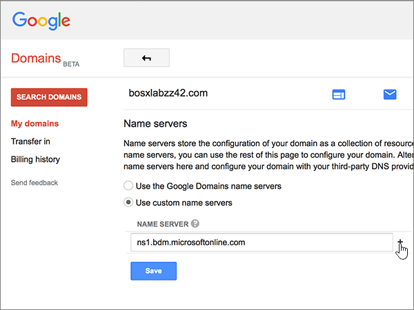
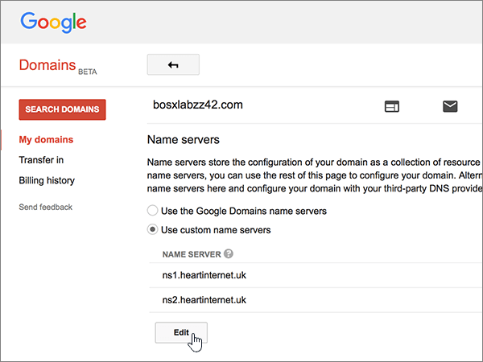

# Cambiar los servidores de nombres para configurar Office 365 con Google Domains

 **[Consulte Preguntas más frecuentes acerca de los dominios](../setup/domains-faq.md)** si no encuentra lo que busca. 
  
Siga estas instrucciones si quiere que Office 365 administre los registros de DNS de Office 365. (Si lo prefiere, puede [administrar todos los registros de DNS de Office 365 en Google Domains](create-dns-records-at-google-domains.md)).
  
    
## Agregar un registro TXT para verificación

Para que pueda usar el dominio con Office 365, tenemos que asegurarnos de que es de su propiedad. Si puede iniciar sesión en la cuenta en su registrador de dominios y crear el registro DNS, Office 365 sabrá que es el propietario del dominio.
  
> [!NOTE]
>  Este registro se usa exclusivamente para verificar si se es el propietario de un dominio; no afecta a nada más. Puede eliminarlo más adelante, si lo desea. 
  
1. Para empezar, vaya a su página de dominios en Google Domains a través de [este vínculo](https://domains.google.com/registrar). You'll be prompted to sign in. To do so:
    
1. Seleccione **iniciar sesión**.
    
2. Escriba sus credenciales de inicio de sesión y vuelva a seleccionar **iniciar sesión**.
    
2. En la página **dominios** , en la sección **dominio** , seleccione **configurar DNS** para el dominio que desea editar. 
    
3. In the **Custom resource records** section, in the boxes for the new record, type or copy and paste the values from the following table. 
    
    (You may have to scroll down.)
    
    (Choose the **Type** value from the drop-down list.) 
    
|||||
|:-----|:-----|:-----|:-----|
|**Name**   |**Type**   |**TTL**   |**Datos**   |
|@    |TXT    |1H    |MS=ms *XXXXXXXX*   **Nota:** Este es un ejemplo. Utilice aquí su valor de **Dirección o puntos de destino**, de la tabla de Office 365. [¿Cómo puedo encontrarlo?](../get-help-with-domains/information-for-dns-records.md)          |
   
4. Seleccione **Agregar**.
    
5. Espere unos minutos antes de continuar para que el registro que acaba de crear pueda actualizarse en Internet.
    
Now that you've added the record at your domain registrar's site, you'll go back to Office 365 and request Office 365 to look for the record.
  
When Office 365 finds the correct TXT record, your domain is verified.
  
1. En el centro de administración, vaya a la página **configuración** \> de <a href="https://go.microsoft.com/fwlink/p/?linkid=834818" target="_blank">dominios</a> .

    
2. En la página **dominios** , seleccione el dominio que desea comprobar. 
    
3. En la página **configuración** , seleccione **Iniciar configuración**.
    
4. En la página **comprobar dominio** , seleccione **comprobar**.
    
> [!NOTE]
> Typically it takes about 15 minutes for DNS changes to take effect. However, it can occasionally take longer for a change you've made to update across the Internet's DNS system. Si tiene problemas con el flujo de correo u otros problemas después de agregar registros DNS, consulte [Buscar y corregir problemas después de agregar el dominio o los registros DNS en Office 365](../get-help-with-domains/find-and-fix-issues.md). 
  
## Cambiar los registros del servidor de nombres (o NS) de su dominio

Para completar la configuración del dominio con Office 365, debe cambiar los registros NS del dominio en su registrador de dominios para que apunten a los servidores DNS primario y secundario de Office 365. Esto configura Office 365 para actualizar los registros DNS del dominio. Agregaremos todos los registros para que el correo electrónico, Skype Empresarial Online y su sitio web público funcionen con su dominio, y ya lo tendrá todo preparado.
  
> [!CAUTION]
> Si cambia los registros NS del dominio para que apunten a los servidores DNS de Office 365, esto afectará a todos los servicios que estén asociados actualmente con su dominio. Por ejemplo, todo el correo electrónico enviado a su dominio (como rob@ *your_domain.*  com) empezará a llegar a Office 365 después de realizar este cambio. 
  
> [!IMPORTANT]
> The following procedure will show you how to delete any other, unwanted nameservers from the list, and also how to add the correct nameservers if they are not already in the list. > cuando haya completado los pasos de esta sección, los únicos servidores DNS que se deben enumerar son estos cuatro: 
  
1. Para empezar, vaya a su página de dominios en Google Domains a través de [este vínculo](https://domains.google.com/registrar). Se le pedirá que inicie sesión. Para ello:
    
1. Seleccione **iniciar sesión**.
    
2. Escriba sus credenciales de inicio de sesión y, después, seleccione **iniciar sesión de**nuevo.
    
2. En la página **dominios** , en la sección **dominio** , seleccione **configurar DNS** para el dominio que desea editar. 
    
3. En la página **Dominios**, en la sección **Servidores de nombres**, seleccione **Use servidores de nombres personalizados**.
    
    
  
4. Dependiendo de si ya existen o no servidores de nombres enumerados en la página que se muestra ahora, continúe con uno de los dos procedimientos siguientes:
    
  - Si aún **NO** se muestran servidores DNS en la lista, [Si aún NO se muestran servidores DNS en la lista](#if-there-are-no-nameservers-already-listed).
    
  - Si **YA** se muestran servidores DNS en la lista, [Si ya existen servidores de nombres enumerados](#if-there-are-nameservers-already-listed).
    
### Si aún NO se muestran servidores DNS en la lista

1. Agregue el primer servidor de nombres.
    
    En la sección **Servidores de nombres**, en el cuadro **SERVIDOR DE NOMBRES**, escriba o copie y pegue el primer valor de la tabla siguiente. 
    
|||
|:-----|:-----|
|**Primer servidor de nombres**   |ns1.bdm.microsoftonline.com    |
|**Segundo servidor de nombres**   |ns2.bdm.microsoftonline.com    |
|**Tercer servidor de nombres**   |ns3.bdm.microsoftonline.com    |
|**Cuarto servidor de nombres**   |ns4.bdm.microsoftonline.com    |
   
   
  
2. Seleccione el control **+ (agregar)** para crear una fila vacía. 
    
    
  
3. Agregue los otros tres registros del servidor de nombres.
    
    En la sección **servidores de nombres personalizados** , cree un registro (para hacerlo, use los valores de la siguiente fila de la tabla y, a continuación, seleccione el control **+ (agregar)** para agregar otra fila. 
    
    Repita este proceso hasta que haya creado los cuatro registros de servidor de nombres.
    
4. Seleccione **Guardar**.
    
    
  
> [!NOTE]
> Las actualizaciones de los registros de los servidores de nombres pueden tardar varias horas en propagarse por el sistema DNS de Internet. A continuación, su correo electrónico y otros servicios de Office 365 estarán listos para funcionar con su dominio. 
  
### Si ya existen servidores de nombres enumerados

1. Si en la lista se muestran otros servidores DNS, seleccione **Editar**.
    
    > [!CAUTION]
    > Follow these steps only if you have existing nameservers other than the four correct nameservers. (Es decir, elimine solo los servidores DNS actuales que *no* tengan el nombre **ns1.BDM.microsoftonline.com**, **NS2.BDM.microsoftonline.com**, **NS3.BDM.microsoftonline.com**o **NS4.BDM.microsoftonline.com**). 
  
    
  
2. Elimine cada uno seleccionándolo y, después, presione la tecla **Eliminar** en el teclado. 
    
    
  
3. Aún en la sección **Servidores de nombres**, en las filas **Servidor de nombres**, escriba o copie y pegue los valores de la tabla siguiente. 
    
|||
|:-----|:-----|
|**Primer servidor de nombres**   |ns1.bdm.microsoftonline.com    |
|**Segundo servidor de nombres**   |ns2.bdm.microsoftonline.com    |
|**Tercer servidor de nombres**   |ns3.bdm.microsoftonline.com    |
|**Cuarto servidor de nombres**   |ns4.bdm.microsoftonline.com    |
   
   
  
4. Seleccione el control **+ (agregar)** para crear una fila vacía. 
    
    
  
5. Agregue los otros dos registros del servidor de nombres.
    
    En la sección **servidores de nombres personalizados** , cree un registro (para hacerlo, use los valores de la siguiente fila de la tabla y, a continuación, seleccione el control **+ (agregar)** para agregar otra fila. 
    
    Repita este proceso hasta que haya creado los cuatro registros de servidor de nombres.
    
6. Seleccione **Guardar**.
    
    
  
> [!NOTE]
> Las actualizaciones de los registros de los servidores de nombres pueden tardar varias horas en propagarse por el sistema DNS de Internet. A continuación, su correo electrónico y otros servicios de Office 365 estarán listos para funcionar con su dominio. 
  
