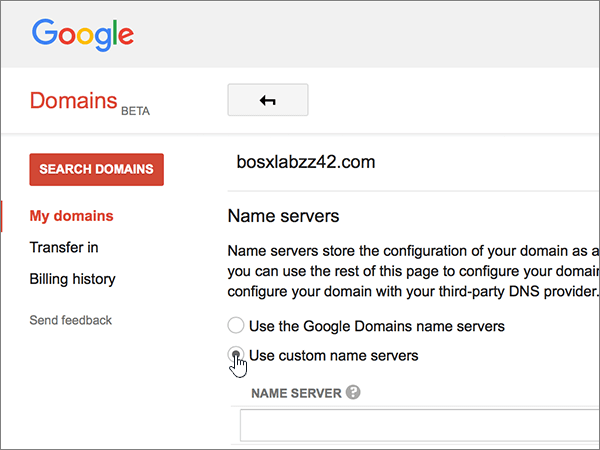
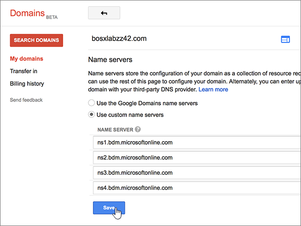

# Cambiar los servidores DNS para configurar Microsoft con Google Domains

 **[Consulte Preguntas más frecuentes acerca de los dominios](../setup/domains-faq.yml)** si no encuentra lo que busca. 
  
Siga estas instrucciones si desea que Microsoft administre los registros DNS por usted. (Si lo prefiere, puede [administrar todos los registros DNS en Google Domains](create-dns-records-at-google-domains.md)).
  
    
## Agregar un registro TXT para verificación

Antes de utilizar el dominio con Microsoft, tenemos que asegurarnos de que sea el propietario. Si puede iniciar sesión en la cuenta en el registrador de dominio y crear el registro DNS, Microsoft sabrá que es el propietario del dominio.
  
> [!NOTE]
>  Este registro se usa exclusivamente para verificar si se es el propietario de un dominio; no afecta a nada más. Puede eliminarlo más adelante, si lo desea. 
  
1. Para empezar, vaya a su página de dominios en Google Domains a través de [este vínculo](https://domains.google.com/registrar). You'll be prompted to sign in. To do so:
    
1. Seleccione **Iniciar sesión**.
    
2. Escriba sus credenciales de inicio de sesión y vuelva a seleccionar **iniciar sesión**.
    
2. En la página **Dominios**, en la sección **Dominio**, seleccione **Configurar DNS** para el dominio que quiera editar. 
    
3. En la sección **Registros de recursos personalizados**, en los cuadros para el nuevo registro, escriba o copie y pegue los valores que aparecen en la tabla siguiente. 
    
    (Es posible que tenga que desplazarse hacia abajo).
    
    (Elija el valor **Tipo** de la lista desplegable). 
    
|||||
|:-----|:-----|:-----|:-----|
|**Nombre**   |**Tipo**   |**TTL**   |**Datos**   |
|@    |TXT    |1H    |MS=ms *XXXXXXXX*   **Nota:** esto es un ejemplo. Utilice aquí su valor de **Dirección de destino**, desde la tabla. [¿Cómo puedo encontrar esto?](../get-help-with-domains/information-for-dns-records.md)          |
   
4. Elija **Agregar**.
    
5. Espere unos minutos antes de continuar para que el registro que acaba de crear pueda actualizarse en Internet.
    
Ahora que ha agregado el registro en el sitio del registrador de dominios, volverá a Microsoft y solicitará una búsqueda para el registro.
  
Cuando Microsoft encuentre el registro TXT correcto, se comprobará su dominio.
  
1. En el centro de administración de Microsoft, diríjase a la página **Configuración** \> <a href="https://go.microsoft.com/fwlink/p/?linkid=834818" target="_blank">Dominios</a>.

    
2. En la página **Dominios**, elija el dominio que está verificando. 
    
3. En la página de **Configuración**, elija **Iniciar configuración**.
    
4. En la página **Verificar dominio**, elija **Verificar**.
    
> [!NOTE]
> Normalmente, se necesitan unos 15 minutos para que los cambios de DNS surtan efecto. Sin embargo, a veces los cambios pueden necesitar más tiempo para aplicarse en todo el sistema DNS de Internet. Si tiene problemas con el flujo de correo u otros problemas después de agregar registros DNS, vea [Encontrar y solucionar problemas después de agregar el dominio o los registros DNS](../get-help-with-domains/find-and-fix-issues.md). 
  
## Cambiar los registros del servidor de nombres (o NS) de su dominio

Para completar la configuración de su dominio con Microsoft, debe cambiar los registros NS de su dominio en su registrador de dominios para que apunten a los servidores de nombres principal y secundario de Microsoft. Esto configura a Microsoft para que actualice los registros DNS del dominio por usted. Agregaremos todos los registros para que el correo electrónico, Skype Empresarial Online y su sitio web público funcionen con su dominio, y ya lo tendrá todo preparado.
  
> [!CAUTION]
> Al cambiar los registros NS de su dominio para que apunten a los servidores de nombres de Microsoft, se ven afectados todos los servicios que están actualmente asociados a su dominio. Por ejemplo, todo el correo electrónico enviado a su dominio (como rob@ *your_domain.*  com) empezará a llegar a Microsoft después de realizar este cambio. 
  
> [!IMPORTANT]
> The following procedure will show you how to delete any other, unwanted nameservers from the list, and also how to add the correct nameservers if they are not already in the list. > cuando haya completado los pasos de esta sección, los únicos servidores DNS que se deben enumerar son estos cuatro: 
  
1. Para empezar, vaya a su página de dominios en Google Domains a través de [este vínculo](https://domains.google.com/registrar). Se le pedirá que inicie sesión. Para ello:
    
1. Seleccione **Iniciar sesión**.
    
2. Escriba sus credenciales de inicio de sesión y vuelva a seleccionar **Iniciar sesión**.
    
2. En la página **Dominios**, en la sección **Dominio**, seleccione **Configurar DNS** para el dominio que quiera editar. 
    
3. En la página **Dominios**, en la sección **Servidores de nombres**, seleccione **Use servidores de nombres personalizados**.
    
    
  
4. Dependiendo de si ya existen o no servidores de nombres enumerados en la página que se muestra ahora, continúe con uno de los dos procedimientos siguientes:
    
  - Si aún **NO** se muestran servidores DNS en la lista, [Si aún NO se muestran servidores DNS en la lista](#if-there-are-no-nameservers-already-listed).
    
  - Si **YA** se muestran servidores DNS en la lista, [Si ya existen servidores de nombres enumerados](#if-there-are-nameservers-already-listed).
    
### Si aún NO se muestran servidores DNS en la lista

1. Agregue el primer servidor de nombres.
    
    En la sección **Servidores de nombres**, en el cuadro **SERVIDOR DE NOMBRES**, escriba o copie y pegue el primer valor de la tabla siguiente. 
    
|||
|:-----|:-----|
|**Primer servidor de nombres**   |ns1.bdm.microsoftonline.com    |
|**Segundo servidor de nombres**   |ns2.bdm.microsoftonline.com    |
|**Tercer servidor de nombres**   |ns3.bdm.microsoftonline.com    |
|**Cuarto servidor de nombres**   |ns4.bdm.microsoftonline.com    |
   
   
  
2. Seleccione el control **+ (agregar)** para crear una fila vacía. 
    
    
  
3. Agregue los otros tres registros del servidor de nombres.
    
    En la sección **servidores de nombres personalizados** , cree un registro (para hacerlo, use los valores de la siguiente fila de la tabla y, a continuación, seleccione el control **+ (agregar)** para agregar otra fila. 
    
    Repita este proceso hasta que haya creado los cuatro registros de servidor de nombres.
    
4. Seleccione **Guardar**.
    
    
  
> [!NOTE]
> Las actualizaciones de los registros de los servidores de nombres pueden tardar varias horas en propagarse por el sistema DNS de Internet. El correo electrónico y otros servicios de Microsoft estarán todos establecidos para funcionar con su dominio. 
  
### Si ya existen servidores de nombres enumerados

1. Si en la lista se muestran otros servidores DNS, seleccione **Editar**.
    
    > [!CAUTION]
    > Follow these steps only if you have existing nameservers other than the four correct nameservers. (Es decir, elimine solo los servidores DNS actuales que  *no*  tengan el nombre **ns1.BDM.microsoftonline.com**, **NS2.BDM.microsoftonline.com**, **NS3.BDM.microsoftonline.com** o **NS4.BDM.microsoftonline.com**). 
  
    
  
2. Elimine cada uno seleccionándolo y, después, presione la tecla **Eliminar** en el teclado. 
    
    
  
3. Aún en la sección **Servidores de nombres**, en las filas **Servidor de nombres**, escriba o copie y pegue los valores de la tabla siguiente. 
    
|||
|:-----|:-----|
|**Primer servidor de nombres**   |ns1.bdm.microsoftonline.com    |
|**Segundo servidor de nombres**   |ns2.bdm.microsoftonline.com    |
|**Tercer servidor de nombres**   |ns3.bdm.microsoftonline.com    |
|**Cuarto servidor de nombres**   |ns4.bdm.microsoftonline.com    |
   
   
  
4. Seleccione el control **+ (agregar)** para crear una fila vacía. 
    
    
  
5. Agregue los otros dos registros del servidor de nombres.
    
    En la sección **servidores de nombres personalizados** , cree un registro (para hacerlo, use los valores de la siguiente fila de la tabla y, a continuación, seleccione el control **+ (agregar)** para agregar otra fila. 
    
    Repita este proceso hasta que haya creado los cuatro registros de servidor de nombres.
    
6. Seleccione **Guardar**.
    
    
  
> [!NOTE]
> Las actualizaciones de los registros de los servidores de nombres pueden tardar varias horas en propagarse por el sistema DNS de Internet. El correo electrónico y otros servicios de Microsoft estarán todos establecidos para funcionar con su dominio. 
  
