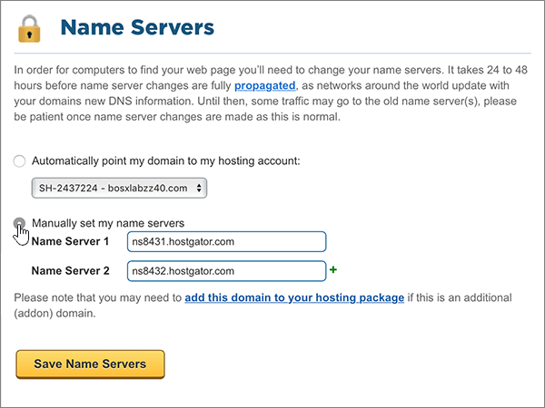

# Cambiar los servidores DNS para configurar Microsoft 365 con Hostgator

 **[Consulte Preguntas más frecuentes acerca de los dominios](../setup/domains-faq.yml)** si no encuentra lo que busca.
  
Siga estas instrucciones si desea que Microsoft administre los registros DNS por usted. (Si lo prefiere, puede [administrar todos los registros DNS de Microsoft en Hostgator](create-dns-records-at-hostgator.md)).
  
    
## Apunte el dominio a su cuenta de hospedaje.

> [!IMPORTANT]
> Necesita realizar este procedimiento antes de realizar el procedimiento de la sección siguiente ( **Agregar un registro TXT para comprobación** ).
  
Siga estos pasos para asociar el dominio y las cuentas de hospedaje.
  
1. Para empezar, vaya a la página de su portal de clientes en Hostgator con [este vínculo](https://portal.hostgator.com/domain/manage). Se le pedirá que inicie sesión.
    
    
  
2. Seleccione la pestaña **dominios** .
    
    
  
3. En la página **administrar dominios** , en el área **mis dominios** , seleccione el dominio que desea actualizar.
    
    
  
4. En la página **información general de dominios** , en el área **servidores DNS** , seleccione **cambiar**.
    
    
  
5. En la página **servidores de nombres** de su dominio, en la lista desplegable **seleccionar cuenta de hospedaje** , elija la cuenta de **hospedaje** que está asociada a su dominio.
    
    
  
6. Seleccione **Guardar servidores de nombres**.
    
    
  
## Agregar un registro TXT para verificación

> [!IMPORTANT]
> Antes de llevar a cabo este procedimiento, primero debe realizar el procedimiento de la primera sección de este artículo, [apuntar el dominio a su cuenta de hospedaje.](#point-your-domain-to-your-hosting-account)
  
Antes de utilizar el dominio con Microsoft, tenemos que asegurarnos de que sea el propietario. Si puede iniciar sesión en la cuenta en el registrador de dominio y crear el registro DNS, Microsoft sabrá que es el propietario del dominio.
  
> [!NOTE]
> Este registro se usa exclusivamente para verificar si se es el propietario de un dominio; no afecta a nada más. Puede eliminarlo más adelante, si lo desea.
  
1. Para empezar, vaya a la página cPanel en Hostgator. Se le pedirá que inicie sesión primero.
    
    (Cada cuenta alojada en Hostgator se le asigna una única dirección CPanel. La dirección cPanel debe tener un aspecto parecido a este: https://YourSiteAddress:secure-port-number. La suscripción de correo electrónico que ha recibido de Hostgator especificará esa dirección de correo electrónico).
    
    > [!IMPORTANT]
    > To have a cPanel associated with your domain, you need a hosting account with Hostgator. Para empezar, puede comprar una cuenta de hospedaje de Hostgator o [cambiar los registros del servidor de nombres (NS) de su dominio](#change-your-domains-nameserver-ns-records) para que apunten a Microsoft. 
  
2. En la página **Panel de control** , en el área **dominios** , seleccione **Editor de zonas DNS avanzado**.
    
    (Es posible que tenga que desplazarse hacia abajo). 
    
3. On the **Advanced DNS Zone Editor** page, in the **Add a Record** area, in the boxes for the new record, type or copy and paste the values from the following table. 
    
    (Elija el valor **Tipo** de la lista desplegable). 
    
|||||
|:-----|:-----|:-----|:-----|
|**Nombre**   |**TTL**   |**Tipo**   |**Datos TXT**   |
|Use su  *nombre_de_dominio*  . (por ejemplo, fourthcoffee.com.)    **Este valor DEBE terminar en punto (.).**   |1     |TXT    |MS=ms *XXXXXXXX*    **Nota:** esto es un ejemplo. Utilice aquí su valor de **Dirección de destino**, desde la tabla. [¿Cómo puedo encontrar esto?](../get-help-with-domains/information-for-dns-records.md)        |
   
4. Seleccione **Agregar registro**.
    
5. Espere unos minutos antes de continuar para que el registro que acaba de crear pueda actualizarse en Internet.
    
Ahora que ha agregado el registro en el sitio del registrador de dominios, volverá a Microsoft y solicitará una búsqueda para el registro.
  
Cuando Microsoft encuentre el registro TXT correcto, se comprobará su dominio.
  
1. En el centro de administración, diríjase a la página **configuración** \> <a href="https://go.microsoft.com/fwlink/p/?linkid=834818" target="_blank">dominios</a>.

    
2. En la página **Dominios**, elija el dominio que está verificando. 
    
3. En la página de **Configuración**, elija **Iniciar configuración**.
    
4. En la página **Verificar dominio**, elija **Verificar**.
    
> [!NOTE]
> Normalmente, se necesitan unos 15 minutos para que los cambios de DNS surtan efecto. Sin embargo, a veces los cambios pueden necesitar más tiempo para aplicarse en todo el sistema DNS de Internet. Si tiene problemas con el flujo de correo u otros problemas después de agregar registros DNS, vea [Encontrar y solucionar problemas después de agregar el dominio o los registros DNS](../get-help-with-domains/find-and-fix-issues.md). 
  
## Cambiar los registros del servidor de nombres (o NS) de su dominio

Para completar la configuración de su dominio con Microsoft, debe cambiar los registros NS de su dominio en su registrador de dominios para que apunten a los servidores de nombres principal y secundario de Microsoft. Esto configura a Microsoft para que actualice los registros DNS del dominio por usted. Agregaremos todos los registros para que el correo electrónico, Skype Empresarial Online y su sitio web público funcionen con su dominio, y ya lo tendrá todo preparado.
  
> [!CAUTION]
> Al cambiar los registros NS de su dominio para que apunten a los servidores de nombres de Microsoft, se ven afectados todos los servicios que están actualmente asociados a su dominio. Por ejemplo, todos los mensajes de correo electrónico enviados a su dominio (como rob@ *your_domain*  . com) empezarán a llegar a Microsoft después de realizar este cambio.
  
> [!IMPORTANT]
> El siguiente procedimiento le mostrará cómo eliminar cualquier otro de los servidores de nombres no deseados de la lista, y también cómo agregar los servidores de nombres correctos si aún no aparecen. Cuando haya completado los pasos de esta sección, los únicos servidores de nombres que se deben enumerar son los cuatro siguientes:  **ns1.BDM.microsoftonline.com**, **NS2.BDM.microsoftonline.com**, **NS3.BDM.microsoftonline.com** y **NS4.BDM.microsoftonline.com**.
  
1. Para empezar, vaya a la página de su portal de clientes en Hostgator con [este vínculo](https://portal.hostgator.com/domain/manage). Se le pedirá que inicie sesión.
    
    
  
2. Seleccione la pestaña **dominios** . 
    
    
  
3. En la página **administrar dominios** , en el área **mis dominios** , seleccione el dominio que desea actualizar. 
    
    
  
4. En la página **información general del dominio** , en el área **servidores DNS** , seleccione **cambiar**.
    
    
  
5. En la página **servidores de nombres** de su dominio, en la lista desplegable **seleccionar cuenta de hospedaje** , elija la cuenta de **hospedaje** que está asociada a su dominio. 
    
    
  
6. Seleccione **establecer manualmente mis servidores de nombres**.
    
    
  
7.   **PRECAUCIÓN**: siga estos pasos solo si tiene servidores de nombres distintos de los cuatro servidores de nombres correctos. (Es decir, elimine solo los servidores DNS actuales que  *no*  tengan el nombre **ns1.BDM.microsoftonline.com**, **NS2.BDM.microsoftonline.com**, **NS3.BDM.microsoftonline.com** o **NS4.BDM.microsoftonline.com**).
  
        En la página **Servidores DNS** del dominio, en la lista de servidores DNS, elimine todos los servidores DNS de la lista (para hacerlo, seleccione los servidores DNS en la lista y, después, presione la tecla **Suprimir** en el teclado). 
    
   
  
8. En la lista de servidores DNS, escriba (o copie y pegue) los dos primeros valores de la tabla siguiente.
    
|||
|:-----|:-----|
|**Servidor DNS 1:**   |ns1.bdm.microsoftonline.com    |
|**Servidor DNS 2:**   |ns2.bdm.microsoftonline.com    |
|**Servidor DNS 3:**   |ns3.bdm.microsoftonline.com    |
|**Servidor DNS 4:**   |ns4.bdm.microsoftonline.com    |
   
   
  
9. Agregue los demás valores de servidor de nombres.
    
    Seleccione **(+)** agregar y, a continuación, escriba (o copie y pegue) el valor de la siguiente fila de la tabla en el cuadro para el registro. 
    
    Repita este proceso hasta que haya creado los cuatro registros de servidor de nombres.
    
    
  
10. Seleccione **Guardar servidores de nombres**.
    
    
  
> [!NOTE]
> Las actualizaciones de los registros de los servidores de nombres pueden tardar varias horas en propagarse por el sistema DNS de Internet. El correo electrónico y otros servicios de Microsoft estarán todos establecidos para funcionar con su dominio.
