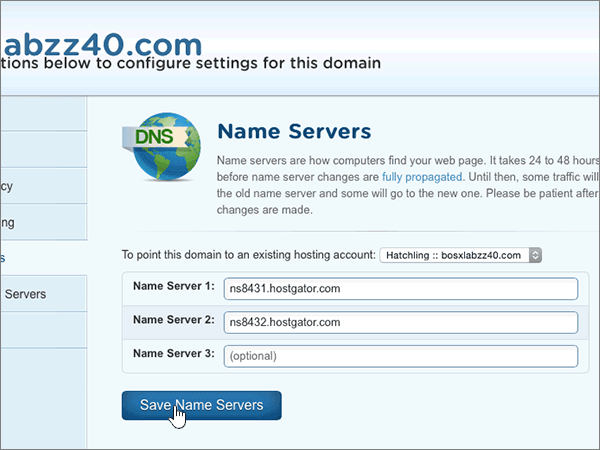

# Cambiar los servidores de nombres para configurar Microsoft 365 con HostgatorChange nameservers to set up Microsoft 365 with Hostgator

 **[Consulte Preguntas más frecuentes acerca de los dominios](../setup/domains-faq.yml)** si no encuentra lo que busca.**[Check the Domains FAQ](../setup/domains-faq.yml)** if you don't find what you're looking for.
  
Siga estas instrucciones si desea que Microsoft administre los registros DNS por usted.Follow these instructions if you want Microsoft to manage your DNS records for you. (Si lo prefiere, puede administrar todos los registros DNS de [Microsoft en Hostgator).](create-dns-records-at-hostgator.md)(If you prefer, you can [manage all your Microsoft DNS records at Hostgator](create-dns-records-at-hostgator.md).)
  
    
## Apunte el dominio a su cuenta de hospedaje.Point your domain to your hosting account.

> [!IMPORTANT]
> Necesita realizar este procedimiento antes de realizar el procedimiento de la sección siguiente ( **Agregar un registro TXT para comprobación** ).You must perform this procedure before you perform the procedure in the following section, **Add a TXT record for verification**.
  
Siga estos pasos para asociar el dominio y las cuentas de hospedaje.Follow these steps to associate your domain and hosting accounts.
  
1. Para empezar, vaya a la página de su portal de clientes en Hostgator con [este vínculo](https://portal.hostgator.com/domain/manage). Se le pedirá que inicie sesión.To get started, go to your customer portal page at Hostgator by using [this link](https://portal.hostgator.com/domain/manage). You'll be prompted to log in.
    
    
  
2. Seleccione la **pestaña** Dominios.Select the **Domains** tab.
    
    
  
3. En la **página Administrar dominios,** en el área **Mis dominios,** seleccione el dominio que desea actualizar.On the **Manage Domains** page, in the **My Domains** area, select the domain you want to update.
    
    
  
4. En la **página Información general de** dominios, en el área Servidores **dns,** seleccione **Cambiar**.On the **Domains Overview** page, in the **Name Servers** area, select **Change**.
    
    
  
5. En la **página Servidores** dns de  su dominio, en la  lista desplegable Seleccionar cuenta de hospedaje, elija la cuenta de hospedaje asociada a su dominio.On the **Name Servers** page for your domain, in the **Select Hosting Account** drop-down list, choose the **hosting account** that is associated with your domain.
    
    
  
6. Seleccione **Guardar servidores dns.**Select **Save Name Servers**.
    
    
  
## Agregar un registro TXT para verificaciónAdd a TXT record for verification

> [!IMPORTANT]
> Antes de llevar a cabo este procedimiento, primero debe realizar el procedimiento de la primera sección de este artículo, Apuntar el dominio [a la cuenta de hospedaje.](#point-your-domain-to-your-hosting-account).Before you perform this procedure, you must first perform the procedure in the first section of this article, [Point your domain to your hosting account.](#point-your-domain-to-your-hosting-account).
  
Antes de utilizar el dominio con Microsoft, tenemos que asegurarnos de que sea el propietario. Si puede iniciar sesión en la cuenta en el registrador de dominio y crear el registro DNS, Microsoft sabrá que es el propietario del dominio.Before you use your domain with Microsoft, we have to make sure that you own it. Your ability to log in to your account at your domain registrar and create the DNS record proves to Microsoft that you own the domain.
  
> [!NOTE]
> Este registro se usa exclusivamente para verificar si se es el propietario de un dominio; no afecta a nada más. Puede eliminarlo más adelante, si lo desea.This record is used only to verify that you own your domain; it doesn't affect anything else. You can delete it later, if you like.
  
1. Para empezar, vaya a la página cPanel en Hostgator. Se le pedirá que inicie sesión primero.To get started, go to your cPanel page at Hostgator. You'll be prompted to log in first.
    
    (Cada cuenta alojada en Hostgator se le asigna una única dirección CPanel. La dirección cPanel debe tener un aspecto parecido a este: https://YourSiteAddress:secure-port-number. La suscripción de correo electrónico que ha recibido de Hostgator especificará esa dirección de correo electrónico).(Each hosted account at Hostgator is assigned a unique cPanel address. Your cPanel address should look like this: https://YourSiteAddress:secure-port-number. The sign-up email you received from Hostgator will specify that address.)
    
    > [!IMPORTANT]
    > To have a cPanel associated with your domain, you need a hosting account with Hostgator.To have a cPanel associated with your domain, you need a hosting account with Hostgator. To get started, you can either purchase a hosting account from Hostgator or [change your domain's nameserver (NS) records](#change-your-domains-nameserver-ns-records) to point to Microsoft.To get started, you can either purchase a hosting account from Hostgator or [change your domain's nameserver (NS) records](#change-your-domains-nameserver-ns-records) to point to Microsoft. 
  
2. En la **página Panel de control,** en el área **Dominios,** seleccione **Editor de zona DNS avanzado.**On the **Control Panel** page, in the **Domains** area, select **Advanced DNS Zone Editor**.
    
    (Es posible que tenga que desplazarse hacia abajo).(You may have to scroll down.) 
    
3. On the **Advanced DNS Zone Editor** page, in the **Add a Record** area, in the boxes for the new record, type or copy and paste the values from the following table.On the **Advanced DNS Zone Editor** page, in the **Add a Record** area, in the boxes for the new record, type or copy and paste the values from the following table. 
    
    (Elija el valor **Tipo** de la lista desplegable).(Choose the **Type** value from the drop-down list.) 
    
|||||
|:-----|:-----|:-----|:-----|
|**Nombre****Name**   |**TTL****TTL**   |**Tipo****Type**   |**Datos TXT****TXT Data**   |
|Use su  *nombre_de_dominio*  . (por ejemplo, fourthcoffee.com.)  Use your  *domain_name*  . (for example, fourthcoffee.com.)    **Este valor DEBE terminar en punto (.).****This value MUST end with a period (.)**   |1 1    |TXTTXT    |MS=ms *XXXXXXXX*MS=ms *XXXXXXXX*    **Nota:** esto es un ejemplo.**Note:** This is an example. Utilice aquí su valor de **Dirección de destino**, desde la tabla.Use your specific **Destination or Points to Address** value here, from the table. [¿Cómo puedo encontrar esto?How do I find this?](../get-help-with-domains/information-for-dns-records.md)        |
   
4. Seleccione **Agregar registro.**Select **Add Record**.
    
5. Espere unos minutos antes de continuar para que el registro que acaba de crear pueda actualizarse en Internet.Wait a few minutes before you continue, so that the record you just created can update across the Internet.
    
Ahora que ha agregado el registro en el sitio del registrador de dominios, volverá a Microsoft y solicitará una búsqueda para el registro.Now that you've added the record at your domain registrar's site, you'll go back to Microsoft and request a search for the record.
  
Cuando Microsoft encuentre el registro TXT correcto, se comprobará su dominio.When Microsoft finds the correct TXT record, your domain is verified.
  
1. En el centro de administración, diríjase a la página **configuración** \> <a href="https://go.microsoft.com/fwlink/p/?linkid=834818" target="_blank">dominios</a>.In the admin center, go to the **Settings** \> <a href="https://go.microsoft.com/fwlink/p/?linkid=834818" target="_blank">Domains</a> page.

    
2. En la página **Dominios**, elija el dominio que está verificando.On the **Domains** page, select the domain that you are verifying. 
    
3. En la página de **Configuración**, elija **Iniciar configuración**.On the **Setup** page, select **Start setup**.
    
4. En la página **Verificar dominio**, elija **Verificar**.On the **Verify domain** page, select **Verify**.
    
> [!NOTE]
> Normalmente, se necesitan unos 15 minutos para que los cambios de DNS surtan efecto.Typically it takes about 15 minutes for DNS changes to take effect. Sin embargo, a veces los cambios pueden necesitar más tiempo para aplicarse en todo el sistema DNS de Internet.However, it can occasionally take longer for a change you've made to update across the Internet's DNS system. Si tiene problemas con el flujo de correo u otros problemas después de agregar registros DNS, vea [Encontrar y solucionar problemas después de agregar el dominio o los registros DNS](../get-help-with-domains/find-and-fix-issues.md).If you're having trouble with mail flow or other issues after adding DNS records, see [Find and fix issues after adding your domain or DNS records](../get-help-with-domains/find-and-fix-issues.md). 
  
## Cambiar los registros del servidor de nombres (o NS) de su dominioChange your domain's nameserver (NS) records

Para completar la configuración de su dominio con Microsoft, cambie los registros NS de su dominio en el registrador de dominios para que apunten a los servidores de nombres principales y secundarios de Microsoft.To complete setting up your domain with Microsoft, you change your domain's NS records at your domain registrar to point to the Microsoft primary and secondary name servers. Esto configura Microsoft para que actualice automáticamente los registros DNS del dominio.This sets up Microsoft to update the domain's DNS records for you. Agregaremos todos los registros para que el correo electrónico, Skype Empresarial Online y su sitio web público funcionen con su dominio, y ya lo tendrá todo preparado.We'll add all records so that email, Skype for Business Online, and your public website work with your domain, and you'll be all set.
  
> [!CAUTION]
> Al cambiar los registros NS de su dominio para que apunten a los servidores de nombres de Microsoft, se verán afectados todos los servicios asociados actualmente a su dominio.When you change your domain's NS records to point to the Microsoft name servers, all the services that are currently associated with your domain are affected. Por ejemplo, todo el correo electrónico enviado a su dominio (como rob@ your_domain .com) empezará a llegar *a*  Microsoft después de realizar este cambio.For example, all email sent to your domain (like rob@ *your_domain*  .com) will start coming to Microsoft after you make this change.
  
> [!IMPORTANT]
> El siguiente procedimiento le mostrará cómo eliminar cualquier otro servidor de nombres no deseado de la lista y también cómo agregar los servidores de nombres correctos si aún no aparecen en la lista.The following procedure will show you how to delete any other, unwanted nameservers from the list, and also how to add the correct nameservers if they are not already listed. Cuando haya completado los pasos de esta sección, los únicos servidores de nombres que deben aparecer son los cuatro siguientes:  **ns1.bdm.microsoftonline.com**, **ns2.bdm.microsoftonline.com**, **ns3.bdm.microsoftonline.com** y **ns4.bdm.microsoftonline.com**.When you have completed the steps in this section, the only nameservers that should be listed are these four:  **ns1.bdm.microsoftonline.com**, **ns2.bdm.microsoftonline.com**, **ns3.bdm.microsoftonline.com**, and **ns4.bdm.microsoftonline.com**.
  
1. Para empezar, vaya a la página de su portal de clientes en Hostgator con [este vínculo](https://portal.hostgator.com/domain/manage). Se le pedirá que inicie sesión.To get started, go to your customer portal page at Hostgator by using [this link](https://portal.hostgator.com/domain/manage). You'll be prompted to log in.
    
    
  
2. Seleccione la **pestaña** Dominios.Select the **Domains** tab. 
    
    
  
3. En la **página Administrar dominios,** en el área **Mis dominios,** seleccione el dominio que desea actualizar.On the **Manage Domains** page, in the **My Domains** area, select the domain you want to update. 
    
    
  
4. En la **página Información general del** dominio, en el área Servidores **dns,** seleccione **Cambiar**.On the **Domain Overview** page, in the **Name Servers** area, select **Change**.
    
    
  
5. En la **página Servidores** dns de  su dominio, en la  lista desplegable Seleccionar cuenta de hospedaje, elija la cuenta de hospedaje asociada a su dominio.On the **Name Servers** page for your domain, in the **Select Hosting Account** drop-down list, choose the **hosting account** that is associated with your domain. 
    
    
  
6. Seleccione **Establecer manualmente mis servidores de nombres.**Select **Manually set my name servers**.
    
    
  
7.   **PRECAUCIÓN:** Siga estos pasos solo si tiene servidores de nombres existentes distintos de los cuatro servidores de nombres correctos.**CAUTION**: Follow these steps only if you have existing nameservers other than the four correct nameservers. (Es decir, elimine solo los servidores  de nombres actuales que no se denominan **ns1.bdm.microsoftonline.com**, **ns2.bdm.microsoftonline.com**, **ns3.bdm.microsoftonline.com** o **ns4.bdm.microsoftonline.com**.)(That is, delete only any current nameservers that are  *not*  named **ns1.bdm.microsoftonline.com**, **ns2.bdm.microsoftonline.com**, **ns3.bdm.microsoftonline.com**, or **ns4.bdm.microsoftonline.com**.)
  
        En la página **Servidores DNS** del dominio, en la lista de servidores DNS, elimine todos los servidores DNS de la lista (para hacerlo, seleccione los servidores DNS en la lista y, después, presione la tecla **Suprimir** en el teclado).Still on the **Name Servers** page for your domain, in the list of nameservers, delete each nameserver in the list by selecting it and then pressing the **Delete** key on your keyboard. 
    
   
  
8. En la lista de servidores DNS, escriba (o copie y pegue) los dos primeros valores de la tabla siguiente.Still in the list of nameservers, type or copy and paste the first two values from the following table.
    
|||
|:-----|:-----|
|**Servidor DNS 1:****Name Server 1:**   |ns1.bdm.microsoftonline.comns1.bdm.microsoftonline.com    |
|**Servidor DNS 2:****Name Server 2:**   |ns2.bdm.microsoftonline.comns2.bdm.microsoftonline.com    |
|**Servidor DNS 3:****Name Server 3:**   |ns3.bdm.microsoftonline.comns3.bdm.microsoftonline.com    |
|**Servidor DNS 4:****Name Server 4:**   |ns4.bdm.microsoftonline.comns4.bdm.microsoftonline.com    |
   
   
  
9. Agregue los demás valores de servidor de nombres.Add the other nameserver values.
    
    Seleccione **(+)** agregar y, a continuación, escriba o copie y pegue el valor de la siguiente fila de la tabla en el cuadro del registro.Select **(+)** add, and then type or copy and paste the value from the next row of the table into the box for the record. 
    
    Repita este proceso hasta que haya creado los cuatro registros de servidor de nombres.Repeat this process until you have created all four nameserver records.
    
    
  
10. Seleccione **Guardar servidores dns.**Select **Save Name Servers**.
    
    
  
> [!NOTE]
> Las actualizaciones de los registros de los servidores de nombres pueden tardar varias horas en propagarse por el sistema DNS de Internet.Your nameserver record updates may take up to several hours to update across the Internet's DNS system. A continuación, el correo electrónico de Microsoft y otros servicios estarán configurados para funcionar con su dominio.Then your Microsoft email and other services will be all set to work with your domain.
