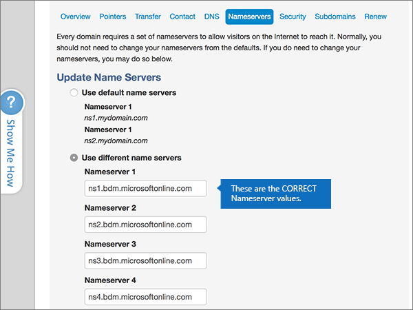

# Cambiar los servidores de nombres para configurar Office 365 con MyDomainChange nameservers to set up Office 365 with MyDomain

 **[Consulte Preguntas más frecuentes acerca de los dominios](../setup/domains-faq.md)** si no encuentra lo que busca.**[Check the Domains FAQ](../setup/domains-faq.md)** if you don't find what you're looking for.
  
Siga estas instrucciones si quiere que Office 365 administre los registros DNS de Office 365 automáticamente. (Si lo prefiere, puede [administrar todos los registros DNS de Office 365 en MyDomain](create-dns-records-at-mydomain.md)).Follow these instructions if you want Office 365 to manage your Office 365 DNS records for you. (If you prefer, you can [manage all your Office 365 DNS records at MyDomain](create-dns-records-at-mydomain.md).)
  
## Agregar un registro TXT para verificaciónAdd a TXT record for verification

Para que pueda usar el dominio con Office 365, tenemos que asegurarnos de que es de su propiedad. Si puede iniciar sesión en la cuenta en su registrador de dominios y crear el registro DNS, Office 365 sabrá que es el propietario del dominio.Before you use your domain with Office 365, we have to make sure that you own it. Your ability to log in to your account at your domain registrar and create the DNS record proves to Office 365 that you own the domain.
  
> [!NOTE]
> Este registro se usa exclusivamente para verificar si se es el propietario de un dominio; no afecta a nada más. Puede eliminarlo más adelante, si lo desea.This record is used only to verify that you own your domain; it doesn't affect anything else. You can delete it later, if you like. 
  
1. Para empezar, vaya a su página de dominios en MyDomain a través de [este vínculo](https://www.mydomain.com/controlpanel). Se le pedirá que primero que inicie sesión.To get started, go to your domains page at MyDomain by using [this link](https://www.mydomain.com/controlpanel). You'll be prompted to log in first.
    
2. En la sección **Mis favoritos**, elija **Dominio Central**.In the **My Favorites** section, select **Domain Central**.
    
3. En **Dominio**, elige el nombre del dominio que deseas editar.Under **Domain**, select the name of the domain that you want to edit.
    
4. En la fila **Información general**, elija **DNS**.In the **Overview** row, select **DNS**.
    
5. En la lista desplegable **Modificar**, elija **Registro TXT/SPF**.From the **Modify** drop-down list, choose **TXT/SPF Record**.
    
6. En **Contenido**, en el cuadro del nuevo registro, escriba o copie y pegue el valor de la tabla siguiente.Under **Content**, in the box for the new record, type or copy and paste the value from the following table.
    
||
|:-----|
|**Contenido****Content**   |
|MS=ms *XXXXXXXX*MS=ms *XXXXXXXX*    **Nota**: este es un ejemplo.**Note**: This is an example. Use su valor **Dirección de destino** específico aquí, de la tabla de Office 365.Use your specific **Destination or Points to Address** value here, from the table in Office 365. [¿Cómo puedo encontrar esto?How do I find this?](../get-help-with-domains/information-for-dns-records.md)          |
   
7. Elija **Agregar**.Select **Add**.
    
8. Espere unos minutos antes de continuar para que el registro que acaba de crear pueda actualizarse en Internet.Wait a few minutes before you continue, so that the record you just created can update across the Internet.
    
Ahora que ha agregado el registro en el sitio de su registrador de dominios, volverá a Office 365 y solicitará que Office 365 lo busque.Now that you've added the record at your domain registrar's site, you'll go back to Office 365 and request Office 365 to look for the record.
  
Cuando Office 365 encuentre el registro TXT correcto, se comprobará su dominio.When Office 365 finds the correct TXT record, your domain is verified.
  
1. En el centro de administración, diríjase a la página **configuración** \> <a href="https://go.microsoft.com/fwlink/p/?linkid=834818" target="_blank">dominios</a>.In the admin center, go to the **Settings** \> <a href="https://go.microsoft.com/fwlink/p/?linkid=834818" target="_blank">Domains</a> page.

    
2. En la página **Dominios**, elija el dominio que está verificando.On the **Domains** page, select the domain that you are verifying. 
    
3. En la página de **Configuración**, elija \*\* Iniciar configuración\*\*.On the **Setup** page, select **Start setup**.
    
4. En la página**Verificar dominio**, elija **Verificar**.On the **Verify domain** page, select **Verify**.
    
> [!NOTE]
> Normalmente, se necesitan unos 15 minutos para que los cambios de DNS surtan efecto.Typically it takes about 15 minutes for DNS changes to take effect. Sin embargo, a veces los cambios pueden necesitar más tiempo para aplicarse en todo el sistema DNS de Internet.However, it can occasionally take longer for a change you've made to update across the Internet's DNS system. Si tiene problemas con el flujo de correo u otros problemas después de agregar registros DNS, consulte [Encontrar y solucionar problemas después de agregar el dominio o registros DNS en Office 365](../get-help-with-domains/find-and-fix-issues.md).If you're having trouble with mail flow or other issues after adding DNS records, see [Find and fix issues after adding your domain or DNS records in Office 365](../get-help-with-domains/find-and-fix-issues.md). 
  
## Cambiar los registros del servidor de nombres (o NS) de su dominioChange your domain's nameserver (NS) records

Para completar la configuración del dominio con Office 365, debe cambiar los registros NS del dominio en su registrador de dominios para que apunten a los servidores DNS primario y secundario de Office 365. Esto configura Office 365 para actualizar los registros DNS del dominio. Agregaremos todos los registros para que el correo electrónico, Skype Empresarial Online y su sitio web público funcionen con su dominio, y ya lo tendrá todo preparado.To complete setting up your domain with Office 365, you change your domain's NS records at your domain registrar to point to the Office 365 primary and secondary name servers. This sets up Office 365 to update the domain's DNS records for you. We'll add all records so that email, Skype for Business Online, and your public website work with your domain, and you'll be all set.
  
> [!CAUTION]
> Si cambia los registros NS del dominio para que apunten a los servidores DNS de Office 365, esto afectará a todos los servicios que estén asociados actualmente con su dominio.When you change your domain's NS records to point to the Office 365 name servers, all the services that are currently associated with your domain are affected. Por ejemplo, todo el correo electrónico enviado a su dominio (como rob@ *your_domain.*For example, all email sent to your domain (like rob@ *your_domain.* com) empezará a llegar a Office 365 después de realizar este cambio.com) will start coming to Office 365 after you make this change. 
  
> [!IMPORTANT]
> The following procedure will show you how to delete any other, unwanted nameservers from the list, and also how to add the correct nameservers if they are not already in the list.The following procedure will show you how to delete any other, unwanted nameservers from the list, and also how to add the correct nameservers if they are not already in the list.   When you have completed the steps in this section, the only nameservers that should be listed are these four:When you have completed the steps in this section, the only nameservers that should be listed are these four:
  
1. Para empezar, vaya a su página de dominios en MyDomain a través de [este vínculo](https://www.mydomain.com/controlpanel). Se le pedirá que primero que inicie sesión.To get started, go to your domains page at MyDomain by using [this link](https://www.mydomain.com/controlpanel). You'll be prompted to log in first.
    
2. En la sección **Mis favoritos**, elija **Dominio Central**.In the **My Favorites** section, select **Domain Central**.
    
3. En **Dominio**, elige el nombre del dominio que deseas editar.Under **Domain**, select the name of the domain that you want to edit.
    
4. En la fila **información general** , seleccione **servidores de nombres**.In the **Overview** row, select **Nameservers**.
    
    
  
5. En la sección **Update Name Servers**, seleccione **Use different name servers**.In the **Update Name Servers** section, select **Use different name servers**.
    
    
  
6. Dependiendo de si ya hay o no servidores de nombres enumerados en la página que se muestra ahora, continúe con uno de los dos procedimientos siguientes.Depending on whether or not there are already nameservers listed on the page that is displayed now, continue to one of the two following procedures.
    
### Si los servidores de nombres correctos ya aparecenIf the correct nameservers ARE already listed

- Si los servidores de nombres correctos ya aparecen, puede omitir este paso.If the correct nameservers are already listed, you can skip this step.
    
    
  
### Si los servidores de nombres correctos todavía no aparecenIf the correct nameservers are NOT already listed

> [!CAUTION]
> Follow these steps only if you have existing nameservers other than the four correct nameservers.Follow these steps only if you have existing nameservers other than the four correct nameservers. (Es decir, elimine solo los servidores DNS actuales que *no* tengan el nombre **ns1.BDM.microsoftonline.com**, **NS2.BDM.microsoftonline.com**, **NS3.BDM.microsoftonline.com**o **NS4.BDM.microsoftonline.com**).(That is, delete only any current nameservers that are  *not*  named **ns1.bdm.microsoftonline.com**, **ns2.bdm.microsoftonline.com**, **ns3.bdm.microsoftonline.com**, or **ns4.bdm.microsoftonline.com**.) 
  
1. Elimine el servidor de nombres existente seleccionando cada entrada en el campo **Servidor de nombres:** y, después, presionando la tecla **Eliminar** de su teclado.Delete the existing nameservers by selecting each entry in the **Nameserver:** field, and then pressing the **Delete** key on your keyboard. 
    
    
  
2. Seleccione **Agregar más** dos veces para agregar dos nuevas filas de servidor de nombres.Select **Add More** twice to add two new Nameserver rows. 
    
    
  
3. En los cuadros para los registros, escriba o copie y pegue los valores del servidor de nombres de la siguiente tabla.In the boxes for the records, type or copy and paste the nameserver values from the following table.
    
|||
|:-----|:-----|
|**Servidor de nombres 1****Nameserver 1**   |ns1.bdm.microsoftonline.comns1.bdm.microsoftonline.com    |
|**Servidor de nombres 2****Nameserver 2**   |ns2.bdm.microsoftonline.comns2.bdm.microsoftonline.com    |
|**Servidor DNS 3****Nameserver 3**   |ns3.bdm.microsoftonline.comns3.bdm.microsoftonline.com    |
|**Servidor DNS 4****Nameserver 4**   |ns4.bdm.microsoftonline.comns4.bdm.microsoftonline.com    |
   
   
  
4. Haga clic en **Guardar**.Select **Save**.
    
    
  
> [!NOTE]
> Las actualizaciones de los registros de los servidores de nombres pueden tardar varias horas en propagarse por el sistema DNS de Internet. A continuación, su correo electrónico y otros servicios de Office 365 estarán listos para funcionar con su dominio.Your nameserver record updates may take up to several hours to update across the Internet's DNS system. Then your Office 365 email and other services will be all set to work with your domain. 
