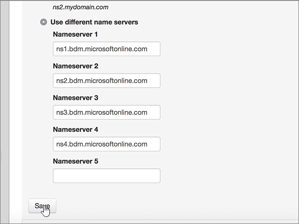

# Cambiar los servidores DNS para configurar Microsoft con midominio

 **[Consulte Preguntas más frecuentes acerca de los dominios](../setup/domains-faq.md)** si no encuentra lo que busca.
  
Siga estas instrucciones si desea que Microsoft administre los registros DNS por usted. (Si lo prefiere, puede [administrar todos los registros DNS de Microsoft en midominio](create-dns-records-at-mydomain.md)).
  
## Agregar un registro TXT para verificación

Antes de utilizar el dominio con Microsoft, tenemos que asegurarnos de que sea el propietario. Si puede iniciar sesión en la cuenta en el registrador de dominio y crear el registro DNS, Microsoft sabrá que es el propietario del dominio.
  
> [!NOTE]
> Este registro se usa exclusivamente para verificar si se es el propietario de un dominio; no afecta a nada más. Puede eliminarlo más adelante, si lo desea. 
  
1. Para empezar, vaya a su página de dominios en MyDomain a través de [este vínculo](https://www.mydomain.com/controlpanel). Se le pedirá que primero que inicie sesión.
    
2. En la sección **Mis favoritos**, elija **Dominio Central**.
    
3. En **Dominio**, elige el nombre del dominio que deseas editar.
    
4. En la fila **Información general**, elija **DNS**.
    
5. En la lista desplegable **Modificar**, elija **Registro TXT/SPF**.
    
6. En **Contenido**, en el cuadro del nuevo registro, escriba o copie y pegue el valor de la tabla siguiente.
    
||
|:-----|
|**Contenido**   |
|MS=ms *XXXXXXXX*    **Nota**: este es un ejemplo. Utilice aquí su valor de **Dirección de destino**, desde la tabla. [¿Cómo puedo encontrar esto?](../get-help-with-domains/information-for-dns-records.md)          |
   
7. Elija **Agregar**.
    
8. Espere unos minutos antes de continuar para que el registro que acaba de crear pueda actualizarse en Internet.
    
Ahora que ha agregado el registro en el sitio de su registrador de dominios, volverá a Microsoft 365 y solicitará que busque el registro.
  
Cuando Microsoft encuentre el registro TXT correcto, se comprobará su dominio.
  
1. En el centro de administración de Microsoft, diríjase a la página **Configuración** \> <a href="https://go.microsoft.com/fwlink/p/?linkid=834818" target="_blank">Dominios</a>.

    
2. En la página **Dominios**, elija el dominio que está verificando. 
    
3. En la página de **Configuración**, elija ** Iniciar configuración**.
    
4. En la página**Verificar dominio**, elija **Verificar**.
    
> [!NOTE]
> Normalmente, se necesitan unos 15 minutos para que los cambios de DNS surtan efecto. Sin embargo, a veces los cambios pueden necesitar más tiempo para aplicarse en todo el sistema DNS de Internet. Si tiene problemas con el flujo de correo u otros problemas después de agregar registros DNS, vea [Encontrar y solucionar problemas después de agregar el dominio o los registros DNS](../get-help-with-domains/find-and-fix-issues.md). 
  
## Cambiar los registros del servidor de nombres (o NS) de su dominio

Para completar la configuración de su dominio con Microsoft, debe cambiar los registros NS de su dominio en su registrador de dominios para que apunten a los servidores de nombres principal y secundario de Microsoft. Esto configura a Microsoft para que actualice los registros DNS del dominio por usted. Agregaremos todos los registros para que el correo electrónico, Skype Empresarial Online y su sitio web público funcionen con su dominio, y ya lo tendrá todo preparado.
  
> [!CAUTION]
> Al cambiar los registros NS de su dominio para que apunten a los servidores de nombres de Microsoft, se ven afectados todos los servicios que están actualmente asociados a su dominio. Por ejemplo, todo el correo electrónico enviado a su dominio (como rob@ *your_domain.* com) empezará a llegar a Microsoft después de realizar este cambio. 
  
> [!IMPORTANT]
> The following procedure will show you how to delete any other, unwanted nameservers from the list, and also how to add the correct nameservers if they are not already in the list.   When you have completed the steps in this section, the only nameservers that should be listed are these four:
  
1. Para empezar, vaya a su página de dominios en MyDomain a través de [este vínculo](https://www.mydomain.com/controlpanel). Se le pedirá que primero que inicie sesión.
    
2. En la sección **Mis favoritos**, elija **Dominio Central**.
    
3. En **Dominio**, elige el nombre del dominio que deseas editar.
    
4. En la fila **información general** , seleccione **servidores de nombres**.
    
    
  
5. En la sección **Update Name Servers**, seleccione **Use different name servers**.
    
    
  
6. Dependiendo de si ya hay o no servidores de nombres enumerados en la página que se muestra ahora, continúe con uno de los dos procedimientos siguientes.
    
### Si los servidores de nombres correctos ya aparecen

- Si los servidores de nombres correctos ya aparecen, puede omitir este paso.
    
    
  
### Si los servidores de nombres correctos todavía no aparecen

> [!CAUTION]
> Follow these steps only if you have existing nameservers other than the four correct nameservers. (Es decir, elimine solo los servidores DNS actuales que *no* tengan el nombre **ns1.BDM.microsoftonline.com**, **NS2.BDM.microsoftonline.com**, **NS3.BDM.microsoftonline.com**o **NS4.BDM.microsoftonline.com**). 
  
1. Elimine el servidor de nombres existente seleccionando cada entrada en el campo **Servidor de nombres:** y, después, presionando la tecla **Eliminar** de su teclado. 
    
    
  
2. Seleccione **Agregar más** dos veces para agregar dos nuevas filas de servidor de nombres. 
    
    
  
3. En los cuadros para los registros, escriba o copie y pegue los valores del servidor de nombres de la siguiente tabla.
    
|||
|:-----|:-----|
|**Servidor de nombres 1**   |ns1.bdm.microsoftonline.com    |
|**Servidor de nombres 2**   |ns2.bdm.microsoftonline.com    |
|**Servidor DNS 3**   |ns3.bdm.microsoftonline.com    |
|**Servidor DNS 4**   |ns4.bdm.microsoftonline.com    |
   
   
  
4. Haga clic en **Guardar**.
    
    
  
> [!NOTE]
> Las actualizaciones de los registros de los servidores de nombres pueden tardar varias horas en propagarse por el sistema DNS de Internet. El correo electrónico y otros servicios de Microsoft estarán todos establecidos para funcionar con su dominio. 
