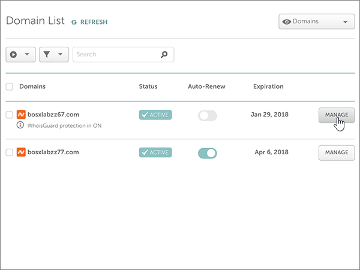
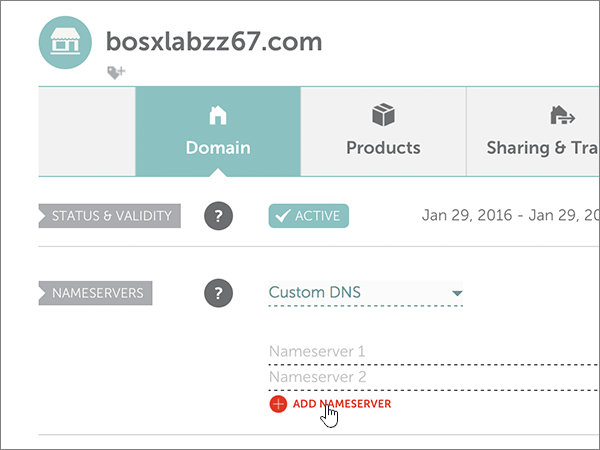

# Cambiar los servidores de nombres para configurar Office 365 con namecheap

 **[Consulte Preguntas más frecuentes acerca de los dominios](../setup/domains-faq.md)** si no encuentra lo que busca.
  
Siga estas instrucciones si quiere que Office 365 administre automáticamente los registros DNS de Office 365. (Si lo prefiere, puede [administrar todos los registros DNS de Office 365 en namecheap](create-dns-records-at-namecheap.md)).
  
    
## Agregar un registro TXT para verificación

1. Para empezar, vaya a su página de dominios en namecheap a través de [este vínculo](https://www.namecheap.com/myaccount/login.aspx?ReturnUrl=%2f). Se le pedirá que inicie sesión y continúe.
    
    
  
2. En la página de **aterrizaje** , en **cuenta**, elija **lista de dominios** en la lista desplegable. 
    
    
  
3. En la página **lista de dominios** , busque el nombre del dominio que desea editar y, a continuación, seleccione **administrar**.
    
    
  
4. Seleccione **DNS avanzado**.
    
    
  
5. En la sección **registros de host** , seleccione **Agregar nuevo registro**.
    
    
  
6. En la lista desplegable **tipo** , seleccione **registro TXT**.
    
    > [!NOTE]
    > La lista desplegable **tipo** aparece automáticamente cuando se selecciona **Agregar nuevo registro**.
  
    
  
7. In the boxes for the new record, type or copy and paste the values from the following table.
    
    (Elija el valor **TTL** de la lista desplegable). 
    
|**Tipo**|**Host**|**Valor**|**TTL**|
|:-----|:-----|:-----|:-----|
|TXT    |@    |MS=ms *XXXXXXXX*    **Nota**: este es un ejemplo. Utilice aquí su valor de **Dirección o puntos de destino**, de la tabla de Office 365.           [¿Cómo puedo encontrarlo?](../get-help-with-domains/information-for-dns-records.md)          |30 minutos    |
   
   
  
8. Seleccione el control **Guardar cambios** (marca de verificación). 
    
    
  
9. Espere unos minutos antes de continuar para que el registro que acaba de crear pueda actualizarse en Internet.
    
Now that you've added the record at your domain registrar's site, you'll go back to Office 365 and request Office 365 to look for the record.
  
When Office 365 finds the correct TXT record, your domain is verified.
  
1. En el centro de administración, vaya a la página **configuración** \> de <a href="https://go.microsoft.com/fwlink/p/?linkid=834818" target="_blank">dominios</a> .

    
2. En la página **dominios** , seleccione el dominio que desea comprobar. 
    
    
  
3. En la página **configuración** , seleccione **Iniciar configuración**.
    
    
  
4. En la página **comprobar dominio** , seleccione **comprobar**.
    
    
  
> [!NOTE]
>  Por lo general, los cambios de DNS tardan unos 15 minutos en aplicarse. Sin embargo, a veces los cambios pueden necesitar más tiempo para aplicarse en todo el sistema DNS de Internet. Si tiene problemas con el flujo de correo u otros problemas después de agregar registros DNS, consulte [Solucionar problemas después de cambiar el nombre del dominio o los registros DNS](../get-help-with-domains/find-and-fix-issues.md). 
  
## Cambiar los registros del servidor de nombres (o NS) de su dominio

Para completar la configuración del dominio con Office 365, debe cambiar los registros NS del dominio en su registrador de dominios para que apunten a los servidores DNS primario y secundario de Office 365. Esto configura Office 365 para actualizar los registros DNS del dominio. Agregaremos todos los registros para que el correo electrónico, Skype Empresarial Online y su sitio web público funcionen con su dominio, y ya lo tendrá todo preparado.
  
> [!CAUTION]
> Si cambia los registros NS del dominio para que apunten a los servidores DNS de Office 365, esto afectará a todos los servicios que estén asociados actualmente con su dominio. Por ejemplo, todos los correos que se envíen a su dominio (como, por ejemplo, rob@ *su_dominio*  .com) comenzarán a llegar a Office 365 después de realizar este cambio. 
  
> [!IMPORTANT]
>  Cuando haya completado los pasos descritos en esta sección, los  *únicos*  servidores DNS que deben aparecer son estos cuatro: >  ns1.bdm.microsoftonline.com >  ns2.bdm.microsoftonline.com >  ns3.bdm.microsoftonline.com >  ns4.bdm.microsoftonline.com >  En el procedimiento siguiente se muestra cómo eliminar cualquier otro servidor de nombres que no desee de la lista y también cómo agregar estos cuatro servidores DNS  *correctos*  , si aún no están en la lista. 
  
1. Para empezar, vaya a su página de dominios en namecheap a través de [este vínculo](https://www.namecheap.com/myaccount/login.aspx?ReturnUrl=%2f). Se le pedirá que inicie sesión y continúe.
    
    
  
2. En la página de **aterrizaje** , en **cuenta**, elija **lista de dominios** en la lista desplegable. 
    
    
  
3. En la página **lista de dominios** , busque el nombre del dominio que desea editar y, a continuación, seleccione **administrar**.
    
    
  
4. Seleccione **dominio**.
    
    
  
5. Busque la sección **servidores de nombres** y seleccione **personalizada** en la lista desplegable **namecheap predeterminada** . 
    
    
  
6. Dependiendo de si ya hay o no servidores de nombres enumerados en la página que se muestra ahora, continúe con uno de los dos procedimientos siguientes.
    
### Si aún NO se muestran servidores DNS en la lista

1. Seleccione **Agregar NAMESERVER** dos veces para agregar dos filas nuevas.
    
    
  
2. En los cuadros **servidor de nombres** , escriba (o copie y pegue) los valores de la tabla siguiente.
    
|||
|:-----|:-----|
|**Servidor DNS 1**   |ns1.bdm.microsoftonline.com    |
|**Servidor de nombres 2**   |ns2.bdm.microsoftonline.com    |
|**Servidor DNS 3**   |ns3.bdm.microsoftonline.com    |
|**Servidor DNS 4**   |ns4.bdm.microsoftonline.com    |
   
   
  
3. Seleccione el control **Guardar** (marca de verificación). 
    
    
  
> [!NOTE]
> Las actualizaciones de los registros de los servidores de nombres pueden tardar varias horas en propagarse por el sistema DNS de Internet. A continuación, su correo electrónico y otros servicios de Office 365 estarán listos para funcionar con su dominio. 
  
### Si ya existen servidores de nombres enumerados

> [!CAUTION]
> Siga estos pasos  *solo*  si tiene servidores de nombres distintos de los cuatro servidores de nombres  *correctos*  . (Es decir, elimine  *solo*  los servidores de nombres actuales que  *no*  sean **ns1.bdm.microsoftonline.com**, **ns2.bdm.microsoftonline.com**, **ns3.bdm.microsoftonline.com** o **ns4.bdm.microsoftonline.com** ). 
  
1. Si en los cuadros **servidor de nombres** aparecen otros servidores DNS, elimínelos (para hacerlo, selecciónelos y, después, presione la tecla **suprimir** en el teclado). 
    
    
  
2. Seleccione **Agregar NAMESERVER** dos veces para agregar dos filas nuevas. 
    
    
  
3. En los cuadros **servidor de nombres** , escriba (o copie y pegue) los valores de la tabla siguiente.
 
    
|||
|:-----|:-----|
|**Servidor DNS 1**   |ns1.bdm.microsoftonline.com    |
|**Servidor DNS 2**   |ns2.bdm.microsoftonline.com    |
|**Servidor DNS 3**   |ns3.bdm.microsoftonline.com    |
|**Servidor DNS 4**   |ns4.bdm.microsoftonline.com    |
   
   
  
4. Seleccione el control **Guardar** (marca de verificación). 
    
    
  
> [!NOTE]
> Las actualizaciones de los registros de los servidores de nombres pueden tardar varias horas en propagarse por el sistema DNS de Internet. A continuación, su correo electrónico y otros servicios de Office 365 estarán listos para funcionar con su dominio.