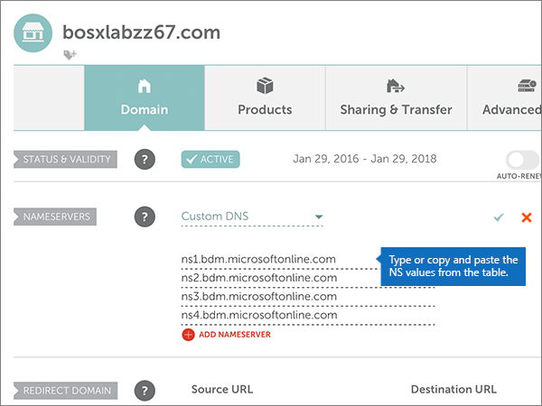
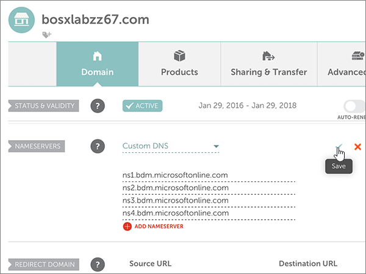
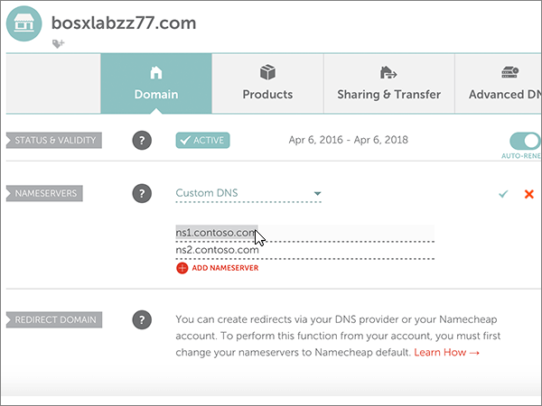

# Cambiar los servidores DNS para configurar Microsoft con namecheapChange nameservers to set up Microsoft with Namecheap

 **[Consulte Preguntas más frecuentes acerca de los dominios](../setup/domains-faq.md)** si no encuentra lo que busca.**[Check the Domains FAQ](../setup/domains-faq.md)** if you don't find what you're looking for.
  
Siga estas instrucciones si desea que Microsoft administre los registros DNS por usted.Follow these instructions if you want Microsoft to manage your DNS records for you. (Si lo prefiere, puede [administrar todos los registros DNS de Microsoft en namecheap](create-dns-records-at-namecheap.md)).(If you prefer, you can [manage all your Microsoft DNS records at Namecheap](create-dns-records-at-namecheap.md).)
  
    
## Agregar un registro TXT para verificaciónAdd a TXT record for verification

1. Para empezar, vaya a su página de dominios en namecheap a través de [este vínculo](https://www.namecheap.com/myaccount/login.aspx?ReturnUrl=%2f).To get started, go to your domains page at Namecheap by using [this link](https://www.namecheap.com/myaccount/login.aspx?ReturnUrl=%2f). Se le pedirá que inicie sesión y continúe.You'll be prompted to Sign in and Continue.
    
    
  
2. En la página de **aterrizaje** , en **cuenta**, elija **lista de dominios** en la lista desplegable.On the **Landing** page, under **Account**, choose **Domain List** from the drop-down list. 
    
    
  
3. En la página **lista de dominios** , busque el nombre del dominio que desea editar y, a continuación, seleccione **administrar**.On the **Domain List** page, find the name of the domain that you want to edit, and then select **Manage**.
    
    
  
4. Seleccione **DNS avanzado**.Select **Advanced DNS**.
    
    
  
5. En la sección **registros de host** , seleccione **Agregar nuevo registro**.In the **HOST RECORDS** section, select **ADD NEW RECORD**.
    
    
  
6. En la lista desplegable **tipo** , seleccione **registro TXT**.In the **Type** drop-down, select **TXT Record**.
    
    > [!NOTE]
    > La lista desplegable **tipo** aparece automáticamente cuando se selecciona **Agregar nuevo registro**.The **Type** drop-down automatically appears when you select **ADD NEW RECORD**.
  
    
  
7. En los cuadros para el nuevo registro, escriba o copie y pegue los valores de la tabla siguiente.In the boxes for the new record, type or copy and paste the values from the following table.
    
    (Elija el valor **TTL** de la lista desplegable).(Choose the **TTL** value from the drop-down list.) 
    
|**Tipo****Type**|**Host****Host**|**Valor****Value**|**TTL****TTL**|
|:-----|:-----|:-----|:-----|
|TXTTXT    |@    |MS=ms *XXXXXXXX*MS=ms *XXXXXXXX*    **Nota**: este es un ejemplo.**Note**: This is an example. Utilice aquí su valor de **Dirección de destino**, desde la tabla.Use your specific **Destination or Points to Address** value here, from the table.           [¿Cómo puedo encontrar esto?How do I find this?](../get-help-with-domains/information-for-dns-records.md)          |30 minutos30 min    |
   
   
  
8. Seleccione el control **Guardar cambios** (marca de verificación).Select the **Save Changes** (check mark) control. 
    
    
  
9. Espere unos minutos antes de continuar para que el registro que acaba de crear pueda actualizarse en Internet.Wait a few minutes before you continue, so that the record you just created can update across the Internet.
    
Ahora que ha agregado el registro en el sitio del registrador de dominios, volverá a Microsoft y solicitará una búsqueda para el registro.Now that you've added the record at your domain registrar's site, you'll go back to Microsoft and request a search for the record.
  
Cuando Microsoft encuentre el registro TXT correcto, se comprobará su dominio.When Microsoft finds the correct TXT record, your domain is verified.
  
1. En el centro de administración, diríjase a la página **configuración** \> <a href="https://go.microsoft.com/fwlink/p/?linkid=834818" target="_blank">dominios</a>.In the admin center, go to the **Settings** \> <a href="https://go.microsoft.com/fwlink/p/?linkid=834818" target="_blank">Domains</a> page.

    
2. En la página **Dominios**, elija el dominio que está verificando.On the **Domains** page, select the domain that you are verifying. 
    
    
  
3. En la página de **Configuración**, elija \*\* Iniciar configuración\*\*.On the **Setup** page, select **Start setup**.
    
    
  
4. En la página**verificar dominio**, seleccione **verificar**.On the **Verify domain** page, select **Verify**.
    
    
  
> [!NOTE]
>  Por lo general, los cambios de DNS tardan unos 15 minutos en aplicarse. Sin embargo, a veces los cambios pueden necesitar más tiempo para aplicarse en todo el sistema DNS de Internet. Si tiene problemas con el flujo de correo u otros problemas después de agregar registros DNS, consulte [Solucionar problemas después de cambiar el nombre del dominio o los registros DNS](../get-help-with-domains/find-and-fix-issues.md).Typically it takes about 15 minutes for DNS changes to take effect. However, it can occasionally take longer for a change you've made to update across the Internet's DNS system. If you're having trouble with mail flow or other issues after adding DNS records, see [Troubleshoot issues after changing your domain name or DNS records](../get-help-with-domains/find-and-fix-issues.md). 
  
## Cambiar los registros del servidor de nombres (o NS) de su dominioChange your domain's nameserver (NS) records

Para completar la configuración de su dominio con Microsoft, debe cambiar los registros NS de su dominio en su registrador de dominios para que apunten a los servidores de nombres principal y secundario de Microsoft.To complete setting up your domain with Microsoft, you change your domain's NS records at your domain registrar to point to the Microsoft primary and secondary name servers. Esto configura a Microsoft para que actualice los registros DNS del dominio por usted.This sets up Microsoft to update the domain's DNS records for you. Agregaremos todos los registros para que el correo electrónico, Skype Empresarial Online y su sitio web público funcionen con su dominio, y ya lo tendrá todo preparado.We'll add all records so that email, Skype for Business Online, and your public website work with your domain, and you'll be all set.
  
> [!CAUTION]
> Al cambiar los registros NS de su dominio para que apunten a los servidores de nombres de Microsoft, se ven afectados todos los servicios que están actualmente asociados a su dominio.When you change your domain's NS records to point to the Microsoft name servers, all the services that are currently associated with your domain are affected. Por ejemplo, todos los mensajes de correo electrónico enviados a su dominio (como rob@ *your_domain* . com) empezarán a llegar a Microsoft después de realizar este cambio.For example, all email sent to your domain (like rob@ *your_domain*  .com) will start coming to Microsoft after you make this change. 
  
> [!IMPORTANT]
>  Cuando haya completado los pasos descritos en esta sección, los  *únicos*  servidores DNS que deben aparecer son estos cuatro: >  ns1.bdm.microsoftonline.com >  ns2.bdm.microsoftonline.com >  ns3.bdm.microsoftonline.com >  ns4.bdm.microsoftonline.com >  En el procedimiento siguiente se muestra cómo eliminar cualquier otro servidor de nombres que no desee de la lista y también cómo agregar estos cuatro servidores DNS  *correctos*  , si aún no están en la lista.When you have completed the steps in this section, the  *only*  nameservers that should be listed are these four: >  ns1.bdm.microsoftonline.com >  ns2.bdm.microsoftonline.com >  ns3.bdm.microsoftonline.com >  ns4.bdm.microsoftonline.com >  The following procedure will show you how to delete any other, unwanted nameservers from the list, and also how to add the  *correct*  nameservers if they are not already in the list. 
  
1. Para empezar, vaya a su página de dominios en namecheap a través de [este vínculo](https://www.namecheap.com/myaccount/login.aspx?ReturnUrl=%2f).To get started, go to your domains page at Namecheap by using [this link](https://www.namecheap.com/myaccount/login.aspx?ReturnUrl=%2f). Se le pedirá que inicie sesión y continúe.You'll be prompted to Sign in and Continue.
    
    
  
2. En la página de **aterrizaje** , en **cuenta**, elija **lista de dominios** en la lista desplegable.On the **Landing** page, under **Account**, choose **Domain List** from the drop-down list. 
    
    
  
3. En la página **lista de dominios** , busque el nombre del dominio que desea editar y, a continuación, seleccione **administrar**.On the **Domain List** page, find the name of the domain that you want to edit, and then select **Manage**.
    
    
  
4. Seleccione **dominio**.Select **Domain**.
    
    
  
5. Busque la sección **servidores de nombres** y seleccione **personalizada** en la lista desplegable **namecheap predeterminada** .Find the **NAMESERVERS** section, and then select **Custom** from the **Namecheap Default** drop-down list. 
    
    
  
6. Dependiendo de si ya hay o no servidores de nombres enumerados en la página que se muestra ahora, continúe con uno de los dos procedimientos siguientes.Depending on whether or not there are already nameservers listed on the page that is displayed now, continue to one of the two following procedures.
    
### Si aún NO se muestran servidores DNS en la listaIf there are NO nameservers already listed

1. Seleccione **Agregar NAMESERVER** dos veces para agregar dos filas nuevas.Select **ADD NAMESERVER** twice to add two new rows.
    
    
  
2. En los cuadros **servidor de nombres** , escriba (o copie y pegue) los valores de la tabla siguiente.In the **Nameserver** boxes, type or copy and paste the values from the following table.
    
|||
|:-----|:-----|
|**Servidor DNS 1****Nameserver 1**   |ns1.bdm.microsoftonline.comns1.bdm.microsoftonline.com    |
|**Servidor de nombres 2****Nameserver 2**   |ns2.bdm.microsoftonline.comns2.bdm.microsoftonline.com    |
|**Servidor DNS 3****Nameserver 3**   |ns3.bdm.microsoftonline.comns3.bdm.microsoftonline.com    |
|**Servidor DNS 4****Nameserver 4**   |ns4.bdm.microsoftonline.comns4.bdm.microsoftonline.com    |
   
   
  
3. Seleccione el control **Guardar** (marca de verificación).Select the **Save** (check mark) control. 
    
    
  
> [!NOTE]
> Your nameserver record updates may take up to several hours to update across the Internet's DNS system.Your nameserver record updates may take up to several hours to update across the Internet's DNS system. El correo electrónico y otros servicios de Microsoft estarán todos establecidos para funcionar con su dominio.Then your Microsoft email and other services will be all set to work with your domain. 
  
### Si ya existen servidores de nombres enumeradosIf there ARE nameservers already listed

> [!CAUTION]
> Siga estos pasos  *solo*  si tiene servidores de nombres distintos de los cuatro servidores de nombres  *correctos*  . (Es decir, elimine  *solo*  los servidores de nombres actuales que  *no*  sean **ns1.bdm.microsoftonline.com**, **ns2.bdm.microsoftonline.com**, **ns3.bdm.microsoftonline.com** o **ns4.bdm.microsoftonline.com** ).Follow these steps  *only*  if you have existing nameservers other than the four  *correct*  nameservers. (That is, delete  *only*  any current nameservers that are  *not*  named **ns1.bdm.microsoftonline.com**, **ns2.bdm.microsoftonline.com**, **ns3.bdm.microsoftonline.com**, or **ns4.bdm.microsoftonline.com**.) 
  
1. Si en los cuadros **servidor de nombres** aparecen otros servidores DNS, elimínelos (para hacerlo, selecciónelos y, después, presione la tecla **suprimir** en el teclado).If there are any other nameservers listed in the **Nameserver** boxes, delete each one by selecting it and then pressing the **Delete** key on your keyboard. 
    
    
  
2. Seleccione **Agregar NAMESERVER** dos veces para agregar dos filas nuevas.Select **ADD NAMESERVER** twice to add two new rows. 
    
    
  
3. En los cuadros **servidor de nombres** , escriba (o copie y pegue) los valores de la tabla siguiente.In the **Nameserver** boxes, type or copy and paste the values from the following table.
 
    
|||
|:-----|:-----|
|**Servidor DNS 1****Name Server 1**   |ns1.bdm.microsoftonline.comns1.bdm.microsoftonline.com    |
|**Servidor DNS 2****Name Server 2**   |ns2.bdm.microsoftonline.comns2.bdm.microsoftonline.com    |
|**Servidor DNS 3****Nameserver 3**   |ns3.bdm.microsoftonline.comns3.bdm.microsoftonline.com    |
|**Servidor DNS 4****Nameserver 4**   |ns4.bdm.microsoftonline.comns4.bdm.microsoftonline.com    |
   
   
  
4. Seleccione el control **Guardar** (marca de verificación).Select the **Save** (check mark) control. 
    
    
  
> [!NOTE]
> Your nameserver record updates may take up to several hours to update across the Internet's DNS system.Your nameserver record updates may take up to several hours to update across the Internet's DNS system. El correo electrónico y otros servicios de Microsoft estarán todos establecidos para funcionar con su dominio.Then your Microsoft email and other services will be all set to work with your domain.
