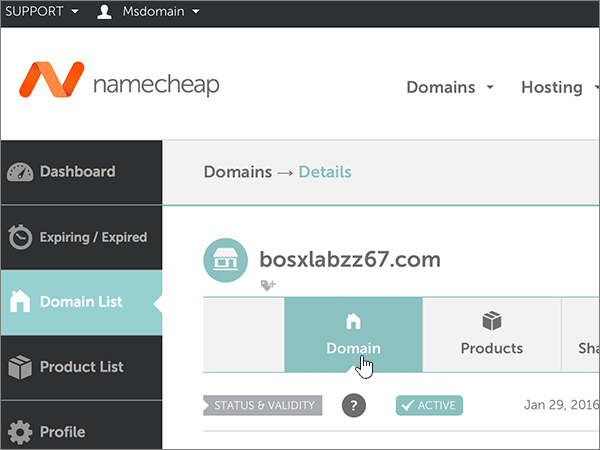

# Cambiar los servidores DNS para configurar Microsoft con namecheap

 **[Consulte Preguntas más frecuentes acerca de los dominios](../setup/domains-faq.md)** si no encuentra lo que busca.
  
Siga estas instrucciones si desea que Microsoft administre los registros DNS por usted. (Si lo prefiere, puede [administrar todos los registros DNS de Microsoft en namecheap](create-dns-records-at-namecheap.md)).
  
    
## Agregar un registro TXT para verificación

1. Para empezar, vaya a su página de dominios en namecheap a través de [este vínculo](https://www.namecheap.com/myaccount/login.aspx?ReturnUrl=%2f). Se le pedirá que inicie sesión y continúe.
    
    
  
2. En la página de **aterrizaje** , en **cuenta**, elija **lista de dominios** en la lista desplegable. 
    
    
  
3. En la página **lista de dominios** , busque el nombre del dominio que desea editar y, a continuación, seleccione **administrar**.
    
    
  
4. Seleccione **DNS avanzado**.
    
    
  
5. En la sección **registros de host** , seleccione **Agregar nuevo registro**.
    
    
  
6. En la lista desplegable **tipo** , seleccione **registro TXT**.
    
    > [!NOTE]
    > La lista desplegable **tipo** aparece automáticamente cuando se selecciona **Agregar nuevo registro**.
  
    
  
7. En los cuadros para el nuevo registro, escriba o copie y pegue los valores de la tabla siguiente.
    
    (Elija el valor **TTL** de la lista desplegable). 
    
|**Tipo**|**Host**|**Valor**|**TTL**|
|:-----|:-----|:-----|:-----|
|TXT    |@    |MS=ms *XXXXXXXX*    **Nota**: este es un ejemplo. Use aquí su **destino específico o** el valor de dirección de destino de la tabla.           [¿Cómo puedo encontrar esto?](../get-help-with-domains/information-for-dns-records.md)          |30 minutos    |
   
   
  
8. Seleccione el control **Guardar cambios** (marca de verificación). 
    
    
  
9. Espere unos minutos antes de continuar para que el registro que acaba de crear pueda actualizarse en Internet.
    
Ahora que ha agregado el registro en el sitio del registrador de dominios, volverá a Microsoft y solicitará una búsqueda para el registro.
  
Cuando Microsoft encuentre el registro TXT correcto, se comprobará el dominio.
  
1. En el centro de administración, diríjase a la página **configuración** \> <a href="https://go.microsoft.com/fwlink/p/?linkid=834818" target="_blank">dominios</a>.

    
2. En la página **Dominios**, elija el dominio que está verificando. 
    
    
  
3. En la página de **Configuración**, elija ** Iniciar configuración**.
    
    
  
4. En la página**verificar dominio**, seleccione **verificar**.
    
    
  
> [!NOTE]
>  Por lo general, los cambios de DNS tardan unos 15 minutos en aplicarse. Sin embargo, a veces los cambios pueden necesitar más tiempo para aplicarse en todo el sistema DNS de Internet. Si tiene problemas con el flujo de correo u otros problemas después de agregar registros DNS, consulte [Solucionar problemas después de cambiar el nombre del dominio o los registros DNS](../get-help-with-domains/find-and-fix-issues.md). 
  
## Cambiar los registros del servidor de nombres (o NS) de su dominio

Para completar la configuración de su dominio con Microsoft, debe cambiar los registros NS de su dominio en su registrador de dominios para que apunten a los servidores de nombres principal y secundario de Microsoft. Esto configura a Microsoft para que actualice los registros DNS del dominio por usted. Agregaremos todos los registros para que el correo electrónico, Skype Empresarial Online y su sitio web público funcionen con su dominio, y ya lo tendrá todo preparado.
  
> [!CAUTION]
> Al cambiar los registros NS de su dominio para que apunten a los servidores de nombres de Microsoft, se ven afectados todos los servicios que están actualmente asociados a su dominio. Por ejemplo, todos los mensajes de correo electrónico enviados a su dominio (como rob@ *your_domain* . com) empezarán a llegar a Microsoft después de realizar este cambio. 
  
> [!IMPORTANT]
>  Cuando haya completado los pasos descritos en esta sección, los  *únicos*  servidores DNS que deben aparecer son estos cuatro: >  ns1.bdm.microsoftonline.com >  ns2.bdm.microsoftonline.com >  ns3.bdm.microsoftonline.com >  ns4.bdm.microsoftonline.com >  En el procedimiento siguiente se muestra cómo eliminar cualquier otro servidor de nombres que no desee de la lista y también cómo agregar estos cuatro servidores DNS  *correctos*  , si aún no están en la lista. 
  
1. Para empezar, vaya a su página de dominios en namecheap a través de [este vínculo](https://www.namecheap.com/myaccount/login.aspx?ReturnUrl=%2f). Se le pedirá que inicie sesión y continúe.
    
    
  
2. En la página de **aterrizaje** , en **cuenta**, elija **lista de dominios** en la lista desplegable. 
    
    
  
3. En la página **lista de dominios** , busque el nombre del dominio que desea editar y, a continuación, seleccione **administrar**.
    
    
  
4. Seleccione **dominio**.
    
    
  
5. Busque la sección **servidores de nombres** y seleccione **personalizada** en la lista desplegable **namecheap predeterminada** . 
    
    
  
6. Dependiendo de si ya hay o no servidores de nombres enumerados en la página que se muestra ahora, continúe con uno de los dos procedimientos siguientes.
    
### Si aún NO se muestran servidores DNS en la lista

1. Seleccione **Agregar NAMESERVER** dos veces para agregar dos filas nuevas.
    
    
  
2. En los cuadros **servidor de nombres** , escriba (o copie y pegue) los valores de la tabla siguiente.
    
|||
|:-----|:-----|
|**Servidor DNS 1**   |ns1.bdm.microsoftonline.com    |
|**Servidor de nombres 2**   |ns2.bdm.microsoftonline.com    |
|**Servidor DNS 3**   |ns3.bdm.microsoftonline.com    |
|**Servidor DNS 4**   |ns4.bdm.microsoftonline.com    |
   
   
  
3. Seleccione el control **Guardar** (marca de verificación). 
    
    
  
> [!NOTE]
> Your nameserver record updates may take up to several hours to update across the Internet's DNS system. El correo electrónico y otros servicios de Microsoft estarán todos establecidos para funcionar con su dominio. 
  
### Si ya existen servidores de nombres enumerados

> [!CAUTION]
> Siga estos pasos  *solo*  si tiene servidores de nombres distintos de los cuatro servidores de nombres  *correctos*  . (Es decir, elimine  *solo*  los servidores de nombres actuales que  *no*  sean **ns1.bdm.microsoftonline.com**, **ns2.bdm.microsoftonline.com**, **ns3.bdm.microsoftonline.com** o **ns4.bdm.microsoftonline.com** ). 
  
1. Si en los cuadros **servidor de nombres** aparecen otros servidores DNS, elimínelos (para hacerlo, selecciónelos y, después, presione la tecla **suprimir** en el teclado). 
    
    
  
2. Seleccione **Agregar NAMESERVER** dos veces para agregar dos filas nuevas. 
    
    
  
3. En los cuadros **servidor de nombres** , escriba (o copie y pegue) los valores de la tabla siguiente.
 
    
|||
|:-----|:-----|
|**Servidor DNS 1**   |ns1.bdm.microsoftonline.com    |
|**Servidor DNS 2**   |ns2.bdm.microsoftonline.com    |
|**Servidor DNS 3**   |ns3.bdm.microsoftonline.com    |
|**Servidor DNS 4**   |ns4.bdm.microsoftonline.com    |
   
   
  
4. Seleccione el control **Guardar** (marca de verificación). 
    
    
  
> [!NOTE]
> Your nameserver record updates may take up to several hours to update across the Internet's DNS system. El correo electrónico y otros servicios de Microsoft estarán todos establecidos para funcionar con su dominio.
