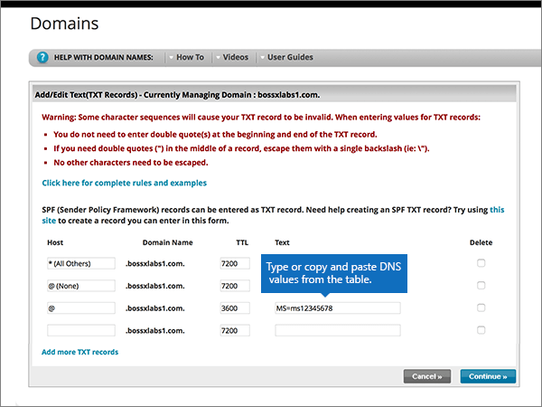

# Cambiar los servidores DNS para configurar Microsoft con soluciones de redChange nameservers to set up Microsoft with Network Solutions

 **[Consulte Preguntas más frecuentes acerca de los dominios](../setup/domains-faq.md)** si no encuentra lo que busca.**[Check the Domains FAQ](../setup/domains-faq.md)** if you don't find what you're looking for.
  
Siga estas instrucciones si desea que Microsoft administre los registros DNS por usted.Follow these instructions if you want Microsoft to manage your DNS records for you. (Si lo prefiere, puede [administrar todos los registros DNS de Microsoft en soluciones de red](create-dns-records-at-network-solutions.md)).(If you prefer, you can [manage all your Microsoft DNS records at Network Solutions](create-dns-records-at-network-solutions.md).)
  
    
## Agregar un registro TXT en Network Solutions para comprobar que es el propietario del dominioAdd a TXT record at Network Solutions to verify that you own the domain

Before you use your domain with Microsoft, we have to make sure that you own it.Before you use your domain with Microsoft, we have to make sure that you own it. Your ability to log in to your account at your domain registrar and create the DNS record proves to Microsoft that you own the domain.Your ability to log in to your account at your domain registrar and create the DNS record proves to Microsoft that you own the domain.
  
> [!NOTE]
> This record is used only to verify that you own your domain; it doesn't affect anything else.This record is used only to verify that you own your domain; it doesn't affect anything else. You can delete it later, if you like.You can delete it later, if you like. 
  
Siga los pasos siguientes o [vea el vídeo (empieza en 0:47)](https://support.microsoft.com/office/69b092e3-c026-4d19-a7d0-16cdb2d8b261).Follow the steps below or [watch the video (start at 0:47)](https://support.microsoft.com/office/69b092e3-c026-4d19-a7d0-16cdb2d8b261).
  
1. To get started, go to your domains page at Network Solutions by using [this link](https://www.networksolutions.com/manage-it).To get started, go to your domains page at Network Solutions by using [this link](https://www.networksolutions.com/manage-it). You'll be prompted to log in.You'll be prompted to log in.
    
    > [!IMPORTANT]
    > Antes de seleccionar el botón de **Inicio de sesión** , elija **Administrar mis nombres de dominio** en la lista desplegable **iniciar sesión en:** .Before you select the **Login** button, first choose **Manage My Domain Names** in the **Log In to:** drop-down list.
  
    
  
2. Seleccione la casilla situada al lado del nombre del dominio que desea modificar.Select the check box next to the name of the domain that you are modifying.
    
    
  
3. Seleccione **Editar DNS**.Select **Edit DNS**.
    
    
  
4. Seleccione **administrar registros DNS avanzados**.Select **Manage Advanced DNS Records**.
    
    (You may have to scroll down.)(You may have to scroll down.)
    
    
  
5. Desplácese hacia abajo hasta la sección **texto (registros txt)** y, a continuación, seleccione **Editar registros txt**.Scroll down to the **Text (TXT Records)** section, and then select **Edit TXT Records**.
    
    
  
6. En los cuadros para el nuevo registro, escriba o copie y pegue los valores de la tabla siguiente.In the boxes for the new record, type or copy and paste the values in the following table.
    
|**Host****Host**|**TTL****TTL**|**Texto****Text**|
|:-----|:-----|:-----|
|@    (The system will change this value to **@ (None)** when you save the record.)(The system will change this value to **@ (None)** when you save the record.)    |36003600    |MS=ms *XXXXXXXX*MS=ms *XXXXXXXX*    **Nota**: este es un ejemplo.**Note**: This is an example. Use su valor **Dirección de destino** específico aquí, de la tabla de Microsoft 365.Use your specific **Destination or Points to Address** value here, from the table in Microsoft 365.           [¿Cómo puedo encontrar esto?How do I find this?](../get-help-with-domains/information-for-dns-records.md)
   
    
   
  
7. Seleccione **continuar**.Select **Continue**.
    
    
  
8. Seleccione **Guardar cambios**.Select **Save Changes**.
    
    
  
9. Espere unos minutos antes de continuar para que el registro que acaba de crear pueda actualizarse en Internet.Wait a few minutes before you continue, so that the record you just created can update across the Internet.
    
Ahora que ha agregado el registro en el sitio de su registrador de dominios, volverá a Microsoft 365 y solicitará que busque el registro.Now that you've added the record at your domain registrar's site, you'll go back to Microsoft 365 and request Microsoft 365 to look for the record.
  
Cuando Microsoft encuentre el registro TXT correcto, se comprobará su dominio.When Microsoft finds the correct TXT record, your domain is verified.
  
1. En el centro de administración de Microsoft, diríjase a la página **Configuración** \> <a href="https://go.microsoft.com/fwlink/p/?linkid=834818" target="_blank">Dominios</a>.In the Microsoft admin center, go to the **Settings** \> <a href="https://go.microsoft.com/fwlink/p/?linkid=834818" target="_blank">Domains</a> page.

    
2. En la página **Dominios**, elija el dominio que está verificando.On the **Domains** page, select the domain that you are verifying. 
    
    
  
3. En la página de **Configuración**, elija \*\* Iniciar configuración\*\*.On the **Setup** page, select **Start setup**.
    
    
  
4. En la página**verificar dominio**, seleccione **verificar**.On the **Verify domain** page, select **Verify**.
    
    
  
> [!NOTE]
>  Typically it takes about 15 minutes for DNS changes to take effect.Typically it takes about 15 minutes for DNS changes to take effect. However, it can occasionally take longer for a change you've made to update across the Internet's DNS system.However, it can occasionally take longer for a change you've made to update across the Internet's DNS system. If you're having trouble with mail flow or other issues after adding DNS records, see [Troubleshoot issues after changing your domain name or DNS records](../get-help-with-domains/find-and-fix-issues.md).If you're having trouble with mail flow or other issues after adding DNS records, see [Troubleshoot issues after changing your domain name or DNS records](../get-help-with-domains/find-and-fix-issues.md). 
  
## Cambiar los registros del servidor de nombres (o NS) de su dominioChange your domain's nameserver (NS) records

Para completar la configuración de su dominio con Microsoft, debe cambiar los registros NS de su dominio en su registrador de dominios para que apunten a los servidores de nombres principal y secundario de Microsoft.To complete setting up your domain with Microsoft, you change your domain's NS records at your domain registrar to point to the Microsoft primary and secondary name servers. Esto configura a Microsoft para que actualice los registros DNS del dominio por usted.This sets up Microsoft to update the domain's DNS records for you. Agregaremos todos los registros para que el correo electrónico, Skype Empresarial Online y su sitio web público funcionen con su dominio, y ya lo tendrá todo preparado.We'll add all records so that email, Skype for Business Online, and your public website work with your domain, and you'll be all set.
  
> [!CAUTION]
> Al cambiar los registros NS de su dominio para que apunten a los servidores de nombres de Microsoft, se ven afectados todos los servicios que están actualmente asociados a su dominio.When you change your domain's NS records to point to the Microsoft name servers, all the services that are currently associated with your domain are affected. Por ejemplo, todos los mensajes de correo electrónico enviados a su dominio (como rob@ *your_domain* . com) empezarán a llegar a Microsoft después de realizar este cambio.For example, all email sent to your domain (like rob@ *your_domain*  .com) will start coming to Microsoft after you make this change.
  
¿Está preparado para cambiar los registros NS para que Microsoft pueda configurar el dominio?Ready to change your NS records so Microsoft can set up your domain? Siga los pasos siguientes o [vea el vídeo (empieza en 2:23)](https://support.microsoft.com/office/69b092e3-c026-4d19-a7d0-16cdb2d8b261).Follow the steps below or [watch the video (start at 2:23)](https://support.microsoft.com/office/69b092e3-c026-4d19-a7d0-16cdb2d8b261).
  
> [!IMPORTANT]
>  Cuando haya completado los pasos de esta sección, los *únicos* servidores de nombres que se deben enumerar son los cuatro siguientes: **ns1.BDM.microsoftonline.com**, **NS2.BDM.microsoftonline.com**, **NS3.BDM.microsoftonline.com**y **NS4.BDM.microsoftonline.com**.When you have completed the steps in this section, the  *only*  nameservers that should be listed are these four: **ns1.bdm.microsoftonline.com**, **ns2.bdm.microsoftonline.com**, **ns3.bdm.microsoftonline.com**, and **ns4.bdm.microsoftonline.com**. En el procedimiento siguiente se muestra cómo eliminar cualquier otro servidor de nombres que no desee de la lista y también cómo agregar estos cuatro servidores DNS  *correctos*  , si aún no están en la lista.The following procedure will show you how to delete any other, unwanted nameservers from the list, and also how to add the  *correct*  nameservers if they are not already in the list. 
  
1. Para empezar, vaya a la página de dominios en Network Solutions mediante [este vínculo](https://www.networksolutions.com/manage-it).To get started, go to your domains page at Network Solutions by using [this link](https://www.networksolutions.com/manage-it). Se le pedirá que inicie sesión.You'll be prompted to log in.
    
    > [!IMPORTANT]
    > Antes de seleccionar el botón de **Inicio de sesión** , elija **Administrar mis nombres de dominio** en la lista desplegable **iniciar sesión en:** .Before you select the **Login** button, first choose **Manage My Domain Names** in the **Log In to:** drop-down list. 
  
    
  
2. Seleccione la casilla situada al lado del nombre del dominio que desea modificar.Select the check box next to the name of the domain that you are modifying.
    
    
  
3. Seleccione **Editar DNS**.Select **Edit DNS**.
    
    
  
4. Seleccione **mover DNS**.Select **Move DNS**.
    
    
  
5. Dependiendo de si ya existen o no servidores de nombres enumerados en la página que se muestra ahora, continúe con uno de los dos procedimientos siguientes:Depending on whether or not there are already nameservers listed on the page that is displayed now, continue to one of the two following procedures:
    
  - Si aún **NO** se muestran servidores DNS en la lista, [Si aún NO se muestran servidores DNS en la lista](#if-there-are-no-nameservers-already-listed).If there are **NO** nameservers already listed, [If there are NO nameservers already listed](#if-there-are-no-nameservers-already-listed).
    
  - Si **YA** se muestran servidores DNS en la lista, [Si ya existen servidores de nombres enumerados](#if-there-are-nameservers-already-listed).If there **ARE** nameservers already listed, [If there ARE nameservers already listed](#if-there-are-nameservers-already-listed).
    
### Si aún NO se muestran servidores DNS en la listaIf there are NO nameservers already listed

1. En la página **dominios** , en la sección **especificar servidores de nombres de dominio** , seleccione **Agregar más servidores de nombres**.On the **Domains** page, in the **Specify Domain Name Servers** section, select **Add More Name Servers**.
    
    
  
2. En la página **Nombres de dominio**, escriba (o copie y pegue) los valores de servidores DNS de la tabla siguiente.On the **Domain Names** page, type or copy and paste the nameserver values from the following table. 
    
|||
|:-----|:-----|
|**Servidor DNS 1****Name Server 1**   |ns1.bdm.microsoftonline.comns1.bdm.microsoftonline.com    |
|**Servidor DNS 2****Name Server 2**   |ns2.bdm.microsoftonline.comns2.bdm.microsoftonline.com    |
|**Servidor DNS 2****Name Server 2**   |ns3.bdm.microsoftonline.comns3.bdm.microsoftonline.com    |
|**Servidor DNS 2****Name Server 2**   |ns4.bdm.microsoftonline.comns4.bdm.microsoftonline.com    |
   
    

  
3. Seleccione **mover DNS**.Select **Move DNS**.
    
    
  
4. Seleccione **Guardar cambios**.Select **Save Changes**.
    
    
  
> [!NOTE]
> Las actualizaciones de los registros de los servidores de nombres pueden tardar varias horas en propagarse por el sistema DNS de Internet.Your nameserver record updates may take up to several hours to update across the Internet's DNS system. El correo electrónico y otros servicios de Microsoft estarán todos establecidos para funcionar con su dominio.Then your Microsoft email and other services will be all set to work with your domain. 
  
### Si ya existen servidores de nombres enumeradosIf there ARE nameservers already listed

> [!CAUTION]
> Follow these steps  *only*  if you have existing nameservers other than the four  *correct*  nameservers.Follow these steps  *only*  if you have existing nameservers other than the four  *correct*  nameservers. (That is, delete  *only*  any current nameservers that are  *not*  named **ns1.bdm.microsoftonline.com**, **ns2.bdm.microsoftonline.com**, **ns3.bdm.microsoftonline.com**, or **ns4.bdm.microsoftonline.com**.)(That is, delete  *only*  any current nameservers that are  *not*  named **ns1.bdm.microsoftonline.com**, **ns2.bdm.microsoftonline.com**, **ns3.bdm.microsoftonline.com**, or **ns4.bdm.microsoftonline.com**.)
  
1. Si la lista contiene otros servidores DNS, elimínelos (para hacerlo, selecciónelos y, después, presione la tecla **Suprimir** en el teclado).If there are any other nameservers listed, delete each one by selecting it and then pressing the **Delete** key on your keyboard.
    
    
  
2. Seleccione **Agregar más servidores de nombres**.Select **Add More Name Servers**.
    
    
  
3. En la página **Nombres de dominio**, escriba (o copie y pegue) los valores de servidores DNS de la tabla siguiente.On the **Domain Names** page, type or copy and paste the nameserver values from the following table. 
    
|||
|:-----|:-----|
|**Servidor DNS 1****Name Server 1**   |ns1.bdm.microsoftonline.comns1.bdm.microsoftonline.com    |
|**Servidor DNS 2****Name Server 2**   |ns2.bdm.microsoftonline.comns2.bdm.microsoftonline.com    |
|**Servidor de nombres 3****Name Server 3**   |ns3.bdm.microsoftonline.comns3.bdm.microsoftonline.com    |
|**Servidor de nombres 4****Name Server 4**   |ns4.bdm.microsoftonline.comns4.bdm.microsoftonline.com    |
   
    

  
4. Seleccione **mover DNS**.Select **Move DNS**.
    
    
  
5. Seleccione **Guardar cambios.**Select **Save Changes.**
    
    
  
> [!NOTE]
> Las actualizaciones de los registros de los servidores de nombres pueden tardar varias horas en propagarse por el sistema DNS de Internet.Your nameserver record updates may take up to several hours to update across the Internet's DNS system. El correo electrónico y otros servicios de Microsoft estarán todos establecidos para funcionar con su dominio.Then your Microsoft email and other services will be all set to work with your domain.
