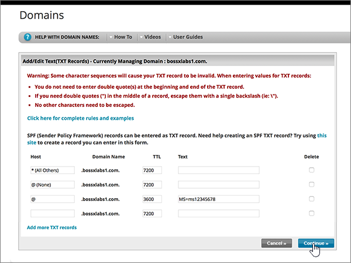
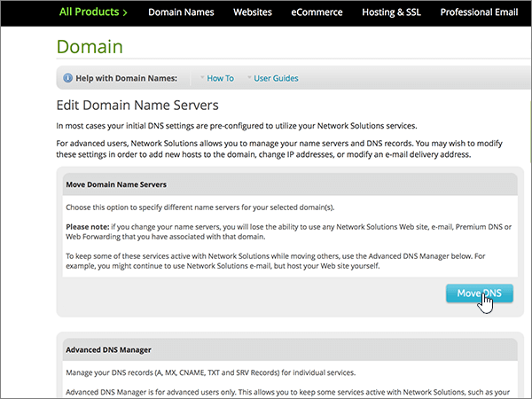

# Cambiar los servidores DNS para configurar Microsoft con soluciones de red

 **[Consulte Preguntas más frecuentes acerca de los dominios](../setup/domains-faq.md)** si no encuentra lo que busca.
  
Siga estas instrucciones si desea que Microsoft administre los registros DNS por usted. (Si lo prefiere, puede [administrar todos los registros DNS de Microsoft en soluciones de red](create-dns-records-at-network-solutions.md)).
  
    
## Agregar un registro TXT en Network Solutions para comprobar que es el propietario del dominio

Before you use your domain with Microsoft, we have to make sure that you own it. Your ability to log in to your account at your domain registrar and create the DNS record proves to Microsoft that you own the domain.
  
> [!NOTE]
> This record is used only to verify that you own your domain; it doesn't affect anything else. You can delete it later, if you like. 
  
Siga los pasos siguientes o [vea el vídeo (empieza en 0:47)](https://support.microsoft.com/office/69b092e3-c026-4d19-a7d0-16cdb2d8b261).
  
1. To get started, go to your domains page at Network Solutions by using [this link](https://www.networksolutions.com/manage-it). You'll be prompted to log in.
    
    > [!IMPORTANT]
    > Antes de seleccionar el botón de **Inicio de sesión** , elija **Administrar mis nombres de dominio** en la lista desplegable **iniciar sesión en:** .
  
    
  
2. Seleccione la casilla situada al lado del nombre del dominio que desea modificar.
    
    
  
3. Seleccione **Editar DNS**.
    
    
  
4. Seleccione **administrar registros DNS avanzados**.
    
    (You may have to scroll down.)
    
    
  
5. Desplácese hacia abajo hasta la sección **texto (registros txt)** y, a continuación, seleccione **Editar registros txt**.
    
    
  
6. En los cuadros para el nuevo registro, escriba o copie y pegue los valores de la tabla siguiente.
    
|**Host**|**TTL**|**Texto**|
|:-----|:-----|:-----|
|@    (The system will change this value to **@ (None)** when you save the record.)    |3600    |MS=ms *XXXXXXXX*    **Nota**: este es un ejemplo. Use su valor **Dirección de destino** específico aquí, de la tabla de Microsoft 365.           [¿Cómo puedo encontrar esto?](../get-help-with-domains/information-for-dns-records.md)
   
    
   
  
7. Seleccione **continuar**.
    
    
  
8. Seleccione **Guardar cambios**.
    
    
  
9. Espere unos minutos antes de continuar para que el registro que acaba de crear pueda actualizarse en Internet.
    
Ahora que ha agregado el registro en el sitio de su registrador de dominios, volverá a Microsoft 365 y solicitará que busque el registro.
  
Cuando Microsoft encuentre el registro TXT correcto, se comprobará su dominio.
  
1. En el centro de administración de Microsoft, diríjase a la página **Configuración** \> <a href="https://go.microsoft.com/fwlink/p/?linkid=834818" target="_blank">Dominios</a>.

    
2. En la página **Dominios**, elija el dominio que está verificando. 
    
    
  
3. En la página de **Configuración**, elija ** Iniciar configuración**.
    
    
  
4. En la página**verificar dominio**, seleccione **verificar**.
    
    
  
> [!NOTE]
>  Typically it takes about 15 minutes for DNS changes to take effect. However, it can occasionally take longer for a change you've made to update across the Internet's DNS system. If you're having trouble with mail flow or other issues after adding DNS records, see [Troubleshoot issues after changing your domain name or DNS records](../get-help-with-domains/find-and-fix-issues.md). 
  
## Cambiar los registros del servidor de nombres (o NS) de su dominio

Para completar la configuración de su dominio con Microsoft, debe cambiar los registros NS de su dominio en su registrador de dominios para que apunten a los servidores de nombres principal y secundario de Microsoft. Esto configura a Microsoft para que actualice los registros DNS del dominio por usted. Agregaremos todos los registros para que el correo electrónico, Skype Empresarial Online y su sitio web público funcionen con su dominio, y ya lo tendrá todo preparado.
  
> [!CAUTION]
> Al cambiar los registros NS de su dominio para que apunten a los servidores de nombres de Microsoft, se ven afectados todos los servicios que están actualmente asociados a su dominio. Por ejemplo, todos los mensajes de correo electrónico enviados a su dominio (como rob@ *your_domain* . com) empezarán a llegar a Microsoft después de realizar este cambio.
  
¿Está preparado para cambiar los registros NS para que Microsoft pueda configurar el dominio? Siga los pasos siguientes o [vea el vídeo (empieza en 2:23)](https://support.microsoft.com/office/69b092e3-c026-4d19-a7d0-16cdb2d8b261).
  
> [!IMPORTANT]
>  Cuando haya completado los pasos de esta sección, los *únicos* servidores de nombres que se deben enumerar son los cuatro siguientes: **ns1.BDM.microsoftonline.com**, **NS2.BDM.microsoftonline.com**, **NS3.BDM.microsoftonline.com**y **NS4.BDM.microsoftonline.com**. En el procedimiento siguiente se muestra cómo eliminar cualquier otro servidor de nombres que no desee de la lista y también cómo agregar estos cuatro servidores DNS  *correctos*  , si aún no están en la lista. 
  
1. Para empezar, vaya a la página de dominios en Network Solutions mediante [este vínculo](https://www.networksolutions.com/manage-it). Se le pedirá que inicie sesión.
    
    > [!IMPORTANT]
    > Antes de seleccionar el botón de **Inicio de sesión** , elija **Administrar mis nombres de dominio** en la lista desplegable **iniciar sesión en:** . 
  
    
  
2. Seleccione la casilla situada al lado del nombre del dominio que desea modificar.
    
    
  
3. Seleccione **Editar DNS**.
    
    
  
4. Seleccione **mover DNS**.
    
    
  
5. Dependiendo de si ya existen o no servidores de nombres enumerados en la página que se muestra ahora, continúe con uno de los dos procedimientos siguientes:
    
  - Si aún **NO** se muestran servidores DNS en la lista, [Si aún NO se muestran servidores DNS en la lista](#if-there-are-no-nameservers-already-listed).
    
  - Si **YA** se muestran servidores DNS en la lista, [Si ya existen servidores de nombres enumerados](#if-there-are-nameservers-already-listed).
    
### Si aún NO se muestran servidores DNS en la lista

1. En la página **dominios** , en la sección **especificar servidores de nombres de dominio** , seleccione **Agregar más servidores de nombres**.
    
    
  
2. En la página **Nombres de dominio**, escriba (o copie y pegue) los valores de servidores DNS de la tabla siguiente. 
    
|||
|:-----|:-----|
|**Servidor DNS 1**   |ns1.bdm.microsoftonline.com    |
|**Servidor DNS 2**   |ns2.bdm.microsoftonline.com    |
|**Servidor DNS 2**   |ns3.bdm.microsoftonline.com    |
|**Servidor DNS 2**   |ns4.bdm.microsoftonline.com    |
   
    

  
3. Seleccione **mover DNS**.
    
    
  
4. Seleccione **Guardar cambios**.
    
    
  
> [!NOTE]
> Las actualizaciones de los registros de los servidores de nombres pueden tardar varias horas en propagarse por el sistema DNS de Internet. El correo electrónico y otros servicios de Microsoft estarán todos establecidos para funcionar con su dominio. 
  
### Si ya existen servidores de nombres enumerados

> [!CAUTION]
> Follow these steps  *only*  if you have existing nameservers other than the four  *correct*  nameservers. (That is, delete  *only*  any current nameservers that are  *not*  named **ns1.bdm.microsoftonline.com**, **ns2.bdm.microsoftonline.com**, **ns3.bdm.microsoftonline.com**, or **ns4.bdm.microsoftonline.com**.)
  
1. Si la lista contiene otros servidores DNS, elimínelos (para hacerlo, selecciónelos y, después, presione la tecla **Suprimir** en el teclado).
    
    
  
2. Seleccione **Agregar más servidores de nombres**.
    
    
  
3. En la página **Nombres de dominio**, escriba (o copie y pegue) los valores de servidores DNS de la tabla siguiente.
 
    
|||
|:-----|:-----|
|**Servidor DNS 1**   |ns1.bdm.microsoftonline.com    |
|**Servidor DNS 2**   |ns2.bdm.microsoftonline.com    |
|**Servidor de nombres 3**   |ns3.bdm.microsoftonline.com    |
|**Servidor de nombres 4**   |ns4.bdm.microsoftonline.com    |
   
    

  
4. Seleccione **mover DNS**.
    
    
  
5. Seleccione **Guardar cambios.**
    
    
  
> [!NOTE]
> Las actualizaciones de los registros de los servidores de nombres pueden tardar varias horas en propagarse por el sistema DNS de Internet. El correo electrónico y otros servicios de Microsoft estarán todos establecidos para funcionar con su dominio.
