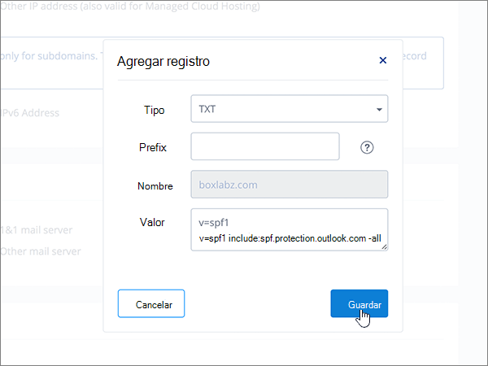

# Crear registros DNS en 1&1 IONOS para MicrosoftCreate DNS records at 1&1 IONOS for Microsoft

 **[Consulte Preguntas más frecuentes acerca de los dominios](../setup/domains-faq.md)** si no encuentra lo que busca.**[Check the Domains FAQ](../setup/domains-faq.md)** if you don't find what you're looking for. 
  
> [!CAUTION]
> Tenga en cuenta que 1&1 IONOS no permite que un dominio tenga un registro MX y un registro CNAME de detección automática de nivel superior.Note that 1&1 IONOS doesn't allow a domain to have both an MX record and a top-level Autodiscover CNAME record. Esto limita las formas en que puede configurar Exchange Online para Microsoft.This limits the ways in which you can configure Exchange Online for Microsoft. Hay una solución alternativa, pero le recomendamos que la emplee **solo** si ya tiene experiencia con la creación de subdominios en 1&1 IONOS.There is a workaround, but we recommend employing it **only** if you already have experience with creating subdomains at 1&1 IONOS. > si, a pesar de esta [limitación del servicio](https://docs.microsoft.com/microsoft-365/admin/setup/domains-faq) , elige administrar sus propios registros DNS de Microsoft en 1&1 IONOS, siga los pasos de este artículo para comprobar su dominio y configurar los registros DNS para el correo electrónico, Skype empresarial online, etc.> If despite this [service limitation](https://docs.microsoft.com/microsoft-365/admin/setup/domains-faq) you choose to manage your own Microsoft DNS records at 1&1 IONOS, follow the steps in this article to verify your domain and to set up DNS records for email, Skype for Business Online, and so on. 
  
Después de agregar estos registros a la 1&1 IONOS, su dominio estará configurado para trabajar con los servicios de Microsoft.After you add these records at 1&1 IONOS, your domain will be set up to work with Microsoft services.
  
  
> [!NOTE]
> Normalmente, se necesitan unos 15 minutos para que los cambios de DNS surtan efecto.Typically it takes about 15 minutes for DNS changes to take effect. Sin embargo, a veces los cambios pueden necesitar más tiempo para aplicarse en todo el sistema DNS de Internet.However, it can occasionally take longer for a change you've made to update across the Internet's DNS system. Si tiene problemas con el flujo de correo u otros problemas después de agregar registros DNS, vea [Encontrar y solucionar problemas después de agregar el dominio o los registros DNS](../get-help-with-domains/find-and-fix-issues.md).If you're having trouble with mail flow or other issues after adding DNS records, see [Find and fix issues after adding your domain or DNS records](../get-help-with-domains/find-and-fix-issues.md). 
  
## Agregar un registro TXT para verificaciónAdd a TXT record for verification

Antes de utilizar el dominio con Microsoft, tenemos que asegurarnos de que sea el propietario. Si puede iniciar sesión en la cuenta en el registrador de dominio y crear el registro DNS, Microsoft sabrá que es el propietario del dominio.Before you use your domain with Microsoft, we have to make sure that you own it. Your ability to log in to your account at your domain registrar and create the DNS record proves to Microsoft that you own the domain.
  
> [!NOTE]
> Este registro se usa exclusivamente para verificar si se es el propietario de un dominio; no afecta a nada más. Puede eliminarlo más adelante, si lo desea.This record is used only to verify that you own your domain; it doesn't affect anything else. You can delete it later, if you like. 
  
Siga los pasos siguientes o [vea el vídeo (empieza en 0:42)](https://docs.microsoft.com/microsoft-365/admin/dns/create-dns-records-at-1-1-internet).Follow the steps below or [watch the video (start at 0:42)](https://docs.microsoft.com/microsoft-365/admin/dns/create-dns-records-at-1-1-internet).
  
1. Para empezar, vaya a su página de dominios en 1&1 IONOS a través de [este vínculo](https://my.1and1.com/).To get started, go to your domains page at 1&1 IONOS by using [this link](https://my.1and1.com/). You'll be prompted to log in.You'll be prompted to log in.
    
2. Seleccione **administrar dominios**.Select **Manage domains**.
    
3. En la página **centro de dominios** , busque el dominio que desea actualizar y, a continuación, seleccione el control **Panel** ( **v**) para ese dominio.On the **Domain Center** page, find the domain that you want to update, and then select the **Panel** ( **v**) control for that domain.
    
4. En el área **configuración del dominio** , seleccione **Editar configuración DNS**.In the **Domain Settings** area, select **Edit DNS Settings**.
    
5. En la sección **registros txt y SRV** , seleccione **Agregar registro**.In the **TXT and SRV Records** section, select **Add Record**.
    
6. In the **Add Record** area, in the boxes for the new record, type or copy and paste the values from the following table.In the **Add Record** area, in the boxes for the new record, type or copy and paste the values from the following table. 
    
    (Choose the **Type** value from the drop-down list.)(Choose the **Type** value from the drop-down list.) 
    
    ||||
    |:-----|:-----|:-----|
    |**Tipo****Type**   |**Prefijo****Prefix**   |**Valor de nombre****Name Value**   |
    |TXTTXT    |(Deje este campo en blanco)(Leave this field blank)    |MS=ms *XXXXXXXX*MS=ms *XXXXXXXX*    Nota: este es un ejemplo.NOTE: This is an example. Utilice aquí su valor de **Dirección de destino**, desde la tabla.Use your specific **Destination or Points to Address** value here, from the table. [¿Cómo puedo encontrar esto?How do I find this?](../get-help-with-domains/information-for-dns-records.md)          |
   
7. Haga clic en **Guardar**.Select **Save**.
    
8. Vuelva a seleccionar **Guardar** .Select **Save** again. 
    
9. En el cuadro de diálogo **Editar configuración DNS** , seleccione **sí**.In the **Edit DNS Settings** dialog box, select **Yes**.
    
10. Espere unos minutos antes de continuar para que el registro que acaba de crear pueda actualizarse en Internet.Wait a few minutes before you continue, so that the record you just created can update across the Internet.
    
Ahora que ha agregado el registro en el sitio de su registrador de dominios, volverá a Microsoft 365 y solicitará que busque el registro.Now that you've added the record at your domain registrar's site, you'll go back to Microsoft 365 and request Microsoft 365 to look for the record.
  
Cuando Microsoft encuentre el registro TXT correcto, se comprobará su dominio.When Microsoft finds the correct TXT record, your domain is verified.
  
1. En el centro de administración de Microsoft, diríjase a la página **Configuración** \> <a href="https://go.microsoft.com/fwlink/p/?linkid=834818" target="_blank">Dominios</a>.In the Microsoft admin center, go to the **Settings** \> <a href="https://go.microsoft.com/fwlink/p/?linkid=834818" target="_blank">Domains</a> page.

    
2. En la página **Dominios**, elija el dominio que está verificando.On the **Domains** page, select the domain that you are verifying. 
    
3. En la página de **Configuración**, elija \*\* Iniciar configuración\*\*.On the **Setup** page, select **Start setup**.
    
4. En la página**Verificar dominio**, elija **Verificar**.On the **Verify domain** page, select **Verify**.
    
> [!NOTE]
> Normalmente, se necesitan unos 15 minutos para que los cambios de DNS surtan efecto.Typically it takes about 15 minutes for DNS changes to take effect. Sin embargo, a veces los cambios pueden necesitar más tiempo para aplicarse en todo el sistema DNS de Internet.However, it can occasionally take longer for a change you've made to update across the Internet's DNS system. Si tiene problemas con el flujo de correo u otros problemas después de agregar registros DNS, vea [Encontrar y solucionar problemas después de agregar el dominio o los registros DNS](../get-help-with-domains/find-and-fix-issues.md).If you're having trouble with mail flow or other issues after adding DNS records, see [Find and fix issues after adding your domain or DNS records](../get-help-with-domains/find-and-fix-issues.md). 
  
## Agregar un registro MX para que el correo electrónico del dominio vaya a MicrosoftAdd an MX record so email for your domain will come to Microsoft

Siga los pasos siguientes o [vea el vídeo (empieza en 3:22)](https://docs.microsoft.com/microsoft-365/admin/dns/create-dns-records-at-1-1-internet).Follow the steps below or [watch the video (start at 3:22)](https://docs.microsoft.com/microsoft-365/admin/dns/create-dns-records-at-1-1-internet).
  
> [!NOTE]
> Si se ha registrado con 1und1.de, [inicie sesión aquí](https://go.microsoft.com/fwlink/?linkid=859152).If you've registered with 1und1.de, [sign in here](https://go.microsoft.com/fwlink/?linkid=859152). 
  
1. Para empezar, vaya a su página de dominios en 1&1 IONOS a través de [este vínculo](https://my.1and1.com/).To get started, go to your domains page at 1&1 IONOS by using [this link](https://my.1and1.com/). You'll be prompted to log in.You'll be prompted to log in.
    
2. Seleccione **administrar dominios**.Select **Manage domains**.
    
3. En la página **centro de dominios** , busque el dominio que desea actualizar y, a continuación, seleccione el control **Panel** ( **v**) para ese dominio.On the **Domain Center** page, find the domain that you want to update, and then select the **Panel** ( **v**) control for that domain.
    
4. En el área **configuración del dominio** , seleccione **Editar configuración DNS**.In the **Domain Settings** area, select **Edit DNS Settings**.
    
5. En la sección **registros MX** , en el área **intercambiador de correo (registro MX)** , seleccione **otro servidor de correo**.In the **MX Records** section, in the **Mail Exchanger (MX Record)** area, select **Other mail server**. (You may have to scroll down.)(You may have to scroll down.)   
  
6. Si ya aparecen registros MX en la lista, elimínelos seleccionando el registro y, después, presionando la tecla **Eliminar** del teclado.If there are any MX records already listed, delete each of them by selecting the record and then pressing the **Delete** key on your keyboard. (Si no hay ningún registro MX en la lista, continúe con el paso siguiente).(If there are no MX records already listed, continue to the next step.)  
  
7. En los cuadros para el registro **MX 1**, escriba o copie y pegue los valores de la tabla siguiente.In the boxes for the **MX 1** record, type or copy and paste the values from the following table. 
    
    |**MX 1****MX 1**|**Prioridad****Priority**|
    |:-----|:-----|
    | *\< clave-de-dominio \>*  . mail.protection.outlook.com    *\<domain-key\>*  .mail.protection.outlook.com     Nota: Obtén la \<clave\> de dominio de tu cuenta de Microsoft.NOTE: Get your \<domain-key\> from your Microsoft account. [¿Cómo puedo encontrarla?How do I find this?](../get-help-with-domains/information-for-dns-records.md)          |10  10    Para obtener más información sobre la prioridad, consulte [¿Qué es una prioridad de MX?](https://docs.microsoft.com/microsoft-365/admin/setup/domains-faq)For more information about priority, see [What is MX priority?](https://docs.microsoft.com/microsoft-365/admin/setup/domains-faq)   | 
    
     
  
8. Haga clic en **Guardar**.Select **Save**. (You may have to scroll down.)(You may have to scroll down.) 
  
9. En el cuadro de diálogo **Editar configuración DNS** , seleccione **sí**.In the **Edit DNS Settings** dialog box, select **Yes**. 
  
## Agregar los seis registros CNAME necesarios para MicrosoftAdd the six CNAME records that are required for Microsoft

1&1 IONOS requiere una solución alternativa para que pueda usar un registro MX junto con los registros CNAME necesarios para los servicios de correo electrónico de Microsoft.1&1 IONOS requires a workaround so that you can use an MX record together with the CNAME records that are required for Microsoft email services. Para solucionar este problema, es necesario crear un conjunto de subdominios en 1&1 IONOS y asignarlos a registros CNAME.This workaround requires you to create a set of subdomains at 1&1 IONOS, and to assign them to CNAME records.
  
> [!IMPORTANT]
> Asegúrese de que tiene al menos dos subdominios disponibles antes de iniciar este procedimiento.Make sure that you have at least two available subdomains before starting this procedure. Le recomendamos esta solución solo si ya tiene experiencia con la creación de subdominios en 1&1 IONOS.We recommend this solution only if you already have experience with creating subdomains at 1&1 IONOS. 
  
### Registros CNAME básicosBasic CNAME records

Siga los pasos siguientes o [vea el vídeo (empieza en 3:57)](https://docs.microsoft.com/microsoft-365/admin/dns/create-dns-records-at-1-1-internet).Follow the steps below or [watch the video (start at 3:57)](https://docs.microsoft.com/microsoft-365/admin/dns/create-dns-records-at-1-1-internet).
  
> [!NOTE]
> Si se ha registrado con 1und1.de, [inicie sesión aquí](https://go.microsoft.com/fwlink/?linkid=859152).If you've registered with 1und1.de, [sign in here](https://go.microsoft.com/fwlink/?linkid=859152). 
  
1. Para empezar, vaya a su página de dominios en 1&1 IONOS a través de [este vínculo](https://my.1and1.com/).To get started, go to your domains page at 1&1 IONOS by using [this link](https://my.1and1.com/). You'll be prompted to log in.You'll be prompted to log in.
    
2. Seleccione **administrar dominios**.Select **Manage domains**.
    
3. En la página **centro de dominios** , busque el dominio que desea actualizar y, a continuación, seleccione **administrar subdominios**.On the **Domain Center** page, find the domain that you want to update, and then select **Manage Subdomains**.   Ahora podrá crear dos subdominios y establecer un valor **Alias** para cada uno.Now you'll create two subdomains and set an **Alias** value for each. (Esto es necesario porque 1&1 IONOS admite solo un registro CNAME de nivel superior, pero Microsoft requiere varios registros CNAME).(This is required because 1&1 IONOS supports only one top-level CNAME record, but Microsoft requires several CNAME records.) En primer lugar, debe crear el subdominio Autodiscover.First, you'll create the Autodiscover subdomain.
    
4. En la sección **información general de subdominio** , seleccione **crear subdominio**.In the **Subdomain Overview** section, select **Create Subdomain**.
    
    
  
5. En el cuadro **Crear subdominio** del nuevo subdominio, escriba o copie y pegue solo el valor **Crear subdominio** de la tabla siguiente. (Agregará el valor **Alias** en un paso posterior).In the **Create Subdomain** box for the new subdomain, type or copy and paste only the **Create Subdomain** value from the following table. (You'll add the **Alias** value in a later step.)

    |**Crear subdominio****Create Subdomain**|**Alias****Alias**|
    |:-----|:-----|
    |autodescubrirautodiscover    |autodiscover.outlook.comautodiscover.outlook.com   | 

    
  
6. Seleccione **crear subdominio**.Select **Create Subdomain**. 
  
7. En la sección **información general de subdominio** , localice el subdominio **Autodiscover** que acaba de crear y, a continuación, seleccione el control **Panel (v)** para ese subdominio.In the **Subdomain Overview** section, locate the **autodiscover** subdomain that you just created, and then select the **Panel (v)** control for that subdomain.  
  
8. En el área **configuración de subdominio** , seleccione **Editar configuración DNS**.In the **Subdomain Settings** area, select **Edit DNS Settings**.  
  
9. En la sección **registros A/AAAA (direcciones IP)** , en el área **dirección IP (registro A)** , seleccione **CNAME**.In the **A/AAAA Records (IP Addresses)** section, in the **IP address (A Record)** area, select **CNAME**. 
  
10. En el cuadro de diálogo **Alias:**, escriba o copie y pegue solo el valor **Alias** de la tabla siguiente.In the **Alias:** box, type or copy and paste only the **Alias** value from the following table.  
    
    |**Crear subdominio****Create Subdomain**|**Alias****Alias**|
    |:-----|:-----|
    |autodescubrirautodiscover    |autodiscover.outlook.comautodiscover.outlook.com   |

    
  
11. Active la casilla del aviso de declinación de responsabilidades **Soy consciente**.Select the check box for the **I am aware** disclaimer. 
  
12. Haga clic en **Guardar**.Select **Save**. 
  
  
### Registros CNAME adicionalesAdditional CNAME records

Los registros CNAME adicionales creados con el procedimiento siguiente habilitan servicios Skype Empresarial Online. Repetirá los mismos pasos que siguió para crear los dos registros anteriores CNAME.The additional CNAME records created in the following procedure enable Skype for Business Online services. You will employ the same steps that you used to create the two CNAME records you have already created.
  
1. Cree el tercer subdominio (Lyncdiscover).Create the third subdomain (Lyncdiscover). En la sección **información general de subdominio** , seleccione **crear subdominio**.On the **Subdomain Overview** section, select **Create Subdomain**.
    
2. En el cuadro **Crear subdominio** del nuevo subdominio, escriba o copie y pegue solo el valor **Crear subdominio** de la tabla siguiente. (Agregará el valor **Alias** en un paso posterior).In the **Create Subdomain** box for the new subdomain, type or copy and paste only the **Create Subdomain** value from the following table. (You'll add the **Alias** value in a later step.)  
    
    |**Crear subdominio****Create Subdomain**|**Alias****Alias**|
    |:-----|:-----|
    |lyncdiscoverlyncdiscover   |webdir.online.lync.comwebdir.online.lync.com  |
   
3. Seleccione **crear subdominio**.Select **Create Subdomain**.
    
4. En la página **centro de dominios** , seleccione **administrar subdominios**.On the **Domain Center** page, select **Manage Subdomains**.
    
5. En la sección **información general de subdominio** , busque el subdominio **lyncdiscover** que acaba de crear y, a continuación, seleccione el control **Panel (v)** para ese subdominio.In the **Subdomain Overview** section, find the **lyncdiscover** subdomain that you just created, and then select the **Panel (v)** control for that subdomain.  En el área **configuración de subdominio** , seleccione **Editar configuración DNS**.In the **Subdomain Settings** area, select **Edit DNS Settings**.
    
6. En la sección **registros A/AAAA (direcciones IP)** , en el área **dirección IP (registro A)** , seleccione **CNAME**.In the **A/AAAA Records (IP Addresses)** section, in the **IP address (A Record)** area, select **CNAME**.
    
7. En el cuadro de diálogo **Alias:**, escriba o copie y pegue solo el valor **Alias** de la tabla siguiente.In the **Alias:** box, type or copy and paste only the **Alias** value from the following table.  
    
    |**Crear subdominio****Create Subdomain**|**Alias****Alias**|
    |:-----|:-----|
    |lyncdiscoverlyncdiscover    |webdir.online.lync.comwebdir.online.lync.com    |
   
8. Active la casilla de verificación **I-Aware** declinación de responsabilidades y, después, seleccione **Guardar**.Select the check box for the **I am aware** disclaimer, and then select **Save**.
    
9. En el cuadro de diálogo **Editar configuración DNS** , seleccione **sí**.In the **Edit DNS Settings** dialog box, select **Yes**.
    
10. Crear el cuarto subdominio (SIP):Create the fourth subdomain (SIP):  En la sección **información general de subdominio** , seleccione **crear subdominio**.In the **Subdomain Overview** section, select **Create Subdomain**.
    
11. En el cuadro **Crear subdominio** del nuevo subdominio, escriba o copie y pegue solo el valor **Crear subdominio** de la tabla siguiente. (Agregará el valor **Alias** en un paso posterior).In the **Create Subdomain** box for the new subdomain, type or copy and paste only the **Create Subdomain** value from the following table. (You'll add the **Alias** value in a later step.)  
    
    |**Crear subdominio****Create Subdomain**|**Alias****Alias**|
    |:-----|:-----|
    |sipsip    |sipdir.online.lync.comsipdir.online.lync.com    |
   
12. Seleccione **crear subdominio**.Select **Create Subdomain**.
    
13. En la página **centro de dominios** , seleccione **administrar subdominios**.On the **Domain Center** page, select **Manage Subdomains**.
    
14. En la sección **información general de subdominio** , busque el subdominio **SIP** que acaba de crear y, a continuación, seleccione el control **Panel (v)** para ese subdominio.In the **Subdomain Overview** section, find the **sip** subdomain that you just created, and then select the **Panel (v)** control for that subdomain.  En el área **configuración de subdominio** , seleccione **Editar configuración DNS**.In the **Subdomain Settings** area, select **Edit DNS Settings**.
    
15. En la sección **registros A/AAAA (direcciones IP)** , en el área **dirección IP (registro A)** , seleccione **CNAME**.In the **A/AAAA Records (IP Addresses)** section, in the **IP address (A Record)** area, select **CNAME**.
    
16. En el cuadro de diálogo **Alias:**, escriba o copie y pegue solo el valor **Alias** de la tabla siguiente.In the **Alias:** box, type or copy and paste only the **Alias** value from the following table. 
    
    |**Crear subdominio****Create Subdomain**|**Alias****Alias**|
    |:-----|:-----|
    |sipsip    |sipdir.online.lync.comsipdir.online.lync.com    |
   
17. Active la casilla de verificación **I-Aware** declinación de responsabilidades y, después, seleccione **Guardar**.Select the check box for the **I am aware** disclaimer, and then select **Save**.
    
18. En el cuadro de diálogo **Editar configuración DNS** , seleccione **sí**.In the **Edit DNS Settings** dialog box, select **Yes**.
    
### Registros CNAME necesarios para MDMCNAME records needed for MDM

> [!IMPORTANT]
> Siga el procedimiento que ha usado para los otros cuatro registros CNAME, pero proporcione los valores de la tabla siguiente.Follow the procedure that you used for the other four CNAME records, but supply the values from the following table. 
  
|**Crear subdominio****Create Subdomain**|**Alias****Alias**|
|:-----|:-----|
|enterpriseregistrationenterpriseregistration    |enterpriseregistration.windows.netenterpriseregistration.windows.net    |
|enterpriseenrollmententerpriseenrollment    |enterpriseenrollment-s.manage.microsoft.comenterpriseenrollment-s.manage.microsoft.com    |
   
## Agregar un registro TXT para SPF para ayudar a evitar el correo no deseadoAdd a TXT record for SPF to help prevent email spam

> [!IMPORTANT]
> No puede tener más de un registro TXT para el SPF de un dominio.You cannot have more than one TXT record for SPF for a domain. Si su dominio tiene más de un registro de SPF, obtendrá errores de correo, así como problemas de clasificación de entrega y de correo no deseado.If your domain has more than one SPF record, you'll get email errors, as well as delivery and spam classification issues. Si ya tiene un registro de SPF para su dominio, no cree uno nuevo para Microsoft.If you already have an SPF record for your domain, don't create a new one for Microsoft. En su lugar, agregue los valores necesarios de Microsoft al registro activo para que tenga un *único* registro de SPF que incluya ambos conjuntos de valores.Instead, add the required Microsoft values to the current record so that you have a  *single*  SPF record that includes both sets of values. ¿Necesita ejemplos?Need examples? Consulte los [Registros externos del sistema de nombres de dominio para Microsoft](https://docs.microsoft.com/office365/enterprise/external-domain-name-system-records).Check out these [External Domain Name System records for Microsoft](https://docs.microsoft.com/office365/enterprise/external-domain-name-system-records). Para validar el registro de SPF, puede usar una de estas[herramientas de validación de SPF](../setup/domains-faq.md).To validate your SPF record, you can use one of these[SPF validation tools](../setup/domains-faq.md). 
  
Siga los pasos siguientes o [vea el vídeo (empieza en 5:09)](https://docs.microsoft.com/microsoft-365/admin/dns/create-dns-records-at-1-1-internet).Follow the steps below or [watch the video (start at 5:09)](https://docs.microsoft.com/microsoft-365/admin/dns/create-dns-records-at-1-1-internet).
  
> [!NOTE]
> Si se ha registrado con 1und1.de, [inicie sesión aquí](https://go.microsoft.com/fwlink/?linkid=859152).If you've registered with 1und1.de, [sign in here](https://go.microsoft.com/fwlink/?linkid=859152). 
  
1. Para empezar, vaya a su página de dominios en 1&1 IONOS a través de [este vínculo](https://my.1and1.com/).To get started, go to your domains page at 1&1 IONOS by using [this link](https://my.1and1.com/). You'll be prompted to log in.You'll be prompted to log in.
    
2. Seleccione **administrar dominios**.Select **Manage domains**.
    
3. En la página **centro de dominios** , busque el dominio que desea actualizar y, a continuación, seleccione el control **Panel** (**v**) para ese dominio.On the **Domain Center** page, find the domain that you want to update, and then select the **Panel** (**v**) control for that domain.
    
4. En el área **configuración del dominio** , seleccione **Editar configuración DNS**.In the **Domain Settings** area, select **Edit DNS Settings**.
    
5. En la sección **registros txt y SRV** , seleccione **Agregar registro**.In the **TXT and SRV Records** section, select **Add Record**.  (You may have to scroll down.)(You may have to scroll down.)
    
6. In the **Add Record** area, in the boxes for the new record, type or copy and paste the values from the following table.In the **Add Record** area, in the boxes for the new record, type or copy and paste the values from the following table.  (Choose the **Type** value from the drop-down list.)(Choose the **Type** value from the drop-down list.)  
    
    |**Type****Type**|**Prefijo****Prefix**|**Valor de nombre****Name Value**|
    |:-----|:-----|:-----|
    |TXTTXT    |(Leave this field empty.)(Leave this field empty.)    |v=spf1 include:spf.protection.outlook.com -allv=spf1 include:spf.protection.outlook.com -all    **Nota:** recomendamos copiar y pegar esta entrada, para que todo el espacio sea correcto.**Note:** We recommend copying and pasting this entry, so that all of the spacing stays correct.           | 
    
    
  
7. Haga clic en **Guardar**.Select **Save**. 
  
8. Haga clic en **Guardar**.Select **Save**. 
  
9. En el cuadro de diálogo **Editar configuración DNS** , seleccione **sí**.In the **Edit DNS Settings** dialog box, select **Yes**. 
  
## Agregar los dos registros SRV necesarios para MicrosoftAdd the two SRV records that are required for Microsoft

Siga los pasos siguientes o [vea el vídeo (empieza en 5:51)](https://docs.microsoft.com/microsoft-365/admin/dns/create-dns-records-at-1-1-internet).Follow the steps below or [watch the video (start at 5:51)](https://docs.microsoft.com/microsoft-365/admin/dns/create-dns-records-at-1-1-internet).
  
> [!NOTE]
> Si se ha registrado con 1und1.de, [inicie sesión aquí](https://go.microsoft.com/fwlink/?linkid=859152).If you've registered with 1und1.de, [sign in here](https://go.microsoft.com/fwlink/?linkid=859152). 
  
1. Para empezar, vaya a su página de dominios en 1&1 IONOS a través de [este vínculo](https://my.1and1.com/).To get started, go to your domains page at 1&1 IONOS by using [this link](https://my.1and1.com/). You'll be prompted to log in.You'll be prompted to log in.
    
2. Seleccione **administrar dominios**.Select **Manage domains**.
    
3. En la página **centro de dominios** , busque el dominio que desea actualizar y, a continuación, seleccione el control **Panel** ( **v**) para ese dominio.On the **Domain Center** page, find the domain that you want to update, and then select the **Panel** ( **v**) control for that domain.
    
4. En el área **configuración del dominio** , seleccione **Editar configuración DNS**.In the **Domain Settings** area, select **Edit DNS Settings**.
    
5. En la sección **registros txt y SRV** , seleccione **Agregar registro**.In the **TXT and SRV Records** section, select **Add Record**.
    
6. Agregue el primero de los dos registros SRV.Add the first of the two SRV records. En el área **Agregar registro**, en los cuadros para el nuevo registro, escriba o copie y pegue los valores que aparecen en la primera fila de la tabla siguiente.In the **Add Record** area, in the boxes for the new record, type or copy and paste the values from the first row in the following table.  (Seleccione los valores **tipo** y **TTL** que se muestran en la lista desplegable).(Choose the **Type** and **TTL** values from the drop-down list.) 
    
    |**Tipo****Type**|**Servicio****Service**|**Protocolo****Protocol**|**Nombre****Name**|**Host****Host**|**Prioridad****Priority**|**Grosor****Weight**|**Puerto****Port**|**TTL****TTL**|
    |:-----|:-----|:-----|:-----|:-----|:-----|:-----|:-----|:-----|
    |SRVSRV    |sipsip    |_tlstls    |(Leave this field empty.)(Leave this field empty.)    |sipdir.online.lync.comsipdir.online.lync.com    |100100    |11    |443443    |3600 (1 h)3600 (1 h)    |
    |SRVSRV    |sipfederationtlssipfederationtls    |tcptcp    |(Deje este campo en blanco).(Leave this field empty.)    |sipfed.online.lync.comsipfed.online.lync.com    |100100    |11    |50615061    |3600 (1 h)3600 (1 h)    |  
    
    
  
7. Haga clic en **Guardar**.Select **Save**.  
  
8. Haga clic en **Guardar**.Select **Save**.  
  
9. En el cuadro de diálogo **Editar configuración DNS** , seleccione **sí**.In the **Edit DNS Settings** dialog box, select **Yes**.  
  
10. Agregue el otro registro SRV.Add the other SRV record.  En la sección **registros txt y SRV** , seleccione **Agregar registro**.In the **TXT and SRV Records** section, select **Add Record**.  En el área **Agregar registro** , cree un registro con los valores de la otra fila de la tabla y, a continuación, vuelva a seleccionar **Agregar**, **Guardar**y **sí** para completar el registro.In the **Add Record** area, create a record using the values from the other row in the table, and then again select **Add**, **Save**, and **Yes** to complete the record. 
    
> [!NOTE]
> Normalmente, se necesitan unos 15 minutos para que los cambios de DNS surtan efecto.Typically it takes about 15 minutes for DNS changes to take effect. Sin embargo, a veces los cambios pueden necesitar más tiempo para aplicarse en todo el sistema DNS de Internet.However, it can occasionally take longer for a change you've made to update across the Internet's DNS system. Si tiene problemas con el flujo de correo u otros problemas después de agregar registros DNS, vea [Encontrar y solucionar problemas después de agregar el dominio o los registros DNS](../get-help-with-domains/find-and-fix-issues.md).If you're having trouble with mail flow or other issues after adding DNS records, see [Find and fix issues after adding your domain or DNS records](../get-help-with-domains/find-and-fix-issues.md). 
  
