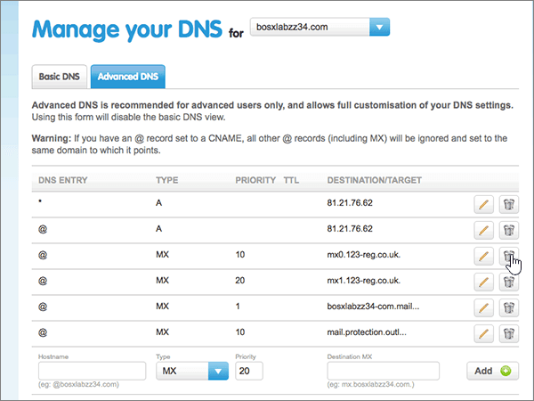
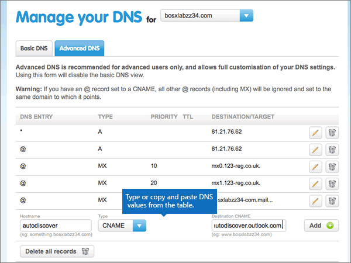

# Crear registros DNS en 123-reg.co.uk para Office 365

 **[Consulte Preguntas más frecuentes acerca de los dominios](../setup/domains-faq.md)** si no encuentra lo que busca. 
  
Si 123-reg.co.uk es su proveedor de host DNS, siga los pasos de este artículo para comprobar el dominio y configurar los registros DNS para el correo electrónico, Skype Empresarial Online, etc.
  
Después de agregar estos registros a 123-reg.co.uk, el dominio estará configurado para funcionar con los servicios de Office 365.
  
Para obtener información sobre hospedaje web y DNS para sitios web con Office 365, vea [Usar un sitio web público con Office 365](https://support.office.com/article/choose-a-public-website-3325d50e-d131-403c-a278-7f3296fe33a9).
  
> [!NOTE]
> Typically it takes about 15 minutes for DNS changes to take effect. However, it can occasionally take longer for a change you've made to update across the Internet's DNS system. Si tiene problemas con el flujo de correo u otros problemas después de agregar registros DNS, consulte [Buscar y corregir problemas después de agregar el dominio o los registros DNS en Office 365](../get-help-with-domains/find-and-fix-issues.md). 
  
## Agregar un registro TXT para verificación

Para que pueda usar el dominio con Office 365, tenemos que asegurarnos de que es de su propiedad. Si puede iniciar sesión en la cuenta en su registrador de dominios y crear el registro DNS, Office 365 sabrá que es el propietario del dominio.
  
> [!NOTE]
> Este registro se usa exclusivamente para verificar si se es el propietario de un dominio; no afecta a nada más. Puede eliminarlo más adelante, si lo desea. 
  
1. Para empezar, vaya a su página de dominios en 123-reg.co.uk a través de [este vínculo](https://www.123-reg.co.uk/secure/cpanel/domain/overview). Se le pedirá que inicie sesión primero .
    
2. On the **Domain name overview** page, select the name of the domain that you want to edit. 
    
3. Choose **DNS** from the **Select action** drop-down list. 
    
4. En la página **administrar el DNS** , seleccione la pestaña **DNS avanzado** . 
    
5. In the **Advanced DNS** section, in the boxes for the new record, type or copy and paste the values from the following table. 
    
    (Choose the **Type** value from the drop-down list.) 
    
    ||||
    |:-----|:-----|:-----|
    |**Nombre de host**   |**Tipo**   |**Destination TXT/SPF**   |
    |@    |TXT/SPF    |MS=ms *XXXXXXXX*    **Nota:** Este es un ejemplo. Utilice aquí su valor de **Dirección o puntos de destino**, de la tabla de Office 365. [¿Cómo puedo encontrarlo?](../get-help-with-domains/information-for-dns-records.md)          |
   
6. Seleccione **Agregar**.
    
7. Espere unos minutos antes de continuar para que el registro que acaba de crear pueda actualizarse en Internet.
    
Now that you've added the record at your domain registrar's site, you'll go back to Office 365 and request Office 365 to look for the record.
  
When Office 365 finds the correct TXT record, your domain is verified.
  
1. En el centro de administración, vaya a la página **configuración** \> de <a href="https://go.microsoft.com/fwlink/p/?linkid=834818" target="_blank">dominios</a> .

    
2. En la página **dominios** , seleccione el dominio que desea comprobar. 
    
3. En la página **configuración** , seleccione **Iniciar configuración**.
    
4. En la página **comprobar dominio** , seleccione **comprobar**.
    
> [!NOTE]
> Typically it takes about 15 minutes for DNS changes to take effect. However, it can occasionally take longer for a change you've made to update across the Internet's DNS system. Si tiene problemas con el flujo de correo u otros problemas después de agregar registros DNS, consulte [Buscar y corregir problemas después de agregar el dominio o los registros DNS en Office 365](../get-help-with-domains/find-and-fix-issues.md). 
  
## Agregar un registro MX para que el correo electrónico del dominio vaya a Office 365

1. Para empezar, vaya a su página de dominios en 123-reg.co.uk a través de [este vínculo](https://www.123-reg.co.uk/secure/cpanel/domain/overview). Se le pedirá que inicie sesión primero .
    
2. On the **Domain name overview** page, select the name of the domain that you want to edit. 
    
3. Choose **DNS** from the **Select action** drop-down list. 
    
4. En la página **administrar el DNS** , seleccione la pestaña **DNS avanzado** . 
    
5. In the **Advanced DNS** section, in the boxes for the new record, type or copy and paste the values from the following table. 
    
    (Choose the **Type** value from the drop-down list.) 
    
    |**Nombre de host**|**Tipo**|**Prioridad**|**MX de destino**|
    |:-----|:-----|:-----|:-----|
    |@    |MX    |1    Para obtener más información sobre la prioridad, consulte [¿Qué es una prioridad de MX?](https://support.office.com/article/2784cc4d-95be-443d-b5f7-bb5dd867ba83.aspx)   | *\<clave-de-dominio\>*  .mail.protection.outlook.com.    **This value MUST end with a period (.)**   **Nota:** Obtenga la \<clave\> de dominio de su cuenta de Office 365. [¿Cómo puedo encontrarla?](../get-help-with-domains/information-for-dns-records.md)          |
   
    
  
6. Seleccione **Agregar**.
    
    
  
7. Si hay otros registros MX, quítelos (para hacerlo, elija el icono **Eliminar [papelera]** de ese registro). 
    
    
  
## Agregar los seis registros CNAME necesarios para Office 365

1. Para empezar, vaya a su página de dominios en 123-reg.co.uk a través de [este vínculo](https://www.123-reg.co.uk/secure/cpanel/domain/overview). Se le pedirá que inicie sesión primero .
    
2. On the **Domain name overview** page, select the name of the domain that you want to edit. 
    
3. Choose **DNS** from the **Select action** drop-down list. 
    
4. En la página **administrar el DNS** , seleccione la pestaña **DNS avanzado** . 
    
5. Agregue el primero de los seis registros CNAME.
    
    In the **Advanced DNS** section, in the boxes for the new record, type or copy and paste the values from the following table. 
    
    (Choose the **Type** value from the drop-down list.) 
    
    |**Nombre de host**|**Tipo**|**CNAME de destino**|
    |:-----|:-----|:-----|
    |autodiscover    |CNAME    |autodiscover.outlook.com.    **This value MUST end with a period (.)**   |
    |sip    |CNAME    |sipdir.online.lync.com.    **This value MUST end with a period (.)**   |
    |lyncdiscover    |CNAME    |webdir.online.lync.com.    **This value MUST end with a period (.)**   |
    |enterpriseregistration    |CNAME    |enterpriseregistration.windows.net.    **Este valor DEBE terminar en punto (.).**   |
    |enterpriseenrollment    |CNAME    |enterpriseenrollment-s.manage.microsoft.com.    **Este valor DEBE terminar en punto (.).**   |
   
    
  
6. Seleccione **Agregar**.
    
    
  
7. Cree los otros cinco registros CNAME.
    
    En la sección **DNS avanzado** , cree un registro con los valores de la siguiente fila de la tabla y, después, vuelva a seleccionar **Agregar** para completar ese registro. 
    
    Repita este proceso hasta crear los seis registros CNAME.
    
## Agregar un registro TXT para SPF para ayudar a evitar el correo no deseado

> [!IMPORTANT]
> You cannot have more than one TXT record for SPF for a domain. If your domain has more than one SPF record, you'll get email errors, as well as delivery and spam classification issues. If you already have an SPF record for your domain, don't create a new one for Office 365. En vez de eso, agregue los valores necesarios de Office 365 para el registro actual, de modo que solo tenga un  *único*  registro de SPF que incluya ambos conjuntos de valores. ¿Necesita ejemplos? Consulte estos [registros del sistema de nombres de dominio externo para Office 365](https://support.office.com/article/c0531a6f-9e25-4f2d-ad0e-a70bfef09ac0#bkmk_spfrecords). Para validar su registro de SPF, puede usar una de estas [herramientas de validación de SPF](../setup/domains-faq.md). 
  
1. Para empezar, vaya a su página de dominios en 123-reg.co.uk a través de [este vínculo](https://www.123-reg.co.uk/secure/cpanel/domain/overview). Se le pedirá que inicie sesión primero .
    
2. On the **Domain name overview** page, select the name of the domain that you want to edit. 
    
3. Choose **DNS** from the **Select action** drop-down list. 
    
4. En la página **administrar el DNS** , seleccione la pestaña **DNS avanzado** . 
    
5. In the **Advanced DNS** section, in the boxes for the new record, type or copy and paste the values from the following table. 
    
    (Choose the **Type** value from the drop-down list.) 
    
    |**Nombre de host**|**Tipo**|**Destination TXT/SPF**|
    |:-----|:-----|:-----|
    |@    |TXT/SPF    |v=spf1 include:spf.protection.outlook.com -all    **Nota:** Se recomienda copiar y pegar esta entrada para que todo el espaciado sea correcto.           |
   
    
  
6. Seleccione **Agregar**.
    
    
  
## Agregar los dos registros SRV necesarios para Office 365

1. Para empezar, vaya a su página de dominios en 123-reg.co.uk a través de [este vínculo](https://www.123-reg.co.uk/secure/cpanel/domain/overview). Se le pedirá que inicie sesión primero .
    
2. On the **Domain name overview** page, select the name of the domain that you want to edit. 
    
3. Choose **DNS** from the **Select action** drop-down list. 
    
4. En la página **administrar el DNS** , seleccione la pestaña **DNS avanzado** . 
    
5. Agregue el primero de los dos registros SRV:
    
    In the **Advanced DNS** section, in the boxes for the new record, type or copy and paste the values from the following table. 
    
    (Choose the **Type** value from the drop-down list.) 
    
    ||||||
    |:-----|:-----|:-----|:-----|:-----|
    |Nombre de host|Tipo|Prioridad|TTL|SRV de destino|
    |_sip. _tls|SRV|100|3600|1 443 sipdir.online.lync.com. **This value MUST end with a period (.)**  **Nota:** Se recomienda copiar y pegar esta entrada para que todo el espaciado sea correcto.           |
    |_sipfederationtls. _tcp|SRV|100|3600|1 5061 sipfed.online.lync.com. **This value MUST end with a period (.)**   **Nota:** Se recomienda copiar y pegar esta entrada para que todo el espaciado sea correcto.           |
   
    
  
6. Seleccione **Agregar**.
    
    
  
7. Para agregar el otro registro SRV:
    
    En la sección **DNS avanzado** , cree un registro (para hacerlo, use los valores de la segunda fila de la tabla y, después, vuelva a seleccionar **Agregar** para completar ese registro). 
    
> [!NOTE]
> Typically it takes about 15 minutes for DNS changes to take effect. However, it can occasionally take longer for a change you've made to update across the Internet's DNS system. Si tiene problemas con el flujo de correo u otros problemas después de agregar registros DNS, consulte [Buscar y corregir problemas después de agregar el dominio o los registros DNS en Office 365](../get-help-with-domains/find-and-fix-issues.md). 
  
