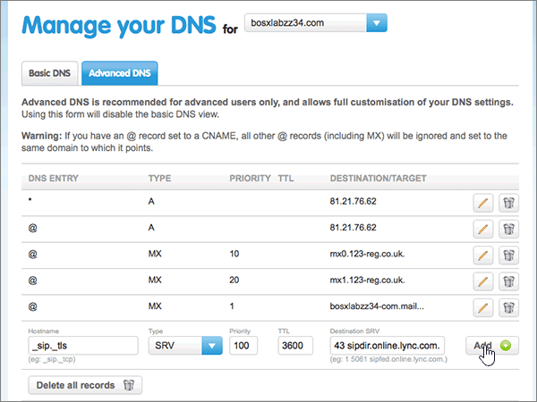

# Crear registros DNS en 123-reg.co.uk para MicrosoftCreate DNS records at 123-reg.co.uk for Microsoft

 **[Consulte Preguntas más frecuentes acerca de los dominios](../setup/domains-faq.md)** si no encuentra lo que busca.**[Check the Domains FAQ](../setup/domains-faq.md)** if you don't find what you're looking for. 
  
Si 123-reg.co.uk es su proveedor de host DNS, siga los pasos de este artículo para comprobar el dominio y configurar los registros DNS para el correo electrónico, Skype Empresarial Online, etc.If 123-reg.co.uk is your DNS hosting provider, follow the steps in this article to verify your domain and set up DNS records for email, Skype for Business Online, and so on.
  
Después de agregar estos registros a 123-reg.co.uk, su dominio estará configurado para funcionar con los servicios de Microsoft.After you add these records at 123-reg.co.uk, your domain will be set up to work with Microsoft services.
  
  
> [!NOTE]
> Normalmente, se necesitan unos 15 minutos para que los cambios de DNS surtan efecto.Typically it takes about 15 minutes for DNS changes to take effect. Sin embargo, a veces los cambios pueden necesitar más tiempo para aplicarse en todo el sistema DNS de Internet.However, it can occasionally take longer for a change you've made to update across the Internet's DNS system. Si tiene problemas con el flujo de correo u otros problemas después de agregar registros DNS, vea [Encontrar y solucionar problemas después de agregar el dominio o los registros DNS](../get-help-with-domains/find-and-fix-issues.md).If you're having trouble with mail flow or other issues after adding DNS records, see [Find and fix issues after adding your domain or DNS records](../get-help-with-domains/find-and-fix-issues.md). 
  
## Agregar un registro TXT para verificaciónAdd a TXT record for verification

Antes de utilizar el dominio con Microsoft, tenemos que asegurarnos de que sea el propietario. Si puede iniciar sesión en la cuenta en el registrador de dominio y crear el registro DNS, Microsoft sabrá que es el propietario del dominio.Before you use your domain with Microsoft, we have to make sure that you own it. Your ability to log in to your account at your domain registrar and create the DNS record proves to Microsoft that you own the domain.
  
> [!NOTE]
> Este registro se usa exclusivamente para verificar si se es el propietario de un dominio; no afecta a nada más. Puede eliminarlo más adelante, si lo desea.This record is used only to verify that you own your domain; it doesn't affect anything else. You can delete it later, if you like. 
  
1. Para empezar, vaya a su página de dominios en 123-reg.co.uk a través de [este vínculo](https://www.123-reg.co.uk/secure/cpanel/domain/overview). Se le pedirá que inicie sesión primero .To get started, go to your domains page at 123-reg.co.uk by using [this link](https://www.123-reg.co.uk/secure/cpanel/domain/overview). You'll be prompted to log in first.
    
2. On the **Domain name overview** page, select the name of the domain that you want to edit.On the **Domain name overview** page, select the name of the domain that you want to edit. 
    
3. Choose **DNS** from the **Select action** drop-down list.Choose **DNS** from the **Select action** drop-down list. 
    
4. En la página **administrar el DNS** , seleccione la pestaña **DNS avanzado** .On the **Manage your DNS** page, select the **Advanced DNS** tab. 
    
5. In the **Advanced DNS** section, in the boxes for the new record, type or copy and paste the values from the following table.In the **Advanced DNS** section, in the boxes for the new record, type or copy and paste the values from the following table. 
    
    (Choose the **Type** value from the drop-down list.)(Choose the **Type** value from the drop-down list.) 
    
    ||||
    |:-----|:-----|:-----|
    |**Nombre de host****Hostname**   |**Tipo****Type**   |**Destination TXT/SPF****Destination TXT/SPF**   |
    |@    |TXT/SPFTXT/SPF    |MS=ms *XXXXXXXX*MS=ms *XXXXXXXX*    **Nota:** esto es un ejemplo.**Note:** This is an example. Utilice aquí su valor de **Dirección de destino**, desde la tabla.Use your specific **Destination or Points to Address** value here, from the table. [¿Cómo puedo encontrar esto?How do I find this?](../get-help-with-domains/information-for-dns-records.md)          |
   
6. Elija **Agregar**.Select **Add**.
    
7. Espere unos minutos antes de continuar para que el registro que acaba de crear pueda actualizarse en Internet.Wait a few minutes before you continue, so that the record you just created can update across the Internet.
    
Ahora que ha agregado el registro en el sitio del registrador de dominios, volverá a Microsoft y solicitará una búsqueda para el registro.Now that you've added the record at your domain registrar's site, you'll go back to Microsoft and request a search for the record.
  
Cuando Microsoft encuentre el registro TXT correcto, se comprobará su dominio.When Microsoft finds the correct TXT record, your domain is verified.
  
1. En el centro de administración de Microsoft, diríjase a la página **Configuración** \> <a href="https://go.microsoft.com/fwlink/p/?linkid=834818" target="_blank">Dominios</a>.In the Microsoft admin center, go to the **Settings** \> <a href="https://go.microsoft.com/fwlink/p/?linkid=834818" target="_blank">Domains</a> page.

    
2. En la página **Dominios**, elija el dominio que está verificando.On the **Domains** page, select the domain that you are verifying. 
    
3. En la página de **Configuración**, elija \*\* Iniciar configuración\*\*.On the **Setup** page, select **Start setup**.
    
4. En la página**Verificar dominio**, elija **Verificar**.On the **Verify domain** page, select **Verify**.
    
> [!NOTE]
> Normalmente, se necesitan unos 15 minutos para que los cambios de DNS surtan efecto.Typically it takes about 15 minutes for DNS changes to take effect. Sin embargo, a veces los cambios pueden necesitar más tiempo para aplicarse en todo el sistema DNS de Internet.However, it can occasionally take longer for a change you've made to update across the Internet's DNS system. Si tiene problemas con el flujo de correo u otros problemas después de agregar registros DNS, vea [Encontrar y solucionar problemas después de agregar el dominio o los registros DNS](../get-help-with-domains/find-and-fix-issues.md).If you're having trouble with mail flow or other issues after adding DNS records, see [Find and fix issues after adding your domain or DNS records](../get-help-with-domains/find-and-fix-issues.md). 
  
## Agregar un registro MX para que el correo electrónico del dominio vaya a MicrosoftAdd an MX record so email for your domain will come to Microsoft

1. Para empezar, vaya a su página de dominios en 123-reg.co.uk a través de [este vínculo](https://www.123-reg.co.uk/secure/cpanel/domain/overview). Se le pedirá que inicie sesión primero .To get started, go to your domains page at 123-reg.co.uk by using [this link](https://www.123-reg.co.uk/secure/cpanel/domain/overview). You'll be prompted to log in first.
    
2. On the **Domain name overview** page, select the name of the domain that you want to edit.On the **Domain name overview** page, select the name of the domain that you want to edit. 
    
3. Choose **DNS** from the **Select action** drop-down list.Choose **DNS** from the **Select action** drop-down list. 
    
4. En la página **administrar el DNS** , seleccione la pestaña **DNS avanzado** .On the **Manage your DNS** page, select the **Advanced DNS** tab. 
    
5. In the **Advanced DNS** section, in the boxes for the new record, type or copy and paste the values from the following table.In the **Advanced DNS** section, in the boxes for the new record, type or copy and paste the values from the following table. 
    
    (Choose the **Type** value from the drop-down list.)(Choose the **Type** value from the drop-down list.) 
    
    |**Nombre de host****Hostname**|**Tipo****Type**|**Prioridad****Priority**|**MX de destino****Destination MX**|
    |:-----|:-----|:-----|:-----|
    |@    |MXMX    |1 1    Para obtener más información sobre la prioridad, consulte [¿Qué es una prioridad de MX?](https://docs.microsoft.com/microsoft-365/admin/setup/domains-faq)For more information about priority, see [What is MX priority?](https://docs.microsoft.com/microsoft-365/admin/setup/domains-faq)   | *\<domain-key\>*  . mail.protection.outlook.com.*\<domain-key\>*  .mail.protection.outlook.com.    **Este valor DEBE terminar en punto (.)****This value MUST end with a period (.)**   \*\*Nota: \*\* Obtenga la \<domain-key\> desde su cuenta de Microsoft.**Note:** Get your \<domain-key\> from your Microsoft account. [¿Cómo puedo encontrar esto?How do I find this?](../get-help-with-domains/information-for-dns-records.md)          |
   
    
  
6. Seleccione **Agregar**.Select **Add**.
    
    
  
7. Si hay otros registros MX, quítelos (para hacerlo, elija el icono **Eliminar [papelera]** de ese registro).If there are any other MX records, remove each one by choosing the **Delete (trash can)** icon for that record. 
    
    
  
## Agregar los seis registros CNAME necesarios para MicrosoftAdd the six CNAME records that are required for Microsoft

1. Para empezar, vaya a su página de dominios en 123-reg.co.uk a través de [este vínculo](https://www.123-reg.co.uk/secure/cpanel/domain/overview). Se le pedirá que inicie sesión primero .To get started, go to your domains page at 123-reg.co.uk by using [this link](https://www.123-reg.co.uk/secure/cpanel/domain/overview). You'll be prompted to log in first.
    
2. On the **Domain name overview** page, select the name of the domain that you want to edit.On the **Domain name overview** page, select the name of the domain that you want to edit. 
    
3. Choose **DNS** from the **Select action** drop-down list.Choose **DNS** from the **Select action** drop-down list. 
    
4. En la página **administrar el DNS** , seleccione la pestaña **DNS avanzado** .On the **Manage your DNS** page, select the **Advanced DNS** tab. 
    
5. Agregue el primero de los seis registros CNAME.Add the first of the six CNAME records.
    
    In the **Advanced DNS** section, in the boxes for the new record, type or copy and paste the values from the following table.In the **Advanced DNS** section, in the boxes for the new record, type or copy and paste the values from the following table. 
    
    (Choose the **Type** value from the drop-down list.)(Choose the **Type** value from the drop-down list.) 
    
    |**Nombre de host****Hostname**|**Tipo****Type**|**CNAME de destino****Destination CNAME**|
    |:-----|:-----|:-----|
    |autodiscoverautodiscover    |CNAMECNAME    |autodiscover.outlook.com.autodiscover.outlook.com.    **Este valor DEBE terminar en punto (.)****This value MUST end with a period (.)**   |
    |sipsip    |CNAMECNAME    |sipdir.online.lync.com.sipdir.online.lync.com.    **Este valor DEBE terminar en punto (.)****This value MUST end with a period (.)**   |
    |lyncdiscoverlyncdiscover    |CNAMECNAME    |webdir.online.lync.com.webdir.online.lync.com.    **Este valor DEBE terminar en punto (.)****This value MUST end with a period (.)**   |
    |enterpriseregistrationenterpriseregistration    |CNAMECNAME    |enterpriseregistration.windows.net.enterpriseregistration.windows.net.    **Este valor DEBE terminar en punto (.)****This value MUST end with a period (.)**   |
    |enterpriseenrollmententerpriseenrollment    |CNAMECNAME    |enterpriseenrollment-s.manage.microsoft.com.enterpriseenrollment-s.manage.microsoft.com.    **Este valor DEBE terminar en punto (.).****This value MUST end with a period (.)**   |
   
    
  
6. Seleccione **Agregar**.Select **Add**.
    
    
  
7. Cree los otros cinco registros CNAME.Add the other five CNAME records.
    
    En la sección **DNS avanzado** , cree un registro con los valores de la siguiente fila de la tabla y, después, vuelva a seleccionar **Agregar** para completar ese registro.In the **Advanced DNS** section, create a record using the values from the next row in the table, and then again select **Add** to complete that record. 
    
    Repita este proceso hasta crear los seis registros CNAME.Repeat this process until you have created all six CNAME records.
    
## Agregar un registro TXT para SPF para ayudar a prevenir el spam de correo electrónicoAdd a TXT record for SPF to help prevent email spam

> [!IMPORTANT]
> No puede tener más de un registro TXT para el SPF de un dominio.You cannot have more than one TXT record for SPF for a domain. Si su dominio tiene más de un registro de SPF, obtendrá errores de correo, así como problemas de clasificación de entrega y de correo no deseado.If your domain has more than one SPF record, you'll get email errors, as well as delivery and spam classification issues. Si ya tiene un registro de SPF para su dominio, no cree uno nuevo para Microsfot.If you already have an SPF record for your domain, don't create a new one for Microsfot. En su lugar, agregue los valores necesarios de Microsoft al registro activo para que tenga un  *único*  registro de SPF que incluya ambos conjuntos de valores.Instead, add the required Microsoft values to the current record so that you have a  *single*  SPF record that includes both sets of values. ¿Necesita ejemplos?Need examples? Consulte los [Registros externos del sistema de nombres de dominio para Microsoft](https://docs.microsoft.com/microsoft-365/enterprise/external-domain-name-system-records#external-dns-records-required-for-spf).Check out these [External Domain Name System records for Microsoft](https://docs.microsoft.com/microsoft-365/enterprise/external-domain-name-system-records#external-dns-records-required-for-spf). To validate your SPF record, you can use one of these [SPF validation tools](../setup/domains-faq.md).To validate your SPF record, you can use one of these [SPF validation tools](../setup/domains-faq.md). 
  
1. Para empezar, vaya a su página de dominios en 123-reg.co.uk a través de [este vínculo](https://www.123-reg.co.uk/secure/cpanel/domain/overview).To get started, go to your domains page at 123-reg.co.uk by using [this link](https://www.123-reg.co.uk/secure/cpanel/domain/overview). Se le pedirá que inicie sesión primero .You'll be prompted to log in first.
    
2. On the **Domain name overview** page, select the name of the domain that you want to edit.On the **Domain name overview** page, select the name of the domain that you want to edit. 
    
3. Choose **DNS** from the **Select action** drop-down list.Choose **DNS** from the **Select action** drop-down list. 
    
4. En la página **administrar el DNS** , seleccione la pestaña **DNS avanzado** .On the **Manage your DNS** page, select the **Advanced DNS** tab. 
    
5. In the **Advanced DNS** section, in the boxes for the new record, type or copy and paste the values from the following table.In the **Advanced DNS** section, in the boxes for the new record, type or copy and paste the values from the following table. 
    
    (Choose the **Type** value from the drop-down list.)(Choose the **Type** value from the drop-down list.) 
    
    |**Nombre de host****Hostname**|**Tipo****Type**|**Destination TXT/SPF****Destination TXT/SPF**|
    |:-----|:-----|:-----|
    |@    |TXT/SPFTXT/SPF    |v=spf1 include:spf.protection.outlook.com -allv=spf1 include:spf.protection.outlook.com -all    **Nota:** recomendamos copiar y pegar esta entrada, para que todo el espacio sea correcto.**Note:** We recommend copying and pasting this entry, so that all of the spacing stays correct.           |
   
    
  
6. Seleccione **Agregar**.Select **Add**.
    
    
  
## Agregar los dos registros SRV necesarios para MicrosoftAdd the two SRV records that are required for Microsoft

1. Para empezar, vaya a su página de dominios en 123-reg.co.uk a través de [este vínculo](https://www.123-reg.co.uk/secure/cpanel/domain/overview). Se le pedirá que inicie sesión primero .To get started, go to your domains page at 123-reg.co.uk by using [this link](https://www.123-reg.co.uk/secure/cpanel/domain/overview). You'll be prompted to log in first.
    
2. On the **Domain name overview** page, select the name of the domain that you want to edit.On the **Domain name overview** page, select the name of the domain that you want to edit. 
    
3. Choose **DNS** from the **Select action** drop-down list.Choose **DNS** from the **Select action** drop-down list. 
    
4. En la página **administrar el DNS** , seleccione la pestaña **DNS avanzado** .On the **Manage your DNS** page, select the **Advanced DNS** tab. 
    
5. Agregue el primero de los dos registros SRV:Add the first of the two SRV records:
    
    In the **Advanced DNS** section, in the boxes for the new record, type or copy and paste the values from the following table.In the **Advanced DNS** section, in the boxes for the new record, type or copy and paste the values from the following table. 
    
    (Choose the **Type** value from the drop-down list.)(Choose the **Type** value from the drop-down list.) 
    
    ||||||
    |:-----|:-----|:-----|:-----|:-----|
    |Nombre de hostHostname|TipoType|PrioridadPriority|TTLTTL|SRV de destinoDestination SRV|
    |_sip._tls_sip._tls|SRVSRV|100100|36003600|1 443 sipdir.online.lync.com.1 443 sipdir.online.lync.com. **Este valor DEBE terminar en punto (.)****This value MUST end with a period (.)**  **Nota:** recomendamos copiar y pegar esta entrada, para que todo el espacio sea correcto.**Note:** We recommend copying and pasting this entry, so that all of the spacing stays correct.           |
    |_sipfederationtls._tcp_sipfederationtls._tcp|SRVSRV|100100|36003600|1 5061 sipfed.online.lync.com.1 5061 sipfed.online.lync.com. **Este valor DEBE terminar en punto (.)****This value MUST end with a period (.)**   **Nota:** recomendamos copiar y pegar esta entrada, para que todo el espacio sea correcto.**Note:** We recommend copying and pasting this entry, so that all of the spacing stays correct.           |
   
    
  
6. Seleccione **Agregar**.Select **Add**.
    
    
  
7. Para agregar el otro registro SRV:To add the other SRV record:
    
    En la sección **DNS avanzado** , cree un registro (para hacerlo, use los valores de la segunda fila de la tabla y, después, vuelva a seleccionar **Agregar** para completar ese registro).In the **Advanced DNS** section, create a record by using the values from the second row in the table, and then again select **Add** to complete that record. 
    
> [!NOTE]
> Normalmente, se necesitan unos 15 minutos para que los cambios de DNS surtan efecto.Typically it takes about 15 minutes for DNS changes to take effect. Sin embargo, a veces los cambios pueden necesitar más tiempo para aplicarse en todo el sistema DNS de Internet.However, it can occasionally take longer for a change you've made to update across the Internet's DNS system. Si tiene problemas con el flujo de correo u otros problemas después de agregar registros DNS, vea [Encontrar y solucionar problemas después de agregar el dominio o los registros DNS](../get-help-with-domains/find-and-fix-issues.md).If you're having trouble with mail flow or other issues after adding DNS records, see [Find and fix issues after adding your domain or DNS records](../get-help-with-domains/find-and-fix-issues.md). 
  
