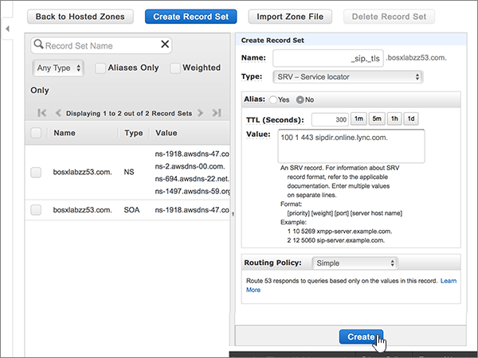

# Crear registros DNS en Amazon Web Services (AWS) para MicrosoftCreate DNS records at Amazon Web Services (AWS) for Microsoft

 **[Consulte Preguntas más frecuentes acerca de los dominios](../setup/domains-faq.md)** si no encuentra lo que busca.**[Check the Domains FAQ](../setup/domains-faq.md)** if you don't find what you're looking for. 
  
Si AWS es su proveedor de host DNS, siga los pasos de este artículo para comprobar su dominio y configurar los registros DNS para el correo electrónico, Skype online para empresas, etc.If AWS is your DNS hosting provider, follow the steps in this article to verify your domain and set up DNS records for email, Skype Online for Business, and so on.
  
Después de agregar estos registros a AWS, el dominio estará configurado para funcionar con los servicios de Microsoft.After you add these records at AWS, your domain will be set up to work with Microsoft services.
  

  
> [!NOTE]
> Normalmente, se necesitan unos 15 minutos para que los cambios de DNS surtan efecto.Typically it takes about 15 minutes for DNS changes to take effect. Sin embargo, a veces los cambios pueden necesitar más tiempo para aplicarse en todo el sistema DNS de Internet.However, it can occasionally take longer for a change you've made to update across the Internet's DNS system. Si tiene problemas con el flujo de correo u otros problemas después de agregar registros DNS, vea [Encontrar y solucionar problemas después de agregar el dominio o los registros DNS](../get-help-with-domains/find-and-fix-issues.md).If you're having trouble with mail flow or other issues after adding DNS records, see [Find and fix issues after adding your domain or DNS records](../get-help-with-domains/find-and-fix-issues.md). 
  
## Agregar un registro TXT para verificaciónAdd a TXT record for verification

Antes de utilizar el dominio con Microsoft, tenemos que asegurarnos de que sea el propietario. Si puede iniciar sesión en la cuenta en el registrador de dominio y crear el registro DNS, Microsoft sabrá que es el propietario del dominio.Before you use your domain with Microsoft, we have to make sure that you own it. Your ability to log in to your account at your domain registrar and create the DNS record proves to Microsoft that you own the domain.
  
> [!NOTE]
> Este registro se usa exclusivamente para verificar si se es el propietario de un dominio; no afecta a nada más. Puede eliminarlo más adelante, si lo desea.This record is used only to verify that you own your domain; it doesn't affect anything else. You can delete it later, if you like. 
  
1. Para empezar, vaya a su página de dominios en AWS a través de [este vínculo](https://console.aws.amazon.com/route53/home).To get started, go to your domains page at AWS by using [this link](https://console.aws.amazon.com/route53/home). Se le pedirá que inicie sesión primero.You'll be prompted to log in first.
    
2. En la página **recursos** , seleccione **zonas hospedadas**.On the **Resources** page, select **Hosted Zones**.
    
3. En la página **zonas hospedadas** , en la columna **nombre de dominio** , seleccione el nombre del dominio que desea editar.On the **Hosted Zones** page, in the **Domain Name** column, select the name of the domain that you want to edit. 
    
4. Seleccione **crear conjunto de registros**.Select **Create Record Set**.
    
5. In the **Create Record Set** area, in the boxes for the new record, type or copy and paste the values from the following table.In the **Create Record Set** area, in the boxes for the new record, type or copy and paste the values from the following table. 
    
    (Choose the **Type** and **Routing Policy** values from the drop-down lists.)(Choose the **Type** and **Routing Policy** values from the drop-down lists.) 
    
    > [!TIP]
    > The quotation marks required by the onscreen instructions are supplied automatically. You don't need to type them manually.The quotation marks required by the onscreen instructions are supplied automatically. You don't need to type them manually. 
  
    |||||||
    |:-----|:-----|:-----|:-----|:-----|:-----|
    |**Name****Name**   |**Type****Type**   |**Alias****Alias**   |**TTL (segundos)****TTL (Seconds)**   |**Valor****Value**   |**Directiva de enrutamiento****Routing Policy**   |
    |(Leave this field empty.)(Leave this field empty.)    |TXT - TextTXT - Text    |NoNo    |300300    |MS=ms *XXXXXXXX*MS=ms *XXXXXXXX*   **Nota:** esto es un ejemplo.**Note:** This is an example. Use su valor **Dirección de destino** específico aquí, de la tabla de Microsoft 365.Use your specific **Destination or Points to Address** value here, from the table in Microsoft 365. [¿Cómo puedo encontrar esto?How do I find this?](../get-help-with-domains/information-for-dns-records.md)          |SimpleSimple    |
   
6. Seleccione **Crear**.Select **Create**.
    
7. Espere unos minutos antes de continuar para que el registro que acaba de crear pueda actualizarse en Internet.Wait a few minutes before you continue, so that the record you just created can update across the Internet.
    
Ahora que ha agregado el registro en el sitio del registrador de dominios, volverá a Microsoft y solicitará una búsqueda para el registro.Now that you've added the record at your domain registrar's site, you'll go back to Microsoft and request a search for the record.
  
Cuando Microsoft encuentre el registro TXT correcto, se comprobará su dominio.When Microsoft finds the correct TXT record, your domain is verified.
  
1. En el centro de administración de Microsoft, diríjase a la página **Configuración** \> <a href="https://go.microsoft.com/fwlink/p/?linkid=834818" target="_blank">Dominios</a>.In the Microsoft admin center, go to the **Settings** \> <a href="https://go.microsoft.com/fwlink/p/?linkid=834818" target="_blank">Domains</a> page.

    
2. En la página **Dominios**, elija el dominio que está verificando.On the **Domains** page, select the domain that you are verifying. 
    
3. En la página de **Configuración**, elija \*\* Iniciar configuración\*\*.On the **Setup** page, select **Start setup**.
    
4. En la página**Verificar dominio**, elija **Verificar**.On the **Verify domain** page, select **Verify**.
    
> [!NOTE]
> Normalmente, se necesitan unos 15 minutos para que los cambios de DNS surtan efecto.Typically it takes about 15 minutes for DNS changes to take effect. Sin embargo, a veces los cambios pueden necesitar más tiempo para aplicarse en todo el sistema DNS de Internet.However, it can occasionally take longer for a change you've made to update across the Internet's DNS system. Si tiene problemas con el flujo de correo u otros problemas después de agregar registros DNS, vea [Encontrar y solucionar problemas después de agregar el dominio o los registros DNS](../get-help-with-domains/find-and-fix-issues.md).If you're having trouble with mail flow or other issues after adding DNS records, see [Find and fix issues after adding your domain or DNS records](../get-help-with-domains/find-and-fix-issues.md). 
  
## Agregar un registro MX para que el correo electrónico del dominio llegue a Microsoft 365Add an MX record so email for your domain will come to Microsoft 365

1. Para empezar, vaya a su página de dominios en AWS a través de [este vínculo](https://console.aws.amazon.com/route53/home). Se le pedirá que inicie sesión primero.To get started, go to your domains page at AWS by using [this link](https://console.aws.amazon.com/route53/home). You'll be prompted to log in first.
    
2. En la página **recursos** , seleccione **zonas hospedadas**.On the **Resources** page, select **Hosted Zones**.
    
3. En la página **zonas hospedadas** , en la columna **nombre de dominio** , seleccione el nombre del dominio que desea editar.On the **Hosted Zones** page, in the **Domain Name** column, select the name of the domain that you want to edit. 
    
4. Seleccione **crear conjunto de registros**.Select **Create Record Set**.
    
5. In the **Create Record Set** area, in the boxes for the new record, type or copy and paste the values from the following table.In the **Create Record Set** area, in the boxes for the new record, type or copy and paste the values from the following table. 
    
    (Choose the **Type** and **Routing Policy** values from the drop-down lists.)(Choose the **Type** and **Routing Policy** values from the drop-down lists.) 
    
    |**Name****Name**|**Type****Type**|**Alias****Alias**|**TTL (segundos)****TTL (Seconds)**|**Valor****Value**|**Directiva de enrutamiento****Routing Policy**|
    |:-----|:-----|:-----|:-----|:-----|:-----|
    |(Deje este campo en blanco).(Leave this field empty.)    |MX - Registro de intercambio de correoMX - Mail exchange    |NoNo    |300300    |0  *\<clave-de-dominio\>*  .mail.protection.outlook.com.0  *\<domain-key\>*  .mail.protection.outlook.com.    El 0 es el valor de prioridad MX. Agréguelo al principio del valor MX, separado del resto del valor por un espacio.  The 0 is the MX priority value. Add it to the beginning of the MX value, separated from the remainder of the value by a space.    **Este valor DEBE terminar en punto (.).****This value MUST end with a period (.)**   **Nota:** Obtenga la \< *clave* \> de dominio de su cuenta de Microsoft 365.**Note:** Get your \<*domain-key*\> from your Microsoft 365 account. [¿Cómo puedo encontrarla?How do I find this?](../get-help-with-domains/information-for-dns-records.md)          |SimpleSimple    |
       
    
  
6. Seleccione **Crear**.Select **Create**.
    
    
  
7. Si hay otros registros MX, quítelos.If there are any other MX records, remove them.
    
    > [!IMPORTANT]
    > AWS almacena registros MX como un conjunto que puede contener varios registros.AWS stores MX records as a set that may contain multiple records. **No** seleccione **eliminar conjunto de registros**, ya que se eliminarán todos los registros MX, incluido el que acaba de agregar.**DO NOT** select **Delete Record Set**, as this will delete all of your MX records, including the one you just added. Use las siguientes instrucciones en su lugar.Use the following instructions instead. 
  
    En primer lugar, seleccione el conjunto de registros MX.First, select the MX record set.
    
    
  
    A continuación, en el área **Editar conjunto de registros**, elimine cada registro MX obsoleto seleccionando la entrada en el cuadro **Valor** y, a continuación, pulse la tecla **Eliminar** de su teclado.Next, in the **Edit Record Set** area, delete each obsolete MX record by selecting the entry in the **Value** box and then pressing the **Delete** key on your keyboard. 
    
    
  
8. Seleccione **Guardar conjunto de registros**.Select **Save Record Set**.
    
    
  
## Agregue los cinco registros CNAME necesarios para Microsoft 365Add the five CNAME records that are required for Microsoft 365

1. Para empezar, vaya a su página de dominios en AWS a través de [este vínculo](https://console.aws.amazon.com/route53/home). Se le pedirá que inicie sesión primero.To get started, go to your domains page at AWS by using [this link](https://console.aws.amazon.com/route53/home). You'll be prompted to log in first.
    
2. En la página **recursos** , seleccione **zonas hospedadas**.On the **Resources** page, select **Hosted Zones**.
    
3. En la página **zonas hospedadas** , en la columna **nombre de dominio** , seleccione el nombre del dominio que desea editar.On the **Hosted Zones** page, in the **Domain Name** column, select the name of the domain that you want to edit. 
    
4. Seleccione **crear conjunto de registros**.Select **Create Record Set**.
    
5. Agregue el primer registro CNAME.Add the first CNAME record.
    
    En el área **Agregar conjunto de registros**, en los cuadros para el nuevo registro, escriba o copie y pegue los valores a partir de la primera fila de la tabla siguiente.In the **Create Record Set** area, in the boxes for the new record, type or copy and paste the values from the first row in the following table. 
    
    (Seleccione los valores **Tipo** y **Directiva de enrutamiento** que aparecen en las listas desplegables).(Choose the **Type** and **Routing Policy** values from the drop-down lists.) 
    
    |**Name****Name**|**Type****Type**|**Alias****Alias**|**TTL (segundos)****TTL (Seconds)**|**Valor****Value**|**Directiva de enrutamiento****Routing Policy**|
    |:-----|:-----|:-----|:-----|:-----|:-----|
    |autodiscoverautodiscover    |CNAME - nombre canónicoCNAME - Canonical name    |NoNo    |300300    |autodiscover.outlook.com.autodiscover.outlook.com.    **Este valor DEBE terminar en punto (.).****This value MUST end with a period (.)**   |SimpleSimple    |
    |sipsip    |CNAME - nombre canónicoCNAME - Canonical name    |NoNo    |300300    |sipdir.online.lync.com.sipdir.online.lync.com.    **Este valor DEBE terminar en punto (.).****This value MUST end with a period (.)**   |SimpleSimple    |
    |lyncdiscoverlyncdiscover    |CNAME - nombre canónicoCNAME - Canonical name    |NoNo    |300300    |webdir.online.lync.com.webdir.online.lync.com.    **Este valor DEBE terminar en punto (.).****This value MUST end with a period (.)**   |SimpleSimple    |
    |enterpriseregistrationenterpriseregistration    |CNAME - nombre canónicoCNAME - Canonical name    |NoNo    |300300    |enterpriseregistration.windows.net.enterpriseregistration.windows.net.    **Este valor DEBE terminar en punto (.).****This value MUST end with a period (.)**   |SimpleSimple    |
    |EnterpriseEnrollmententerpriseenrollment    |CNAME - nombre canónicoCNAME - Canonical name    |NoNo    |300300    |enterpriseenrollment-s.manage.microsoft.com.enterpriseenrollment-s.manage.microsoft.com.    **Este valor DEBE terminar en punto (.).****This value MUST end with a period (.)**   |SimpleSimple    |
   
    
  
6. Seleccione **Crear**.Select **Create**.
    
    
  
7. Agregue los otros cuatro registros CNAME.Add the other four CNAME records.
    
    En la página **zonas hospedadas** , seleccione **crear conjunto de registros**, cree un registro con los valores de la siguiente fila de la tabla y, a continuación, vuelva a seleccionar **crear** para completar ese registro.In the **Hosted Zones** page, select **Create Record Set**, create a record using the values from the next row in the table, and then again select **Create** to complete that record. 
    
    Repita este proceso hasta que haya creado los cinco registros CNAME.Repeat this process until you have created all five CNAME records.
    
## Agregar un registro TXT para SPF para ayudar a prevenir el spam de correo electrónicoAdd a TXT record for SPF to help prevent email spam

> [!IMPORTANT]
> No puede tener más de un registro TXT para el SPF de un dominio.You cannot have more than one TXT record for SPF for a domain. Si su dominio tiene más de un registro de SPF, obtendrá errores de correo, así como problemas de clasificación de entrega y de correo no deseado.If your domain has more than one SPF record, you'll get email errors, as well as delivery and spam classification issues. Si ya tiene un registro de SPF para su dominio, no cree uno nuevo para Microsoft.If you already have an SPF record for your domain, don't create a new one for Microsoft. En su lugar, agregue los valores necesarios de Microsoft al registro activo para que tenga un *único* registro de SPF que incluya ambos conjuntos de valores.Instead, add the required Microsoft values to the current record so that you have a  *single*  SPF record that includes both sets of values. ¿Necesita ejemplos?Need examples? Consulte los [Registros externos del sistema de nombres de dominio para Microsoft](https://support.office.com/article/c0531a6f-9e25-4f2d-ad0e-a70bfef09ac0).Check out these [External Domain Name System records for Microsoft](https://support.office.com/article/c0531a6f-9e25-4f2d-ad0e-a70bfef09ac0). Para validar el registro de SPF, puede usar una de estas[herramientas de validación de SPF](../setup/domains-faq.md).To validate your SPF record, you can use one of these[SPF validation tools](../setup/domains-faq.md). 
  
1. Para empezar, vaya a su página de dominios en AWS a través de [este vínculo](https://console.aws.amazon.com/route53/home).To get started, go to your domains page at AWS by using [this link](https://console.aws.amazon.com/route53/home). Se le pedirá que inicie sesión primero.You'll be prompted to log in first.
    
2. En la página **recursos** , seleccione **zonas hospedadas**.On the **Resources** page, select **Hosted Zones**.
    
3. En la página **zonas hospedadas** , en la columna **nombre de dominio** , seleccione el nombre del dominio que desea editar.On the **Hosted Zones** page, in the **Domain Name** column, select the name of the domain that you want to edit. 
    
4. Seleccione el conjunto de registros **txt** .Select the **TXT** record set. 
    
    
  
5. En el área **Editar conjunto de registros**, al final de la entrada actual del cuadro **Valor:** del registro existente, presione ENTRAR en el teclado para crear una línea; luego, en esa línea (en el valor existente), escriba o copie y pegue el valor de la tabla siguiente (puede ver un ejemplo en la ilustración que aparece debajo de la tabla).In the **Edit Record Set** area, at the end of the current entry in the **Value:** box for the existing record, press Enter on your keyboard to create a new line; and then, on that new line (under the existing value), type or copy and paste the value from the following table. (You can see an example in the illustration below the table.) 
    
    |**Valor:****Value:**|
    |:-----|
    |v=spf1 include:spf.protection.outlook.com -allv=spf1 include:spf.protection.outlook.com -all    (Las comillas necesarias por las instrucciones en pantalla aparecen automáticamente. No es necesario escribirlas manualmente).  (The quotation marks required by the onscreen instructions are supplied automatically. You don't need to type them manually.)    **Nota:** recomendamos copiar y pegar esta entrada, para que todo el espacio sea correcto.**Note:** We recommend copying and pasting this entry, so that all of the spacing stays correct.           |
   
    
  
6. Seleccione **Guardar conjunto de registros**.Select **Save Record Set**.
    
    
  
## Agregue los dos registros SRV necesarios para Microsoft 365Add the two SRV records that are required for Microsoft 365

1. Para empezar, vaya a su página de dominios en AWS a través de [este vínculo](https://console.aws.amazon.com/route53/home). Se le pedirá que inicie sesión primero.To get started, go to your domains page at AWS by using [this link](https://console.aws.amazon.com/route53/home). You'll be prompted to log in first.
    
2. En la página **recursos** , seleccione **zonas hospedadas**.On the **Resources** page, select **Hosted Zones**.
    
3. En la página **zonas hospedadas** , en la columna **nombre de dominio** , seleccione el nombre del dominio que desea editar.On the **Hosted Zones** page, in the **Domain Name** column, select the name of the domain that you want to edit. 
    
4. Seleccione **crear conjunto de registros**.Select **Create Record Set**.
    
5. Agregue el primer registro SRV.Add the first SRV record:
    
    En el área **Agregar conjunto de registros**, en los cuadros para el nuevo registro, escriba o copie y pegue los valores a partir de la primera fila de la tabla siguiente.In the **Create Record Set** area, in the boxes for the new record, type or copy and paste the values from the first row in the following table. 
    
    (Seleccione los valores **Tipo** y **Directiva de enrutamiento** que aparecen en las listas desplegables).(Choose the **Type** and **Routing Policy** values from the drop-down lists.) 
    
    |**Name****Name**|**Type****Type**|**Alias****Alias**|**TTL (segundos)****TTL (Seconds)**|**Valor****Value**|**Directiva de enrutamiento****Routing Policy**|
    |:-----|:-----|:-----|:-----|:-----|:-----|
    |_sip. _tls_sip._tls|SRV - Localizador de servicioSRV - Service locator|NoNo|300300|100 1 443 sipdir.online.lync.com.100 1 443 sipdir.online.lync.com. **Este valor debe terminar con un punto (.).**>**This value MUST end with a period (.)**>  **Nota:** recomendamos copiar y pegar esta entrada, para que todo el espacio sea correcto.**Note:** We recommend copying and pasting this entry, so that all of the spacing stays correct.           |SimpleSimple|
    |_sipfederationtls. _tcp_sipfederationtls._tcp|SRV - Localizador de servicioSRV - Service locator|NoNo|300300|100 1 5061 sipfed.online.lync.com.100 1 5061 sipfed.online.lync.com. **This value MUST end with a period (.)****This value MUST end with a period (.)**  **Nota:** recomendamos copiar y pegar esta entrada, para que todo el espacio sea correcto.**Note:** We recommend copying and pasting this entry, so that all of the spacing stays correct.           |SimpleSimple|
   
    
  
6. Seleccione **Crear**.Select **Create**.
    
    
  
7. Para agregar el otro registro SRV:To add the other SRV record:
    
    En la página **zonas hospedadas** , seleccione **crear conjunto de registros**, cree un registro con los valores de la siguiente fila de la tabla y, a continuación, vuelva a seleccionar **crear** para completar ese registro.In the **Hosted Zones** page, select **Create Record Set**, create a record using the values from the next row in the table, and then again select **Create** to complete that record. 
    
> [!NOTE]
> Normalmente, se necesitan unos 15 minutos para que los cambios de DNS surtan efecto.Typically it takes about 15 minutes for DNS changes to take effect. Sin embargo, a veces los cambios pueden necesitar más tiempo para aplicarse en todo el sistema DNS de Internet.However, it can occasionally take longer for a change you've made to update across the Internet's DNS system. Si tiene problemas con el flujo de correo u otros problemas después de agregar registros DNS, vea [Encontrar y solucionar problemas después de agregar el dominio o los registros DNS](../get-help-with-domains/find-and-fix-issues.md).If you're having trouble with mail flow or other issues after adding DNS records, see [Find and fix issues after adding your domain or DNS records](../get-help-with-domains/find-and-fix-issues.md). 
  
