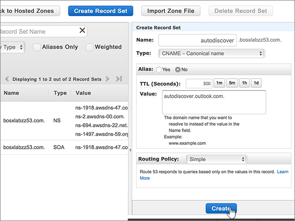
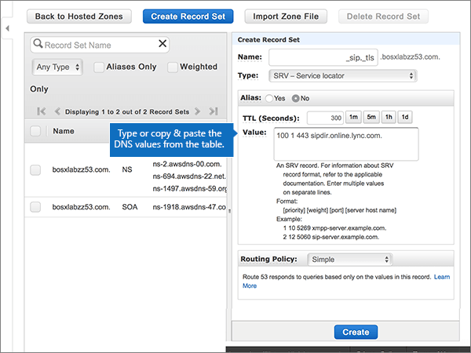

# Crear registros DNS en Amazon Web Services (AWS) para Microsoft

 **[Consulte Preguntas más frecuentes acerca de los dominios](../setup/domains-faq.md)** si no encuentra lo que busca. 
  
Si AWS es su proveedor de host DNS, siga los pasos de este artículo para comprobar su dominio y configurar los registros DNS para el correo electrónico, Skype online para empresas, etc.
  
Después de agregar estos registros a AWS, el dominio estará configurado para funcionar con los servicios de Microsoft.
  

  
> [!NOTE]
> Normalmente, se necesitan unos 15 minutos para que los cambios de DNS surtan efecto. Sin embargo, a veces los cambios pueden necesitar más tiempo para aplicarse en todo el sistema DNS de Internet. Si tiene problemas con el flujo de correo u otros problemas después de agregar registros DNS, vea [Encontrar y solucionar problemas después de agregar el dominio o los registros DNS](../get-help-with-domains/find-and-fix-issues.md). 
  
## Agregar un registro TXT para verificación

Antes de utilizar el dominio con Microsoft, tenemos que asegurarnos de que sea el propietario. Si puede iniciar sesión en la cuenta en el registrador de dominio y crear el registro DNS, Microsoft sabrá que es el propietario del dominio.
  
> [!NOTE]
> Este registro se usa exclusivamente para verificar si se es el propietario de un dominio; no afecta a nada más. Puede eliminarlo más adelante, si lo desea. 
  
1. Para empezar, vaya a su página de dominios en AWS a través de [este vínculo](https://console.aws.amazon.com/route53/home). Se le pedirá que inicie sesión primero.
    
2. En la página **recursos** , seleccione **zonas hospedadas**.
    
3. En la página **zonas hospedadas** , en la columna **nombre de dominio** , seleccione el nombre del dominio que desea editar. 
    
4. Seleccione **crear conjunto de registros**.
    
5. In the **Create Record Set** area, in the boxes for the new record, type or copy and paste the values from the following table. 
    
    (Choose the **Type** and **Routing Policy** values from the drop-down lists.) 
    
    > [!TIP]
    > The quotation marks required by the onscreen instructions are supplied automatically. You don't need to type them manually. 
  
    |||||||
    |:-----|:-----|:-----|:-----|:-----|:-----|
    |**Name**   |**Type**   |**Alias**   |**TTL (segundos)**   |**Valor**   |**Directiva de enrutamiento**   |
    |(Leave this field empty.)    |TXT - Text    |No    |300    |MS=ms *XXXXXXXX*   **Nota:** esto es un ejemplo. Use su valor **Dirección de destino** específico aquí, de la tabla de Microsoft 365. [¿Cómo puedo encontrar esto?](../get-help-with-domains/information-for-dns-records.md)          |Simple    |
   
6. Seleccione **Crear**.
    
7. Espere unos minutos antes de continuar para que el registro que acaba de crear pueda actualizarse en Internet.
    
Ahora que ha agregado el registro en el sitio del registrador de dominios, volverá a Microsoft y solicitará una búsqueda para el registro.
  
Cuando Microsoft encuentre el registro TXT correcto, se comprobará su dominio.
  
1. En el centro de administración de Microsoft, diríjase a la página **Configuración** \> <a href="https://go.microsoft.com/fwlink/p/?linkid=834818" target="_blank">Dominios</a>.

    
2. En la página **Dominios**, elija el dominio que está verificando. 
    
3. En la página de **Configuración**, elija ** Iniciar configuración**.
    
4. En la página**Verificar dominio**, elija **Verificar**.
    
> [!NOTE]
> Normalmente, se necesitan unos 15 minutos para que los cambios de DNS surtan efecto. Sin embargo, a veces los cambios pueden necesitar más tiempo para aplicarse en todo el sistema DNS de Internet. Si tiene problemas con el flujo de correo u otros problemas después de agregar registros DNS, vea [Encontrar y solucionar problemas después de agregar el dominio o los registros DNS](../get-help-with-domains/find-and-fix-issues.md). 
  
## Agregar un registro MX para que el correo electrónico del dominio llegue a Microsoft 365

1. Para empezar, vaya a su página de dominios en AWS a través de [este vínculo](https://console.aws.amazon.com/route53/home). Se le pedirá que inicie sesión primero.
    
2. En la página **recursos** , seleccione **zonas hospedadas**.
    
3. En la página **zonas hospedadas** , en la columna **nombre de dominio** , seleccione el nombre del dominio que desea editar. 
    
4. Seleccione **crear conjunto de registros**.
    
5. In the **Create Record Set** area, in the boxes for the new record, type or copy and paste the values from the following table. 
    
    (Choose the **Type** and **Routing Policy** values from the drop-down lists.) 
    
    |**Name**|**Type**|**Alias**|**TTL (segundos)**|**Valor**|**Directiva de enrutamiento**|
    |:-----|:-----|:-----|:-----|:-----|:-----|
    |(Deje este campo en blanco).    |MX - Registro de intercambio de correo    |No    |300    |0 *\<domain-key\>* . mail.Protection.Outlook.com.    El 0 es el valor de prioridad MX. Agréguelo al principio del valor MX, separado del resto del valor por un espacio.    **Este valor DEBE terminar en punto (.).**   **Nota:** Obtenga su \<*domain-key*\> cuenta de Microsoft 365. [¿Cómo puedo encontrarla?](../get-help-with-domains/information-for-dns-records.md)          |Simple    |
       
    
  
6. Seleccione **Crear**.
    
    
  
7. Si hay otros registros MX, quítelos.
    
    > [!IMPORTANT]
    > AWS almacena registros MX como un conjunto que puede contener varios registros. **No** seleccione **eliminar conjunto de registros**, ya que se eliminarán todos los registros MX, incluido el que acaba de agregar. Use las siguientes instrucciones en su lugar. 
  
    En primer lugar, seleccione el conjunto de registros MX.
    
    
  
    A continuación, en el área **Editar conjunto de registros**, elimine cada registro MX obsoleto seleccionando la entrada en el cuadro **Valor** y, a continuación, pulse la tecla **Eliminar** de su teclado. 
    
    
  
8. Seleccione **Guardar conjunto de registros**.
    
    
  
## Agregue los cinco registros CNAME necesarios para Microsoft 365

1. Para empezar, vaya a su página de dominios en AWS a través de [este vínculo](https://console.aws.amazon.com/route53/home). Se le pedirá que inicie sesión primero.
    
2. En la página **recursos** , seleccione **zonas hospedadas**.
    
3. En la página **zonas hospedadas** , en la columna **nombre de dominio** , seleccione el nombre del dominio que desea editar. 
    
4. Seleccione **crear conjunto de registros**.
    
5. Agregue el primer registro CNAME.
    
    En el área **Agregar conjunto de registros**, en los cuadros para el nuevo registro, escriba o copie y pegue los valores a partir de la primera fila de la tabla siguiente. 
    
    (Seleccione los valores **Tipo** y **Directiva de enrutamiento** que aparecen en las listas desplegables). 
    
    |**Name**|**Type**|**Alias**|**TTL (segundos)**|**Valor**|**Directiva de enrutamiento**|
    |:-----|:-----|:-----|:-----|:-----|:-----|
    |autodiscover    |CNAME - nombre canónico    |No    |300    |autodiscover.outlook.com.    **Este valor DEBE terminar en punto (.).**   |Simple    |
    |sip    |CNAME - nombre canónico    |No    |300    |sipdir.online.lync.com.    **Este valor DEBE terminar en punto (.).**   |Simple    |
    |lyncdiscover    |CNAME - nombre canónico    |No    |300    |webdir.online.lync.com.    **Este valor DEBE terminar en punto (.).**   |Simple    |
    |enterpriseregistration    |CNAME - nombre canónico    |No    |300    |enterpriseregistration.windows.net.    **Este valor DEBE terminar en punto (.).**   |Simple    |
    |EnterpriseEnrollment    |CNAME - nombre canónico    |No    |300    |enterpriseenrollment-s.manage.microsoft.com.    **Este valor DEBE terminar en punto (.).**   |Simple    |
   
    
  
6. Seleccione **Crear**.
    
    
  
7. Agregue los otros cuatro registros CNAME.
    
    En la página **zonas hospedadas** , seleccione **crear conjunto de registros**, cree un registro con los valores de la siguiente fila de la tabla y, a continuación, vuelva a seleccionar **crear** para completar ese registro. 
    
    Repita este proceso hasta que haya creado los cinco registros CNAME.
    
## Agregar un registro TXT para SPF para ayudar a prevenir el spam de correo electrónico

> [!IMPORTANT]
> No puede tener más de un registro TXT para el SPF de un dominio. Si su dominio tiene más de un registro de SPF, obtendrá errores de correo, así como problemas de clasificación de entrega y de correo no deseado. Si ya tiene un registro de SPF para su dominio, no cree uno nuevo para Microsoft. En su lugar, agregue los valores necesarios de Microsoft al registro activo para que tenga un *único* registro de SPF que incluya ambos conjuntos de valores. ¿Necesita ejemplos? Consulte los [Registros externos del sistema de nombres de dominio para Microsoft](https://docs.microsoft.com/office365/enterprise/external-domain-name-system-records). Para validar el registro de SPF, puede usar una de estas[herramientas de validación de SPF](../setup/domains-faq.md). 
  
1. Para empezar, vaya a su página de dominios en AWS a través de [este vínculo](https://console.aws.amazon.com/route53/home). Se le pedirá que inicie sesión primero.
    
2. En la página **recursos** , seleccione **zonas hospedadas**.
    
3. En la página **zonas hospedadas** , en la columna **nombre de dominio** , seleccione el nombre del dominio que desea editar. 
    
4. Seleccione el conjunto de registros **txt** . 
    
    
  
5. En el área **Editar conjunto de registros**, al final de la entrada actual del cuadro **Valor:** del registro existente, presione ENTRAR en el teclado para crear una línea; luego, en esa línea (en el valor existente), escriba o copie y pegue el valor de la tabla siguiente (puede ver un ejemplo en la ilustración que aparece debajo de la tabla). 
    
    |**Valor:**|
    |:-----|
    |v=spf1 include:spf.protection.outlook.com -all    (Las comillas necesarias por las instrucciones en pantalla aparecen automáticamente. No es necesario escribirlas manualmente).    **Nota:** recomendamos copiar y pegar esta entrada, para que todo el espacio sea correcto.           |
   
    
  
6. Seleccione **Guardar conjunto de registros**.
    
    
  
## Agregue los dos registros SRV necesarios para Microsoft 365

1. Para empezar, vaya a su página de dominios en AWS a través de [este vínculo](https://console.aws.amazon.com/route53/home). Se le pedirá que inicie sesión primero.
    
2. En la página **recursos** , seleccione **zonas hospedadas**.
    
3. En la página **zonas hospedadas** , en la columna **nombre de dominio** , seleccione el nombre del dominio que desea editar. 
    
4. Seleccione **crear conjunto de registros**.
    
5. Agregue el primer registro SRV.
    
    En el área **Agregar conjunto de registros**, en los cuadros para el nuevo registro, escriba o copie y pegue los valores a partir de la primera fila de la tabla siguiente. 
    
    (Seleccione los valores **Tipo** y **Directiva de enrutamiento** que aparecen en las listas desplegables). 
    
    |**Name**|**Type**|**Alias**|**TTL (segundos)**|**Valor**|**Directiva de enrutamiento**|
    |:-----|:-----|:-----|:-----|:-----|:-----|
    |_sip. _tls|SRV - Localizador de servicio|No|300|100 1 443 sipdir.online.lync.com. **Este valor debe terminar con un punto (.).**>  **Nota:** recomendamos copiar y pegar esta entrada, para que todo el espacio sea correcto.           |Simple|
    |_sipfederationtls. _tcp|SRV - Localizador de servicio|No|300|100 1 5061 sipfed.online.lync.com. **This value MUST end with a period (.)**  **Nota:** recomendamos copiar y pegar esta entrada, para que todo el espacio sea correcto.           |Simple|
   
    
  
6. Seleccione **Crear**.
    
    
  
7. Para agregar el otro registro SRV:
    
    En la página **zonas hospedadas** , seleccione **crear conjunto de registros**, cree un registro con los valores de la siguiente fila de la tabla y, a continuación, vuelva a seleccionar **crear** para completar ese registro. 
    
> [!NOTE]
> Normalmente, se necesitan unos 15 minutos para que los cambios de DNS surtan efecto. Sin embargo, a veces los cambios pueden necesitar más tiempo para aplicarse en todo el sistema DNS de Internet. Si tiene problemas con el flujo de correo u otros problemas después de agregar registros DNS, vea [Encontrar y solucionar problemas después de agregar el dominio o los registros DNS](../get-help-with-domains/find-and-fix-issues.md). 
  
