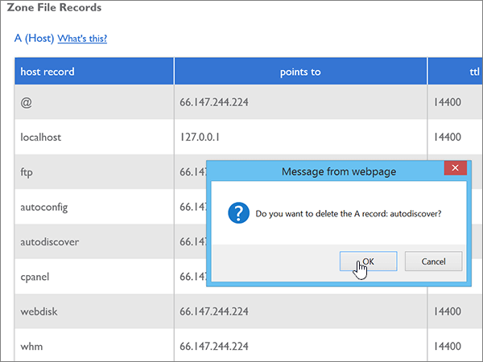
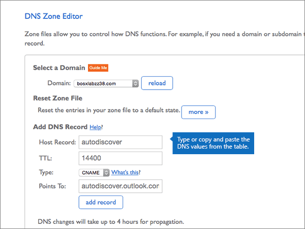
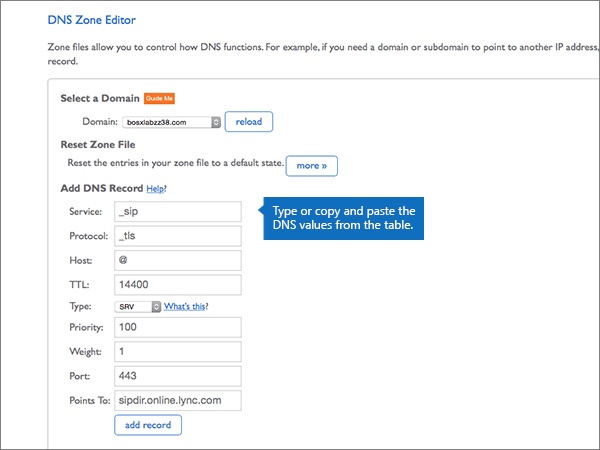

# Crear registros DNS en Bluehost para Microsoft

 **[Consulte Preguntas más frecuentes acerca de los dominios](../setup/domains-faq.md)** si no encuentra lo que busca. 
  
Si Bluehost es su proveedor de host DNS, siga los pasos de este artículo para comprobar el dominio y configurar los registros DNS para el correo electrónico, Skype Empresarial Online, etc.
  
Después de agregar estos registros a Bluehost, su dominio estará configurado para funcionar con los servicios de Microsoft.

> [!NOTE]
> Normalmente, se necesitan unos 15 minutos para que los cambios de DNS surtan efecto. Sin embargo, a veces los cambios pueden necesitar más tiempo para aplicarse en todo el sistema DNS de Internet. Si tiene problemas con el flujo de correo u otros problemas después de agregar registros DNS, vea [Encontrar y solucionar problemas después de agregar el dominio o los registros DNS](../get-help-with-domains/find-and-fix-issues.md). 
  
## Agregar un registro TXT para verificación

Antes de utilizar el dominio con Microsoft, tenemos que asegurarnos de que sea el propietario. Si puede iniciar sesión en la cuenta en el registrador de dominio y crear el registro DNS, Microsoft sabrá que es el propietario del dominio.
  
> [!NOTE]
> Este registro se usa exclusivamente para verificar si se es el propietario de un dominio; no afecta a nada más. Puede eliminarlo más adelante, si lo desea. 
  
1. Para empezar, vaya a su página de dominios en Bluehost a través de [este vínculo](https://my.bluehost.com/cgi/dm). Se le pedirá que inicie sesión primero .
    
2. En la página **dominios**, en el área **dominio**, encuentre la fila del dominio que quiere cambiar y, a continuación, seleccione la casilla que corresponde a ese dominio. 
    
    (Es posible que tenga que desplazarse hacia abajo).
    
3. En el área ***domain_name*** , en la fila editor de la **zona DNS** , seleccione **administrar registros DNS**.
    
4. On the **DNS Zone Editor** page, in the **Add DNS Record** area, in the boxes for the new record, type or copy and paste the values from the following table. 
    
    (Choose the **Type** value from the drop-down list.) 
    
    |||||
    |:-----|:-----|:-----|:-----|
    |**Host Record**   |**TTL**   |**Tipo**   |**TXT Value**   |
    |@    |14400    |TXT    |MS=ms *XXXXXXXX*    **Nota:** esto es un ejemplo. Utilice aquí su valor de **Dirección de destino**, desde la tabla. [¿Cómo puedo encontrar esto?](../get-help-with-domains/information-for-dns-records.md)          |
   
5. Seleccione **Agregar registro**.
    
6. Espere unos minutos antes de continuar para que el registro que acaba de crear pueda actualizarse en Internet.
    
Ahora que ha agregado el registro en el sitio del registrador de dominios, volverá a Microsoft y solicitará una búsqueda para el registro.
  
Cuando Microsoft encuentre el registro TXT correcto, se comprobará su dominio.
  
1. En el centro de administración de Microsoft, diríjase a la página **Configuración** \> <a href="https://go.microsoft.com/fwlink/p/?linkid=834818" target="_blank">Dominios</a>.

    
2. En la página **Dominios**, elija el dominio que está verificando. 
    
3. En la página de **Configuración**, elija ** Iniciar configuración**.
    
4. En la página**Verificar dominio**, elija **Verificar**.
    
> [!NOTE]
> Normalmente, se necesitan unos 15 minutos para que los cambios de DNS surtan efecto. Sin embargo, a veces los cambios pueden necesitar más tiempo para aplicarse en todo el sistema DNS de Internet. Si tiene problemas con el flujo de correo u otros problemas después de agregar registros DNS, vea [Encontrar y solucionar problemas después de agregar el dominio o los registros DNS](../get-help-with-domains/find-and-fix-issues.md). 
  
## Agregar un registro MX para que el correo electrónico del dominio vaya a Microsoft

1. Para empezar, vaya a su página de dominios en Bluehost a través de [este vínculo](https://my.bluehost.com/cgi/dm). Se le pedirá que inicie sesión primero .
    
2. En la página **dominios**, en el área **dominio**, encuentre la fila del dominio que quiere cambiar y, a continuación, seleccione la casilla que corresponde a ese dominio. 
    
    (Es posible que tenga que desplazarse hacia abajo).
    
3. En el área ***domain_name*** , en la fila editor de la **zona DNS** , seleccione **administrar registros DNS**.
    
4. On the **DNS Zone Editor** page, in the **Add DNS Record** area, in the boxes for the new record, type or copy and paste the values from the following table. 
    
    (Choose the **Type** value from the drop-down list.) 
    
    |**Host Record**|**TTL**|**Tipo**|**Apunta a**|**Prioridad**|
    |:-----|:-----|:-----|:-----|:-----|
    |@    |14400    |MX    | *\< clave-de-dominio \>*  . mail.protection.outlook.com       **Nota:** Obtenga la \<*clave-de-dominio*\> desde su cuenta de Microsoft. [¿Cómo puedo encontrarla?](../get-help-with-domains/information-for-dns-records.md)          |comprendi    Para obtener más información sobre la prioridad, consulte [¿Qué es una prioridad de MX?](https://support.office.com/article/2784cc4d-95be-443d-b5f7-bb5dd867ba83.aspx)   |
   
   
  
5. Seleccione **Agregar registro**.
    
    
  
6. Si hay otros registros MX en la sección **MX (agente de intercambio de correo)**, elimínelos. 
    
    Para uno de los demás registros MX, seleccione **eliminar.**
    
    
  
7. En el cuadro de diálogo de confirmación, seleccione **Aceptar**.
    
    
  
8. Siga el mismo procedimiento para eliminar el resto de los registros MX que se muestren.
    
## Agregar los seis registros CNAME necesarios para Microsoft

1. Para empezar, vaya a su página de dominios en Bluehost a través de [este vínculo](https://my.bluehost.com/cgi/dm). Se le pedirá que inicie sesión primero .
    
2. En la página **dominios**, en el área **dominio**, encuentre la fila del dominio que quiere cambiar y, a continuación, seleccione la casilla que corresponde a ese dominio. 
    
    (Es posible que tenga que desplazarse hacia abajo).
    
3. En el área ***domain_name*** , en la fila editor de la **zona DNS** , seleccione **administrar registros DNS**.
    
4. En la sección registros de **A (host)** , busque la fila del registro de **detección automática** y, a continuación, seleccione **eliminar** para esa fila. 
    
    > [!IMPORTANT]
    > Debe eliminar el registro de **detección automática** existente *antes* de agregar el registro de **detección automática** que necesita Microsoft. Bluehost no le permite mantener de forma simultánea dos registros **autodiscover**. 
  
    
  
5. Seleccione **ACEPTAR**.
    
    
  
6. Cree el primero de los seis registros CNAME.
    
    En la página **Editor de zona DNS**, en el área **Agregar registro DNS**, en los cuadros del nuevo registro, escriba (o copie y pegue) los valores de la primera fila de la tabla siguiente. 
    
    (Choose the **Type** value from the drop-down list.) 
    
    |**Host Record**|**TTL**|**Tipo**|**Apunta a**|
    |:-----|:-----|:-----|:-----|
    |autodiscover    |14400    |CNAME    |autodiscover.outlook.com    |
    |sip    |14400    |CNAME    |sipdir.online.lync.com    |
    |lyncdiscover    |14400    |CNAME    |webdir.online.lync.com    |
    |enterpriseregistration    |14400    |CNAME    |enterpriseregistration.windows.net    |
    |enterpriseenrollment    |14400    |CNAME    |EnterpriseEnrollment-s.manage.microsoft.com    |
   
    
  
7. Seleccione **Agregar registro**.
    
    
  
8. Agregue los otros cinco registros CNAME.
    
    En la sección **Agregar registro DNS** , cree un registro (para hacerlo, use los valores de la siguiente fila de la tabla y, después, vuelva a seleccionar **Agregar registro** para completar ese registro). 
    
    Repita este proceso hasta crear los seis registros CNAME.
    
## Agregar un registro TXT para SPF para ayudar a prevenir el spam de correo electrónico

> [!IMPORTANT]
> No puede tener más de un registro TXT para el SPF de un dominio. Si su dominio tiene más de un registro de SPF, obtendrá errores de correo, así como problemas de clasificación de entrega y de correo no deseado. Si ya tiene un registro de SPF para su dominio, no cree uno nuevo para Microsoft. En su lugar, agregue los valores necesarios de Microsoft al registro activo para que tenga un *único* registro de SPF que incluya ambos conjuntos de valores. ¿Necesita ejemplos? Consulte los [Registros externos del sistema de nombres de dominio para Microsoft](https://support.office.com/article/c0531a6f-9e25-4f2d-ad0e-a70bfef09ac0). Para validar el registro de SPF, puede usar una de estas[herramientas de validación de SPF](../setup/domains-faq.md). 
  
1. Para empezar, vaya a su página de dominios en Bluehost a través de [este vínculo](https://my.bluehost.com/cgi/dm). Se le pedirá que inicie sesión primero .
    
2. En la página **dominios**, en el área **dominio**, encuentre la fila del dominio que quiere cambiar y, a continuación, seleccione la casilla que corresponde a ese dominio. 
    
    (Es posible que tenga que desplazarse hacia abajo).
    
3. En el área ***domain_name*** , en la fila editor de la **zona DNS** , seleccione **administrar registros DNS**.
    
4. On the **DNS Zone Editor** page, in the **Add DNS Record** area, in the boxes for the new record, type or copy and paste the values from the following table. 
    
    (Choose the **Type** value from the drop-down list.) 
        
    |**Host Record**|**TTL**|**Tipo**|**TXT Value**|
    |:-----|:-----|:-----|:-----|
    |@    |14400    |TXT    |v=spf1 include:spf.protection.outlook.com -all   **Nota:** recomendamos copiar y pegar esta entrada, para que todo el espacio sea correcto.           |
   
    
  
5. Seleccione **Agregar registro**.
    
    
  
## Agregar los dos registros SRV necesarios para Microsoft

1. Para empezar, vaya a su página de dominios en Bluehost a través de [este vínculo](https://my.bluehost.com/cgi/dm). Se le pedirá que inicie sesión primero .
    
2. En la página **dominios**, en el área **dominio**, encuentre la fila del dominio que quiere cambiar y, a continuación, seleccione la casilla que corresponde a ese dominio. 
    
    (Es posible que tenga que desplazarse hacia abajo).
    
3. En el área ***domain_name*** , en la fila editor de la **zona DNS** , seleccione **administrar registros DNS**.
    
4. Cree el primero de los dos registros SRV.
    
    En la página **Editor de zona DNS**, en el área **Agregar registro DNS**, en los cuadros del nuevo registro, escriba (o copie y pegue) los valores de la primera fila de la tabla siguiente. 
    
    (Choose the **Type** value from the drop-down list.) 
    
    |**Servicio**|**Protocolo**|**Host**|**TTL**|**Tipo**|**Prioridad**|**Grosor**|**Puerto**|**Apunta a**|
    |:-----|:-----|:-----|:-----|:-----|:-----|:-----|:-----|:-----|
    |_sip    |_tls    |@    |14400    |SRV    |100    |1    |443    |sipdir.online.lync.com    |
    |_sipfederationtls    |_tcp    |@    |14400    |SRV    |100    |1    |5061    |sipfed.online.lync.com    |
   
    
  
5. Seleccione **Agregar registro**.
    
    
  
6. Agregue el otro registro SRV.
    
    En la sección **Agregar registro DNS** , cree un registro (para hacerlo, use los valores de la otra fila de la tabla y, después, vuelva a seleccionar **Agregar registro** para completar ese registro). 
    
> [!NOTE]
> Normalmente, se necesitan unos 15 minutos para que los cambios de DNS surtan efecto. Sin embargo, a veces los cambios pueden necesitar más tiempo para aplicarse en todo el sistema DNS de Internet. Si tiene problemas con el flujo de correo u otros problemas después de agregar registros DNS, vea [Encontrar y solucionar problemas después de agregar el dominio o los registros DNS](../get-help-with-domains/find-and-fix-issues.md). 
  

