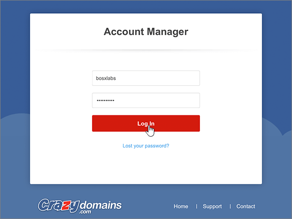

# Crear registros DNS en dominios locos para MicrosoftCreate DNS records at Crazy Domains for Microsoft

 **[Consulte Preguntas más frecuentes acerca de los dominios](../setup/domains-faq.md)** si no encuentra lo que busca.**[Check the Domains FAQ](../setup/domains-faq.md)** if you don't find what you're looking for. 
  
Si Crazy Domains es su proveedor de hosting DNS, siga los pasos de este artículo para comprobar su dominio y configurar los registros DNS para el correo electrónico, Skype Empresarial Online, etc.If Crazy Domains is your DNS hosting provider, follow the steps in this article to verify your domain and set up DNS records for email, Skype for Business Online, and so on.
  
Después de agregar estos registros a otros dominios, el dominio estará configurado para trabajar con los servicios de Microsoft.After you add these records at Crazy Domains, your domain will be set up to work with Microsoft services.
  

  
> [!NOTE]
> Por lo general, los cambios de DNS tardan unos 15 minutos en aplicarse. Sin embargo, a veces los cambios pueden necesitar más tiempo para aplicarse en todo el sistema DNS de Internet. Si tiene problemas con el flujo de correo u otros problemas después de agregar registros DNS, consulte [Solucionar problemas después de cambiar el nombre del dominio o los registros DNS](../get-help-with-domains/find-and-fix-issues.md).Typically it takes about 15 minutes for DNS changes to take effect. However, it can occasionally take longer for a change you've made to update across the Internet's DNS system. If you're having trouble with mail flow or other issues after adding DNS records, see [Troubleshoot issues after changing your domain name or DNS records](../get-help-with-domains/find-and-fix-issues.md). 
  
## Agregar un registro TXT para verificaciónAdd a TXT record for verification

Antes de utilizar el dominio con Microsoft, tenemos que asegurarnos de que sea el propietario. Si puede iniciar sesión en la cuenta en el registrador de dominio y crear el registro DNS, Microsoft sabrá que es el propietario del dominio.Before you use your domain with Microsoft, we have to make sure that you own it. Your ability to log in to your account at your domain registrar and create the DNS record proves to Microsoft that you own the domain.
  
> [!NOTE]
> Este registro se usa exclusivamente para verificar si se es el propietario de un dominio; no afecta a nada más. Puede eliminarlo más adelante, si lo desea.This record is used only to verify that you own your domain; it doesn't affect anything else. You can delete it later, if you like. 
  
1. Para comenzar, vaya a la página de dominios de Crazy Domains a través de [este vínculo](https://manage.crazydomains.com/members/domains/). Se le pedirá que primero inicie sesión.To get started, go to your domains page at Crazy Domains by using [this link](https://manage.crazydomains.com/members/domains/). You'll be prompted to log in first.
    
    
  
2. En la sección **mi cuenta** , seleccione **dominios**.In the **My Account** section, select **Domains**.
    
    
  
3. En la página **nombres de dominio** , en la sección **dominio** , seleccione el nombre del dominio que quiera actualizar.On the **Domain Names** page, in the **Domain** section, select the name of the domain that you are updating. 
    
    
  
4. En la sección **configuración DNS** , seleccione el icono de la lista desplegable.In the **DNS Settings** section, select the drop-down list icon. 
    
    
  
5. Seleccione **Agregar registro**.Select **Add Record**.
    
    
  
6. Elija **Registro TXT** en la lista desplegable **Agregar registro**.Choose **TXT Record** from the **Add Record** drop-down list. 
    
    
  
7. Elija **Agregar**.Select **Add**.
    
    
  
8. En los cuadros para el nuevo registro, escriba o copie y pegue los valores de la tabla siguiente.In the boxes for the new record, type or copy and paste the values from the following table.
    
    |**Subdominio****Sub Domain**|**Registro de texto****Text Record**|
    |:-----|:-----|
    |(Leave this field empty.)(Leave this field empty.)    |MS=ms *XXXXXXXX*MS=ms *XXXXXXXX*    **Nota:** esto es un ejemplo.**Note:** This is an example. Utilice aquí su valor de **Dirección de destino**, desde la tabla.Use your specific **Destination or Points to Address** value here, from the table.           [¿Cómo puedo encontrar esto?How do I find this?](../get-help-with-domains/information-for-dns-records.md)          |
   
    
  
9. Seleccione **Actualizar**.Select **Update**.
    
    
  
10. Espere unos minutos antes de continuar para que el registro que acaba de crear pueda actualizarse en Internet.Wait a few minutes before you continue, so that the record you just created can update across the Internet.
    
Ahora que ha agregado el registro en el sitio de su registrador de dominios, deberá volver a Microsoft y solicitar el registro.Now that you've added the record at your domain registrar's site, you'll go back to Microsoft and request the record.
  
Cuando Microsoft encuentre el registro TXT correcto, se comprobará su dominio.When Microsoft finds the correct TXT record, your domain is verified.
  
1. En el centro de administración de Microsoft, diríjase a la página **Configuración** \> <a href="https://go.microsoft.com/fwlink/p/?linkid=834818" target="_blank">Dominios</a>.In the Microsoft admin center, go to the **Settings** \> <a href="https://go.microsoft.com/fwlink/p/?linkid=834818" target="_blank">Domains</a> page.

    
2. En la página **Dominios**, elija el dominio que está verificando.On the **Domains** page, select the domain that you are verifying. 
    
    
  
3. En la página de **Configuración**, elija \*\* Iniciar configuración\*\*.On the **Setup** page, select **Start setup**.
    
    
  
4. En la página**verificar dominio**, seleccione **verificar**.On the **Verify domain** page, select **Verify**.
    
    
  
> [!NOTE]
>  Por lo general, los cambios de DNS tardan unos 15 minutos en aplicarse. Sin embargo, a veces los cambios pueden necesitar más tiempo para aplicarse en todo el sistema DNS de Internet. Si tiene problemas con el flujo de correo u otros problemas después de agregar registros DNS, consulte [Solucionar problemas después de cambiar el nombre del dominio o los registros DNS](../get-help-with-domains/find-and-fix-issues.md).Typically it takes about 15 minutes for DNS changes to take effect. However, it can occasionally take longer for a change you've made to update across the Internet's DNS system. If you're having trouble with mail flow or other issues after adding DNS records, see [Troubleshoot issues after changing your domain name or DNS records](../get-help-with-domains/find-and-fix-issues.md). 
  
## Agregar un registro MX para que el correo electrónico del dominio vaya a MicrosoftAdd an MX record so email for your domain will come to Microsoft

1. Para comenzar, vaya a la página de dominios de Crazy Domains a través de [este vínculo](https://manage.crazydomains.com/members/domains/). Se le pedirá que primero inicie sesión.To get started, go to your domains page at Crazy Domains by using [this link](https://manage.crazydomains.com/members/domains/). You'll be prompted to log in first.
    
    
  
2. En la sección **mi cuenta** , seleccione **dominios**.In the **My Account** section, select **Domains**.
    
    
  
3. En la página **nombres de dominio** , en la sección **dominio** , seleccione el nombre del dominio que quiera actualizar.On the **Domain Names** page, in the **Domain** section, select the name of the domain that you are updating. 
    
    
  
4. En la sección **configuración DNS** , seleccione el icono de la lista desplegable.In the **DNS Settings** section, select the drop-down list icon. 
    
    
  
5. Seleccione **Agregar registro**.Select **Add Record**.
    
    
  
6. Elija **Registro MX** en la lista desplegable **Agregar registro:**.Choose **MX Record** from the **Add Record:** drop-down list. 
    
    
  
7. Elija **Agregar**.Select **Add**.
    
    
  
8. En los cuadros para el nuevo registro, escriba o copie y pegue los valores de la tabla siguiente.In the boxes for the new record, type or copy and paste the values from the following table.
    
    (Elija el valor **prioridad** de la lista desplegable).(Choose the **Priority** value from the drop-down list.) 
    
    |**Correo por zona****Mail For Zone**|**Prioridad****Priority**|**Asignado a un servidor****Assigned To Server**|
    |:-----|:-----|:-----|
    |(Deje este campo en blanco).(Leave this field empty.)    |1 1    Para obtener más información sobre la prioridad, consulte [¿Qué es una prioridad de MX?](https://docs.microsoft.com/microsoft-365/admin/setup/domains-faq)For more information about priority, see [What is MX priority?](https://docs.microsoft.com/microsoft-365/admin/setup/domains-faq)   | *\<domain-key\>*. mail.protection.outlook.com*\<domain-key\>*  .mail.protection.outlook.com    **Nota:** Obtén tu *\<domain-key\>* cuenta de Microsoft.**Note:** Get your  *\<domain-key\>*  from your Microsoft account.           [¿Cómo puedo encontrar esto?How do I find this?](../get-help-with-domains/information-for-dns-records.md)          |
       
   
  
9. Seleccione **Actualizar**.Select **Update**.
    
    
  
10. Si hay otros registros MX enumerados en la sección **registro MX** , seleccione **modificar** para uno de esos registros.If there are any other MX records listed in the **MX Record** section, select **Modify** for one of those records. 
    
    
  
11. Seleccione **Eliminar**.Select **Delete**.
    
    
  
12. Seleccione **Actualizar** para confirmar la eliminación.Select **Update** to confirm the deletion. 
    
    
  
13. Use el mismo proceso para quitar cualquier otro registro MX de la lista, hasta que solo quede el que ha agregado anteriormente en este procedimiento.Use the same process to remove any other MX records in the list, until only the one that you added earlier in this procedure remains.
    
## Agregar los seis registros CNAME necesarios para MicrosoftAdd the six CNAME records that are required for Microsoft

1. Para comenzar, vaya a la página de dominios de Crazy Domains a través de [este vínculo](https://manage.crazydomains.com/members/domains/). Se le pedirá que primero inicie sesión.To get started, go to your domains page at Crazy Domains by using [this link](https://manage.crazydomains.com/members/domains/). You'll be prompted to log in first.
    
    
  
2. En la sección **mi cuenta** , seleccione **dominios**.In the **My Account** section, select **Domains**.
    
    
  
3. En la página **nombres de dominio** , en la sección **dominio** , seleccione el nombre del dominio que quiera actualizar.On the **Domain Names** page, in the **Domain** section, select the name of the domain that you are updating. 
    
    
  
4. En la sección **configuración DNS** , seleccione el icono de la lista desplegable.In the **DNS Settings** section, select the drop-down list icon. 
    
    
  
5. Seleccione **Agregar registro**.Select **Add Record**.
    
    
  
6. Elija **Registro CNAME** en la lista desplegable **Agregar registro:**.Choose **CNAME Record** from the **Add Record:** drop-down list. 
    
    
  
7. Elija **Agregar**.Select **Add**.
    
    
  
8. Agregue el primero de los seis registros CNAME.Add the first of the six CNAME records.
    
    En los cuadros para el nuevo registro, escriba o copie y pegue los valores de la primera fila de la tabla siguiente.In the boxes for the new record, type or copy and paste the values from the first row of the following table.
    
    |**Subdominio****Sub Domain**|**Alias para****Alias for**|
    |:-----|:-----|
    |autodescubrirautodiscover    |autodiscover.outlook.comautodiscover.outlook.com    |
    |sipsip    |sipdir.online.lync.comsipdir.online.lync.com    |
    |lyncdiscoverlyncdiscover    |webdir.online.lync.comwebdir.online.lync.com    |
    |enterpriseregistrationenterpriseregistration    |enterpriseregistration.windows.netenterpriseregistration.windows.net    |
    |enterpriseenrollmententerpriseenrollment    |EnterpriseEnrollment-s.manage.microsoft.comenterpriseenrollment-s.manage.microsoft.com    |
   
    
  
9. Seleccione **Agregar registro CNAME**.Select **Add CNAME Record**.
    
    
  
10. Agregue el segundo registro CNAME.Add the second CNAME record.
    
    En los cuadros para el nuevo registro, use los valores de la siguiente fila de la tabla y, después, vuelva a seleccionar **Agregar registro CNAME**.In the boxes for the new record, use the values from the next row in the table, and then again select **Add CNAME Record**.
    
    Repita este proceso hasta crear los seis registros CNAME.Repeat this process until you have created all six CNAME records.
    
11. Seleccione **Actualizar** para guardar los cambios.Select **Update** to save your changes. 
    
    
  
## Agregar un registro TXT para SPF para ayudar a prevenir el spam de correo electrónicoAdd a TXT record for SPF to help prevent email spam

> [!IMPORTANT]
> No puede tener más de un registro TXT para el SPF de un dominio.You cannot have more than one TXT record for SPF for a domain. Si su dominio tiene más de un registro de SPF, obtendrá errores de correo, así como problemas de clasificación de entrega y de correo no deseado.If your domain has more than one SPF record, you'll get email errors, as well as delivery and spam classification issues. Si ya tiene un registro de SPF para su dominio, no cree uno nuevo para Microsoft.If you already have an SPF record for your domain, don't create a new one for Microsoft. En su lugar, agregue los valores necesarios de Microsoft al registro activo para que tenga un *único* registro de SPF que incluya ambos conjuntos de valores.Instead, add the required Microsoft values to the current record so that you have a  *single*  SPF record that includes both sets of values. 
  
1. Para comenzar, vaya a la página de dominios de Crazy Domains a través de [este vínculo](https://manage.crazydomains.com/members/domains/). Se le pedirá que primero inicie sesión.To get started, go to your domains page at Crazy Domains by using [this link](https://manage.crazydomains.com/members/domains/). You'll be prompted to log in first.
    
    
  
2. En la sección **mi cuenta** , seleccione **dominios**.In the **My Account** section, select **Domains**.
    
    
  
3. En la página **nombres de dominio** , en la sección **dominio** , seleccione el nombre del dominio que quiera actualizar.On the **Domain Names** page, in the **Domain** section, select the name of the domain that you are updating. 
    
    
  
4. En la sección **configuración DNS** , seleccione el icono de la lista desplegable.In the **DNS Settings** section, select the drop-down list icon. 
    
    
  
5. Seleccione **Agregar registro**.Select **Add Record**.
    
    
  
6. Elija **Registro TXT** en la lista desplegable **Agregar registro:**.Choose **TXT Record** from the **Add Record:** drop-down list. 
    
    
  
7. Elija **Agregar**.Select **Add**.
    
    
  
8. En los cuadros para el nuevo registro, escriba o pegue los valores de la tabla siguiente.In the boxes for the new record, type or paste the values from the following table.
    
    |**Subdominio****Sub Domain**|**Registro de texto****Text Record**|
    |:-----|:-----|
    |(Deje este campo en blanco).(Leave this field empty.)    |v=spf1 include:spf.protection.outlook.com -allv=spf1 include:spf.protection.outlook.com -all    **Nota:** recomendamos copiar y pegar esta entrada, para que todo el espacio sea correcto.**Note:** We recommend copying and pasting this entry, so that all of the spacing stays correct.           |
   
    
  
9. Seleccione **Actualizar**.Select **Update**.
    
    
  
## Agregar los dos registros SRV necesarios para MicrosoftAdd the two SRV records that are required for Microsoft

1. Para comenzar, vaya a la página de dominios de Crazy Domains a través de [este vínculo](https://manage.crazydomains.com/members/domains/). Se le pedirá que primero inicie sesión.To get started, go to your domains page at Crazy Domains by using [this link](https://manage.crazydomains.com/members/domains/). You'll be prompted to log in first.
    
    
  
2. En la sección **mi cuenta** , seleccione **dominios**.In the **My Account** section, select **Domains**.
    
    
  
3. En la página **nombres de dominio** , en la sección **dominio** , seleccione el nombre del dominio que quiera actualizar.On the **Domain Names** page, in the **Domain** section, select the name of the domain that you are updating. 
    
    
  
4. En la sección **configuración DNS** , seleccione el icono de la lista desplegable.In the **DNS Settings** section, select the drop-down list icon. 
    
    
  
5. Seleccione **Agregar registro**.Select **Add Record**.
    
    
  
6. Elija **Registro SRV** en la lista desplegable **Agregar registro:**.Choose **SRV Record** from the **Add Record:** drop-down list. 
    
    
  
7. Elija **Agregar**.Select **Add**.
    
    
  
8. Agregue el primero de los dos registros SRV.Add the first of the two SRV records.
    
    En los cuadros para el nuevo registro, escriba o copie y pegue los valores de la primera fila de la tabla siguiente.In the boxes for the new record, type or copy and paste the values from the first row of the following table.
    
    |**Tipo de registro****Record Type**|**Subdominio****Sub Domain**|**Prioridad****Priority**|**Grosor****Weight**|**Puerto****Port**|**Destino****Target**|
    |:-----|:-----|:-----|:-----|:-----|:-----|
    |Registro SRVSRV Record    |_sip. _tls_sip._tls    |100100    |1 1    |443443    |sipdir.online.lync.comsipdir.online.lync.com    |
    |Registro SRVSRV Record    |_sipfederationtls. _tcp_sipfederationtls._tcp    |100100    |1 1    |50615061    |sipfed.online.lync.comsipfed.online.lync.com    |
   
    
  
9. Seleccione **Agregar registro SRV**.Select **Add SRV Record**.
    
    
  
10. Agregue el otro registro SRV.Add the other SRV record.
    
    En los cuadros del nuevo registro, use los valores de la segunda fila de la tabla.In the boxes for the new record, use the values from the second row in the table.
    
11. Seleccione **Actualizar** para guardar los cambios.Select **Update** to save your changes. 
    
    
  
> [!NOTE]
> Por lo general, los cambios de DNS tardan unos 15 minutos en aplicarse. Sin embargo, a veces los cambios pueden necesitar más tiempo para aplicarse en todo el sistema DNS de Internet. Si tiene problemas con el flujo de correo u otros problemas después de agregar registros DNS, consulte [Solucionar problemas después de cambiar el nombre del dominio o los registros DNS](../get-help-with-domains/find-and-fix-issues.md).Typically it takes about 15 minutes for DNS changes to take effect. However, it can occasionally take longer for a change you've made to update across the Internet's DNS system. If you're having trouble with mail flow or other issues after adding DNS records, see [Troubleshoot issues after changing your domain name or DNS records](../get-help-with-domains/find-and-fix-issues.md). 
  
