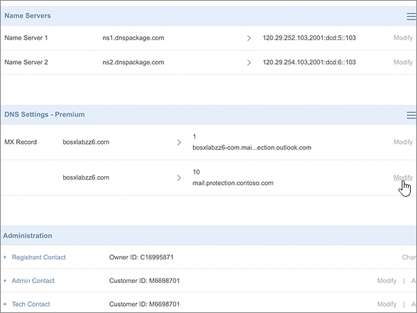

# Crear registros DNS en dominios locos para Microsoft

 **[Consulte Preguntas más frecuentes acerca de los dominios](../setup/domains-faq.md)** si no encuentra lo que busca. 
  
Si Crazy Domains es su proveedor de hosting DNS, siga los pasos de este artículo para comprobar su dominio y configurar los registros DNS para el correo electrónico, Skype Empresarial Online, etc.
  
Después de agregar estos registros a otros dominios, el dominio estará configurado para trabajar con los servicios de Microsoft.
  

  
> [!NOTE]
> Por lo general, los cambios de DNS tardan unos 15 minutos en aplicarse. Sin embargo, a veces los cambios pueden necesitar más tiempo para aplicarse en todo el sistema DNS de Internet. Si tiene problemas con el flujo de correo u otros problemas después de agregar registros DNS, consulte [Solucionar problemas después de cambiar el nombre del dominio o los registros DNS](../get-help-with-domains/find-and-fix-issues.md). 
  
## Agregar un registro TXT para verificación

Antes de utilizar el dominio con Microsoft, tenemos que asegurarnos de que sea el propietario. Si puede iniciar sesión en la cuenta en el registrador de dominio y crear el registro DNS, Microsoft sabrá que es el propietario del dominio.
  
> [!NOTE]
> Este registro se usa exclusivamente para verificar si se es el propietario de un dominio; no afecta a nada más. Puede eliminarlo más adelante, si lo desea. 
  
1. Para comenzar, vaya a la página de dominios de Crazy Domains a través de [este vínculo](https://manage.crazydomains.com/members/domains/). Se le pedirá que primero inicie sesión.
    
    
  
2. En la sección **mi cuenta** , seleccione **dominios**.
    
    
  
3. En la página **nombres de dominio** , en la sección **dominio** , seleccione el nombre del dominio que quiera actualizar. 
    
    
  
4. En la sección **configuración DNS** , seleccione el icono de la lista desplegable. 
    
    
  
5. Seleccione **Agregar registro**.
    
    
  
6. Elija **Registro TXT** en la lista desplegable **Agregar registro**. 
    
    
  
7. Elija **Agregar**.
    
    
  
8. En los cuadros para el nuevo registro, escriba o copie y pegue los valores de la tabla siguiente.
    
    |**Subdominio**|**Registro de texto**|
    |:-----|:-----|
    |(Leave this field empty.)    |MS=ms *XXXXXXXX*    **Nota:** esto es un ejemplo. Utilice aquí su valor de **Dirección de destino**, desde la tabla.           [¿Cómo puedo encontrar esto?](../get-help-with-domains/information-for-dns-records.md)          |
   
    
  
9. Seleccione **Actualizar**.
    
    
  
10. Espere unos minutos antes de continuar para que el registro que acaba de crear pueda actualizarse en Internet.
    
Ahora que ha agregado el registro en el sitio de su registrador de dominios, deberá volver a Microsoft y solicitar el registro.
  
Cuando Microsoft encuentre el registro TXT correcto, se comprobará su dominio.
  
1. En el centro de administración de Microsoft, diríjase a la página **Configuración** \> <a href="https://go.microsoft.com/fwlink/p/?linkid=834818" target="_blank">Dominios</a>.

    
2. En la página **Dominios**, elija el dominio que está verificando. 
    
    
  
3. En la página de **Configuración**, elija ** Iniciar configuración**.
    
    
  
4. En la página**verificar dominio**, seleccione **verificar**.
    
    
  
> [!NOTE]
>  Por lo general, los cambios de DNS tardan unos 15 minutos en aplicarse. Sin embargo, a veces los cambios pueden necesitar más tiempo para aplicarse en todo el sistema DNS de Internet. Si tiene problemas con el flujo de correo u otros problemas después de agregar registros DNS, consulte [Solucionar problemas después de cambiar el nombre del dominio o los registros DNS](../get-help-with-domains/find-and-fix-issues.md). 
  
## Agregar un registro MX para que el correo electrónico del dominio vaya a Microsoft

1. Para comenzar, vaya a la página de dominios de Crazy Domains a través de [este vínculo](https://manage.crazydomains.com/members/domains/). Se le pedirá que primero inicie sesión.
    
    
  
2. En la sección **mi cuenta** , seleccione **dominios**.
    
    
  
3. En la página **nombres de dominio** , en la sección **dominio** , seleccione el nombre del dominio que quiera actualizar. 
    
    
  
4. En la sección **configuración DNS** , seleccione el icono de la lista desplegable. 
    
    
  
5. Seleccione **Agregar registro**.
    
    
  
6. Elija **Registro MX** en la lista desplegable **Agregar registro:**. 
    
    
  
7. Elija **Agregar**.
    
    
  
8. En los cuadros para el nuevo registro, escriba o copie y pegue los valores de la tabla siguiente.
    
    (Elija el valor **prioridad** de la lista desplegable). 
    
    |**Correo por zona**|**Prioridad**|**Asignado a un servidor**|
    |:-----|:-----|:-----|
    |(Deje este campo en blanco).    |1     Para obtener más información sobre la prioridad, consulte [¿Qué es una prioridad de MX?](https://docs.microsoft.com/microsoft-365/admin/setup/domains-faq)   | *\<domain-key\>*. mail.protection.outlook.com    **Nota:** Obtén tu *\<domain-key\>* cuenta de Microsoft.           [¿Cómo puedo encontrar esto?](../get-help-with-domains/information-for-dns-records.md)          |
       
   
  
9. Seleccione **Actualizar**.
    
    
  
10. Si hay otros registros MX enumerados en la sección **registro MX** , seleccione **modificar** para uno de esos registros. 
    
    
  
11. Seleccione **Eliminar**.
    
    
  
12. Seleccione **Actualizar** para confirmar la eliminación. 
    
    
  
13. Use el mismo proceso para quitar cualquier otro registro MX de la lista, hasta que solo quede el que ha agregado anteriormente en este procedimiento.
    
## Agregar los seis registros CNAME necesarios para Microsoft

1. Para comenzar, vaya a la página de dominios de Crazy Domains a través de [este vínculo](https://manage.crazydomains.com/members/domains/). Se le pedirá que primero inicie sesión.
    
    
  
2. En la sección **mi cuenta** , seleccione **dominios**.
    
    
  
3. En la página **nombres de dominio** , en la sección **dominio** , seleccione el nombre del dominio que quiera actualizar. 
    
    
  
4. En la sección **configuración DNS** , seleccione el icono de la lista desplegable. 
    
    
  
5. Seleccione **Agregar registro**.
    
    
  
6. Elija **Registro CNAME** en la lista desplegable **Agregar registro:**. 
    
    
  
7. Elija **Agregar**.
    
    
  
8. Agregue el primero de los seis registros CNAME.
    
    En los cuadros para el nuevo registro, escriba o copie y pegue los valores de la primera fila de la tabla siguiente.
    
    |**Subdominio**|**Alias para**|
    |:-----|:-----|
    |autodescubrir    |autodiscover.outlook.com    |
    |sip    |sipdir.online.lync.com    |
    |lyncdiscover    |webdir.online.lync.com    |
    |enterpriseregistration    |enterpriseregistration.windows.net    |
    |enterpriseenrollment    |EnterpriseEnrollment-s.manage.microsoft.com    |
   
    
  
9. Seleccione **Agregar registro CNAME**.
    
    
  
10. Agregue el segundo registro CNAME.
    
    En los cuadros para el nuevo registro, use los valores de la siguiente fila de la tabla y, después, vuelva a seleccionar **Agregar registro CNAME**.
    
    Repita este proceso hasta crear los seis registros CNAME.
    
11. Seleccione **Actualizar** para guardar los cambios. 
    
    
  
## Agregar un registro TXT para SPF para ayudar a prevenir el spam de correo electrónico

> [!IMPORTANT]
> No puede tener más de un registro TXT para el SPF de un dominio. Si su dominio tiene más de un registro de SPF, obtendrá errores de correo, así como problemas de clasificación de entrega y de correo no deseado. Si ya tiene un registro de SPF para su dominio, no cree uno nuevo para Microsoft. En su lugar, agregue los valores necesarios de Microsoft al registro activo para que tenga un *único* registro de SPF que incluya ambos conjuntos de valores. 
  
1. Para comenzar, vaya a la página de dominios de Crazy Domains a través de [este vínculo](https://manage.crazydomains.com/members/domains/). Se le pedirá que primero inicie sesión.
    
    
  
2. En la sección **mi cuenta** , seleccione **dominios**.
    
    
  
3. En la página **nombres de dominio** , en la sección **dominio** , seleccione el nombre del dominio que quiera actualizar. 
    
    
  
4. En la sección **configuración DNS** , seleccione el icono de la lista desplegable. 
    
    
  
5. Seleccione **Agregar registro**.
    
    
  
6. Elija **Registro TXT** en la lista desplegable **Agregar registro:**. 
    
    
  
7. Elija **Agregar**.
    
    
  
8. En los cuadros para el nuevo registro, escriba o pegue los valores de la tabla siguiente.
    
    |**Subdominio**|**Registro de texto**|
    |:-----|:-----|
    |(Deje este campo en blanco).    |v=spf1 include:spf.protection.outlook.com -all    **Nota:** recomendamos copiar y pegar esta entrada, para que todo el espacio sea correcto.           |
   
    
  
9. Seleccione **Actualizar**.
    
    
  
## Agregar los dos registros SRV necesarios para Microsoft

1. Para comenzar, vaya a la página de dominios de Crazy Domains a través de [este vínculo](https://manage.crazydomains.com/members/domains/). Se le pedirá que primero inicie sesión.
    
    
  
2. En la sección **mi cuenta** , seleccione **dominios**.
    
    
  
3. En la página **nombres de dominio** , en la sección **dominio** , seleccione el nombre del dominio que quiera actualizar. 
    
    
  
4. En la sección **configuración DNS** , seleccione el icono de la lista desplegable. 
    
    
  
5. Seleccione **Agregar registro**.
    
    
  
6. Elija **Registro SRV** en la lista desplegable **Agregar registro:**. 
    
    
  
7. Elija **Agregar**.
    
    
  
8. Agregue el primero de los dos registros SRV.
    
    En los cuadros para el nuevo registro, escriba o copie y pegue los valores de la primera fila de la tabla siguiente.
    
    |**Tipo de registro**|**Subdominio**|**Prioridad**|**Grosor**|**Puerto**|**Destino**|
    |:-----|:-----|:-----|:-----|:-----|:-----|
    |Registro SRV    |_sip. _tls    |100    |1     |443    |sipdir.online.lync.com    |
    |Registro SRV    |_sipfederationtls. _tcp    |100    |1     |5061    |sipfed.online.lync.com    |
   
    
  
9. Seleccione **Agregar registro SRV**.
    
    
  
10. Agregue el otro registro SRV.
    
    En los cuadros del nuevo registro, use los valores de la segunda fila de la tabla.
    
11. Seleccione **Actualizar** para guardar los cambios. 
    
    
  
> [!NOTE]
> Por lo general, los cambios de DNS tardan unos 15 minutos en aplicarse. Sin embargo, a veces los cambios pueden necesitar más tiempo para aplicarse en todo el sistema DNS de Internet. Si tiene problemas con el flujo de correo u otros problemas después de agregar registros DNS, consulte [Solucionar problemas después de cambiar el nombre del dominio o los registros DNS](../get-help-with-domains/find-and-fix-issues.md). 
  
