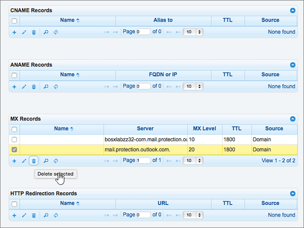

# Crear registros DNS en DNSMadeEasy para MicrosoftCreate DNS records at DNSMadeEasy for Microsoft

 **[Consulte Preguntas más frecuentes acerca de los dominios](../setup/domains-faq.md)** si no encuentra lo que busca.**[Check the Domains FAQ](../setup/domains-faq.md)** if you don't find what you're looking for. 
  
Si DNSMadeEasy es su proveedor de host DNS, siga los pasos de este artículo para comprobar el dominio y configurar los registros DNS para el correo electrónico, Skype Empresarial Online, etc.If DNSMadeEasy is your DNS hosting provider, follow the steps in this article to verify your domain and set up DNS records for email, Skype for Business Online, and so on.
  
Después de agregar estos registros a DNSMadeEasy, su dominio estará configurado para funcionar con los servicios de Microsoft.After you add these records at DNSMadeEasy, your domain will be set up to work with Microsoft services.
  

  
> [!NOTE]
> Normalmente, se necesitan unos 15 minutos para que los cambios de DNS surtan efecto.Typically it takes about 15 minutes for DNS changes to take effect. Sin embargo, a veces los cambios pueden necesitar más tiempo para aplicarse en todo el sistema DNS de Internet.However, it can occasionally take longer for a change you've made to update across the Internet's DNS system. Si tiene problemas con el flujo de correo u otros problemas después de agregar registros DNS, vea [Encontrar y solucionar problemas después de agregar el dominio o los registros DNS](../get-help-with-domains/find-and-fix-issues.md).If you're having trouble with mail flow or other issues after adding DNS records, see [Find and fix issues after adding your domain or DNS records](../get-help-with-domains/find-and-fix-issues.md). 
  
## Agregar un registro TXT para verificaciónAdd a TXT record for verification

Antes de utilizar el dominio con Microsoft, tenemos que asegurarnos de que sea el propietario. Si puede iniciar sesión en la cuenta en el registrador de dominio y crear el registro DNS, Microsoft sabrá que es el propietario del dominio.Before you use your domain with Microsoft, we have to make sure that you own it. Your ability to log in to your account at your domain registrar and create the DNS record proves to Microsoft that you own the domain.
  
> [!NOTE]
> Este registro se usa exclusivamente para verificar si se es el propietario de un dominio; no afecta a nada más. Puede eliminarlo más adelante, si lo desea.This record is used only to verify that you own your domain; it doesn't affect anything else. You can delete it later, if you like. 
  
> [!IMPORTANT]
> Para las cuentas de DNSMadeEasy, el dominio que agregó se compró de un registrador de dominios separado.For DNSMadeEasy accounts, the domain you added was purchased from a separate domain registrar. DNSMadeEasy no ofrece servicios de registro de dominios.DNSMadeEasy does not offer domain registration services. Su capacidad para iniciar sesión en DNSMadeEasy y crear el registro DNS es una prueba suficiente de que es el propietario.Your ability to log in at DNSMadeEasy and create the DNS record is sufficient proof of ownership. 
  
1. Para empezar, vaya a su página de dominios en DNSMadeEasy a través de [este vínculo](https://cp.dnsmadeeasy.com/).To get started, go to your domains page at DNSMadeEasy by using [this link](https://cp.dnsmadeeasy.com/). Se le pedirá que inicie sesión primero.You'll be prompted to login first.
    
2. En la página **consola de administración** , en el área **dominios actualizados recientemente** , seleccione el dominio que desea actualizar.On the **Management Console** page, in the **Recently Updated Domains** area, select the domain that you want to update. 
    
3. En la página **DNS administrados** , en el área **registros txt** , seleccione el **+** control () ( **Agregar nuevo**).On the **Managed DNS** page, in the **TXT Records** area, select the ( **+**) control ( **Add new**).
    
    (You may have to scroll down.)(You may have to scroll down.)
    
4. In the **Add TXT Records** area, in the boxes for the new record, type or copy and paste the values from the following table.In the **Add TXT Records** area, in the boxes for the new record, type or copy and paste the values from the following table. 
    
    ||||
    |:-----|:-----|:-----|
    |**Name****Name**   |**Valor****Value**   |**TTL****TTL**   |
    |(Deje este campo en blanco).(Leave this field empty.)    |MS=ms *XXXXXXXX*MS=ms *XXXXXXXX*    **Nota:** esto es un ejemplo.**Note:** This is an example. Utilice aquí su valor de **Dirección de destino**, desde la tabla.Use your specific **Destination or Points to Address** value here, from the table. [¿Cómo puedo encontrar esto?How do I find this?](../get-help-with-domains/information-for-dns-records.md)          |18001800    |
   
5. Seleccione **Enviar**.Select **Submit**.
    
6. Espere unos minutos antes de continuar para que el registro que acaba de crear pueda actualizarse en Internet.Wait a few minutes before you continue, so that the record you just created can update across the Internet.
    
Ahora que ha agregado el registro en el sitio de su registrador de dominios, deberá volver a Microsoft y solicitar el registro.Now that you've added the record at your domain registrar's site, you'll go back to Microsoft and request the record.
  
Cuando Microsoft encuentre el registro TXT correcto, se comprobará su dominio.When Microsoft finds the correct TXT record, your domain is verified.
  
1. En el centro de administración de Microsoft, diríjase a la página **Configuración** \> <a href="https://go.microsoft.com/fwlink/p/?linkid=834818" target="_blank">Dominios</a>.In the Microsoft admin center, go to the **Settings** \> <a href="https://go.microsoft.com/fwlink/p/?linkid=834818" target="_blank">Domains</a> page.

    
2. En la página **Dominios**, elija el dominio que está verificando.On the **Domains** page, select the domain that you are verifying. 
    
3. En la página de **Configuración**, elija \*\* Iniciar configuración\*\*.On the **Setup** page, select **Start setup**.
    
4. En la página**Verificar dominio**, elija **Verificar**.On the **Verify domain** page, select **Verify**.
    
> [!NOTE]
> Normalmente, se necesitan unos 15 minutos para que los cambios de DNS surtan efecto.Typically it takes about 15 minutes for DNS changes to take effect. Sin embargo, a veces los cambios pueden necesitar más tiempo para aplicarse en todo el sistema DNS de Internet.However, it can occasionally take longer for a change you've made to update across the Internet's DNS system. Si tiene problemas con el flujo de correo u otros problemas después de agregar registros DNS, vea [Encontrar y solucionar problemas después de agregar el dominio o los registros DNS](../get-help-with-domains/find-and-fix-issues.md).If you're having trouble with mail flow or other issues after adding DNS records, see [Find and fix issues after adding your domain or DNS records](../get-help-with-domains/find-and-fix-issues.md). 
  
## Agregar un registro MX para que el correo electrónico del dominio vaya a MicrosoftAdd an MX record so email for your domain will come to Microsoft

1. Para empezar, vaya a su página de dominios en DNSMadeEasy a través de [este vínculo](https://cp.dnsmadeeasy.com/). Se le pedirá que inicie sesión primero.To get started, go to your domains page at DNSMadeEasy by using [this link](https://cp.dnsmadeeasy.com/). You'll be prompted to login first.
    
2. En la página **consola de administración** , en el área **dominios actualizados recientemente** , seleccione el dominio que desea actualizar.On the **Management Console** page, in the **Recently Updated Domains** area, select the domain that you want to update. 
    
    En la página **consola de administración** , en el área **dominios actualizados recientemente** , seleccione el dominio que desea actualizar.On the **Management Console** page, in the **Recently Updated Domains** area, select the domain that you want to update. 
    
    
  
3. En la página **DNS administrados** , en el área **registros MX** , seleccione el control **(+)** ( **Agregar nuevo**).On the **Managed DNS** page, in the **MX Records** area, select the **(+)** control ( **Add new**).
    
    (You may have to scroll down.)(You may have to scroll down.)
    
    
  
4. En el área **Agregar registros MX**, en los cuadros del nuevo registro, escriba (o copie y pegue) los valores de la tabla siguiente.In the **Add MX Records** area, in the boxes for the new record, type or copy and paste the values from the following table. 
    
    (Es posible que tenga que desplazarse hacia abajo).(You may have to scroll down.)
    
    |**Name****Name**|**Servidor****Server**|**Nivel de MX****MX Level**|**TTL****TTL**|
    |:-----|:-----|:-----|:-----|
    |(Deje este campo en blanco).(Leave this field empty.)    | *\< clave-de-dominio \>*  . mail.protection.outlook.com    *\<domain-key\>*  .mail.protection.outlook.com    **This value MUST end with a period (.)****This value MUST end with a period (.)**   **Nota:** Obtenga la \<*clave-de-dominio*\> desde su cuenta de Microsoft.**Note:** Get your \<*domain-key*\> from your Microsoft account. [¿Cómo puedo encontrarla?How do I find this?](../get-help-with-domains/information-for-dns-records.md)          |10  10    Para obtener más información sobre la prioridad, consulte [¿Qué es una prioridad de MX?](https://docs.microsoft.com/microsoft-365/admin/setup/domains-faq)For more information about priority, see [What is MX priority?](https://docs.microsoft.com/microsoft-365/admin/setup/domains-faq)   |18001800    |
   
    
  
5. Seleccione **Enviar**.Select **Submit**.
    
    
  
6. Si en la sección **Registros MX** se muestran otros registros MX, selecciónelos para eliminarlos.If there are any other MX records listed in the **MX Records** section, delete all of them by selecting each one. 
    
    
  
7. Una vez seleccionados todos los registros, seleccione **eliminar seleccionados**.When all records are selected, select **Delete selected**.
    
    
  
8. En el cuadro de diálogo **eliminar registros MX** , seleccione **eliminar** para confirmar los cambios.In the **Delete MX Records** dialog box, select **Delete** to confirm your changes. 
    
    
  
## Agregar los cinco registros CNAME necesarios para MicrosoftAdd the five CNAME records that are required for Microsoft

1. Para empezar, vaya a su página de dominios en DNSMadeEasy a través de [este vínculo](https://cp.dnsmadeeasy.com/). Se le pedirá que inicie sesión primero.To get started, go to your domains page at DNSMadeEasy by using [this link](https://cp.dnsmadeeasy.com/). You'll be prompted to login first.
    
2. En la página **consola de administración** , en el área **dominios actualizados recientemente** , seleccione el dominio que desea actualizar.On the **Management Console** page, in the **Recently Updated Domains** area, select the domain that you want to update. 
    
3. En la página **DNS administrados** , en el área **registros CNAME** , seleccione el control **(+)** ( **Agregar nuevo**).On the **Managed DNS** page, in the **CNAME Records** area, select the **(+)** control ( **Add new**).
    
    (You may have to scroll down.)(You may have to scroll down.)
    
    
  
4. Agregue el primero de los cinco registros CNAME.Add the first of the five CNAME records.
    
    En el área **Agregar registros CNAME**, en los cuadros del nuevo registro, escriba (o copie y pegue) los valores de la primera fila de la tabla siguiente.In the **Add CNAME Records** area, in the boxes for the new record, type or copy and paste the values from the first row in the following table. 
    
    |**Nombre****Name**|**Alias para****Alias to**|**TTL****TTL**|
    |:-----|:-----|:-----|
    |autodiscoverautodiscover    |autodiscover.outlook.com.autodiscover.outlook.com.    **Este valor DEBE terminar en punto (.).****This value MUST end with a period (.)**   |18001800    |
    |sipsip    |sipdir.online.lync.com.sipdir.online.lync.com.    **Este valor DEBE terminar en punto (.).****This value MUST end with a period (.)**   |18001800    |
    |lyncdiscoverlyncdiscover    |webdir.online.lync.com.webdir.online.lync.com.    **Este valor DEBE terminar en punto (.).****This value MUST end with a period (.)**   |18001800    |
    |enterpriseregistrationenterpriseregistration    |enterpriseregistration.windows.net.enterpriseregistration.windows.net.    **Este valor DEBE terminar en punto (.).****This value MUST end with a period (.)**   |18001800    |
    |enterpriseenrollmententerpriseenrollment    |enterpriseenrollment-s.manage.microsoft.com.enterpriseenrollment-s.manage.microsoft.com.    **Este valor DEBE terminar en punto (.).****This value MUST end with a period (.)**   |18001800    |
   
    
  
5. Seleccione **Enviar**.Select **Submit**.
    
    
  
6. Agregue cada uno de los otros cuatro registros CNAME.Add each of the other four CNAME records.
    
    En la sección **registros CNAME** , seleccione el control **(+)** ( **Agregar nuevo**), cree un registro (para hacerlo, use los valores de la siguiente fila de la tabla y, después, seleccione **Enviar** para completar ese registro).In the **CNAME Records** section, select the **(+)** control ( **Add new**), create a record by using the values from the next row in the table, and then again select **Submit** to complete that record. 
    
    Repita este proceso hasta que haya creado los cinco registros CNAME.Repeat this process until you have created all five CNAME records.
    
## Agregar un registro TXT para SPF para ayudar a evitar el correo no deseadoAdd a TXT record for SPF to help prevent email spam

> [!IMPORTANT]
> No puede tener más de un registro TXT para el SPF de un dominio.You cannot have more than one TXT record for SPF for a domain. Si su dominio tiene más de un registro de SPF, obtendrá errores de correo, así como problemas de clasificación de entrega y de correo no deseado.If your domain has more than one SPF record, you'll get email errors, as well as delivery and spam classification issues. Si ya tiene un registro de SPF para su dominio, no cree uno nuevo para Microsoft.If you already have an SPF record for your domain, don't create a new one for Microsoft. En su lugar, agregue los valores necesarios de Microsoft al registro activo para que tenga un *único* registro de SPF que incluya ambos conjuntos de valores.Instead, add the required Microsoft values to the current record so that you have a  *single*  SPF record that includes both sets of values. ¿Necesita ejemplos?Need examples? Consulte los [Registros externos del sistema de nombres de dominio para Microsoft](https://docs.microsoft.com/office365/enterprise/external-domain-name-system-records).Check out these [External Domain Name System records for Microsoft](https://docs.microsoft.com/office365/enterprise/external-domain-name-system-records). Para validar el registro de SPF, puede usar una de estas[herramientas de validación de SPF](../setup/domains-faq.md).To validate your SPF record, you can use one of these[SPF validation tools](../setup/domains-faq.md). 
  
1. Para empezar, vaya a su página de dominios en DNSMadeEasy a través de [este vínculo](https://cp.dnsmadeeasy.com/).To get started, go to your domains page at DNSMadeEasy by using [this link](https://cp.dnsmadeeasy.com/). Se le pedirá que inicie sesión primero.You'll be prompted to login first.
    
2. En la página **consola de administración** , en el área **dominios actualizados recientemente** , seleccione el dominio que desea actualizar.On the **Management Console** page, in the **Recently Updated Domains** area, select the domain that you want to update. 
    
3. En la página **DNS administrados** , en el área **registros txt** , seleccione el control **(+)** ( **Agregar nuevo**).On the **Managed DNS** page, in the **TXT Records** area, select the **(+)** control ( **Add new**).
    
    (Es posible que tenga que desplazarse hacia abajo).(You may have to scroll down.)
    
    
  
4. In the **Add TXT Records** area, in the boxes for the new record, type or copy and paste the values from the following table.In the **Add TXT Records** area, in the boxes for the new record, type or copy and paste the values from the following table. 
    
    |**Name****Name**|**Valor****Value**|**TTL****TTL**|
    |:-----|:-----|:-----|
    |(Deje este campo en blanco).(Leave this field empty.)    |v=spf1 include:spf.protection.outlook.com -allv=spf1 include:spf.protection.outlook.com -all    **Nota:** recomendamos copiar y pegar esta entrada, para que todo el espacio sea correcto.**Note:** We recommend copying and pasting this entry, so that all of the spacing stays correct.           |18001800    |
   
    
  
5. Seleccione **Enviar**.Select **Submit**.
    
    
  
## Agregar los dos registros SRV necesarios para MicrosoftAdd the two SRV records that are required for Microsoft

1. Para empezar, vaya a su página de dominios en DNSMadeEasy a través de [este vínculo](https://cp.dnsmadeeasy.com/). Se le pedirá que inicie sesión primero.To get started, go to your domains page at DNSMadeEasy by using [this link](https://cp.dnsmadeeasy.com/). You'll be prompted to login first.
    
2. En la página **consola de administración** , en el área **dominios actualizados recientemente** , seleccione el dominio que desea actualizar.On the **Management Console** page, in the **Recently Updated Domains** area, select the domain that you want to update. 
    
3. En la página **DNS administrados** , en el área **registros SRV** , seleccione el control **(+)** ( **Agregar nuevo**).On the **Managed DNS** page, in the **SRV Records** area, select the **(+)** control ( **Add new**).
    
    (Puede que tenga que desplazarse hacia abajo).(You may have to scroll down)
    
    
  
4. Agregue el primero de los dos registros SRV.Add the first of the two SRV records.
    
    En el área **Agregar registros SRV**, en los cuadros del nuevo registro, escriba (o copie y pegue) los valores de la primera fila de la tabla siguiente.In the **Add SRV Records** area, in the boxes for the new record, type or copy and paste the values from the first row in the following table. 
    
    |**Nombre****Name**|**Prioridad****Priority**|**Grosor****Weight**|**Puerto****Port**|**Host****Host**|**TTL****TTL**|
    |:-----|:-----|:-----|:-----|:-----|:-----|
    |_sip. _tls_sip._tls    |100100    |11    |443443    |sipdir.online.lync.com.sipdir.online.lync.com.    **Este valor DEBE terminar en punto (.).****This value MUST end with a period (.)**   |18001800    |
    |_sipfederationtls. _tcp_sipfederationtls._tcp    |100100    |11    |50615061    |sipfed.online.lync.com.sipfed.online.lync.com.    **Este valor DEBE terminar en punto (.).****This value MUST end with a period (.)**   |18001800    |
   
    
  
5. Seleccione **Enviar**.Select **Submit**.
    
    
  
6. Agregue el otro registro SRV.Add the other SRV record.
    
    En la sección **registros SRV** , seleccione el control **(+)** ( **Agregar nuevo**), cree un registro (para hacerlo, use los valores de la siguiente fila de la tabla y, después, seleccione **Enviar** para completar ese registro).In the **SRV Records** section, select the **(+)** control ( **Add new**), create a record by using the values from the next row in the table, and then again select **Submit** to complete that record. 
    
> [!NOTE]
> Normalmente, se necesitan unos 15 minutos para que los cambios de DNS surtan efecto.Typically it takes about 15 minutes for DNS changes to take effect. Sin embargo, a veces los cambios pueden necesitar más tiempo para aplicarse en todo el sistema DNS de Internet.However, it can occasionally take longer for a change you've made to update across the Internet's DNS system. Si tiene problemas con el flujo de correo u otros problemas después de agregar registros DNS, vea [Encontrar y solucionar problemas después de agregar el dominio o los registros DNS](../get-help-with-domains/find-and-fix-issues.md).If you're having trouble with mail flow or other issues after adding DNS records, see [Find and fix issues after adding your domain or DNS records](../get-help-with-domains/find-and-fix-issues.md). 
  

