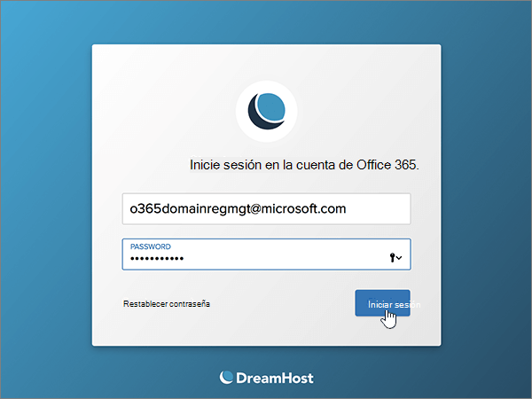
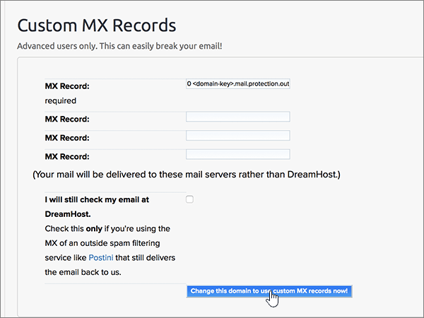
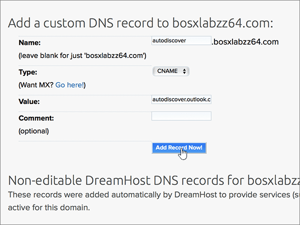

# Crear registros DNS en Dreamhost para Microsoft

 **[Consulte Preguntas más frecuentes acerca de los dominios](../setup/domains-faq.yml)** si no encuentra lo que busca. 
  
Si DreamHost es su proveedor de host DNS, siga los pasos de este artículo para comprobar su dominio y configurar los registros DNS para el correo electrónico, Lync, etc.
 
Después de agregar estos registros a DreamHost, su dominio estará configurado para funcionar con los servicios de Microsoft.
  
  
> [!NOTE]
> Por lo general, los cambios de DNS tardan unos 15 minutos en aplicarse. Sin embargo, a veces los cambios pueden necesitar más tiempo para aplicarse en todo el sistema DNS de Internet. Si tiene problemas con el flujo de correo u otros problemas después de agregar registros DNS, consulte [Solucionar problemas después de cambiar el nombre del dominio o los registros DNS](../get-help-with-domains/find-and-fix-issues.md). 
  
## Agregar un registro TXT para verificación

Antes de utilizar el dominio con Microsoft, tenemos que asegurarnos de que sea el propietario. Si puede iniciar sesión en la cuenta en el registrador de dominio y crear el registro DNS, Microsoft sabrá que es el propietario del dominio.
  
> [!NOTE]
> Este registro se usa exclusivamente para verificar si se es el propietario de un dominio; no afecta a nada más. Puede eliminarlo más adelante, si lo desea. 
  
1. Para empezar, vaya a su página de dominios en DreamHost a través de [este vínculo](https://panel.dreamhost.com/). Se le pedirá que inicie sesión.
    
    
  
2. En la página **Panel** , seleccione **dominios** y, a continuación, **administrar dominios**.
    
    
  
3. En la página **administrar dominios** , en la sección **dominio** , seleccione **DNS** para el dominio que quiera editar. 
    
    
  
4. In the **Add a custom DNS record** section, in the boxes for the new record, type or copy and paste the values from the following table. 
    
    (You may have to scroll down.)
    
    (Elija el valor **Tipo** de la lista desplegable). 
    
    |**Nombre**|**Type**|**Valor**|**Comment**|
    |:-----|:-----|:-----|:-----|
    |(Leave this field empty.)    |TXT    |MS=ms *XXXXXXXX*    **Nota:** esto es un ejemplo. Utilice aquí su valor de **Dirección de destino**, desde la tabla.           [¿Cómo puedo encontrar esto?](../get-help-with-domains/information-for-dns-records.md)          |(Este campo es opcional).    |
   
   
  
5. Seleccione **Agregar registro ahora.**
    
    
  
6. Espere unos minutos antes de continuar para que el registro que acaba de crear pueda actualizarse en Internet.
    
Ahora que ha agregado el registro en el sitio de su registrador de dominios, deberá volver a Microsoft y solicitar el registro.
  
Cuando Microsoft encuentre el registro TXT correcto, se comprobará su dominio.
  
1. En el centro de administración de Microsoft, diríjase a la página **Configuración** \> <a href="https://go.microsoft.com/fwlink/p/?linkid=834818" target="_blank">Dominios</a>.

    
2. En la página **Dominios**, elija el dominio que está verificando. 
    
    
  
3. En la página de **Configuración**, elija **Iniciar configuración**.
    
    
  
4. En la página **verificar dominio**, seleccione **verificar**.
    
    
  
> [!NOTE]
>  Por lo general, los cambios de DNS tardan unos 15 minutos en aplicarse. Sin embargo, a veces los cambios pueden necesitar más tiempo para aplicarse en todo el sistema DNS de Internet. Si tiene problemas con el flujo de correo u otros problemas después de agregar registros DNS, consulte [Solucionar problemas después de cambiar el nombre del dominio o los registros DNS](../get-help-with-domains/find-and-fix-issues.md). 
  

  
## Agregar un registro MX para que el correo electrónico del dominio vaya a Microsoft

Siga estos pasos.
  
1. Para empezar, vaya a su página de dominios en DreamHost a través de [este vínculo](https://panel.dreamhost.com/). Se le pedirá que inicie sesión.
    
    
  
2. En la página **Panel** , seleccione **correo** y, a continuación, **Custom mx**.
    
    
  
3. En la sección **administrar la entrega de correo** , en la columna **acciones** , seleccione **Editar** en el dominio que quiera editar. 
    
    
  
4. En la sección **registro MX personalizado** , en los cuadros para el nuevo registro, escriba o copie y pegue los valores siguientes de la tabla siguiente. 
    
    (Es posible que tenga que desplazarse hacia abajo).
    
    (Si hay otros registros MX, marque los registros que se van a eliminar).
    
    |**Registro MX (obligatorio)**|
    |:-----|
    |0  *\<domain-key\>*  .mail.protection.outlook.com.    **Este valor DEBE terminar en punto (.).**   El 0 es el valor de prioridad MX. Agréguelo al principio del valor MX, separado del resto del valor por un espacio.    **Nota:** Obtén tu  *\<domain-key\>*  cuenta de Microsoft.           [¿Cómo puedo encontrar esto?](../get-help-with-domains/information-for-dns-records.md)          |
   
    
  
5. Seleccione **cambiar este dominio para usar registros MX personalizados ahora.**
    
    
  
6. Si hay otros registros MX, elimine cada uno de ellos seleccionando la entrada y, después, presionando la tecla **suprimir** en el teclado. 
    
    
  
7. Si ha eliminado algún registro, seleccione **actualizar los registros MX personalizados ahora.**
    
    

  
## Agregar los seis registros CNAME necesarios para Microsoft

Siga estos pasos.
  
1. Para empezar, vaya a su página de dominios en DreamHost a través de [este vínculo](https://panel.dreamhost.com/). Se le pedirá que inicie sesión.
    
    
  
2. En la página **Panel** , seleccione **dominios** y, a continuación, **administrar dominios**.
    
    
  
3. En la página **administrar dominios** , en la sección **dominio** , seleccione **DNS** para el dominio que quiera editar. 
    
    
  
4. En la sección **Agregar un registro DNS personalizado** , en los cuadros para el nuevo registro, escriba o copie y pegue los valores de la primera fila en la tabla siguiente. 
    
    (Es posible que tenga que desplazarse hacia abajo).
    
    (Elija el valor **Tipo** de la lista desplegable). 
    
    |**Nombre**|**Type**|**Valor**|**Comment**|
    |:-----|:-----|:-----|:-----|
    |autodiscover    |CNAME    |autodiscover.outlook.com.    **Este valor DEBE terminar en punto (.)**   |(Este campo es opcional).    |
    |sip    |CNAME    |sipdir.online.lync.com.    **Este valor DEBE terminar en punto (.)**   |(Este campo es opcional).    |
    |lyncdiscover    |CNAME    |webdir.online.lync.com.    **Este valor DEBE terminar en punto (.)**   |(Este campo es opcional).    |
    |enterpriseregistration    |CNAME    |enterpriseregistration.windows.net.    **Este valor DEBE terminar en punto (.)**   |(Este campo es opcional).    |
    |enterpriseenrollment    |CNAME    |enterpriseenrollment-s.manage.microsoft.com.    **Este valor DEBE terminar en punto (.).**   |(Este campo es opcional).    |
   
    
  
5. Seleccione **Agregar registro ahora.**
    
    
  
6. Con los dos pasos anteriores y los valores de las otras cinco filas de la tabla, agregue cada uno de los otros cinco registros CNAME.

  
## Agregar un registro TXT para SPF para ayudar a evitar el correo no deseado

> [!IMPORTANT]
> No puede tener más de un registro TXT para el SPF de un dominio. Si su dominio tiene más de un registro de SPF, obtendrá errores de correo, así como problemas de clasificación de entrega y de correo no deseado. Si ya tiene un registro de SPF para su dominio, no cree uno nuevo para Microsoft. En su lugar, agregue los valores necesarios de Microsoft al registro activo para que tenga un  *único*  registro de SPF que incluya ambos conjuntos de valores.
  
Siga estos pasos.
  
1. Para empezar, vaya a su página de dominios en DreamHost a través de [este vínculo](https://panel.dreamhost.com/). Se le pedirá que inicie sesión.
    
    
  
2. En la página **Panel** , seleccione **dominios** y, a continuación, **administrar dominios**.
    
    
  
3. En la página **administrar dominios** , en la sección **dominio** , seleccione **DNS** para el dominio que quiera editar. 
    
    
  
4. En la sección **Agregar un registro DNS personalizado** , en los cuadros para el nuevo registro, escriba o copie y pegue los valores de la primera fila en la tabla siguiente. 
    
    (Es posible que tenga que desplazarse hacia abajo).
    
    (Elija el valor **Tipo** de la lista desplegable). 
    
    |**Nombre**|**Type**|**Valor**|**Comment**|
    |:-----|:-----|:-----|:-----|
    |(Leave this field empty.)    |TXT    |v=spf1 include:spf.protection.outlook.com -all    **Nota:** recomendamos copiar y pegar esta entrada, para que todo el espacio sea correcto.           |(Este campo es opcional).    |
   
   
  
5. Seleccione **Agregar registro ahora.**
    
    
  
6. Con los dos pasos anteriores y los valores de la segunda fila de la tabla, agregue el otro registro SRV.
    
  
## Agregar los dos registros SRV necesarios para Microsoft

Siga estos pasos.
  
1. Para empezar, vaya a su página de dominios en DreamHost a través de [este vínculo](https://panel.dreamhost.com/). Se le pedirá que inicie sesión.
    
    
  
2. En la página **Panel** , seleccione **dominios** y, a continuación, **administrar dominios**.
    
    
  
3. En la página **administrar dominios** , en la sección **dominio** , seleccione **DNS** para el dominio que quiera editar. 
    
    
  
4. En la sección **Agregar un registro DNS personalizado** , en los cuadros para el nuevo registro, escriba o copie y pegue los valores de la primera fila en la tabla siguiente. 
    
    (Es posible que tenga que desplazarse hacia abajo).
    
    (Elija el valor **Tipo** de la lista desplegable). 
    
    |**Nombre**|**Type**|**Valor**|**Comment**|
    |:-----|:-----|:-----|:-----|
    |_sip._tls    |SRV    |100 1 443    sipdir.online.lync.com.    **Este valor DEBE terminar en punto (.)**   |(Este campo es opcional).    |
    |_sipfederationtls._tcp    |SRV    |100 1 5061    sipfed.online.lync.com.    **Este valor DEBE terminar en punto (.).**   |(Este campo es opcional).    |
   
    
  
5. Seleccione **Agregar registro ahora**.
    
    
  
6. Con los dos pasos anteriores y los valores de la segunda fila de la tabla, agregue el otro registro SRV.
    
> [!NOTE]
>  Por lo general, los cambios de DNS tardan unos 15 minutos en aplicarse. Sin embargo, a veces los cambios pueden necesitar más tiempo para aplicarse en todo el sistema DNS de Internet. Si tiene problemas con el flujo de correo u otros problemas después de agregar registros DNS, consulte [Solucionar problemas después de cambiar el nombre del dominio o los registros DNS](../get-help-with-domains/find-and-fix-issues.md). 

  
