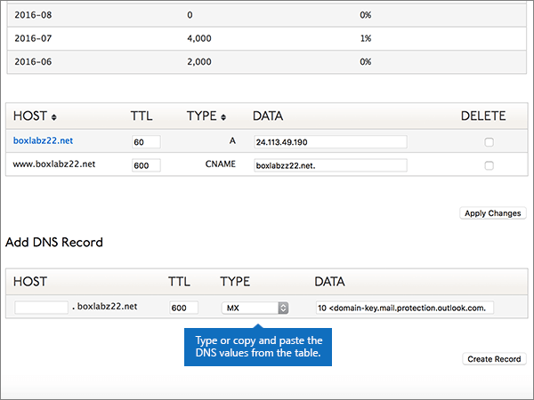
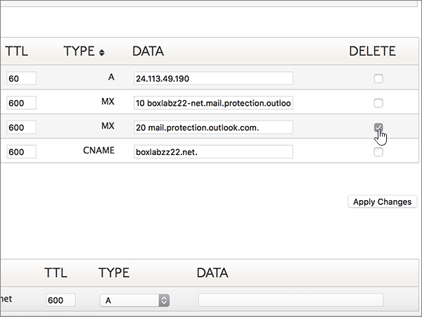

# Crear registros DNS en Dyn.com para Microsoft

 **[Consulte Preguntas más frecuentes acerca de los dominios](../setup/domains-faq.md)** si no encuentra lo que busca. 
  
Si Dyn.com es su proveedor de host DNS, siga los pasos de este artículo para comprobar el dominio y configurar los registros DNS para el correo electrónico, Skype Empresarial Online, etc.
 
Para obtener más información sobre WebHosting y DNS para sitios web con Microsoft, vea [usar un sitio web público con Microsoft](https://support.office.com/article/choose-a-public-website-3325d50e-d131-403c-a278-7f3296fe33a9).
  
> [!NOTE]
>  Por lo general, los cambios de DNS tardan unos 15 minutos en aplicarse. Sin embargo, a veces los cambios pueden necesitar más tiempo para aplicarse en todo el sistema DNS de Internet. Si tiene problemas con el flujo de correo u otros problemas después de agregar registros DNS, consulte [Solucionar problemas después de cambiar el nombre del dominio o los registros DNS](../get-help-with-domains/find-and-fix-issues.md). 
  
## Agregar un registro TXT para verificación

1. Para empezar, vaya a su página de dominios en Dyn.com a través de [este vínculo](https://account.dyn.com/dns/). Se le pedirá que inicie sesión primero.
    
    
  
2. En la página **servicios de nivel de zona** , seleccione **servicio DNS estándar de Dyn** para el dominio que quiera editar. 
    
3. En la página **DNS** de su dominio, seleccione **preferencias**.
    
4. Seleccione **Habilitar interfaz de experto**.
    
5. In the **Add DNS Record** section, in the boxes for the new record, type or copy and paste the values from the following table. 
    
    (Choose the **Type** value from the drop-down list.) 
    
    |**Host**|**TTL**|**Tipo**|**Datos**|
    |:-----|:-----|:-----|:-----|
    |(Leave this field empty.)    |600    |TXT    |MS=ms *XXXXXXXX*    **Nota:** esto es un ejemplo. Use aquí su **destino específico o** el valor de dirección de destino de la tabla.           [¿Cómo puedo encontrar esto?](../get-help-with-domains/information-for-dns-records.md)          |
       
   
  
6. Seleccione **crear registro**.
    
    
  
7. Espere unos minutos antes de continuar para que el registro que acaba de crear pueda actualizarse en Internet.
    
Ahora que ha agregado el registro en el sitio del registrador de dominios, volverá a Microsoft y solicitará el registro.
  
Cuando Microsoft encuentre el registro TXT correcto, se comprobará el dominio.
  
1. En el centro de administración de Microsoft, vaya a la página de **configuración** \> de <a href="https://go.microsoft.com/fwlink/p/?linkid=834818" target="_blank">dominios</a> .

    
2. En la página **Dominios**, elija el dominio que está verificando. 
    
    
  
3. En la página de **Configuración**, elija ** Iniciar configuración**.
    
    
  
4. En la página**verificar dominio**, seleccione **verificar**.
    
    
  
> [!NOTE]
>  Por lo general, los cambios de DNS tardan unos 15 minutos en aplicarse. Sin embargo, a veces los cambios pueden necesitar más tiempo para aplicarse en todo el sistema DNS de Internet. Si tiene problemas con el flujo de correo u otros problemas después de agregar registros DNS, consulte [Solucionar problemas después de cambiar el nombre del dominio o los registros DNS](../get-help-with-domains/find-and-fix-issues.md). 
  
## Agregar un registro MX para que el correo electrónico del dominio llegue a Microsoft

1. Para empezar, vaya a su página de dominios en Dyn.com a través de [este vínculo](https://account.dyn.com/dns/). Se le pedirá que inicie sesión primero.
    
    
  
2. En la página **servicios de nivel de zona** , seleccione **servicio DNS estándar de Dyn** para el dominio que quiera editar. 
    
3. En la página DNS de su dominio, seleccione **preferencias**.
    
4. Seleccione **Habilitar interfaz de experto**.
    
5. In the **Add DNS Record** section, in the boxes for the new record, type or copy and paste the values from the following table. 
    
    (Choose the **Type** value from the drop-down list.) 
    
    |**Host**|**TTL**|**Tipo**|**Datos**|
    |:-----|:-----|:-----|:-----|
    |(Leave this field empty.)    |600    |MX    |10  *\<clave-de-dominio\>*  .mail.protection.outlook.com.    **Este valor DEBE terminar en punto (.).**   El valor de **10** se corresponde con la prioridad MX. Agréguelo al principio del valor MX, separado del resto del valor por un espacio.    **Nota:** Obtén tu * \<clave\> de dominio* de tu cuenta de Microsoft.           [¿Cómo puedo encontrarla?](../get-help-with-domains/information-for-dns-records.md)           Para obtener más información sobre la prioridad, consulte [¿Qué es una prioridad de MX?](https://support.office.com/article/2784cc4d-95be-443d-b5f7-bb5dd867ba83.aspx)   |
   
    
  
6. Seleccione **crear registro**.
    
    
  
7. Si hay otros registros MX, quítelos (para hacerlo, seleccione la casilla junto a cada registro en la columna **Eliminar**). 
    
    
  
8. Seleccione **aplicar cambios**.
    
    
  
## Agregar los seis registros CNAME necesarios para Microsoft

1. Para empezar, vaya a su página de dominios en Dyn.com a través de [este vínculo](https://account.dyn.com/dns/). Se le pedirá que inicie sesión primero.
    
    
  
2. En la página **servicios de nivel de zona** , seleccione **servicio DNS estándar de Dyn** para el dominio que quiera editar. 
    
3. En la página **DNS** de su dominio, seleccione **preferencias**.
    
4. Seleccione **Habilitar interfaz de experto**.
    
5. Agregue el primero de los seis registros CNAME.
    
    En la sección **Agregar registro DNS**, en los cuadros del nuevo registro, escriba (o copie y pegue) los valores de la primera fila de la tabla siguiente. 
    
    (Elija el valor **Tipo** de la lista desplegable). 
    
    |**Host**|**TTL**|**Tipo**|**Datos**|
    |:-----|:-----|:-----|:-----|
    |autodiscover    |600    |CNAME    |autodiscover.outlook.com.    **This value MUST end with a period (.)**   |
    |sip    |600    |CNAME    |sipdir.online.lync.com.    **This value MUST end with a period (.)**   |
    |lyncdiscover    |600    |CNAME    |webdir.online.lync.com.    **This value MUST end with a period (.)**   |
    |enterpriseregistration    |600    |CNAME    |enterpriseregistration.windows.net.    **This value MUST end with a period (.)**   |
    |enterpriseenrollment    |600    |CNAME    |enterpriseenrollment-s.manage.microsoft.com.    **Este valor DEBE terminar en punto (.).**   |
   
    
  
6. Seleccione **crear registro**.
    
    
  
7. Agregue los otros cinco registros CNAME.
    
    En la sección **Agregar registro DNS** , cree un registro (para hacerlo, use los valores de la siguiente fila de la tabla y, después, vuelva a seleccionar **crear registro** para completar ese registro). 
    
    Repita este proceso hasta crear los seis registros CNAME.
    
## Agregar un registro TXT para SPF para ayudar a prevenir el spam de correo electrónico

> [!IMPORTANT]
> No puede tener más de un registro TXT para el SPF de un dominio. Si su dominio tiene más de un registro de SPF, obtendrá errores de correo, así como problemas de clasificación de entrega y de correo no deseado. Si ya tiene un registro de SPF para su dominio, no cree uno nuevo para Microsoft. En su lugar, agregue los valores necesarios de Microsoft al registro activo para que tenga un *único* registro de SPF que incluya ambos conjuntos de valores.
  
1. Para empezar, vaya a su página de dominios en Dyn.com a través de [este vínculo](https://account.dyn.com/dns/). Se le pedirá que inicie sesión primero.
    
    
  
2. En la página **servicios de nivel de zona** , seleccione **servicio DNS estándar de Dyn** para el dominio que quiera editar. 
    
3. En la página **DNS** de su dominio, seleccione **preferencias**.
    
4. Seleccione **Habilitar interfaz de experto**.
    
5. In the **Add DNS Record** section, in the boxes for the new record, type or copy and paste the values from the following table. 
    
    (Choose the **Type** value from the drop-down list.) 
    
    |**Host**|**TTL**|**Tipo**|**Datos**|
    |:-----|:-----|:-----|:-----|
    |(Leave this field empty.)    |600    |TXT    |v=spf1 include:spf.protection.outlook.com -all    **Nota:** recomendamos copiar y pegar esta entrada, para que todo el espacio sea correcto.           |
   
    
  
6. Seleccione **crear registro**.
    
    
  
## Agregar los dos registros SRV necesarios para Microsoft

1. Para empezar, vaya a su página de dominios en Dyn.com a través de [este vínculo](https://account.dyn.com/dns/). Se le pedirá que inicie sesión primero 
    
    
  
2. En la página **servicios de nivel de zona** , seleccione **servicio DNS estándar de Dyn** para el dominio que quiera editar. 
    
3. En la página **DNS** de su dominio, seleccione **preferencias**.
    
4. Seleccione **Habilitar interfaz de experto**.
    
5. Agregue el primero de los dos registros SRV.
    
    En la sección **Agregar registro DNS**, en los cuadros del nuevo registro, escriba (o copie y pegue) los valores de la primera fila de la tabla siguiente. 
    
    (Elija el valor **Tipo** de la lista desplegable). 
    
    |**Host**|**TTL**|**Tipo**|**Datos**|
    |:-----|:-----|:-----|:-----|
    |_sip. _tls|600|SRV|100 1 443 sipdir.online.lync.com. **This value MUST end with a period (.)** **Nota:** recomendamos copiar y pegar esta entrada, para que todo el espacio sea correcto.           |
    |_sipfederationtls. _tcp|600|SRV|100 1 5061 sipfed.online.lync.com. **This value MUST end with a period (.)**  **Nota:** recomendamos copiar y pegar esta entrada, para que todo el espacio sea correcto.           |
   
    
  
6. Seleccione **crear registro**.
    
    
  
7. Agregue el otro registro SRV.
    
    En la sección **Agregar registro DNS** , cree un registro (para hacerlo, use los valores de la segunda fila de la tabla y, después, vuelva a seleccionar **crear registro** para completar ese registro). 
    
> [!NOTE]
>  Por lo general, los cambios de DNS tardan unos 15 minutos en aplicarse. Sin embargo, a veces los cambios pueden necesitar más tiempo para aplicarse en todo el sistema DNS de Internet. Si tiene problemas con el flujo de correo u otros problemas después de agregar registros DNS, consulte [Solucionar problemas después de cambiar el nombre del dominio o los registros DNS](../get-help-with-domains/find-and-fix-issues.md). 
  
