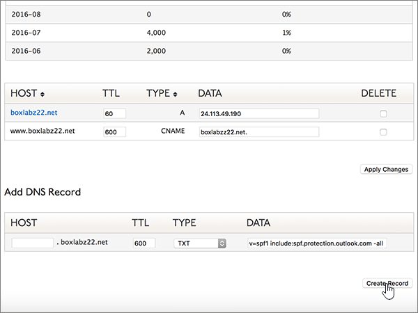

# Crear registros DNS en Dyn.com para MicrosoftCreate DNS records at Dyn.com for Microsoft

 **[Consulte Preguntas más frecuentes acerca de los dominios](../setup/domains-faq.md)** si no encuentra lo que busca.**[Check the Domains FAQ](../setup/domains-faq.md)** if you don't find what you're looking for. 
  
Si Dyn.com es su proveedor de host DNS, siga los pasos de este artículo para comprobar el dominio y configurar los registros DNS para el correo electrónico, Skype Empresarial Online, etc.If Dyn.com is your DNS hosting provider, follow the steps in this article to verify your domain and set up DNS records for email, Skype for Business Online, and so on.
 
Para obtener más información sobre WebHosting y DNS para sitios web con Microsoft, vea [usar un sitio web público con Microsoft](https://support.office.com/article/choose-a-public-website-3325d50e-d131-403c-a278-7f3296fe33a9).To learn about webhosting and DNS for websites with Microsoft, see [Use a public website with Microsoft](https://support.office.com/article/choose-a-public-website-3325d50e-d131-403c-a278-7f3296fe33a9).
  
> [!NOTE]
>  Por lo general, los cambios de DNS tardan unos 15 minutos en aplicarse. Sin embargo, a veces los cambios pueden necesitar más tiempo para aplicarse en todo el sistema DNS de Internet. Si tiene problemas con el flujo de correo u otros problemas después de agregar registros DNS, consulte [Solucionar problemas después de cambiar el nombre del dominio o los registros DNS](../get-help-with-domains/find-and-fix-issues.md).Typically it takes about 15 minutes for DNS changes to take effect. However, it can occasionally take longer for a change you've made to update across the Internet's DNS system. If you're having trouble with mail flow or other issues after adding DNS records, see [Troubleshoot issues after changing your domain name or DNS records](../get-help-with-domains/find-and-fix-issues.md). 
  
## Agregar un registro TXT para verificaciónAdd a TXT record for verification

1. Para empezar, vaya a su página de dominios en Dyn.com a través de [este vínculo](https://account.dyn.com/dns/). Se le pedirá que inicie sesión primero.To get started, go to your domains page at Dyn.com by using [this link](https://account.dyn.com/dns/). You'll be prompted to login first.
    
    
  
2. En la página **servicios de nivel de zona** , seleccione **servicio DNS estándar de Dyn** para el dominio que quiera editar.On the **Zone Level Services** page, select **Dyn Standard DNS Service** for the domain that you want to edit. 
    
3. En la página **DNS** de su dominio, seleccione **preferencias**.On the **DNS** page for your domain, select **Preferences**.
    
4. Seleccione **Habilitar interfaz de experto**.Select **Enable Expert Interface**.
    
5. In the **Add DNS Record** section, in the boxes for the new record, type or copy and paste the values from the following table.In the **Add DNS Record** section, in the boxes for the new record, type or copy and paste the values from the following table. 
    
    (Choose the **Type** value from the drop-down list.)(Choose the **Type** value from the drop-down list.) 
    
    |**Host****Host**|**TTL****TTL**|**Tipo****Type**|**Datos****Data**|
    |:-----|:-----|:-----|:-----|
    |(Leave this field empty.)(Leave this field empty.)    |600600    |TXTTXT    |MS=ms *XXXXXXXX*MS=ms *XXXXXXXX*    **Nota:** esto es un ejemplo.**Note:** This is an example. Use aquí su **destino específico o** el valor de dirección de destino de la tabla.Use your specific **Destination or Points to Address** value here, from the table.           [¿Cómo puedo encontrar esto?How do I find this?](../get-help-with-domains/information-for-dns-records.md)          |
       
   
  
6. Seleccione **crear registro**.Select **Create Record**.
    
    
  
7. Espere unos minutos antes de continuar para que el registro que acaba de crear pueda actualizarse en Internet.Wait a few minutes before you continue, so that the record you just created can update across the Internet.
    
Ahora que ha agregado el registro en el sitio del registrador de dominios, volverá a Microsoft y solicitará el registro.Now that you've added the record at your domain registrar's site, you'll go back to Microsoft and request the record.
  
Cuando Microsoft encuentre el registro TXT correcto, se comprobará el dominio.When Microsoft finds the correct TXT record, your domain is verified.
  
1. En el centro de administración de Microsoft, vaya a la página de **configuración** \> de <a href="https://go.microsoft.com/fwlink/p/?linkid=834818" target="_blank">dominios</a> .In the Microsoft admin center, go to the **Settings** \> <a href="https://go.microsoft.com/fwlink/p/?linkid=834818" target="_blank">Domains</a> page.

    
2. En la página **Dominios**, elija el dominio que está verificando.On the **Domains** page, select the domain that you are verifying. 
    
    
  
3. En la página de **Configuración**, elija \*\* Iniciar configuración\*\*.On the **Setup** page, select **Start setup**.
    
    
  
4. En la página**verificar dominio**, seleccione **verificar**.On the **Verify domain** page, select **Verify**.
    
    
  
> [!NOTE]
>  Por lo general, los cambios de DNS tardan unos 15 minutos en aplicarse. Sin embargo, a veces los cambios pueden necesitar más tiempo para aplicarse en todo el sistema DNS de Internet. Si tiene problemas con el flujo de correo u otros problemas después de agregar registros DNS, consulte [Solucionar problemas después de cambiar el nombre del dominio o los registros DNS](../get-help-with-domains/find-and-fix-issues.md).Typically it takes about 15 minutes for DNS changes to take effect. However, it can occasionally take longer for a change you've made to update across the Internet's DNS system. If you're having trouble with mail flow or other issues after adding DNS records, see [Troubleshoot issues after changing your domain name or DNS records](../get-help-with-domains/find-and-fix-issues.md). 
  
## Agregar un registro MX para que el correo electrónico del dominio llegue a MicrosoftAdd an MX record so email for your domain will come to Microsoft

1. Para empezar, vaya a su página de dominios en Dyn.com a través de [este vínculo](https://account.dyn.com/dns/). Se le pedirá que inicie sesión primero.To get started, go to your domains page at Dyn.com by using [this link](https://account.dyn.com/dns/). You'll be prompted to login first.
    
    
  
2. En la página **servicios de nivel de zona** , seleccione **servicio DNS estándar de Dyn** para el dominio que quiera editar.On the **Zone Level Services** page, select **Dyn Standard DNS Service** for the domain that you want to edit. 
    
3. En la página DNS de su dominio, seleccione **preferencias**.On the DNS page for your domain, select **Preferences**.
    
4. Seleccione **Habilitar interfaz de experto**.Select **Enable Expert Interface**.
    
5. In the **Add DNS Record** section, in the boxes for the new record, type or copy and paste the values from the following table.In the **Add DNS Record** section, in the boxes for the new record, type or copy and paste the values from the following table. 
    
    (Choose the **Type** value from the drop-down list.)(Choose the **Type** value from the drop-down list.) 
    
    |**Host****Host**|**TTL****TTL**|**Tipo****Type**|**Datos****Data**|
    |:-----|:-----|:-----|:-----|
    |(Leave this field empty.)(Leave this field empty.)    |600600    |MXMX    |10  *\<clave-de-dominio\>*  .mail.protection.outlook.com.10  *\<domain-key\>*  .mail.protection.outlook.com.    **Este valor DEBE terminar en punto (.).****This value MUST end with a period (.)**   El valor de **10** se corresponde con la prioridad MX. Agréguelo al principio del valor MX, separado del resto del valor por un espacio.  The **10** is the MX priority value. Add it to the beginning of the MX value, separated from the remainder of the value by a space.    **Nota:** Obtén tu \* \<clave\> de dominio\* de tu cuenta de Microsoft.**Note:** Get your  *\<domain-key\>*  from your Microsoft account.           [¿Cómo puedo encontrarla?How do I find this?](../get-help-with-domains/information-for-dns-records.md)           Para obtener más información sobre la prioridad, consulte [¿Qué es una prioridad de MX?](https://support.office.com/article/2784cc4d-95be-443d-b5f7-bb5dd867ba83.aspx)For more information about priority, see [What is MX priority?](https://support.office.com/article/2784cc4d-95be-443d-b5f7-bb5dd867ba83.aspx)   |
   
    
  
6. Seleccione **crear registro**.Select **Create Record**.
    
    
  
7. Si hay otros registros MX, quítelos (para hacerlo, seleccione la casilla junto a cada registro en la columna **Eliminar**).If there are any other MX records, remove them by selecting the check box for each one in the **Delete** column. 
    
    
  
8. Seleccione **aplicar cambios**.Select **Apply Changes**.
    
    
  
## Agregar los seis registros CNAME necesarios para MicrosoftAdd the six CNAME records that are required for Microsoft

1. Para empezar, vaya a su página de dominios en Dyn.com a través de [este vínculo](https://account.dyn.com/dns/). Se le pedirá que inicie sesión primero.To get started, go to your domains page at Dyn.com by using [this link](https://account.dyn.com/dns/). You'll be prompted to login first.
    
    
  
2. En la página **servicios de nivel de zona** , seleccione **servicio DNS estándar de Dyn** para el dominio que quiera editar.On the **Zone Level Services** page, select **Dyn Standard DNS Service** for the domain that you want to edit. 
    
3. En la página **DNS** de su dominio, seleccione **preferencias**.On the **DNS** page for your domain, select **Preferences**.
    
4. Seleccione **Habilitar interfaz de experto**.Select **Enable Expert Interface**.
    
5. Agregue el primero de los seis registros CNAME.Add the first of the six CNAME records.
    
    En la sección **Agregar registro DNS**, en los cuadros del nuevo registro, escriba (o copie y pegue) los valores de la primera fila de la tabla siguiente.In the **Add DNS Record** section, in the boxes for the new record, type or copy and paste the values from the first row of the following table. 
    
    (Elija el valor **Tipo** de la lista desplegable).(Choose the **Type** value from the drop-down list.) 
    
    |**Host****Host**|**TTL****TTL**|**Tipo****Type**|**Datos****Data**|
    |:-----|:-----|:-----|:-----|
    |autodiscoverautodiscover    |600600    |CNAMECNAME    |autodiscover.outlook.com.autodiscover.outlook.com.    **This value MUST end with a period (.)****This value MUST end with a period (.)**   |
    |sipsip    |600600    |CNAMECNAME    |sipdir.online.lync.com.sipdir.online.lync.com.    **This value MUST end with a period (.)****This value MUST end with a period (.)**   |
    |lyncdiscoverlyncdiscover    |600600    |CNAMECNAME    |webdir.online.lync.com.webdir.online.lync.com.    **This value MUST end with a period (.)****This value MUST end with a period (.)**   |
    |enterpriseregistrationenterpriseregistration    |600600    |CNAMECNAME    |enterpriseregistration.windows.net.enterpriseregistration.windows.net.    **This value MUST end with a period (.)****This value MUST end with a period (.)**   |
    |enterpriseenrollmententerpriseenrollment    |600600    |CNAMECNAME    |enterpriseenrollment-s.manage.microsoft.com.enterpriseenrollment-s.manage.microsoft.com.    **Este valor DEBE terminar en punto (.).****This value MUST end with a period (.)**   |
   
    
  
6. Seleccione **crear registro**.Select **Create Record**.
    
    
  
7. Agregue los otros cinco registros CNAME.Add the remaining five CNAME records.
    
    En la sección **Agregar registro DNS** , cree un registro (para hacerlo, use los valores de la siguiente fila de la tabla y, después, vuelva a seleccionar **crear registro** para completar ese registro).In the **Add DNS Record** section, create a record by using the values from the next row in the table, and then again select **Create Record** to complete that record. 
    
    Repita este proceso hasta crear los seis registros CNAME.Repeat this process until you have created all six CNAME records.
    
## Agregar un registro TXT para SPF para ayudar a prevenir el spam de correo electrónicoAdd a TXT record for SPF to help prevent email spam

> [!IMPORTANT]
> No puede tener más de un registro TXT para el SPF de un dominio.You cannot have more than one TXT record for SPF for a domain. Si su dominio tiene más de un registro de SPF, obtendrá errores de correo, así como problemas de clasificación de entrega y de correo no deseado.If your domain has more than one SPF record, you'll get email errors, as well as delivery and spam classification issues. Si ya tiene un registro de SPF para su dominio, no cree uno nuevo para Microsoft.If you already have an SPF record for your domain, don't create a new one for Microsoft. En su lugar, agregue los valores necesarios de Microsoft al registro activo para que tenga un *único* registro de SPF que incluya ambos conjuntos de valores.Instead, add the required Microsoft values to the current record so that you have a  *single*  SPF record that includes both sets of values.
  
1. Para empezar, vaya a su página de dominios en Dyn.com a través de [este vínculo](https://account.dyn.com/dns/). Se le pedirá que inicie sesión primero.To get started, go to your domains page at Dyn.com by using [this link](https://account.dyn.com/dns/). You'll be prompted to login first.
    
    
  
2. En la página **servicios de nivel de zona** , seleccione **servicio DNS estándar de Dyn** para el dominio que quiera editar.On the **Zone Level Services** page, select **Dyn Standard DNS Service** for the domain that you want to edit. 
    
3. En la página **DNS** de su dominio, seleccione **preferencias**.On the **DNS** page for your domain, select **Preferences**.
    
4. Seleccione **Habilitar interfaz de experto**.Select **Enable Expert Interface**.
    
5. In the **Add DNS Record** section, in the boxes for the new record, type or copy and paste the values from the following table.In the **Add DNS Record** section, in the boxes for the new record, type or copy and paste the values from the following table. 
    
    (Choose the **Type** value from the drop-down list.)(Choose the **Type** value from the drop-down list.) 
    
    |**Host****Host**|**TTL****TTL**|**Tipo****Type**|**Datos****Data**|
    |:-----|:-----|:-----|:-----|
    |(Leave this field empty.)(Leave this field empty.)    |600600    |TXTTXT    |v=spf1 include:spf.protection.outlook.com -allv=spf1 include:spf.protection.outlook.com -all    **Nota:** recomendamos copiar y pegar esta entrada, para que todo el espacio sea correcto.**Note:** We recommend copying and pasting this entry, so that all of the spacing stays correct.           |
   
    
  
6. Seleccione **crear registro**.Select **Create Record**.
    
    
  
## Agregar los dos registros SRV necesarios para MicrosoftAdd the two SRV records that are required for Microsoft

1. Para empezar, vaya a su página de dominios en Dyn.com a través de [este vínculo](https://account.dyn.com/dns/).To get started, go to your domains page at Dyn.com by using [this link](https://account.dyn.com/dns/). Se le pedirá que inicie sesión primeroYou'll be prompted to login first 
    
    
  
2. En la página **servicios de nivel de zona** , seleccione **servicio DNS estándar de Dyn** para el dominio que quiera editar.On the **Zone Level Services** page, select **Dyn Standard DNS Service** for the domain that you want to edit. 
    
3. En la página **DNS** de su dominio, seleccione **preferencias**.On the **DNS** page for your domain, select **Preferences**.
    
4. Seleccione **Habilitar interfaz de experto**.Select **Enable Expert Interface**.
    
5. Agregue el primero de los dos registros SRV.Add the first of the two SRV records.
    
    En la sección **Agregar registro DNS**, en los cuadros del nuevo registro, escriba (o copie y pegue) los valores de la primera fila de la tabla siguiente.In the **Add DNS Record** section, in the boxes for the new record, type or copy and paste the values from the first row of the following table. 
    
    (Elija el valor **Tipo** de la lista desplegable).(Choose the **Type** value from the drop-down list.) 
    
    |**Host****Host**|**TTL****TTL**|**Tipo****Type**|**Datos****Data**|
    |:-----|:-----|:-----|:-----|
    |_sip. _tls_sip._tls|600600|SRVSRV|100 1 443 sipdir.online.lync.com.100 1 443 sipdir.online.lync.com. **This value MUST end with a period (.)****This value MUST end with a period (.)** **Nota:** recomendamos copiar y pegar esta entrada, para que todo el espacio sea correcto.**Note:** We recommend copying and pasting this entry, so that all of the spacing stays correct.           |
    |_sipfederationtls. _tcp_sipfederationtls._tcp|600600|SRVSRV|100 1 5061 sipfed.online.lync.com.100 1 5061 sipfed.online.lync.com. **This value MUST end with a period (.)****This value MUST end with a period (.)**  **Nota:** recomendamos copiar y pegar esta entrada, para que todo el espacio sea correcto.**Note:** We recommend copying and pasting this entry, so that all of the spacing stays correct.           |
   
    
  
6. Seleccione **crear registro**.Select **Create Record**.
    
    
  
7. Agregue el otro registro SRV.Add the other SRV record.
    
    En la sección **Agregar registro DNS** , cree un registro (para hacerlo, use los valores de la segunda fila de la tabla y, después, vuelva a seleccionar **crear registro** para completar ese registro).In the **Add DNS Record** section, create a record by using the values from the second row in the table, and then again select **Create Record** to complete that record. 
    
> [!NOTE]
>  Por lo general, los cambios de DNS tardan unos 15 minutos en aplicarse. Sin embargo, a veces los cambios pueden necesitar más tiempo para aplicarse en todo el sistema DNS de Internet. Si tiene problemas con el flujo de correo u otros problemas después de agregar registros DNS, consulte [Solucionar problemas después de cambiar el nombre del dominio o los registros DNS](../get-help-with-domains/find-and-fix-issues.md).Typically it takes about 15 minutes for DNS changes to take effect. However, it can occasionally take longer for a change you've made to update across the Internet's DNS system. If you're having trouble with mail flow or other issues after adding DNS records, see [Troubleshoot issues after changing your domain name or DNS records](../get-help-with-domains/find-and-fix-issues.md). 
  
