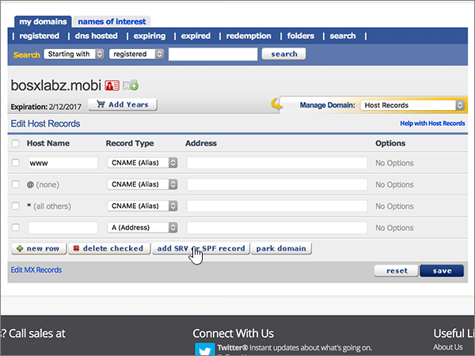

# Crear registros DNS en eNomCentral para Office 365Create DNS records at eNomCentral for Office 365

 **[Consulte Preguntas más frecuentes acerca de los dominios](../setup/domains-faq.md)** si no encuentra lo que busca.**[Check the Domains FAQ](../setup/domains-faq.md)** if you don't find what you're looking for. 
  
Si eNomCentral es su proveedor de host DNS, siga los pasos de este artículo para comprobar el dominio y configurar los registros DNS para el correo electrónico, Skype Empresarial Online, etc.If eNomCentral is your DNS hosting provider, follow the steps in this article to verify your domain and set up DNS records for email, Skype for Business Online, and so on.
  
Después de agregar estos registros a eNomCentral, el dominio estará configurado para funcionar con los servicios de Office 365.After you add these records at eNomCentral, your domain will be set up to work with Office 365 services.
  
Para obtener información acerca del hospedaje web y de DNS para sitios web con Office 365, consulte [Usar un sitio web público con Office 365](https://support.office.com/article/choose-a-public-website-3325d50e-d131-403c-a278-7f3296fe33a9).To learn about webhosting and DNS for websites with Office 365, see [Use a public website with Office 365](https://support.office.com/article/choose-a-public-website-3325d50e-d131-403c-a278-7f3296fe33a9).
  
> [!NOTE]
>  Por lo general, los cambios de DNS tardan unos 15 minutos en aplicarse. Sin embargo, a veces los cambios pueden necesitar más tiempo para aplicarse en todo el sistema DNS de Internet. Si tiene problemas con el flujo de correo u otros problemas después de agregar registros DNS, consulte [Solucionar problemas después de cambiar el nombre del dominio o los registros DNS](../get-help-with-domains/find-and-fix-issues.md).Typically it takes about 15 minutes for DNS changes to take effect. However, it can occasionally take longer for a change you've made to update across the Internet's DNS system. If you're having trouble with mail flow or other issues after adding DNS records, see [Troubleshoot issues after changing your domain name or DNS records](../get-help-with-domains/find-and-fix-issues.md). 
  
## Agregar un registro TXT para verificaciónAdd a TXT record for verification

Para que pueda usar el dominio con Office 365, tenemos que asegurarnos de que es de su propiedad. Si puede iniciar sesión en la cuenta en su registrador de dominios y crear el registro DNS, Office 365 sabrá que es el propietario del dominio.Before you use your domain with Office 365, we have to make sure that you own it. Your ability to log in to your account at your domain registrar and create the DNS record proves to Office 365 that you own the domain.
  
> [!NOTE]
> Este registro se usa exclusivamente para verificar si se es el propietario de un dominio; no afecta a nada más. Puede eliminarlo más adelante, si lo desea.This record is used only to verify that you own your domain; it doesn't affect anything else. You can delete it later, if you like. 
  
Siga los pasos siguientes o [vea el vídeo (empieza en 0:46)](https://support.office.com/article/Video-Create-DNS-records-at-eNomCentral-for-Office-365-3766a9e8-77dd-4a42-908d-89b076143e7d?ui=en-US&amp;rs=en-US&amp;ad=US).Follow the steps below or [watch the video (start at 0:46)](https://support.office.com/article/Video-Create-DNS-records-at-eNomCentral-for-Office-365-3766a9e8-77dd-4a42-908d-89b076143e7d?ui=en-US&amp;rs=en-US&amp;ad=US).
  
1. Para empezar, vaya a su página de dominios en eNom Central a través de [este vínculo](https://www.enomcentral.com/domains/Domain-Manager.aspx?tab=registered). Se le pedirá que primero inicie sesión.To get started, go to your domains page at eNom Central by using [this link](https://www.enomcentral.com/domains/Domain-Manager.aspx?tab=registered). You'll be prompted to login.
    
    
  
2. En **mis dominios**, seleccione el nombre del dominio que desea editar.Under **my domains**, select the name of the domain that you want to edit.
    
    
  
3. En la lista desplegable **Administrar dominio**, elija **Registros de host**.On the **Manage Domain** drop-down list, choose **Host Records**.
    
    
  
4. En los cuadros para el nuevo registro, escriba o copie y pegue los valores de la tabla siguiente.In the boxes for the new record, type or copy and paste the values from the following table.
    
    (Choose the **Record Type** value from the drop-down list.)(Choose the **Record Type** value from the drop-down list.) 
    
    ||||
    |:-----|:-----|:-----|
    |**Host Name****Host Name**   |**Record Type****Record Type**   |**Address****Address**   |
    |@    |TXTTXT    |MS=ms *XXXXXXXX*MS=ms *XXXXXXXX*    **Nota:** Este es un ejemplo.**Note:** This is an example. Utilice aquí su valor de **Dirección o puntos de destino**, de la tabla de Office 365.Use your specific **Destination or Points to Address** value here, from the table in Office 365.           [¿Cómo puedo encontrarlo?How do I find this?](../get-help-with-domains/information-for-dns-records.md)          |
       
   
  
5. Seleccione **Guardar**.Select **save**.
    
    
  
6. Espere unos minutos antes de continuar para que el registro que acaba de crear pueda actualizarse en Internet.Wait a few minutes before you continue, so that the record you just created can update across the Internet.
    
Now that you've added the record at your domain registrar's site, you'll go back to Office 365 and request Office 365 to look for the record.Now that you've added the record at your domain registrar's site, you'll go back to Office 365 and request Office 365 to look for the record.
  
When Office 365 finds the correct TXT record, your domain is verified.When Office 365 finds the correct TXT record, your domain is verified.
  
1. En el centro de administración, vaya a la página **configuración** \> de <a href="https://go.microsoft.com/fwlink/p/?linkid=834818" target="_blank">dominios</a> .In the admin center, go to the **Settings** \> <a href="https://go.microsoft.com/fwlink/p/?linkid=834818" target="_blank">Domains</a> page.

    
2. En la página **dominios** , seleccione el dominio que desea comprobar.On the **Domains** page, select the domain that you are verifying. 
    
    
  
3. En la página **configuración** , seleccione **Iniciar configuración**.On the **Setup** page, select **Start setup**.
    
    
  
4. En la página **comprobar dominio** , seleccione **comprobar**.On the **Verify domain** page, select **Verify**.
    
    
  
> [!NOTE]
>  Por lo general, los cambios de DNS tardan unos 15 minutos en aplicarse. Sin embargo, a veces los cambios pueden necesitar más tiempo para aplicarse en todo el sistema DNS de Internet. Si tiene problemas con el flujo de correo u otros problemas después de agregar registros DNS, consulte [Solucionar problemas después de cambiar el nombre del dominio o los registros DNS](../get-help-with-domains/find-and-fix-issues.md).Typically it takes about 15 minutes for DNS changes to take effect. However, it can occasionally take longer for a change you've made to update across the Internet's DNS system. If you're having trouble with mail flow or other issues after adding DNS records, see [Troubleshoot issues after changing your domain name or DNS records](../get-help-with-domains/find-and-fix-issues.md). 
  
## Agregar un registro MX para que el correo electrónico del dominio vaya a Office 365Add an MX record so email for your domain will come to Office 365

Siga los pasos siguientes o [vea el vídeo (empieza en 3:40)](https://support.office.com/article/Video-Create-DNS-records-at-eNomCentral-for-Office-365-3766a9e8-77dd-4a42-908d-89b076143e7d?ui=en-US&amp;rs=en-US&amp;ad=US).Follow the steps below or [watch the video (start at 3:40)](https://support.office.com/article/Video-Create-DNS-records-at-eNomCentral-for-Office-365-3766a9e8-77dd-4a42-908d-89b076143e7d?ui=en-US&amp;rs=en-US&amp;ad=US).
  
1. Para empezar, vaya a su página de dominios en eNom Central a través de [este vínculo](https://www.enomcentral.com/domains/Domain-Manager.aspx?tab=registered). Se le pedirá que primero inicie sesión.To get started, go to your domains page at eNom Central by using [this link](https://www.enomcentral.com/domains/Domain-Manager.aspx?tab=registered). You'll be prompted to login.
    
    
  
2. En **mis dominios**, seleccione el nombre del dominio que desea editar.Under **my domains**, select the name of the domain that you want to edit.
    
    
  
3. En la lista desplegable **Administrar dominio**, elija **Configuración de correo electrónico**.On the **Manage Domain** drop-down list, choose **Email Settings**.
    
    
  
4. En la lista desplegable **Selección de servicio**, elija **Usuario (MX)**.On the **Service Selection** drop-down list, choose **User (MX)**.
    
    
  
5. In the boxes for the new record, type or copy and paste the values from the following table.In the boxes for the new record, type or copy and paste the values from the following table.
    
    |**Host Name****Host Name**|**Dirección****Address**|**Pref.****Pref**|
    |:-----|:-----|:-----|
    |@    | *\<clave-de-dominio\>*  .mail.protection.outlook.com.*\<domain-key\>*  .mail.protection.outlook.com.    **This value MUST end with a period (.)****This value MUST end with a period (.)**   **Nota:** Obtenga la \* \<clave\> de dominio\* de su cuenta de Office 365.**Note:** Get your  *\<domain-key\>*  from your Office 365 account.           [¿Cómo puedo encontrarla?How do I find this?](../get-help-with-domains/information-for-dns-records.md)          |10 10    Para obtener más información sobre la prioridad, consulte [¿Qué es una prioridad de MX?](https://support.office.com/article/2784cc4d-95be-443d-b5f7-bb5dd867ba83.aspx)For more information about priority, see [What is MX priority?](https://support.office.com/article/2784cc4d-95be-443d-b5f7-bb5dd867ba83.aspx)   |
       
   
  
6. Seleccione **Guardar**.Select **save**.
    
    
  
7. Si hay otros registros MX, active las casillas de esos registros para seleccionarlos.If there are any other existing MX records, select the check boxes for those records to select them.
    
    
  
8. Seleccione **eliminar seleccionados**.Select **delete checked**.
    
    
  
## Agregar los registros CNAME necesarios para Office 365Add the CNAME records that are required for Office 365

Siga los pasos siguientes o [vea el vídeo (empieza en 4:24)](https://support.office.com/article/Video-Create-DNS-records-at-eNomCentral-for-Office-365-3766a9e8-77dd-4a42-908d-89b076143e7d?ui=en-US&amp;rs=en-US&amp;ad=US).Follow the steps below or [watch the video (start at 4:24)](https://support.office.com/article/Video-Create-DNS-records-at-eNomCentral-for-Office-365-3766a9e8-77dd-4a42-908d-89b076143e7d?ui=en-US&amp;rs=en-US&amp;ad=US).
  
1. Para empezar, vaya a su página de dominios en eNom Central a través de [este vínculo](https://www.enomcentral.com/domains/Domain-Manager.aspx?tab=registered). Se le pedirá que primero inicie sesión.To get started, go to your domains page at eNom Central by using [this link](https://www.enomcentral.com/domains/Domain-Manager.aspx?tab=registered). You'll be prompted to login.
    
    
  
2. En **mis dominios**, seleccione el nombre del dominio que desea editar.Under **my domains**, select the name of the domain that you want to edit.
    
    
  
3. En la lista desplegable **Administrar dominio**, elija **Registros de host**.On the **Manage Domain** drop-down list, choose **Host Records**.
    
    
  
4. Seleccione **nueva fila**.Select **new row**.
    
    
  
5. En los cuadros para los seis nuevos registros, escriba o copie y pegue los valores siguientes.In the boxes for the six new records, type or copy and paste the following values.
    
        (Choose the **Record Type** value from the drop-down list.) 
        
    |**Host Name****Host Name**|**Record Type****Record Type**|**Dirección****Address**|
    |:-----|:-----|:-----|
    |autodiscoverautodiscover    |CNAME (Alias)CNAME (Alias)    |autodiscover.outlook.com.autodiscover.outlook.com.    **This value MUST end with a period (.)****This value MUST end with a period (.)**   |
    |sipsip    |CNAME (Alias)CNAME (Alias)    |sipdir.online.lync.com.sipdir.online.lync.com.    **This value MUST end with a period (.)****This value MUST end with a period (.)**   |
    |lyncdiscoverlyncdiscover    |CNAME (Alias)CNAME (Alias)    |webdir.online.lync.com.webdir.online.lync.com.    **This value MUST end with a period (.)****This value MUST end with a period (.)**   |
    |enterpriseregistrationenterpriseregistration    |CNAME (alias)CNAME (Alias)    |enterpriseregistration.windows.net.enterpriseregistration.windows.net.    **Este valor DEBE terminar en punto (.).****This value MUST end with a period (.)**   |
    |enterpriseenrollmententerpriseenrollment    |CNAME (alias)CNAME (Alias)    |enterpriseenrollment-s.manage.microsoft.com.enterpriseenrollment-s.manage.microsoft.com.    **Este valor DEBE terminar en punto (.).****This value MUST end with a period (.)**   |
   
    
  
6. Seleccione **Guardar**.Select **save**.
    
    
  
## Agregar un registro TXT para SPF para ayudar a evitar el correo no deseadoAdd a TXT record for SPF to help prevent email spam

> [!IMPORTANT]
> You cannot have more than one TXT record for SPF for a domain.You cannot have more than one TXT record for SPF for a domain. If your domain has more than one SPF record, you'll get email errors, as well as delivery and spam classification issues.If your domain has more than one SPF record, you'll get email errors, as well as delivery and spam classification issues. If you already have an SPF record for your domain, don't create a new one for Office 365.If you already have an SPF record for your domain, don't create a new one for Office 365. En vez de eso, agregue los valores necesarios de Office 365 para el registro actual, de modo que solo tenga un  *único*  registro de SPF que incluya ambos conjuntos de valores.Instead, add the required Office 365 values to the current record so that you have a  *single*  SPF record that includes both sets of values.
  
Siga los pasos siguientes o [vea el vídeo (empieza en 5:12)](https://support.office.com/article/Video-Create-DNS-records-at-eNomCentral-for-Office-365-3766a9e8-77dd-4a42-908d-89b076143e7d?ui=en-US&amp;rs=en-US&amp;ad=US).Follow the steps below or [watch the video (start at 5:12)](https://support.office.com/article/Video-Create-DNS-records-at-eNomCentral-for-Office-365-3766a9e8-77dd-4a42-908d-89b076143e7d?ui=en-US&amp;rs=en-US&amp;ad=US).
  
1. Para empezar, vaya a su página de dominios en eNom Central a través de [este vínculo](https://www.enomcentral.com/domains/Domain-Manager.aspx?tab=registered). Se le pedirá que primero inicie sesión.To get started, go to your domains page at eNom Central by using [this link](https://www.enomcentral.com/domains/Domain-Manager.aspx?tab=registered). You'll be prompted to login.
    
    
  
2. En **mis dominios**, seleccione el nombre del dominio que desea editar.Under **my domains**, select the name of the domain that you want to edit.
    
    
  
3. En la lista desplegable **Administrar dominio**, elija **Registros de host**.On the **Manage Domain** drop-down list, choose **Host Records**.
    
    
  
4. En los cuadros del nuevo registro, escriba (o copie y pegue) los valores de la tabla siguiente.In the boxes for the new record, type or copy and paste the values from the following table.
    
    (Choose the **Record Type** value from the drop-down list.)(Choose the **Record Type** value from the drop-down list.) 
    
    |**Host Name****Host Name**|**Record Type****Record Type**|**Address****Address**|
    |:-----|:-----|:-----|
    |@    |TXTTXT    |v=spf1 include:spf.protection.outlook.com -allv=spf1 include:spf.protection.outlook.com -all   **Nota:** Se recomienda copiar y pegar esta entrada para que todo el espaciado sea correcto.**Note:** We recommend copying and pasting this entry, so that all of the spacing stays correct.           |
   
   
  
5. Seleccione **Guardar**.Select **save**.
    
    
  
## Agregar los dos registros SRV necesarios para Office 365Add the two SRV records that are required for Office 365

Siga los pasos siguientes o [vea el vídeo (empieza en 5:50)](https://support.office.com/article/Video-Create-DNS-records-at-eNomCentral-for-Office-365-3766a9e8-77dd-4a42-908d-89b076143e7d?ui=en-US&amp;rs=en-US&amp;ad=US).Follow the steps below or [watch the video (start at 5:50)](https://support.office.com/article/Video-Create-DNS-records-at-eNomCentral-for-Office-365-3766a9e8-77dd-4a42-908d-89b076143e7d?ui=en-US&amp;rs=en-US&amp;ad=US).
  
1. Para empezar, vaya a su página de dominios en eNom Central a través de [este vínculo](https://www.enomcentral.com/domains/Domain-Manager.aspx?tab=registered). Se le pedirá que primero inicie sesión.To get started, go to your domains page at eNom Central by using [this link](https://www.enomcentral.com/domains/Domain-Manager.aspx?tab=registered). You'll be prompted to login.
    
    
  
2. En **mis dominios**, seleccione el nombre del dominio que desea editar.Under **my domains**, select the name of the domain that you want to edit.
    
    
  
3. En la lista desplegable **Administrar dominio**, elija **Registros de host**.On the **Manage Domain** drop-down list, choose **Host Records**.
    
    
  
4. A la derecha de **nueva fila**, seleccione **Agregar registro SRV o SPF**.To the right of **new row**, select **add SRV or SPF record**.
    
    
  
5. En los cuadros de los dos nuevos registros, escriba (o copie y pegue) los valores de la tabla siguiente.In the boxes for the two new records, type or copy and paste the values from the following table.
    
    |**Servicio****Service**|**Protocolo****Protocol**|**Prioridad****Priority**|**Peso****Weight**|**Puerto****Port**|**Destino          (nombre de host)****Target          (Hostname)**|
    |:-----|:-----|:-----|:-----|:-----|:-----|
    |_sip_sip    |_tls_tls    |100100    |11    |443443    |sipdir.online.lync.com.sipdir.online.lync.com.    **Este valor DEBE terminar en punto (.).****This value MUST end with a period (.)**   |
    |_sipfederationtls_sipfederationtls    |_tcp_tcp    |100100    |11    |50615061    |sipfed.online.lync.com.sipfed.online.lync.com.    **Este valor DEBE terminar en punto (.).****This value MUST end with a period (.)**   |
   
    
  
6. Seleccione **Guardar**Select **save**
    
    
  
> [!NOTE]
>  Por lo general, los cambios de DNS tardan unos 15 minutos en aplicarse. Sin embargo, a veces los cambios pueden necesitar más tiempo para aplicarse en todo el sistema DNS de Internet. Si tiene problemas con el flujo de correo u otros problemas después de agregar registros DNS, consulte [Solucionar problemas después de cambiar el nombre del dominio o los registros DNS](../get-help-with-domains/find-and-fix-issues.md).Typically it takes about 15 minutes for DNS changes to take effect. However, it can occasionally take longer for a change you've made to update across the Internet's DNS system. If you're having trouble with mail flow or other issues after adding DNS records, see [Troubleshoot issues after changing your domain name or DNS records](../get-help-with-domains/find-and-fix-issues.md). 
  

