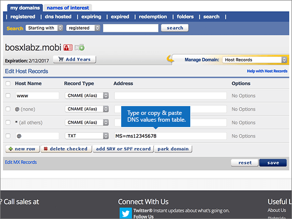
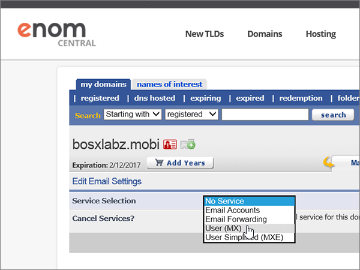
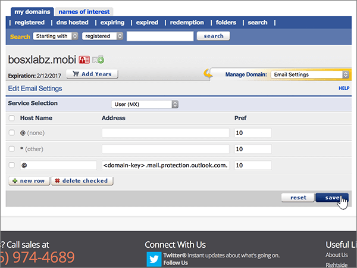

# Crear registros DNS en eNomCentral para Microsoft

 **[Consulte Preguntas más frecuentes acerca de los dominios](../setup/domains-faq.yml)** si no encuentra lo que busca.

Si eNomCentral es su proveedor de host DNS, siga los pasos de este artículo para comprobar el dominio y configurar los registros DNS para el correo electrónico, Skype Empresarial Online, etc.

Después de agregar estos registros a eNomCentral, el dominio estará configurado para funcionar con los servicios Microsoft.

> [!NOTE]
> Por lo general, los cambios de DNS tardan unos 15 minutos en aplicarse. Sin embargo, a veces los cambios pueden necesitar más tiempo para aplicarse en todo el sistema DNS de Internet. Si tiene problemas con el flujo de correo u otros problemas después de agregar registros DNS, consulte [Solucionar problemas después de cambiar el nombre del dominio o los registros DNS](../get-help-with-domains/find-and-fix-issues.md).

## Agregar un registro TXT para verificación

Antes de utilizar el dominio con Microsoft, tenemos que asegurarnos de que sea el propietario. Si puede iniciar sesión en la cuenta en el registrador de dominio y crear el registro DNS, Microsoft sabrá que es el propietario del dominio.

> [!NOTE]
> Este registro se usa exclusivamente para verificar si se es el propietario de un dominio; no afecta a nada más. Puede eliminarlo más adelante, si lo desea.

Siga los pasos siguientes o [vea el vídeo (empieza en 0:46)](https://support.microsoft.com/office/3766a9e8-77dd-4a42-908d-89b076143e7d).

1. Para empezar, vaya a su página de dominios en eNom Central a través de [este vínculo](https://www.enomcentral.com/domains/Domain-Manager.aspx?tab=registered). Se le pedirá que primero inicie sesión.

   

2. En **mis dominios,** seleccione el nombre del dominio que desea editar.

   

3. En la lista desplegable **Administrar dominio**, elija **Registros de host**.

   

4. En los cuadros para el nuevo registro, escriba o copie y pegue los valores de la tabla siguiente.

   Elija el **valor tipo de** registro de la lista desplegable.

   |Nombre de host|Record Type|Address|
   |---|---|---|
   |@|TXT|MS=ms *XXXXXXXX*    **Nota:** esto es un ejemplo. Utilice aquí su valor de **Dirección de destino**, desde la tabla. [¿Cómo puedo encontrar esto?](../get-help-with-domains/information-for-dns-records.md)|

   

5. Seleccione **guardar**.

   

6. Espere unos minutos antes de continuar para que el registro que acaba de crear pueda actualizarse en Internet.

Ahora que ha agregado el registro en el sitio de su registrador de dominios, volverá a Microsoft 365 y solicitará que busque el registro.

Cuando Microsoft encuentre el registro TXT correcto, se comprobará su dominio.

1. En el centro de administración de Microsoft, diríjase a la página **Configuración** \> <a href="https://go.microsoft.com/fwlink/p/?linkid=834818" target="_blank">Dominios</a>.

2. En la página **Dominios**, elija el dominio que está verificando.

3. En la página de **Configuración**, elija **Iniciar configuración**.

4. En la página **verificar dominio**, seleccione **verificar**.

> [!NOTE]
> Por lo general, los cambios de DNS tardan unos 15 minutos en aplicarse. Sin embargo, a veces los cambios pueden necesitar más tiempo para aplicarse en todo el sistema DNS de Internet. Si tiene problemas con el flujo de correo u otros problemas después de agregar registros DNS, consulte [Solucionar problemas después de cambiar el nombre del dominio o los registros DNS](../get-help-with-domains/find-and-fix-issues.md).

## Agregar un registro MX para que el correo electrónico del dominio vaya a Microsoft

Siga los pasos siguientes o [vea el vídeo (empieza en 3:40)](https://support.microsoft.com/office/3766a9e8-77dd-4a42-908d-89b076143e7d).

1. Para empezar, vaya a su página de dominios en eNom Central a través de [este vínculo](https://www.enomcentral.com/domains/Domain-Manager.aspx?tab=registered). Se le pedirá que primero inicie sesión.

   

2. En **mis dominios,** seleccione el nombre del dominio que desea editar.

   

3. En la lista desplegable **Administrar dominio**, elija **Configuración de correo electrónico**.

   

4. En la lista desplegable **Selección de servicio**, elija **Usuario (MX)**.

   

5. In the boxes for the new record, type or copy and paste the values from the following table.

   |Nombre de host|Address|Pref.|
   |---|---|---|
   |@| *\<domain-key\>*  .mail.protection.outlook.com.    **Este valor DEBE terminar en punto (.)**   **Nota:** Obtenga la  *\<domain-key\>*  información de su cuenta de Microsoft. [¿Cómo puedo encontrarla?](../get-help-with-domains/information-for-dns-records.md)|10      Para obtener más información sobre la prioridad, consulte [¿Qué es una prioridad de MX?](https://docs.microsoft.com/microsoft-365/admin/setup/domains-faq)|

   

6. Seleccione **guardar**.

   

7. Si hay otros registros MX, active las casillas de esos registros para seleccionarlos.

   

8. Seleccione **eliminar activada.**

   

## Agregar los registros CNAME necesarios para Microsoft

Siga los pasos siguientes o [vea el vídeo (empieza en 4:24)](https://support.microsoft.com/office/3766a9e8-77dd-4a42-908d-89b076143e7d).

1. Para empezar, vaya a su página de dominios en eNom Central a través de [este vínculo](https://www.enomcentral.com/domains/Domain-Manager.aspx?tab=registered). Se le pedirá que primero inicie sesión.

   

2. En **mis dominios,** seleccione el nombre del dominio que desea editar.

   

3. En la lista desplegable **Administrar dominio**, elija **Registros de host**.

   

4. Seleccione **nueva fila**.

   

5. En los cuadros para los seis nuevos registros, escriba o copie y pegue los valores siguientes.

   Elija el **valor tipo de** registro de la lista desplegable.

   |Nombre de host|Record Type|Address|
   |---|---|---|
   |autodiscover|CNAME (alias)|autodiscover.outlook.com.    **Este valor DEBE terminar en punto (.)**|
   |sip|CNAME (alias)|sipdir.online.lync.com.    **Este valor DEBE terminar en punto (.)**|
   |lyncdiscover|CNAME (alias)|webdir.online.lync.com.    **Este valor DEBE terminar en punto (.)**|
   |enterpriseregistration|CNAME (alias)|enterpriseregistration.windows.net.    **Este valor DEBE terminar en punto (.)**|
   |enterpriseenrollment|CNAME (alias)|enterpriseenrollment-s.manage.microsoft.com.    **Este valor DEBE terminar en punto (.).**|

   

6. Seleccione **guardar**.

   

## Agregar un registro TXT para SPF para ayudar a evitar el correo no deseado

> [!IMPORTANT]
> No puede tener más de un registro TXT para el SPF de un dominio. Si su dominio tiene más de un registro de SPF, obtendrá errores de correo, así como problemas de clasificación de entrega y de correo no deseado. Si ya tiene un registro de SPF para su dominio, no cree uno nuevo para Microsoft. En su lugar, agregue los valores de Microsoft necesarios al registro actual para que tenga un único registro  *de*  SPF que incluya ambos conjuntos de valores.

Siga los pasos siguientes o [vea el vídeo (empieza en 5:12)](https://support.microsoft.com/office/3766a9e8-77dd-4a42-908d-89b076143e7d).

1. Para empezar, vaya a su página de dominios en eNom Central a través de [este vínculo](https://www.enomcentral.com/domains/Domain-Manager.aspx?tab=registered). Se le pedirá que primero inicie sesión.

   

2. En **mis dominios,** seleccione el nombre del dominio que desea editar.

   

3. En la lista desplegable **Administrar dominio**, elija **Registros de host**.

   

4. En los cuadros del nuevo registro, escriba (o copie y pegue) los valores de la tabla siguiente.

   Elija el **valor tipo de** registro de la lista desplegable.

   |Nombre de host|Record Type|Address|
   |---|---|---|
   |@|TXT|v=spf1 include:spf.protection.outlook.com -all   **Nota:** recomendamos copiar y pegar esta entrada, para que todo el espacio sea correcto.|

   

5. Seleccione **guardar**.

   

## Agregar los dos registros SRV necesarios para Microsoft

Siga los pasos siguientes o [vea el vídeo (empieza en 5:50)](https://support.microsoft.com/office/3766a9e8-77dd-4a42-908d-89b076143e7d).

1. Para empezar, vaya a su página de dominios en eNom Central a través de [este vínculo](https://www.enomcentral.com/domains/Domain-Manager.aspx?tab=registered). Se le pedirá que primero inicie sesión.

   

2. En **mis dominios,** seleccione el nombre del dominio que desea editar.

   

3. En la lista desplegable **Administrar dominio**, elija **Registros de host**.

   

4. A la derecha de **la nueva fila,** seleccione **agregar registro SRV o SPF**.

   

5. En los cuadros de los dos nuevos registros, escriba (o copie y pegue) los valores de la tabla siguiente.

   |Servicio|Protocolo|Priority|Peso|Puerto|Destino (nombre de host)|
   |---|---|---|---|---|---|
   |_sip|_tls|100|1 |443|sipdir.online.lync.com.    **Este valor DEBE terminar en punto (.)**|
   |_sipfederationtls|_tcp|100|1 |5061|sipfed.online.lync.com.    **Este valor DEBE terminar en punto (.).**|

   

6. Seleccionar **guardar**

   

> [!NOTE]
> Por lo general, los cambios de DNS tardan unos 15 minutos en aplicarse. Sin embargo, a veces los cambios pueden necesitar más tiempo para aplicarse en todo el sistema DNS de Internet. Si tiene problemas con el flujo de correo u otros problemas después de agregar registros DNS, consulte [Solucionar problemas después de cambiar el nombre del dominio o los registros DNS](../get-help-with-domains/find-and-fix-issues.md).
