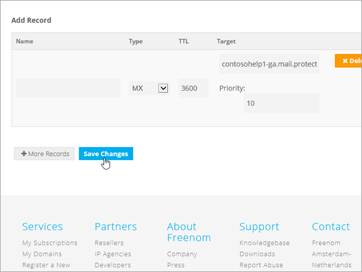

# Crear registros DNS en Freenom para Office 365

[Consulte preguntas más frecuentes acerca de los dominios](../setup/domains-faq.md) si no encuentra lo que está buscando. 
  
> [!CAUTION]
> El sitio web de Freenom no admite los registros SRV, lo que significa que no funcionarán varias características de Skype empresarial online y Outlook Web App. Independientemente del plan de Office 365 que use, hay importantes limitaciones de servicio y es posible que quiera cambiar a un proveedor de host DNS diferente. 
  
Si a pesar de las limitaciones del servicio, elige administrar sus propios registros DNS de Office 365 en Freenom, siga los pasos descritos en este artículo para comprobar su dominio y configurar los registros DNS para el correo electrónico y otros servicios.
  
Para obtener información acerca del hospedaje web y de DNS para sitios web con Office 365, consulte [Usar un sitio web público con Office 365](https://support.office.com/article/a8178510-501d-4bd8-9921-b04f2e9517a5.aspx).
  
> [!NOTE]
> Por lo general, los cambios de DNS tardan unos 15 minutos en aplicarse. Sin embargo, a veces los cambios pueden necesitar más tiempo para aplicarse en todo el sistema DNS de Internet. Si tiene problemas con el flujo de correo u otros problemas después de agregar registros DNS, consulte [Solucionar problemas después de cambiar el nombre del dominio o los registros DNS](../get-help-with-domains/find-and-fix-issues.md). 
  
## Agregar un registro TXT para verificación

Para que pueda usar el dominio con Office 365, tenemos que asegurarnos de que es de su propiedad. Si puede iniciar sesión en la cuenta en su registrador de dominios y crear el registro DNS, Office 365 sabrá que es el propietario del dominio.
  
> [!NOTE]
> Este registro se usa exclusivamente para verificar si se es el propietario de un dominio; no afecta a nada más. Puede eliminarlo más adelante, si lo desea. 
  
1. Para empezar, vaya a su página de dominios en Freenom a través de [este vínculo](https://my.freenom.com/). You'll be prompted to log in.
    
    
  
2. Seleccione **servicios**y, a continuación, seleccione **mis dominios**.
    
    
  
3. En el dominio que quiera editar, seleccione **administrar dominio**.
    
    
  
4. Seleccione **administrar DNS de Freenom**.
    
    
  
5. En **Agregar registro**, en la columna **tipo** , elija **txt** en el menú. 
    
    
  
6. En los cuadros para el nuevo registro, escriba o copie y pegue los valores de la tabla siguiente. 
    
    |**Name**|**Type**|**TTL**|**Destino**|
    |:-----|:-----|:-----|:-----|
    |(se deja en blanco)    |TXT    |3600 (segundos)    |MS = msXXXXXXXX    **Nota:** esto es un ejemplo. Use su valor **Dirección de destino** específico aquí, de la tabla de Office 365.           [¿Cómo puedo encontrar esto?](../get-help-with-domains/information-for-dns-records.md)          |
   
    
  
7. Seleccione **Guardar cambios**.
    
    
  
8. Espere unos minutos antes de continuar para que el registro que acaba de crear pueda actualizarse en Internet.
    
Ahora que ha agregado el registro en el sitio de su registrador de dominios, volverá a Office 365 y solicitará que Office 365 lo busque.
  
Cuando Office 365 encuentre el registro TXT correcto, se comprobará su dominio.
  
1. En el centro de administración, diríjase a la página **configuración** \> <a href="https://go.microsoft.com/fwlink/p/?linkid=834818" target="_blank">dominios</a>.

    
2. En la página **Dominios**, elija el dominio que está verificando. 
    
    
  
3. En la página de **Configuración**, elija ** Iniciar configuración**.
    
    
  
4. En la página**verificar dominio**, seleccione **verificar**.
    
    
  
> [!NOTE]
>  Por lo general, los cambios de DNS tardan unos 15 minutos en aplicarse. Sin embargo, a veces los cambios pueden necesitar más tiempo para aplicarse en todo el sistema DNS de Internet. Si tiene problemas con el flujo de correo u otros problemas después de agregar registros DNS, consulte [Solucionar problemas después de cambiar el nombre del dominio o los registros DNS](../get-help-with-domains/find-and-fix-issues.md). 
  
## Agregar un registro MX para que el correo electrónico del dominio vaya a Office 365

1. Para empezar, vaya a su página de dominios en Freenom a través de [este vínculo](https://my.freenom.com/). You'll be prompted to log in.
    
    
  
2. Seleccione **servicios**y, a continuación, seleccione **mis dominios**.
    
    
  
3. En el dominio que quiera editar, seleccione **administrar dominio**.
    
    
  
4. Establezca el nombre para el dominio en los servidores de nombres Freenom predeterminados. Seleccione **herramientas de administración**y, a continuación, seleccione **servidores de nombres**.
    
    
  
5. Asegúrese de que la opción **usar servidores de nombres predeterminados** está seleccionada y, después, seleccione **Cambiar servidores de nombres**.
    
    
  
6. Seleccione **administrar DNS de Freenom**.
    
    
  
7. En **Agregar registro**, en la columna **tipo** , elija **mx** en el menú. 
    
    
  
8. En los cuadros para el nuevo registro, escriba o copie y pegue los valores de la primera fila de la tabla siguiente. 
    
    |**Name**|**Type**|**TTL**|**Destino**|**Prioridad**|
    |:-----|:-----|:-----|:-----|:-----|
    |(se deja en blanco)    |MX (intercambiador de correo)    |3600 (segundos)    |\<Domain-Key\>. mail.Protection.Outlook.com    **Nota:** Obtenga la * \<clave\> de dominio* de su cuenta de Office 365.   [¿Cómo puedo encontrarla?](../get-help-with-domains/information-for-dns-records.md)          |10     Para obtener más información sobre la prioridad, consulte [¿Qué es una prioridad de MX?](https://support.office.com/article/17d415c1-067e-4974-84d5-aaeaf3a0c0a9)   |
   
   
  
9. Seleccione **Guardar cambios**.
    
    
  
10. Si hay otros registros MX, elimínelos todos. Para cada registro, seleccione **eliminar**. Si el mensaje **realmente desea quitar esta entrada** , seleccione **Aceptar**.
    
## Agregar los registros CNAME necesarios para Office 365

1. Para empezar, vaya a su página de dominios en Freenom a través de [este vínculo](https://my.freenom.com/). You'll be prompted to log in.
    
    
  
2. Seleccione **servicios**y, a continuación, seleccione **mis dominios**.
    
    
  
3. En el dominio que quiera editar, seleccione **administrar dominio**.
    
    
  
4. Seleccione **administrar DNS de Freenom**.
    
    
  
5. En **Agregar registro**, en la columna **tipo** , elija **CNAME** en el menú. 
    
    
  
6. Cree el primer registro CNAME. En los cuadros para el nuevo registro, escriba o copie y pegue los valores de la primera fila de la tabla siguiente. 
    
    |**Nombre**|**Tipo de registro**|**TTL**|**Destino**|
    |:-----|:-----|:-----|:-----|
    |autodiscover    |CNAME    |3600 (segundos)    |autodiscover.outlook.com    |
    |sip    |CNAME    |3600 (segundos)    |sipdir.online.lync.com    |
    |lyncdiscover    |CNAME    |3600 (segundos)    |webdir.online.lync.com    |
    |enterpriseregistration    |CNAME    |3600 (segundos)    |enterpriseregistration.windows.net    |
    |enterpriseenrollment    |CNAME    |3600 (segundos)    |enterpriseenrollment-s.manage.microsoft.com    |
   
    
  
7. Seleccione **Guardar cambios**.
    
    
  
8. Repita los pasos anteriores para crear los otros cinco registros CNAME. 
    
    Para cada registro, escriba (o copie y pegue) los valores de la siguiente fila de la tabla anterior en los cuadros para ese registro.
    
## Agregar un registro TXT para SPF para ayudar a evitar el correo no deseado

> [!IMPORTANT]
> No puede tener más de un registro TXT para el SPF de un dominio. Si su dominio tiene más de un registro de SPF, obtendrá errores de correo, así como problemas de clasificación de entrega y de correo no deseado. If you already have an SPF record for your domain, don't create a new one for Office 365. En vez de eso, agregue los valores necesarios de Office 365 para el registro actual, de modo que solo tenga un  *único*  registro de SPF que incluya ambos conjuntos de valores. 

1. Para empezar, vaya a su página de dominios en Freenom a través de [este vínculo](https://my.freenom.com/). You'll be prompted to log in.
    
    
  
2. Seleccione **servicios**y, a continuación, seleccione **mis dominios**.
    
    
  
3. En el dominio que quiera editar, seleccione **administrar dominio**.
    
    
  
4. Seleccione **administrar DNS de Freenom**.
    
    
  
5. En **Agregar registro**, en la columna **tipo** , elija **txt** en el menú. 
    
    
  
6. In the boxes for the new record, type or copy and paste the following values. 
    
    |**Nombre**|**Tipo de registro**|**TTL**|**Destino**|
    |:-----|:-----|:-----|:-----|
    |(se deja en blanco)    |TXT    |3600 (segundos)    |v=spf1 include:spf.protection.outlook.com -all   **Nota:** recomendamos copiar y pegar esta entrada, para que todo el espacio sea correcto.           |
   
    
  
7. Seleccione **Guardar cambios**.
    
    
  

