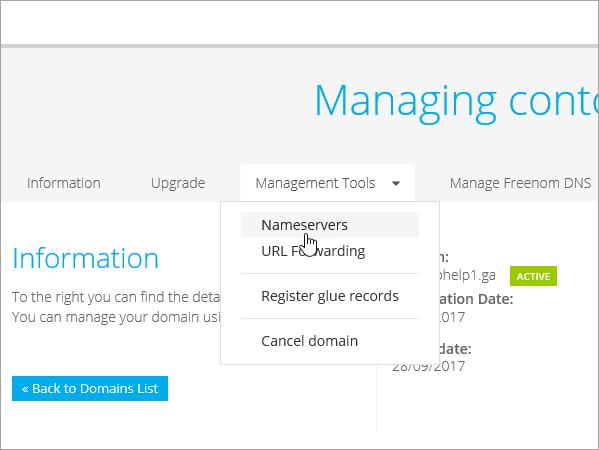

# Crear registros DNS en Freenom para MicrosoftCreate DNS records at Freenom for Microsoft

[Consulte preguntas más frecuentes acerca de los dominios ](../setup/domains-faq.yml) si no encuentra lo que está buscando.[Check the Domains FAQ ](../setup/domains-faq.yml) if you don't find what you're looking for. 
  
> [!CAUTION]
> El sitio web de Freenom no admite los registros SRV, lo que significa que no funcionarán varias características de Skype empresarial online y Outlook Web App.The Freenom website doesn't support SRV records, which means that several Skype for Business Online and Outlook Web App features won't work. Independientemente del plan de Microsoft que use, hay importantes limitaciones de servicio y es posible que quiera cambiar a un proveedor de host DNS diferente.No matter which Microsoft plan you use, there are significant service limitations, and you may want to switch to a different DNS hosting provider. 
  
Si a pesar de las limitaciones del servicio, elige administrar sus propios registros DNS de Microsoft en Freenom, siga los pasos descritos en este artículo para comprobar su dominio y configurar los registros DNS para el correo electrónico y otros servicios.If despite the service limitations, you choose to manage your own Microsoft DNS records at Freenom, follow the steps in this article to verify your domain and set up DNS records for email and other services.
  
  
> [!NOTE]
> Por lo general, los cambios de DNS tardan unos 15 minutos en aplicarse. Sin embargo, a veces los cambios pueden necesitar más tiempo para aplicarse en todo el sistema DNS de Internet. Si tiene problemas con el flujo de correo u otros problemas después de agregar registros DNS, consulte [Solucionar problemas después de cambiar el nombre del dominio o los registros DNS](../get-help-with-domains/find-and-fix-issues.md).Typically it takes about 15 minutes for DNS changes to take effect. However, it can occasionally take longer for a change you've made to update across the Internet's DNS system. If you're having trouble with mail flow or other issues after adding DNS records, see [Troubleshoot issues after changing your domain name or DNS records](../get-help-with-domains/find-and-fix-issues.md). 
  
## Agregar un registro TXT para verificaciónAdd a TXT record for verification

Antes de utilizar el dominio con Microsoft, tenemos que asegurarnos de que sea el propietario. Si puede iniciar sesión en la cuenta en el registrador de dominio y crear el registro DNS, Microsoft sabrá que es el propietario del dominio.Before you use your domain with Microsoft, we have to make sure that you own it. Your ability to log in to your account at your domain registrar and create the DNS record proves to Microsoft that you own the domain.
  
> [!NOTE]
> Este registro se usa exclusivamente para verificar si se es el propietario de un dominio; no afecta a nada más. Puede eliminarlo más adelante, si lo desea.This record is used only to verify that you own your domain; it doesn't affect anything else. You can delete it later, if you like. 
  
1. Para empezar, vaya a su página de dominios en Freenom a través de [este vínculo](https://my.freenom.com/).To get started, go to your domains page in Freenom by using [this link](https://my.freenom.com/). You'll be prompted to log in.You'll be prompted to log in.
    
    
  
2. Seleccione **servicios** y, a continuación, seleccione **mis dominios**.Select **Services**, and then select **My Domains**.
    
    
  
3. En el dominio que quiera editar, seleccione **administrar dominio**.For the domain that you want to edit, select **Manage Domain**.
    
    
  
4. Seleccione **administrar DNS de Freenom**.Select **Manage Freenom DNS**.
    
    
  
5. En **Agregar registro**, en la columna **tipo** , elija **txt** en el menú.Under **Add Record**, in the **Type** column, choose **TXT** from the menu. 
    
    
  
6. En los cuadros para el nuevo registro, escriba o copie y pegue los valores de la tabla siguiente.In the boxes for the new record, type or copy and paste the values from the following table. 
    
    |**Nombre****Name**|**Tipo****Type**|**TTL****TTL**|**Target****Target**|
    |:-----|:-----|:-----|:-----|
    |(se deja en blanco)(leave blank)    |TXTTXT    |3600 (segundos)3600 (seconds)    |MS = msXXXXXXXXMS=msXXXXXXXX    **Nota:** esto es un ejemplo.**Note:** This is an example. Utilice aquí su valor de **Dirección de destino**, desde la tabla.Use your specific **Destination or Points to Address** value here, from the table.           [¿Cómo puedo encontrar esto?How do I find this?](../get-help-with-domains/information-for-dns-records.md)          |
   
    
  
7. Seleccione **Guardar cambios**.Select **Save Changes**.
    
    
  
8. Espere unos minutos antes de continuar para que el registro que acaba de crear pueda actualizarse en Internet.Wait a few minutes before you continue, so that the record you just created can update across the Internet.
    
Ahora que ha agregado el registro en el sitio de su registrador de dominios, deberá volver a Microsoft y solicitar el registro.Now that you've added the record at your domain registrar's site, you'll go back to Microsoft and request the record.
  
Cuando Microsoft encuentre el registro TXT correcto, se comprobará su dominio.When Microsoft finds the correct TXT record, your domain is verified.
  
1. En el centro de administración de Microsoft, diríjase a la página **Configuración** \> <a href="https://go.microsoft.com/fwlink/p/?linkid=834818" target="_blank">Dominios</a>.In the Microsoft admin center, go to the **Settings** \> <a href="https://go.microsoft.com/fwlink/p/?linkid=834818" target="_blank">Domains</a> page.

    
2. En la página **Dominios**, elija el dominio que está verificando.On the **Domains** page, select the domain that you are verifying. 
    
    
  
3. En la página de **Configuración**, elija **Iniciar configuración**.On the **Setup** page, select **Start setup**.
    
    
  
4. En la página **verificar dominio**, seleccione **verificar**.On the **Verify domain** page, select **Verify**.
    
    
  
> [!NOTE]
>  Por lo general, los cambios de DNS tardan unos 15 minutos en aplicarse. Sin embargo, a veces los cambios pueden necesitar más tiempo para aplicarse en todo el sistema DNS de Internet. Si tiene problemas con el flujo de correo u otros problemas después de agregar registros DNS, consulte [Solucionar problemas después de cambiar el nombre del dominio o los registros DNS](../get-help-with-domains/find-and-fix-issues.md).Typically it takes about 15 minutes for DNS changes to take effect. However, it can occasionally take longer for a change you've made to update across the Internet's DNS system. If you're having trouble with mail flow or other issues after adding DNS records, see [Troubleshoot issues after changing your domain name or DNS records](../get-help-with-domains/find-and-fix-issues.md). 
  
## Agregar un registro MX para que el correo electrónico del dominio vaya a MicrosoftAdd an MX record so email for your domain will come to Microsoft

1. Para empezar, vaya a su página de dominios en Freenom a través de [este vínculo](https://my.freenom.com/).To get started, go to your domains page in Freenom by using [this link](https://my.freenom.com/). You'll be prompted to log in.You'll be prompted to log in.
    
    
  
2. Seleccione **servicios** y, a continuación, seleccione **mis dominios**.Select **Services**, and then select **My Domains**.
    
    
  
3. En el dominio que quiera editar, seleccione **administrar dominio**.For the domain that you want to edit, select **Manage Domain**.
    
    
  
4. Establezca el nombre para el dominio en los servidores de nombres Freenom predeterminados.Set the name serves for your domain to the default Freenom name servers. Seleccione **herramientas de administración** y, a continuación, seleccione **servidores de nombres**.Select **Management Tools**, and then select **Nameservers**.
    
    
  
5. Asegúrese de que la opción **usar servidores de nombres predeterminados** está seleccionada y, después, seleccione **Cambiar servidores de nombres**.Make sure **Use default nameservers** is selected, and then select **Change Nameservers**.
    
    
  
6. Seleccione **administrar DNS de Freenom**.Select **Manage Freenom DNS**.
    
    
  
7. En **Agregar registro**, en la columna **tipo** , elija **mx** en el menú.Under **Add Record**, in the **Type** column, choose **MX** from the menu. 
    
    
  
8. En los cuadros para el nuevo registro, escriba o copie y pegue los valores de la primera fila de la tabla siguiente.In the boxes for the new record, type or copy and paste the values from the first row of the following table. 
    
    |**Nombre****Name**|**Tipo****Type**|**TTL****TTL**|**Target****Target**|**Prioridad****Priority**|
    |:-----|:-----|:-----|:-----|:-----|
    |(se deja en blanco)(leave blank)    |MX (intercambiador de correo)MX (Mail Exchanger)    |3600 (segundos)3600 (seconds)    |\<domain-key\>. mail.protection.outlook.com\<domain-key\>.mail.protection.outlook.com    **Nota:** Obtén tu  *\<domain-key\>*  cuenta de Microsoft.**Note:** Get your  *\<domain-key\>*  from your Microsoft account.   [¿Cómo puedo encontrarla?How do I find this?](../get-help-with-domains/information-for-dns-records.md)          |10 10    Para obtener más información sobre la prioridad, consulte [¿Qué es una prioridad de MX?](https://docs.microsoft.com/microsoft-365/admin/setup/domains-faq)For more information about priority, see [What is MX priority?](https://docs.microsoft.com/microsoft-365/admin/setup/domains-faq)   |
   
   
  
9. Seleccione **Guardar cambios**.Select **Save Changes**.
    
    
  
10. Si hay otros registros MX, elimínelos todos.If there are any other MX records, delete them all. Para cada registro, seleccione **eliminar**.For each record, select **Delete**. Si el mensaje **realmente desea quitar esta entrada** , seleccione **Aceptar**.When the message **Do you really want to remove this entry?** appears, select **OK**.
    
## Agregar los registros CNAME necesarios para MicrosoftAdd the CNAME records that are required for Microsoft

1. Para empezar, vaya a su página de dominios en Freenom a través de [este vínculo](https://my.freenom.com/).To get started, go to your domains page in Freenom by using [this link](https://my.freenom.com/). You'll be prompted to log in.You'll be prompted to log in.
    
    
  
2. Seleccione **servicios** y, a continuación, seleccione **mis dominios**.Select **Services**, and then select **My Domains**.
    
    
  
3. En el dominio que quiera editar, seleccione **administrar dominio**.For the domain that you want to edit, select **Manage Domain**.
    
    
  
4. Seleccione **administrar DNS de Freenom**.Select **Manage Freenom DNS**.
    
    
  
5. En **Agregar registro**, en la columna **tipo** , elija **CNAME** en el menú.Under **Add Record**, in the **Type** column, choose **CNAME** from the menu. 
    
    
  
6. Cree el primer registro CNAME.Create the first CNAME record. En los cuadros para el nuevo registro, escriba o copie y pegue los valores de la primera fila de la tabla siguiente.In the boxes for the new record, type or copy and paste the values from the first row of the following table. 
    
    |**Nombre****Name**|**Tipo de registro****Record type**|**TTL****TTL**|**Target****Target**|
    |:-----|:-----|:-----|:-----|
    |autodiscoverautodiscover    |CNAMECNAME    |3600 (segundos)3600 (seconds)    |autodiscover.outlook.comautodiscover.outlook.com    |
    |sipsip    |CNAMECNAME    |3600 (segundos)3600 (seconds)    |sipdir.online.lync.comsipdir.online.lync.com    |
    |lyncdiscoverlyncdiscover    |CNAMECNAME    |3600 (segundos)3600 (seconds)    |webdir.online.lync.comwebdir.online.lync.com    |
    |enterpriseregistrationenterpriseregistration    |CNAMECNAME    |3600 (segundos)3600 (seconds)    |enterpriseregistration.windows.netenterpriseregistration.windows.net    |
    |enterpriseenrollmententerpriseenrollment    |CNAMECNAME    |3600 (segundos)3600 (seconds)    |enterpriseenrollment-s.manage.microsoft.comenterpriseenrollment-s.manage.microsoft.com    |
   
    
  
7. Seleccione **Guardar cambios**.Select **Save Changes**.
    
    
  
8. Repita los pasos anteriores para crear los otros cinco registros CNAME.Repeat the previous steps to create the other five CNAME records. 
    
    Para cada registro, escriba (o copie y pegue) los valores de la siguiente fila de la tabla anterior en los cuadros para ese registro.For each record, type or copy and paste the values from the next row of the table above into the boxes for that record.
    
## Agregar un registro TXT para SPF para ayudar a evitar el correo no deseadoAdd a TXT record for SPF to help prevent email spam

> [!IMPORTANT]
> No puede tener más de un registro TXT para el SPF de un dominio.You cannot have more than one TXT record for SPF for a domain. Si su dominio tiene más de un registro de SPF, obtendrá errores de correo, así como problemas de clasificación de entrega y de correo no deseado.If your domain has more than one SPF record, you'll get email errors, as well as delivery and spam classification issues. Si ya tiene un registro de SPF para su dominio, no cree uno nuevo para Microsoft.If you already have an SPF record for your domain, don't create a new one for Microsoft. En su lugar, agregue los valores necesarios de Microsoft al registro activo para que tenga un  *único*  registro de SPF que incluya ambos conjuntos de valores.Instead, add the required Microsoft values to the current record so that you have a  *single*  SPF record that includes both sets of values. 

1. Para empezar, vaya a su página de dominios en Freenom a través de [este vínculo](https://my.freenom.com/).To get started, go to your domains page in Freenom by using [this link](https://my.freenom.com/). You'll be prompted to log in.You'll be prompted to log in.
    
    
  
2. Seleccione **servicios** y, a continuación, seleccione **mis dominios**.Select **Services**, and then select **My Domains**.
    
    
  
3. En el dominio que quiera editar, seleccione **administrar dominio**.For the domain that you want to edit, select **Manage Domain**.
    
    
  
4. Seleccione **administrar DNS de Freenom**.Select **Manage Freenom DNS**.
    
    
  
5. En **Agregar registro**, en la columna **tipo** , elija **txt** en el menú.Under **Add Record**, in the **Type** column, choose **TXT** from the menu. 
    
    
  
6. In the boxes for the new record, type or copy and paste the following values.In the boxes for the new record, type or copy and paste the following values. 
    
    |**Nombre****Name**|**Tipo de registro****Record type**|**TTL****TTL**|**Target****Target**|
    |:-----|:-----|:-----|:-----|
    |(se deja en blanco)(leave blank)    |TXTTXT    |3600 (segundos)3600 (seconds)    |v=spf1 include:spf.protection.outlook.com -allv=spf1 include:spf.protection.outlook.com -all   **Nota:** recomendamos copiar y pegar esta entrada, para que todo el espacio sea correcto.**Note:** We recommend copying and pasting this entry, so that all of the spacing stays correct.           |
   
    
  
7. Seleccione **Guardar cambios**.Select **Save Changes**.
    
    
  

