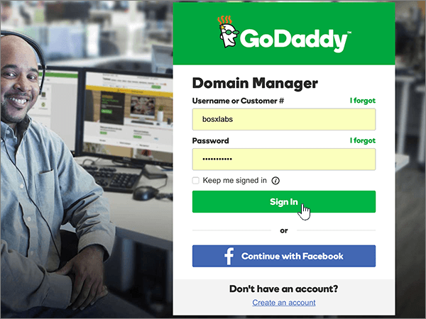

# Crear registros DNS en GoDaddy para Office 365Create DNS records at GoDaddy for Office 365

 **[Consulte Preguntas más frecuentes acerca de los dominios](../setup/domains-faq.md)** si no encuentra lo que busca.**[Check the Domains FAQ](../setup/domains-faq.md)** if you don't find what you're looking for.

Si GoDaddy es su proveedor de hosting DNS, siga los pasos de este artículo para comprobar su dominio y configurar los registros DNS para el correo electrónico, Skype Empresarial Online, etc.If GoDaddy is your DNS hosting provider, follow the steps in this article to verify your domain and set up DNS records for email, Skype for Business Online, and so on.

Después de agregar estos registros a GoDaddy, su dominio estará configurado para trabajar con los servicios de Office 365.After you add these records at GoDaddy, your domain will be set up to work with Office 365 services.

Para obtener información acerca del hospedaje web y de DNS para sitios web con Office 365, consulte [Usar un sitio web público con Office 365](https://support.office.com/article/choose-a-public-website-3325d50e-d131-403c-a278-7f3296fe33a9).To learn about webhosting and DNS for websites with Office 365, see [Use a public website with Office 365](https://support.office.com/article/choose-a-public-website-3325d50e-d131-403c-a278-7f3296fe33a9).

> [!NOTE]
> Por lo general, los cambios de DNS tardan unos 15 minutos en aplicarse. Sin embargo, a veces los cambios pueden necesitar más tiempo para aplicarse en todo el sistema DNS de Internet. Si tiene problemas con el flujo de correo u otros problemas después de agregar registros DNS, consulte [Solucionar problemas después de cambiar el nombre del dominio o los registros DNS](../get-help-with-domains/find-and-fix-issues.md).Typically it takes about 15 minutes for DNS changes to take effect. However, it can occasionally take longer for a change you've made to update across the Internet's DNS system. If you're having trouble with mail flow or other issues after adding DNS records, see [Troubleshoot issues after changing your domain name or DNS records](../get-help-with-domains/find-and-fix-issues.md).

## Agregar un registro TXT para verificaciónAdd a TXT record for verification

Para que pueda usar el dominio con Office 365, tenemos que asegurarnos de que es de su propiedad. Si puede iniciar sesión en la cuenta en su registrador de dominios y crear el registro DNS, Office 365 sabrá que es el propietario del dominio.Before you use your domain with Office 365, we have to make sure that you own it. Your ability to log in to your account at your domain registrar and create the DNS record proves to Office 365 that you own the domain.

> [!NOTE]
> Este registro se usa exclusivamente para verificar si se es el propietario de un dominio; no afecta a nada más. Puede eliminarlo más adelante, si lo desea.This record is used only to verify that you own your domain; it doesn't affect anything else. You can delete it later, if you like.

Siga estos pasos.Follow the steps below.

1. Para empezar, vaya a su página de dominios en GoDaddy a través de [este vínculo](https://account.godaddy.com/products/?go_redirect=disabled). Se le pedirá que inicie sesión.To get started, go to your domains page at GoDaddy by using [this link](https://account.godaddy.com/products/?go_redirect=disabled). You'll be prompted to log in.

    

2. En **dominios**, seleccione DNS en el dominio que quiera editar.Under **Domains**, select DNS under the domain that you want to edit.

    

3. Seleccione **Agregar**.Select **Add**.

    

4. Elija **TXT (texto)** en la lista desplegable.Choose **TXT (Text)** from the drop-down list. In the boxes for the new record, type or copy and paste the values from the following table.In the boxes for the new record, type or copy and paste the values from the following table.

    |**Tipo de registro****Record type** |**Host****Host**|**Valor TXT****TXT Value**|**TTL****TTL** |
    |:-----|:-----|:-----|:-----|
    |TXT (texto)TXT (Text)|@|MS=ms *XXXXXXXX*MS=ms *XXXXXXXX* **Nota**: este es un ejemplo.**Note**: This is an example. Utilice aquí su valor de **Dirección o puntos de destino**, de la tabla de Office 365.Use your specific **Destination or Points to Address** value here, from the table in Office 365. [¿Cómo puedo encontrarlo?How do I find this?](../get-help-with-domains/information-for-dns-records.md)|1 hour1 hour   (Seleccione un valor de la lista desplegable).(Select a value from the drop-down list.)|

      

5. Seleccione **Guardar**.Select **Save**.

6. Espere unos minutos antes de continuar para que el registro que acaba de crear pueda actualizarse en Internet.Wait a few minutes before you continue, so that the record you just created can update across the Internet.

Now that you've added the record at your domain registrar's site, you'll go back to Office 365 and request Office 365 to look for the record.Now that you've added the record at your domain registrar's site, you'll go back to Office 365 and request Office 365 to look for the record.

When Office 365 finds the correct TXT record, your domain is verified.When Office 365 finds the correct TXT record, your domain is verified.
  
1. En el centro de administración, vaya a la página **configuración** \> de <a href="https://go.microsoft.com/fwlink/p/?linkid=834818" target="_blank">dominios</a> .In the admin center, go to the **Settings** \> <a href="https://go.microsoft.com/fwlink/p/?linkid=834818" target="_blank">Domains</a> page.

    
2. En la página **dominios** , seleccione el dominio que desea comprobar.On the **Domains** page, select the domain that you are verifying. 
    
    
  
3. En la página **configuración** , seleccione **Iniciar configuración**.On the **Setup** page, select **Start setup**.

4. En la página **comprobar dominio** , seleccione **comprobar**.On the **Verify domain** page, select **Verify**.

> [!NOTE]
>  Por lo general, los cambios de DNS tardan unos 15 minutos en aplicarse. Sin embargo, a veces los cambios pueden necesitar más tiempo para aplicarse en todo el sistema DNS de Internet. Si tiene problemas con el flujo de correo u otros problemas después de agregar registros DNS, consulte [Solucionar problemas después de cambiar el nombre del dominio o los registros DNS](../get-help-with-domains/find-and-fix-issues.md).Typically it takes about 15 minutes for DNS changes to take effect. However, it can occasionally take longer for a change you've made to update across the Internet's DNS system. If you're having trouble with mail flow or other issues after adding DNS records, see [Troubleshoot issues after changing your domain name or DNS records](../get-help-with-domains/find-and-fix-issues.md).

## Agregar un registro MX para que el correo electrónico del dominio vaya a Office 365Add an MX record so email for your domain will come to Office 365

Siga estos pasos.Follow the steps below.

1. Para empezar, vaya a su página de dominios en GoDaddy a través de [este vínculo](https://account.godaddy.com/products/?go_redirect=disabled). Se le pedirá que inicie sesión.To get started, go to your domains page at GoDaddy by using [this link](https://account.godaddy.com/products/?go_redirect=disabled). You'll be prompted to log in.

    

2. En **dominios**, seleccione DNS en el dominio que quiera editar.Under **Domains**, select DNS under the domain that you want to edit.

    

3. Seleccione **Agregar**.Select **Add**.

    

4. Elija **MX (Agente de intercambio de correo)** de la lista desplegable.Choose **MX (Mail Exchanger)** from the drop-down list.

    

5. En los cuadros para el nuevo registro, escriba o copie y pegue los valores de la tabla siguiente.In the boxes for the new record, type or copy and paste the values from the following table.

    (Elija el valor **TTL** de la lista desplegable).(Choose the **TTL** value from the drop-down list.)

    |**Tipo de registro****Record type**|**Host****Host**|**Señala a****Points to**|**Prioridad****Priority**|**TTL****TTL**|
    |:-----|:-----|:-----|:-----|:-----|
    |MX (intercambiador de correo)MX (Mail Exchanger)    |@    | *\< clave-de-dominio \>*  . mail.protection.outlook.com    *\<domain-key\>*  .mail.protection.outlook.com    **Nota:** Obtenga la \* \<clave\> de dominio\* de su cuenta de Office 365.**Note:** Get your  *\<domain-key\>*  from your Office 365 account.           [¿Cómo puedo encontrarla?How do I find this?](../get-help-with-domains/information-for-dns-records.md)          |10 10    Para obtener más información sobre la prioridad, consulte [¿Qué es una prioridad de MX?](https://support.office.com/article/2784cc4d-95be-443d-b5f7-bb5dd867ba83.aspx)For more information about priority, see [What is MX priority?](https://support.office.com/article/2784cc4d-95be-443d-b5f7-bb5dd867ba83.aspx)   |1 hora1 hour    |

6. Seleccione **Guardar**.Select **Save**.

## Agregar los registros CNAME necesarios para Office 365Add the CNAME records that are required for Office 365

Siga estos pasos.Follow the steps below.

1. Para empezar, vaya a su página de dominios en GoDaddy a través de [este vínculo](https://account.godaddy.com/products/?go_redirect=disabled). Se le pedirá que inicie sesión.To get started, go to your domains page at GoDaddy by using [this link](https://account.godaddy.com/products/?go_redirect=disabled). You'll be prompted to log in.

    

2. En **dominios**, seleccione DNS en el dominio que quiera editar.Under **Domains**, select DNS under the domain that you want to edit.

    

3. Seleccione **Agregar**.Select **Add**.

    

4. Elija **CNAME (Alias)** de la lista desplegable.Choose **CNAME (Alias)** from the drop-down list.

    

5. Cree el primer registro CNAME.Create the first CNAME record.

    En los cuadros para el nuevo registro, escriba o copie y pegue los valores de la primera fila de la tabla siguiente.In the boxes for the new record, type or copy and paste the values from the first row of the following table.

    (Elija el valor **TTL** de la lista desplegable).(Choose the **TTL** value from the drop-down list.)

    |**Tipo de registro****Record type**|**Host****Host**|**Señala a****Points to**|**TTL****TTL**|
    |:-----|:-----|:-----|:-----|
    |CNAME (Alias)CNAME (Alias)    |autodiscoverautodiscover    |autodiscover.outlook.comautodiscover.outlook.com    |1 hour1 hour    |
    |CNAME (alias)CNAME (Alias)    |sipsip    |sipdir.online.lync.comsipdir.online.lync.com    |1 hora1 hour    |
    |CNAME (alias)CNAME (Alias)    |lyncdiscoverlyncdiscover    |webdir.online.lync.comwebdir.online.lync.com    |1 hora1 hour    |
    |CNAME (alias)CNAME (Alias)    |enterpriseregistrationenterpriseregistration    |enterpriseregistration.windows.netenterpriseregistration.windows.net    |1 hora1 hour    |
    |CNAME (alias)CNAME (Alias)    |enterpriseenrollmententerpriseenrollment    |enterpriseenrollment.manage.microsoft.comenterpriseenrollment.manage.microsoft.com    |1 hour1 hour    |

6. Repita estos pasos para agregar el siguiente registro CNAME hasta que haya creado los seis registros CNAME.Repeat these steps to add the next CNAME record until you have created all six of the CNAME records.

## Agregar un registro TXT para SPF para ayudar a evitar el correo no deseadoAdd a TXT record for SPF to help prevent email spam

> [!IMPORTANT]
> You cannot have more than one TXT record for SPF for a domain.You cannot have more than one TXT record for SPF for a domain. If your domain has more than one SPF record, you'll get email errors, as well as delivery and spam classification issues.If your domain has more than one SPF record, you'll get email errors, as well as delivery and spam classification issues. If you already have an SPF record for your domain, don't create a new one for Office 365.If you already have an SPF record for your domain, don't create a new one for Office 365. En vez de eso, agregue los valores necesarios de Office 365 para el registro actual, de modo que solo tenga un  *único*  registro de SPF que incluya ambos conjuntos de valores.Instead, add the required Office 365 values to the current record so that you have a  *single*  SPF record that includes both sets of values.

Siga estos pasos.Follow the steps below.

1. Para empezar, vaya a su página de dominios en GoDaddy a través de [este vínculo](https://account.godaddy.com/products/?go_redirect=disabled). Se le pedirá que inicie sesión.To get started, go to your domains page at GoDaddy by using [this link](https://account.godaddy.com/products/?go_redirect=disabled). You'll be prompted to log in.

    

2. En **dominios**, seleccione DNS en el dominio que quiera editar.Under **Domains**, select DNS under the domain that you want to edit.

    

3. Seleccione **Agregar**.Select **Add**.

    

4. Elija **TXT (texto)** en la lista desplegable.Choose **TXT (Text)** from the drop-down list.

    

5. En el cuadro para el nuevo registro, escriba o copie y pegue los valores siguientes.In the boxes for the new record, type or copy and paste the following values.

    (Elija el valor **TTL** de las listas desplegables).(Choose the **TTL** value from the drop-down lists.)

    |**Tipo de registro****Record type**|**Host****Host**|**Valor TXT****TXT Value**|**TTL****TTL**|
    |:-----|:-----|:-----|:-----|
    |TXT (texto)TXT (Text)    |@    |v=spf1 include:spf.protection.outlook.com -allv=spf1 include:spf.protection.outlook.com -all    **Nota:** Se recomienda copiar y pegar esta entrada para que todo el espaciado sea correcto.**Note:** We recommend copying and pasting this entry, so that all of the spacing stays correct.           |1 hour1 hour    |

    

6. Seleccione **Guardar**.Select **Save**.

## Agregar los dos registros SRV necesarios para Office 365Add the two SRV records that are required for Office 365

Siga estos pasos.Follow the steps below.

1. Para empezar, vaya a su página de dominios en GoDaddy a través de [este vínculo](https://account.godaddy.com/products/?go_redirect=disabled). Se le pedirá que inicie sesión.To get started, go to your domains page at GoDaddy by using [this link](https://account.godaddy.com/products/?go_redirect=disabled). You'll be prompted to log in.

    

2. En **dominios**, seleccione DNS en el dominio que quiera editar.Under **Domains**, select DNS under the domain that you want to edit.

    

3. Seleccione **Agregar**.Select **Add**.

    

4. Elija **SRV (Servicio)** en la lista desplegable.Choose **SRV (Service)** from the drop-down list.

    

5. Cree el primer registro SRV.Create the first SRV record.

    En los cuadros para el nuevo registro, escriba o copie y pegue los valores de la primera fila de la tabla siguiente.In the boxes for the new record, type or copy and paste the values from the first row of the following table.

    (Elija los valores **tipo de registro** y **TTL** que se muestran en las listas desplegables).(Choose the **Record type** and **TTL** values from the drop-down lists.)

    |**Tipo de registro****Record type**|**Nombre****Name**|**Destino****Target**|**Protocolo****Protocol**|**Servicio****Service**|**Prioridad****Priority**|**Peso****Weight**|**Puerto****Port**|**TTL****TTL**|
    |:-----|:-----|:-----|:-----|:-----|:-----|:-----|:-----|:-----|
    |SRV (servicio)SRV (Service)    |@    |sipdir.online.lync.comsipdir.online.lync.com    |_tls_tls    |_sip_sip    |100100    |11    |443443    |1 hora1 hour    |
    |SRV (servicio)SRV (Service)    |@    |sipfed.online.lync.comsipfed.online.lync.com    |_tcp_tcp    |_sipfederationtls_sipfederationtls    |100100    |11    |50615061    |1 hora1 hour    |

    

6. Repita el **paso 5** para crear el otro registro SRV.Repeat **Step 5** to Create the other SRV record.

7. Seleccione **Guardar**.Select **Save**.

> [!NOTE]
> Por lo general, los cambios de DNS tardan unos 15 minutos en aplicarse. Sin embargo, a veces los cambios pueden necesitar más tiempo para aplicarse en todo el sistema DNS de Internet. Si tiene problemas con el flujo de correo u otros problemas después de agregar registros DNS, consulte [Solucionar problemas después de cambiar el nombre del dominio o los registros DNS](../get-help-with-domains/find-and-fix-issues.md).Typically it takes about 15 minutes for DNS changes to take effect. However, it can occasionally take longer for a change you've made to update across the Internet's DNS system. If you're having trouble with mail flow or other issues after adding DNS records, see [Troubleshoot issues after changing your domain name or DNS records](../get-help-with-domains/find-and-fix-issues.md).
