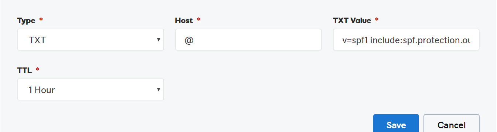

# Crear registros DNS en GoDaddy para MicrosoftCreate DNS records at GoDaddy for Microsoft

 **[Consulte Preguntas más frecuentes acerca de los dominios](../setup/domains-faq.md)** si no encuentra lo que busca.**[Check the Domains FAQ](../setup/domains-faq.md)** if you don't find what you're looking for.

Si GoDaddy es su proveedor de hosting DNS, siga los pasos de este artículo para comprobar su dominio y configurar los registros DNS para el correo electrónico, Skype Empresarial Online, etc.If GoDaddy is your DNS hosting provider, follow the steps in this article to verify your domain and set up DNS records for email, Skype for Business Online, and so on.

Después de agregar estos registros a GoDaddy, el dominio estará configurado para funcionar con los servicios de Microsoft.After you add these records at GoDaddy, your domain will be set up to work with Microsoft services.

> [!NOTE]
> Por lo general, los cambios de DNS tardan unos 15 minutos en aplicarse. Sin embargo, a veces los cambios pueden necesitar más tiempo para aplicarse en todo el sistema DNS de Internet. Si tiene problemas con el flujo de correo u otros problemas después de agregar registros DNS, consulte [Solucionar problemas después de cambiar el nombre del dominio o los registros DNS](../get-help-with-domains/find-and-fix-issues.md).Typically it takes about 15 minutes for DNS changes to take effect. However, it can occasionally take longer for a change you've made to update across the Internet's DNS system. If you're having trouble with mail flow or other issues after adding DNS records, see [Troubleshoot issues after changing your domain name or DNS records](../get-help-with-domains/find-and-fix-issues.md).

## Agregar un registro TXT para verificaciónAdd a TXT record for verification

Antes de utilizar el dominio con Microsoft, tenemos que asegurarnos de que sea el propietario. Si puede iniciar sesión en la cuenta en el registrador de dominio y crear el registro DNS, Microsoft sabrá que es el propietario del dominio.Before you use your domain with Microsoft, we have to make sure that you own it. Your ability to log in to your account at your domain registrar and create the DNS record proves to Microsoft that you own the domain.

> [!NOTE]
> Este registro se usa exclusivamente para verificar si se es el propietario de un dominio; no afecta a nada más. Puede eliminarlo más adelante, si lo desea.This record is used only to verify that you own your domain; it doesn't affect anything else. You can delete it later, if you like.

Siga estos pasos.Follow the steps below.

1. Para empezar, vaya a su página de dominios en GoDaddy a través de [este vínculo](https://account.godaddy.com/products/?go_redirect=disabled). Se le pedirá que inicie sesión.To get started, go to your domains page at GoDaddy by using [this link](https://account.godaddy.com/products/?go_redirect=disabled). You'll be prompted to log in.

    

2. En **dominios**, seleccione DNS en el dominio que quiera editar.Under **Domains**, select DNS under the domain that you want to edit.

    

3. Seleccione **Agregar**.Select **Add**.

    

4. Elija **TXT (texto)** en la lista desplegable.Choose **TXT (Text)** from the drop-down list. En los cuadros para el nuevo registro, escriba o copie y pegue los valores de la tabla siguiente.In the boxes for the new record, type or copy and paste the values from the following table.

    |**Tipo de registro****Record type** |**Host****Host**|**Valor TXT****TXT Value**|**TTL****TTL** |
    |:-----|:-----|:-----|:-----|
    |TXT (texto)TXT (Text)|@|MS=ms *XXXXXXXX*MS=ms *XXXXXXXX* **Nota**: este es un ejemplo.**Note**: This is an example. Utilice aquí su valor de **Dirección de destino**, desde la tabla.Use your specific **Destination or Points to Address** value here, from the table. [¿Cómo puedo encontrar esto?How do I find this?](../get-help-with-domains/information-for-dns-records.md)|1 hora1 hour   (Seleccione un valor de la lista desplegable).(Select a value from the drop-down list.)|

      

5. Seleccione **Guardar**.Select **Save**.

6. Espere unos minutos antes de continuar para que el registro que acaba de crear pueda actualizarse en Internet.Wait a few minutes before you continue, so that the record you just created can update across the Internet.

Ahora que ha agregado el registro en el sitio de su registrador de dominios, deberá volver a Microsoft y solicitar el registro.Now that you've added the record at your domain registrar's site, you'll go back to Microsoft and request the record.

Cuando Microsoft encuentre el registro TXT correcto, se comprobará su dominio.When Microsoft finds the correct TXT record, your domain is verified.
  
1. En el centro de administración de Microsoft, diríjase a la página **Configuración** \> <a href="https://go.microsoft.com/fwlink/p/?linkid=834818" target="_blank">Dominios</a>.In the Microsoft admin center, go to the **Settings** \> <a href="https://go.microsoft.com/fwlink/p/?linkid=834818" target="_blank">Domains</a> page.

    
2. En la página **Dominios**, elija el dominio que está verificando.On the **Domains** page, select the domain that you are verifying. 
    
    
  
3. En la página de **Configuración**, elija \*\* Iniciar configuración\*\*.On the **Setup** page, select **Start setup**.

4. En la página**verificar dominio**, seleccione **verificar**.On the **Verify domain** page, select **Verify**.

> [!NOTE]
>  Por lo general, los cambios de DNS tardan unos 15 minutos en aplicarse. Sin embargo, a veces los cambios pueden necesitar más tiempo para aplicarse en todo el sistema DNS de Internet. Si tiene problemas con el flujo de correo u otros problemas después de agregar registros DNS, consulte [Solucionar problemas después de cambiar el nombre del dominio o los registros DNS](../get-help-with-domains/find-and-fix-issues.md).Typically it takes about 15 minutes for DNS changes to take effect. However, it can occasionally take longer for a change you've made to update across the Internet's DNS system. If you're having trouble with mail flow or other issues after adding DNS records, see [Troubleshoot issues after changing your domain name or DNS records](../get-help-with-domains/find-and-fix-issues.md).

## Agregar un registro MX para que el correo electrónico del dominio vaya a MicrosoftAdd an MX record so email for your domain will come to Microsoft

Siga estos pasos.Follow the steps below.

1. Para empezar, vaya a su página de dominios en GoDaddy a través de [este vínculo](https://account.godaddy.com/products/?go_redirect=disabled). Se le pedirá que inicie sesión.To get started, go to your domains page at GoDaddy by using [this link](https://account.godaddy.com/products/?go_redirect=disabled). You'll be prompted to log in.

    

2. En **dominios**, seleccione DNS en el dominio que quiera editar.Under **Domains**, select DNS under the domain that you want to edit.

    

3. Seleccione **Agregar**.Select **Add**.

    

4. Elija **MX (Agente de intercambio de correo)** de la lista desplegable.Choose **MX (Mail Exchanger)** from the drop-down list.

    

5. En los cuadros para el nuevo registro, escriba o copie y pegue los valores de la tabla siguiente.In the boxes for the new record, type or copy and paste the values from the following table.

    (Elija el valor **TTL** de la lista desplegable).(Choose the **TTL** value from the drop-down list.)

    |**Tipo de registro****Record type**|**Host****Host**|**Señala a****Points to**|**Prioridad****Priority**|**TTL****TTL**|
    |:-----|:-----|:-----|:-----|:-----|
    |MX (intercambiador de correo)MX (Mail Exchanger)    |@    | *\<domain-key\>*  .mail.protection.outlook.com*\<domain-key\>*  .mail.protection.outlook.com    **Nota:** Obtén tu  *\<domain-key\>*  cuenta de Microsoft.**Note:** Get your  *\<domain-key\>*  from your Microsoft account.           [¿Cómo puedo encontrarla?How do I find this?](../get-help-with-domains/information-for-dns-records.md)          |10  10    Para obtener más información sobre la prioridad, consulte [¿Qué es una prioridad de MX?](https://docs.microsoft.com/microsoft-365/admin/setup/domains-faq)For more information about priority, see [What is MX priority?](https://docs.microsoft.com/microsoft-365/admin/setup/domains-faq)   |1 hora1 hour    |

6. Seleccione **Guardar**.Select **Save**.

## Agregar los registros CNAME necesarios para MicrosoftAdd the CNAME records that are required for Microsoft

Siga estos pasos.Follow the steps below.

1. Para empezar, vaya a su página de dominios en GoDaddy a través de [este vínculo](https://account.godaddy.com/products/?go_redirect=disabled). Se le pedirá que inicie sesión.To get started, go to your domains page at GoDaddy by using [this link](https://account.godaddy.com/products/?go_redirect=disabled). You'll be prompted to log in.

    

2. En **dominios**, seleccione DNS en el dominio que quiera editar.Under **Domains**, select DNS under the domain that you want to edit.

    

3. Seleccione **Agregar**.Select **Add**.

    

4. Elija **CNAME (Alias)** de la lista desplegable.Choose **CNAME (Alias)** from the drop-down list.

    

5. Cree el primer registro CNAME.Create the first CNAME record.

    En los cuadros para el nuevo registro, escriba o copie y pegue los valores de la primera fila de la tabla siguiente.In the boxes for the new record, type or copy and paste the values from the first row of the following table.

    (Elija el valor **TTL** de la lista desplegable).(Choose the **TTL** value from the drop-down list.)

    |**Tipo de registro****Record type**|**Host****Host**|**Señala a****Points to**|**TTL****TTL**|
    |:-----|:-----|:-----|:-----|
    |CNAME (alias)CNAME (Alias)    |autodescubrirautodiscover    |autodiscover.outlook.comautodiscover.outlook.com    |1 hora1 hour    |
    |CNAME (alias)CNAME (Alias)    |sipsip    |sipdir.online.lync.comsipdir.online.lync.com    |1 hora1 hour    |
    |CNAME (alias)CNAME (Alias)    |lyncdiscoverlyncdiscover    |webdir.online.lync.comwebdir.online.lync.com    |1 hora1 hour    |
    |CNAME (alias)CNAME (Alias)    |enterpriseregistrationenterpriseregistration    |enterpriseregistration.windows.netenterpriseregistration.windows.net    |1 hora1 hour    |
    |CNAME (alias)CNAME (Alias)    |enterpriseenrollmententerpriseenrollment    |enterpriseenrollment.manage.microsoft.comenterpriseenrollment.manage.microsoft.com    |1 hora1 hour    |

6. Repita estos pasos para agregar el siguiente registro CNAME hasta que haya creado los seis registros CNAME.Repeat these steps to add the next CNAME record until you have created all six of the CNAME records.

## Agregar un registro TXT para SPF para ayudar a evitar el correo no deseadoAdd a TXT record for SPF to help prevent email spam

> [!IMPORTANT]
> No puede tener más de un registro TXT para el SPF de un dominio.You cannot have more than one TXT record for SPF for a domain. Si su dominio tiene más de un registro de SPF, obtendrá errores de correo, así como problemas de clasificación de entrega y de correo no deseado.If your domain has more than one SPF record, you'll get email errors, as well as delivery and spam classification issues. Si ya tiene un registro de SPF para su dominio, no cree uno nuevo para Microsoft.If you already have an SPF record for your domain, don't create a new one for Microsoft. En su lugar, agregue los valores necesarios de Microsoft al registro activo para que tenga un  *único*  registro de SPF que incluya ambos conjuntos de valores.Instead, add the required Microsoft values to the current record so that you have a  *single*  SPF record that includes both sets of values.

Siga estos pasos.Follow the steps below.

1. Para empezar, vaya a su página de dominios en GoDaddy a través de [este vínculo](https://account.godaddy.com/products/?go_redirect=disabled). Se le pedirá que inicie sesión.To get started, go to your domains page at GoDaddy by using [this link](https://account.godaddy.com/products/?go_redirect=disabled). You'll be prompted to log in.

    

2. En **dominios**, seleccione DNS en el dominio que quiera editar.Under **Domains**, select DNS under the domain that you want to edit.

    

3. Seleccione **Agregar**.Select **Add**.

    

4. Elija **TXT (texto)** en la lista desplegable.Choose **TXT (Text)** from the drop-down list.

    

5. En el cuadro para el nuevo registro, escriba o copie y pegue los valores siguientes.In the boxes for the new record, type or copy and paste the following values.

    (Elija el valor **TTL** de las listas desplegables).(Choose the **TTL** value from the drop-down lists.)

    |**Tipo de registro****Record type**|**Host****Host**|**Valor TXT****TXT Value**|**TTL****TTL**|
    |:-----|:-----|:-----|:-----|
    |TXT (texto)TXT (Text)    |@    |v=spf1 include:spf.protection.outlook.com -allv=spf1 include:spf.protection.outlook.com -all    **Nota:** recomendamos copiar y pegar esta entrada, para que todo el espacio sea correcto.**Note:** We recommend copying and pasting this entry, so that all of the spacing stays correct.           |1 hora1 hour    |

    

6. Seleccione **Guardar**.Select **Save**.

## Agregar los dos registros SRV necesarios para MicrosoftAdd the two SRV records that are required for Microsoft

Siga estos pasos.Follow the steps below.

1. Para empezar, vaya a su página de dominios en GoDaddy a través de [este vínculo](https://account.godaddy.com/products/?go_redirect=disabled). Se le pedirá que inicie sesión.To get started, go to your domains page at GoDaddy by using [this link](https://account.godaddy.com/products/?go_redirect=disabled). You'll be prompted to log in.

    

2. En **dominios**, seleccione DNS en el dominio que quiera editar.Under **Domains**, select DNS under the domain that you want to edit.

    

3. Seleccione **Agregar**.Select **Add**.

    

4. Elija **SRV (Servicio)** en la lista desplegable.Choose **SRV (Service)** from the drop-down list.

    

5. Cree el primer registro SRV.Create the first SRV record.

    En los cuadros para el nuevo registro, escriba o copie y pegue los valores de la primera fila de la tabla siguiente.In the boxes for the new record, type or copy and paste the values from the first row of the following table.

    (Elija los valores **tipo de registro** y **TTL** que se muestran en las listas desplegables).(Choose the **Record type** and **TTL** values from the drop-down lists.)

    |**Tipo de registro****Record type**|**Nombre****Name**|**Destino****Target**|**Protocolo****Protocol**|**Servicio****Service**|**Prioridad****Priority**|**Grosor****Weight**|**Puerto****Port**|**TTL****TTL**|
    |:-----|:-----|:-----|:-----|:-----|:-----|:-----|:-----|:-----|
    |SRV (servicio)SRV (Service)    |@    |sipdir.online.lync.comsipdir.online.lync.com    |_tls_tls    |_sip_sip    |100100    |11    |443443    |1 hora1 hour    |
    |SRV (servicio)SRV (Service)    |@    |sipfed.online.lync.comsipfed.online.lync.com    |_tcp_tcp    |_sipfederationtls_sipfederationtls    |100100    |11    |50615061    |1 hora1 hour    |

    

6. Repita el **paso 5** para crear el otro registro SRV.Repeat **Step 5** to Create the other SRV record.

7. Seleccione **Guardar**.Select **Save**.

> [!NOTE]
> Por lo general, los cambios de DNS tardan unos 15 minutos en aplicarse. Sin embargo, a veces los cambios pueden necesitar más tiempo para aplicarse en todo el sistema DNS de Internet. Si tiene problemas con el flujo de correo u otros problemas después de agregar registros DNS, consulte [Solucionar problemas después de cambiar el nombre del dominio o los registros DNS](../get-help-with-domains/find-and-fix-issues.md).Typically it takes about 15 minutes for DNS changes to take effect. However, it can occasionally take longer for a change you've made to update across the Internet's DNS system. If you're having trouble with mail flow or other issues after adding DNS records, see [Troubleshoot issues after changing your domain name or DNS records](../get-help-with-domains/find-and-fix-issues.md).
