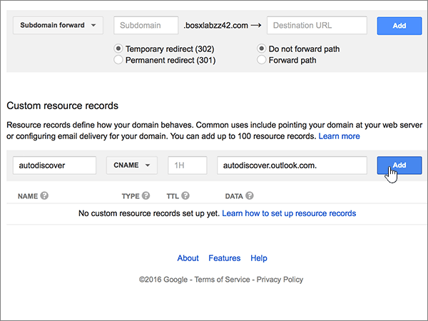

# Crear registros DNS en Google Domains para Microsoft

 **[Consulte Preguntas más frecuentes acerca de los dominios](../setup/domains-faq.yml)** si no encuentra lo que busca. 
  
Si Google Domains es su proveedor de host DNS, siga los pasos de este artículo para comprobar su dominio y configurar los registros DNS para el correo electrónico, Lync, etc.
  
Después de agregar estos registros a Google Domains, el dominio estará configurado para funcionar con los servicios de Microsoft.
  

  
> [!NOTE]
> Normalmente, se necesitan unos 15 minutos para que los cambios de DNS surtan efecto. Sin embargo, a veces los cambios pueden necesitar más tiempo para aplicarse en todo el sistema DNS de Internet. Si tiene problemas con el flujo de correo u otros problemas después de agregar registros DNS, consulte [Encontrar y solucionar problemas después de agregar el dominio o registros DNS en Microsoft](../get-help-with-domains/find-and-fix-issues.md). 
  
## Agregar un registro TXT para verificación

Antes de utilizar el dominio con Microsoft, tenemos que asegurarnos de que sea el propietario. Si puede iniciar sesión en la cuenta en el registrador de dominio y crear el registro DNS, Microsoft sabrá que es el propietario del dominio.
  
> [!NOTE]
> Este registro se usa exclusivamente para verificar si se es el propietario de un dominio; no afecta a nada más. Puede eliminarlo más adelante, si lo desea. 
  
1. Para empezar, vaya a su página de dominios en Google Domains a través de [este vínculo](https://domains.google.com/registrar). Se le pedirá que inicie sesión. Para ello:
    
1. Seleccione **Iniciar sesión**.
    
2. Escriba sus credenciales de inicio de sesión y vuelva a seleccionar **Iniciar sesión**.
    
2. En la página **Mis dominios**, busque el dominio que quiere usar con Microsoft y seleccione el vínculo **ADMINISTRAR** situado al lado. En el panel de navegación izquierdo, seleccione **DNS**.
    
3. En la sección **Registros de recursos personalizados**, en los cuadros para el nuevo registro, escriba o copie y pegue los valores que aparecen en la tabla siguiente. 
    
    (Es posible que tenga que desplazarse hacia abajo).
    
    (Elija el valor **Tipo** de la lista desplegable). 
    
    |||||
    |:-----|:-----|:-----|:-----|
    |**Nombre**   |**Tipo**   |**TTL**   |**Datos**   |
    |@    |TXT    |1H    |MS=ms *XXXXXXXX*    **Nota:** esto es un ejemplo. Utilice aquí su valor de **Dirección de destino**, desde la tabla. [¿Cómo puedo encontrar esto?](../get-help-with-domains/information-for-dns-records.md)          |
   
4. Elija **Agregar**.
    
5. Espere unos minutos antes de continuar para que el registro que acaba de crear pueda actualizarse en Internet.
    
Ahora que ha agregado el registro en el sitio de su registrador de dominios, deberá volver a Microsoft y solicitar el registro.
  
Cuando Microsoft encuentre el registro TXT correcto, se comprobará su dominio.
  
1. En el centro de administración de Microsoft, diríjase a la página **Configuración** \> <a href="https://go.microsoft.com/fwlink/p/?linkid=834818" target="_blank">Dominios</a>.

    
2. En la página **Dominios**, elija el dominio que está verificando. 
    
3. En la página de **Configuración**, elija **Iniciar configuración**.
    
4. En la página **Verificar dominio**, elija **Verificar**.
    
> [!NOTE]
> Normalmente, se necesitan unos 15 minutos para que los cambios de DNS surtan efecto. Sin embargo, a veces los cambios pueden necesitar más tiempo para aplicarse en todo el sistema DNS de Internet. Si tiene problemas con el flujo de correo u otros problemas después de agregar registros DNS, vea [Encontrar y solucionar problemas después de agregar el dominio o los registros DNS](../get-help-with-domains/find-and-fix-issues.md). 

  
## Agregar un registro MX para que el correo electrónico del dominio vaya a Microsoft

1. Para empezar, vaya a su página de dominios en Google Domains a través de [este vínculo](https://domains.google.com/registrar). Se le pedirá que inicie sesión. Para ello:
    
2. Seleccione **Iniciar sesión**.
    
3. Escriba sus credenciales de inicio de sesión y vuelva a seleccionar **Iniciar sesión**.
4. En la página **Dominios**, en la sección **Dominio**, seleccione **Configurar DNS** para el dominio que quiera editar.
    
    > [!IMPORTANT]
    > Si tiene una cuenta de correo electrónico de G Suite, primero deberá eliminar los registros MX asociados a esa cuenta. Los registros MX de G Suite le impiden agregar otros registros MX, incluidos los que se requieren para Microsoft. Tenga en cuenta que eliminar los registros de G Suite no elimina su cuenta de G Suite. Para eliminar sus registros MX de G Suite, siga los pasos que se muestran a continuación. 
  
5. En la sección **Registros sintéticos**, en el área **G Suite**, seleccione **Eliminar**
    
    (Es posible que tenga que desplazarse hacia abajo).
    
    
  
6. Seleccione **Eliminar**.
    
    
  
7. En la sección **Registros de recursos personalizados**, en los cuadros para el nuevo registro, escriba o copie y pegue los valores que aparecen en la tabla siguiente. 
    
    (Es posible que tenga que desplazarse hacia abajo).
    
    (Elija el valor **Tipo** de la lista desplegable). 
    
    |**Nombre**|**Tipo**|**TTL**|**Datos**|
    |:-----|:-----|:-----|:-----|
    |@    |MX    |1H    |0  *\<domain-key\>*  .mail.protection.outlook.com.    **Este valor DEBE terminar en punto (.).**   El valor de **0** se corresponde con la prioridad MX. Agréguelo al principio del valor MX, separado del resto del valor por un espacio.    **Nota:** Obtenga la \<*domain-key*\> desde su cuenta de Microsoft.  [¿Cómo puedo encontrar esto?](../get-help-with-domains/information-for-dns-records.md)          Para obtener más información sobre la prioridad, consulte [¿Qué es una prioridad de MX?](../setup/domains-faq.yml)   |
   
    
  
5. Seleccione **Agregar**.
    
    
  
6. Si hay otros registros MX personalizados, quítelos.
    
1. Seleccione **Editar** en la fila de registro MX. 
    
    
  
2. Para cada registro MX personalizado restante, seleccione la entrada en el cuadro **Datos** y después pulse la tecla **Suprimir** en el teclado para eliminar ese registro. 
    
    Continúe hasta haber eliminado la entrada **Datos** de cada uno de los demás registros MX. 
    
    
  
7. Después de eliminar la entrada **Datos** del resto de los registros MX, seleccione **Guardar** para guardar los cambios. 
    
    
  
## Agregar los cinco registros CNAME necesarios para Microsoft

1. Para empezar, vaya a su [página de Google Domains] (https://domains.google.com/registrar) e inicie sesión.
    
2. En la página **Dominios**, en la sección **Dominio**, seleccione **Configurar DNS** para el dominio que quiera editar. 
    
3. Agregue el primer registro CNAME.
    
    En la sección **Registros de recursos personalizados**, en los cuadros del nuevo registro, escriba o copie y pegue los valores que aparecen en la primera fila de la tabla siguiente. 
    
    (Es posible que tenga que desplazarse hacia abajo).
    
    (Elija el valor **Tipo** de la lista desplegable). 
    
    |**Nombre**|**Tipo**|**TTL**|**Datos**|
    |:-----|:-----|:-----|:-----|
    |autodiscover    |CNAME    |1H    |autodiscover.outlook.com.    **Este valor DEBE terminar en punto (.)**   |
    |sip    |CNAME    |1H    |sipdir.online.lync.com.    **Este valor DEBE terminar en punto (.)**   |
    |lyncdiscover    |CNAME    |1H    |webdir.online.lync.com.    **Este valor DEBE terminar en punto (.)**   |
    |enterpriseregistration    |CNAME    |1H    |enterpriseregistration.windows.net.    **Este valor DEBE terminar en punto (.)**   |
    |enterpriseenrollment    |CNAME    |1H    |enterpriseenrollment-s.manage.microsoft.com.    **Este valor DEBE terminar en punto (.).**   |
   
    
  
4. Seleccione **Agregar**.
    
    
  
5. Agregue los otros cuatro registros CNAME.
    
    En la sección **Registros de recursos personalizados**, cree un registro mediante los valores de la siguiente fila de la tabla y vuelva a seleccionar **Agregar** para completar ese registro. 
    
    Repita este proceso hasta crear todos los registros CNAME necesarios.
    
## Agregar un registro TXT para SPF para ayudar a prevenir el spam de correo electrónico

> [!IMPORTANT]
> No puede tener más de un registro TXT para el SPF de un dominio. Si su dominio tiene más de un registro de SPF, obtendrá errores de correo, así como problemas de clasificación de entrega y de correo no deseado. Si ya tiene un registro de SPF para su dominio, no cree uno nuevo para Microsoft. En vez de eso, agregue los valores necesarios de Microsoft para el registro actual, de modo que solo tenga un único registro de SPF que incluya ambos conjuntos de valores. ¿Necesita ejemplos? Consulte los [Registros externos del sistema de nombres de dominio para Microsoft](../../enterprise/external-domain-name-system-records.md#bkmk_spfrecords). To validate your SPF record, you can use one of these [SPF validation tools](../setup/domains-faq.yml). 
  
1. Para empezar, vaya a su página de dominios en Google Domains a través de [este vínculo](https://domains.google.com/registrar). Se le pedirá que inicie sesión. Para ello:
    
1. Seleccione **Iniciar sesión**.
    
2. Escriba sus credenciales de inicio de sesión y vuelva a seleccionar **Iniciar sesión**.
    
3. En la página **Dominios**, en la sección **Dominio**, seleccione **Configurar DNS** para el dominio que quiera editar. 
    
4. En la sección **Registros de recursos personalizados**, en la fila del registro TXT, seleccione **Editar**. 
    
    > [!IMPORTANT]
    > Google Domains almacena los registros TXT como un conjunto que puede contener varios registros. Cuando tenga como mínimo otro registro TXT (como el registro TXT que usó para comprobar el dominio), necesitará agregar los nuevos registros TXT a ese conjunto de registros. Si intenta agregar otros registros TXT como entradas separadas, se mostrará el mensaje de error **Registro duplicado**. 
  
    
  
5. Seleccione el control **(+)**. 
    
    
  
6. En los cuadros para el nuevo registro, escriba o copie y pegue los valores de la tabla siguiente.
    
    (Es posible que tenga que desplazarse hacia abajo).
    
    |**Datos**|
    |:-----|
    |v=spf1 include:spf.protection.outlook.com -all    

    > [!NOTE]
    > Recomendamos copiar y pegar esta entrada, para que todo el espaciado sea correcto.           
   
   
  
7. Seleccione **Guardar**.
    
    
  
## Agregar los dos registros SRV necesarios para Microsoft

1. Para empezar, vaya a su página de dominios en Google Domains a través de [este vínculo](https://domains.google.com/registrar). Se le pedirá que inicie sesión. Para ello:
    
2. Seleccione **Iniciar sesión**.
    
3. Escriba sus credenciales de inicio de sesión y vuelva a seleccionar **Iniciar sesión**.
    
4. En la página **Dominios**, en la sección **Dominio**, seleccione **Configurar DNS** para el dominio que quiera editar. 
    
5. Agregue el primer registro SRV.
    
    En la sección **Registros de recursos personalizados**, en los cuadros para el nuevo registro, escriba o copie y pegue los valores que aparecen en la tabla siguiente. 
    
    (Es posible que tenga que desplazarse hacia abajo).
    
    (Elija el valor **Tipo** de la lista desplegable). 
    
    |**Nombre**|**Tipo**|**TTL**|**Datos**|
    |:-----|:-----|:-----|:-----|
    |_sip._tls|SRV|1H|100 1 443 sipdir.online.lync.com. **Este valor DEBE terminar en punto (.)** **Nota:** Se recomienda copiar y pegar esta entrada para que todo el espaciado sea correcto.           |
    |_sipfederationtls._tcp|SRV|1H|100 1 5061 sipfed.online.lync.com. **Este valor DEBE terminar en punto (.)**

    Recomendamos copiar y pegar esta entrada, para que todo el espaciado sea correcto.       
   
    
  
6. Seleccione **Agregar**.
    
    
  
7. Agregue el otro registro SRV.
    
    En la sección **Registros de recursos personalizados**, cree un registro mediante los valores de la segunda fila de la tabla y vuelva a seleccionar **Agregar** para completar ese registro. 
    
    > [!NOTE]
    > Normalmente, se necesitan unos 15 minutos para que los cambios de DNS surtan efecto. Sin embargo, a veces los cambios pueden necesitar más tiempo para aplicarse en todo el sistema DNS de Internet. Si tiene problemas con el flujo de correo u otros problemas después de agregar registros DNS, vea [Encontrar y solucionar problemas después de agregar el dominio o los registros DNS](../get-help-with-domains/find-and-fix-issues.md). 
