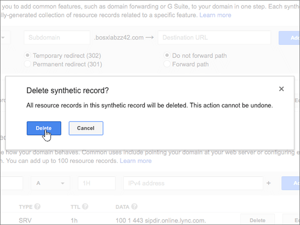

# Crear registros DNS en Google Domains para MicrosoftCreate DNS records at Google Domains for Microsoft

 **[Consulte Preguntas más frecuentes acerca de los dominios](../setup/domains-faq.md)** si no encuentra lo que busca.**[Check the Domains FAQ](../setup/domains-faq.md)** if you don't find what you're looking for. 
  
Si Google Domains es su proveedor de host DNS, siga los pasos de este artículo para comprobar su dominio y configurar los registros DNS para el correo electrónico, Lync, etc.If Google Domains is your DNS hosting provider, follow the steps in this article to verify your domain and set up DNS records for email, Lync, and so on.
  
Después de agregar estos registros a Google Domains, el dominio estará configurado para funcionar con los servicios de Microsoft.After you add these records at Google Domains, your domain will be set up to work with Microsoft services.
  

  
> [!NOTE]
> Normalmente, se necesitan unos 15 minutos para que los cambios de DNS surtan efecto.Typically it takes about 15 minutes for DNS changes to take effect. Sin embargo, a veces los cambios pueden necesitar más tiempo para aplicarse en todo el sistema DNS de Internet.However, it can occasionally take longer for a change you've made to update across the Internet's DNS system. Si tiene problemas con el flujo de correo u otros problemas después de agregar registros DNS, consulte [Buscar y corregir problemas después de agregar el dominio o los registros DNS en Microsoft](../get-help-with-domains/find-and-fix-issues.md).If you're having trouble with mail flow or other issues after adding DNS records, see [Find and fix issues after adding your domain or DNS records in Microsoft](../get-help-with-domains/find-and-fix-issues.md). 
  
## Agregar un registro TXT para verificaciónAdd a TXT record for verification

Antes de utilizar el dominio con Microsoft, tenemos que asegurarnos de que sea el propietario. Si puede iniciar sesión en la cuenta en el registrador de dominio y crear el registro DNS, Microsoft sabrá que es el propietario del dominio.Before you use your domain with Microsoft, we have to make sure that you own it. Your ability to log in to your account at your domain registrar and create the DNS record proves to Microsoft that you own the domain.
  
> [!NOTE]
> Este registro se usa exclusivamente para verificar si se es el propietario de un dominio; no afecta a nada más. Puede eliminarlo más adelante, si lo desea.This record is used only to verify that you own your domain; it doesn't affect anything else. You can delete it later, if you like. 
  
1. Para empezar, vaya a su página de dominios en Google Domains a través de [este vínculo](https://domains.google.com/registrar). Se le pedirá que inicie sesión. Para ello:To get started, go to your domains page at Google Domains by using [this link](https://domains.google.com/registrar). You'll be prompted to sign in. To do so:
    
1. Seleccione **iniciar sesión**.Select **Sign In**.
    
2. Escriba sus credenciales de inicio de sesión y, después, seleccione **iniciar sesión de**nuevo.Enter your login credentials, and then again select **Sign In**.
    
2. En la página **mis dominios** , busque el dominio que desea usar con Microsoft y seleccione el vínculo **administrar** junto a él.On the **My domains** page, find the domain you want to use with Microsoft, and select the **MANAGE** link next to it. En el panel de navegación izquierdo, seleccione **DNS**.In the left navigation, select **DNS**.
    
3. In the **Custom resource records** section, in the boxes for the new record, type or copy and paste the values from the following table.In the **Custom resource records** section, in the boxes for the new record, type or copy and paste the values from the following table. 
    
    (You may have to scroll down.)(You may have to scroll down.)
    
    (Choose the **Type** value from the drop-down list.)(Choose the **Type** value from the drop-down list.) 
    
    |||||
    |:-----|:-----|:-----|:-----|
    |**Name****Name**   |**Type****Type**   |**TTL****TTL**   |**Datos****Data**   |
    |@    |TXTTXT    |1H1H    |MS=ms *XXXXXXXX*MS=ms *XXXXXXXX*    **Nota:** esto es un ejemplo.**Note:** This is an example. Utilice aquí su valor de **Dirección de destino**, desde la tabla.Use your specific **Destination or Points to Address** value here, from the table. [¿Cómo puedo encontrar esto?How do I find this?](../get-help-with-domains/information-for-dns-records.md)          |
   
4. Elija **Agregar**.Select **Add**.
    
5. Espere unos minutos antes de continuar para que el registro que acaba de crear pueda actualizarse en Internet.Wait a few minutes before you continue, so that the record you just created can update across the Internet.
    
Ahora que ha agregado el registro en el sitio de su registrador de dominios, deberá volver a Microsoft y solicitar el registro.Now that you've added the record at your domain registrar's site, you'll go back to Microsoft and request the record.
  
Cuando Microsoft encuentre el registro TXT correcto, se comprobará su dominio.When Microsoft finds the correct TXT record, your domain is verified.
  
1. En el centro de administración de Microsoft, diríjase a la página **Configuración** \> <a href="https://go.microsoft.com/fwlink/p/?linkid=834818" target="_blank">Dominios</a>.In the Microsoft admin center, go to the **Settings** \> <a href="https://go.microsoft.com/fwlink/p/?linkid=834818" target="_blank">Domains</a> page.

    
2. En la página **Dominios**, elija el dominio que está verificando.On the **Domains** page, select the domain that you are verifying. 
    
3. En la página de **Configuración**, elija \*\* Iniciar configuración\*\*.On the **Setup** page, select **Start setup**.
    
4. En la página**Verificar dominio**, elija **Verificar**.On the **Verify domain** page, select **Verify**.
    
> [!NOTE]
> Normalmente, se necesitan unos 15 minutos para que los cambios de DNS surtan efecto.Typically it takes about 15 minutes for DNS changes to take effect. Sin embargo, a veces los cambios pueden necesitar más tiempo para aplicarse en todo el sistema DNS de Internet.However, it can occasionally take longer for a change you've made to update across the Internet's DNS system. Si tiene problemas con el flujo de correo u otros problemas después de agregar registros DNS, vea [Encontrar y solucionar problemas después de agregar el dominio o los registros DNS](../get-help-with-domains/find-and-fix-issues.md).If you're having trouble with mail flow or other issues after adding DNS records, see [Find and fix issues after adding your domain or DNS records](../get-help-with-domains/find-and-fix-issues.md). 

  
## Agregar un registro MX para que el correo electrónico del dominio vaya a MicrosoftAdd an MX record so email for your domain will come to Microsoft

1. Para empezar, vaya a su página de dominios en Google Domains a través de [este vínculo](https://domains.google.com/registrar). Se le pedirá que inicie sesión. Para ello:To get started, go to your domains page at Google Domains by using [this link](https://domains.google.com/registrar). You'll be prompted to sign in. To do so:
    
2. Seleccione **iniciar sesión**.Select **Sign In**.
    
3. Escriba sus credenciales de inicio de sesión y, después, seleccione **iniciar sesión de**nuevo.Enter your login credentials, and then again select **Sign In**.
4. En la página **dominios** , en la sección **dominio** , seleccione **configurar DNS** para el dominio que desea editar.On the **Domains** page, in the **Domain** section, select **Configure DNS** for the domain that you want to edit.
    
    > [!IMPORTANT]
    > Si tiene una cuenta de correo electrónico de G Suite, primero deberá eliminar los registros MX asociados a esa cuenta.If you have a G Suite email account, you must first delete the MX records associated with that account. Los registros MX de G Suite le impiden agregar otros registros MX, incluidos los necesarios para Microsoft.The G Suite MX records prevent you from adding any other MX records, including those required for Microsoft. Tenga en cuenta que eliminar los registros de G Suite no elimina su cuenta de G Suite.Note that deleting the G Suite records does not delete your G Suite account. Para eliminar sus registros MX de G Suite, siga los pasos que se muestran a continuación.To delete your G Suite MX records, use the following steps. 
  
5. En la sección **registros sintéticos** , en el área **G Suite** , seleccione **eliminar**.In the **Synthetic records** section, in the **G Suite** area, select **Delete**.
    
    (You may have to scroll down.)(You may have to scroll down.)
    
    
  
6. Seleccione **Eliminar**.Select **Delete**.
    
    
  
7. In the **Custom resource records** section, in the boxes for the new record, type or copy and paste the values from the following table.In the **Custom resource records** section, in the boxes for the new record, type or copy and paste the values from the following table. 
    
    (You may have to scroll down.)(You may have to scroll down.)
    
    (Choose the **Type** value from the drop-down list.)(Choose the **Type** value from the drop-down list.) 
    
    |**Name****Name**|**Type****Type**|**TTL****TTL**|**Datos****Data**|
    |:-----|:-----|:-----|:-----|
    |@    |MXMX    |1H1H    |0  *\<clave-de-dominio\>*  .mail.protection.outlook.com.0  *\<domain-key\>*  .mail.protection.outlook.com.    **Este valor DEBE terminar en punto (.).****This value MUST end with a period (.)**   El valor de **0** se corresponde con la prioridad MX. Agréguelo al principio del valor MX, separado del resto del valor por un espacio.  The **0** is the MX priority value. Add it to the beginning of the MX value, separated from the remainder of the value by a space.    **Nota:** Obtenga la \<*clave-de-dominio*\> desde su cuenta de Microsoft.**Note:** Get your \<*domain-key*\> from your Microsoft account.  [¿Cómo puedo encontrarla?How do I find this?](../get-help-with-domains/information-for-dns-records.md)          Para obtener más información sobre la prioridad, consulte [¿Qué es una prioridad de MX?](https://support.office.com/article/2784cc4d-95be-443d-b5f7-bb5dd867ba83.aspx)For more information about priority, see [What is MX priority?](https://support.office.com/article/2784cc4d-95be-443d-b5f7-bb5dd867ba83.aspx)   |
   
    
  
5. Seleccione **Agregar**.Select **Add**.
    
    
  
6. Si hay otros registros MX personalizados, quítelos:If there are any other Custom MX records, remove them.
    
1. Seleccione **Editar** en la fila del registro MX.Select **Edit** in the MX record row. 
    
    
  
2. Para cada uno de los demás registros MX personalizados, seleccione la entrada en el cuadro **datos** y, después, presione la tecla **suprimir** en el teclado para eliminar ese registro.For each of the other Custom MX records, select the entry in the **Data** box and then press the **Delete** key on your keyboard to delete that record. 
    
    Continúe hasta haber eliminado la entrada **Datos** de cada uno de los demás registros MX.Continue until you have deleted the **Data** entry for each of the other MX records. 
    
    
  
7. Cuando haya eliminado la entrada de **datos** de cada uno de los demás registros MX, seleccione **Guardar** para guardar los cambios.When you have deleted the **Data** entry for each of the other MX records, select **Save** to save your changes. 
    
    
  
## Agregar los cinco registros CNAME necesarios para MicrosoftAdd the five CNAME records that are required for Microsoft

1. Para empezar, vaya a su página de [Google Domains]https://domains.google.com/registrar) (e inicie sesión.To get started, go to your [Google Domains page] (https://domains.google.com/registrar) and sign in.
    
2. En la página **dominios** , en la sección **dominio** , seleccione **configurar DNS** para el dominio que desea editar.On the **Domains** page, in the **Domain** section, select **Configure DNS** for the domain that you want to edit. 
    
3. Agregue el primer registro CNAME.Add the first CNAME record.
    
    En la sección **Registros de recursos personalizados**, en los cuadros del nuevo registro, escriba o copie y pegue los valores que aparecen en la primera fila de la tabla siguiente.In the **Custom resource records** section, in the boxes for the new record, type or copy and paste the values from first row of the following table. 
    
    (You may have to scroll down.)(You may have to scroll down.)
    
    (Choose the **Type** value from the drop-down list.)(Choose the **Type** value from the drop-down list.) 
    
    |**Name****Name**|**Type****Type**|**TTL****TTL**|**Datos****Data**|
    |:-----|:-----|:-----|:-----|
    |autodiscoverautodiscover    |CNAMECNAME    |1H1H    |autodiscover.outlook.com.autodiscover.outlook.com.    **This value MUST end with a period (.)****This value MUST end with a period (.)**   |
    |sipsip    |CNAMECNAME    |1H1H    |sipdir.online.lync.com.sipdir.online.lync.com.    **This value MUST end with a period (.)****This value MUST end with a period (.)**   |
    |lyncdiscoverlyncdiscover    |CNAMECNAME    |1H1H    |webdir.online.lync.com.webdir.online.lync.com.    **This value MUST end with a period (.)****This value MUST end with a period (.)**   |
    |enterpriseregistrationenterpriseregistration    |CNAMECNAME    |1H1H    |enterpriseregistration.windows.net.enterpriseregistration.windows.net.    **This value MUST end with a period (.)****This value MUST end with a period (.)**   |
    |enterpriseenrollmententerpriseenrollment    |CNAMECNAME    |1H1H    |enterpriseenrollment-s.manage.microsoft.com.enterpriseenrollment-s.manage.microsoft.com.    **This value MUST end with a period (.)****This value MUST end with a period (.)**   |
   
    
  
4. Seleccione **Agregar**.Select **Add**.
    
    
  
5. Agregue los otros cuatro registros CNAME.Add the other four CNAME records.
    
    En la sección **registros de recursos personalizados** , cree un registro (para hacerlo, use los valores de la siguiente fila de la tabla y, después, vuelva a seleccionar **Agregar** para completar ese registro).In the **Custom resource records** section, create a record by using the values from the next row in the table, and then again select **Add** to complete that record. 
    
    Repita este proceso hasta que haya creado todos los registros CNAME necesarios.Repeat this process until you have created all of the required CNAME records.
    
## Agregar un registro TXT para SPF para ayudar a prevenir el spam de correo electrónicoAdd a TXT record for SPF to help prevent email spam

> [!IMPORTANT]
> No puede tener más de un registro TXT para el SPF de un dominio.You cannot have more than one TXT record for SPF for a domain. Si su dominio tiene más de un registro de SPF, obtendrá errores de correo, así como problemas de clasificación de entrega y de correo no deseado.If your domain has more than one SPF record, you'll get email errors, as well as delivery and spam classification issues. Si ya tiene un registro de SPF para su dominio, no cree uno nuevo para Microsoft.If you already have an SPF record for your domain, don't create a new one for Microsoft. En vez de eso, agregue los valores necesarios de Microsoft para el registro actual, de modo que solo tenga un único registro de SPF que incluya ambos conjuntos de valores.Instead, add the required Microsoft values to the current record so that you have a single SPF record that includes both sets of values. ¿Necesita ejemplos?Need examples? Consulte los [Registros externos del sistema de nombres de dominio para Microsoft](https://support.office.com/article/c0531a6f-9e25-4f2d-ad0e-a70bfef09ac0#bkmk_spfrecords).Check out these [External Domain Name System records for Microsoft](https://support.office.com/article/c0531a6f-9e25-4f2d-ad0e-a70bfef09ac0#bkmk_spfrecords). To validate your SPF record, you can use one of these [SPF validation tools](../setup/domains-faq.md).To validate your SPF record, you can use one of these [SPF validation tools](../setup/domains-faq.md). 
  
1. Para empezar, vaya a su página de dominios en Google Domains a través de [este vínculo](https://domains.google.com/registrar). Se le pedirá que inicie sesión. Para ello:To get started, go to your domains page at Google Domains by using [this link](https://domains.google.com/registrar). You'll be prompted to sign in. To do so:
    
1. Seleccione **iniciar sesión**.Select **Sign In**.
    
2. Escriba sus credenciales de inicio de sesión y, después, seleccione **iniciar sesión de**nuevo.Enter your login credentials, and then again select **Sign In**.
    
3. En la página **dominios** , en la sección **dominio** , seleccione **configurar DNS** para el dominio que desea editar.On the **Domains** page, in the **Domain** section, select **Configure DNS** for the domain that you want to edit. 
    
4. En la sección **registros de recursos personalizados** , en la fila registro TXT, seleccione **Editar**.In the **Custom resource records** section, on the TXT record row, select **Edit**. 
    
    > [!IMPORTANT]
    > Google Domains almacena los registros TXT como un conjunto que puede contener varios registros. Cuando tenga como mínimo otro registro TXT (como el registro TXT que usó para comprobar el dominio), necesitará agregar los nuevos registros TXT a ese conjunto de registros. Si intenta agregar otros registros TXT como entradas separadas, se mostrará el mensaje de error **Registro duplicado**.Google Domains stores TXT records as a set that may contain multiple records. When you have at least one other TXT record, such as the TXT record you used to verify your domain, you must add TXT new records to that record set. Any attempt to enter additional TXT records as separate entries will result in a **Duplicate record** error message. 
  
    
  
5. Seleccione el control **(+)** .Select the **(+)** control. 
    
    
  
6. En los cuadros para el nuevo registro, escriba o copie y pegue los valores de la tabla siguiente.In the boxes for the new record, type or copy and paste the values from the following table.
    
    (Es posible que tenga que desplazarse hacia abajo).(You may have to scroll down.)
    
    |**Datos****Data**|
    |:-----|
    |v=spf1 include:spf.protection.outlook.com -allv=spf1 include:spf.protection.outlook.com -all    

    > [!NOTE]
    > Recomendamos copiar y pegar esta entrada, para que todo el espacio sea correcto.We recommend copying and pasting this entry, so that all of the spacing stays correct.           
   
   
  
7. Haga clic en **Guardar**.Select **Save**.
    
    
  
## Agregar los dos registros SRV necesarios para MicrosoftAdd the two SRV records that are required for Microsoft

1. Para empezar, vaya a su página de dominios en Google Domains a través de [este vínculo](https://domains.google.com/registrar). Se le pedirá que inicie sesión. Para ello:To get started, go to your domains page at Google Domains by using [this link](https://domains.google.com/registrar). You'll be prompted to sign in. To do so:
    
2. Seleccione **iniciar sesión**.Select **Sign In**.
    
3. Escriba sus credenciales de inicio de sesión y, después, seleccione **iniciar sesión de**nuevo.Enter your login credentials, and then again select **Sign In**.
    
4. En la página **dominios** , en la sección **dominio** , seleccione **configurar DNS** para el dominio que desea editar.On the **Domains** page, in the **Domain** section, select **Configure DNS** for the domain that you want to edit. 
    
5. Agregue el primer registro SRV.Add the first SRV record.
    
    In the **Custom resource records** section, in the boxes for the new record, type or copy and paste the values from the following table.In the **Custom resource records** section, in the boxes for the new record, type or copy and paste the values from the following table. 
    
    (You may have to scroll down.)(You may have to scroll down.)
    
    (Choose the **Type** value from the drop-down list.)(Choose the **Type** value from the drop-down list.) 
    
    |**Name****Name**|**Type****Type**|**TTL****TTL**|**Datos****Data**|
    |:-----|:-----|:-----|:-----|
    |_sip. _tls_sip._tls|SRVSRV|1H1H|100 1 443 sipdir.online.lync.com.100 1 443 sipdir.online.lync.com. **Este valor debe terminar con un punto (.).** **Nota:** Se recomienda copiar y pegar esta entrada para que todo el espaciado sea correcto.**This value MUST end with a period (.)** **Note:** We recommend copying and pasting this entry, so that all of the spacing stays correct.           |
    |_sipfederationtls. _tcp_sipfederationtls._tcp|SRVSRV|1H1H|100 1 5061 sipfed.online.lync.com.100 1 5061 sipfed.online.lync.com. **This value MUST end with a period (.)****This value MUST end with a period (.)**

    Recomendamos copiar y pegar esta entrada, para que todo el espacio sea correcto.We recommend copying and pasting this entry, so that all of the spacing stays correct.       
   
    
  
6. Seleccione **Agregar**.Select **Add**.
    
    
  
7. Agregue el otro registro SRV.Add the other SRV record.
    
    En la sección **registros de recursos personalizados** , cree un registro (para hacerlo, use los valores de la segunda fila de la tabla y, después, vuelva a seleccionar **Agregar** para completar ese registro).In the **Custom resource records** section, create a record by using the values from the second row in the table, and then again select **Add** to complete that record. 
    
    > [!NOTE]
    > Normalmente, se necesitan unos 15 minutos para que los cambios de DNS surtan efecto.Typically it takes about 15 minutes for DNS changes to take effect. Sin embargo, a veces los cambios pueden necesitar más tiempo para aplicarse en todo el sistema DNS de Internet.However, it can occasionally take longer for a change you've made to update across the Internet's DNS system. Si tiene problemas con el flujo de correo u otros problemas después de agregar registros DNS, vea [Encontrar y solucionar problemas después de agregar el dominio o los registros DNS](../get-help-with-domains/find-and-fix-issues.md).If you're having trouble with mail flow or other issues after adding DNS records, see [Find and fix issues after adding your domain or DNS records](../get-help-with-domains/find-and-fix-issues.md). 
  
