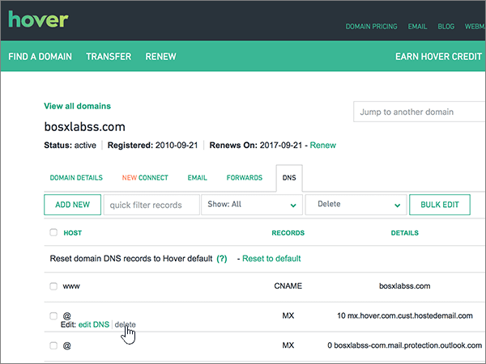
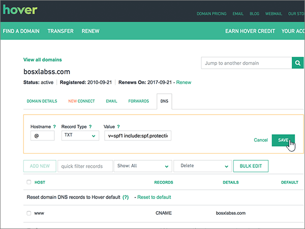
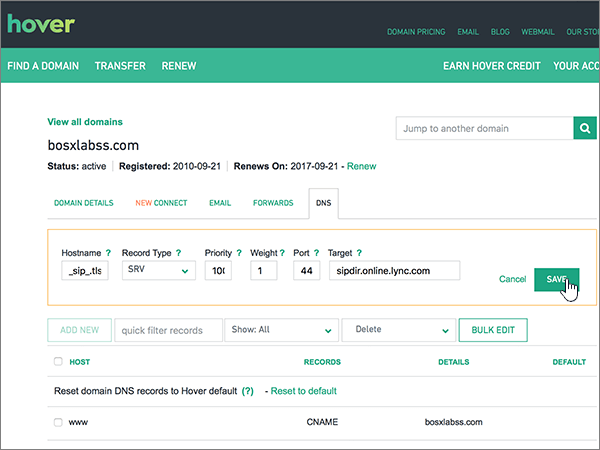

# Crear registros DNS en hover para MicrosoftCreate DNS records at Hover for Microsoft

 **[Consulte Preguntas más frecuentes acerca de los dominios](../setup/domains-faq.md)** si no encuentra lo que busca.**[Check the Domains FAQ](../setup/domains-faq.md)** if you don't find what you're looking for. 
  
Si Hover es su proveedor de host DNS, siga los pasos de este artículo para comprobar el dominio y configurar los registros DNS para el correo electrónico, Skype Empresarial Online, etc.If Hover is your DNS hosting provider, follow the steps in this article to verify your domain and set up DNS records for email, Skype for Business Online, and so on.
     
Después de agregar estos registros al pasar el mouse, el dominio estará configurado para funcionar con los servicios de Microsoft.After you add these records at Hover, your domain will be set up to work with Microsoft services.
  
Para obtener más información sobre WebHosting y DNS para sitios web con Microsoft, vea [usar un sitio web público con Microsoft](https://support.office.com/article/choose-a-public-website-3325d50e-d131-403c-a278-7f3296fe33a9).To learn about webhosting and DNS for websites with Microsoft, see [Use a public website with Microsoft](https://support.office.com/article/choose-a-public-website-3325d50e-d131-403c-a278-7f3296fe33a9).
  
> [!NOTE]
>  Por lo general, los cambios de DNS tardan unos 15 minutos en aplicarse. Sin embargo, a veces los cambios pueden necesitar más tiempo para aplicarse en todo el sistema DNS de Internet. Si tiene problemas con el flujo de correo u otros problemas después de agregar registros DNS, consulte [Solucionar problemas después de cambiar el nombre del dominio o los registros DNS](../get-help-with-domains/find-and-fix-issues.md).Typically it takes about 15 minutes for DNS changes to take effect. However, it can occasionally take longer for a change you've made to update across the Internet's DNS system. If you're having trouble with mail flow or other issues after adding DNS records, see [Troubleshoot issues after changing your domain name or DNS records](../get-help-with-domains/find-and-fix-issues.md). 
  
## Agregar un registro TXT para verificaciónAdd a TXT record for verification

Antes de usar el dominio con Microsoft, debemos asegurarnos de que es el propietario.Before you use your domain with Microsoft, we have to make sure that you own it. Su capacidad para iniciar sesión en su cuenta en el registrador de dominios y crear el registro DNS es la que se demuestre a Microsoft que es el propietario del dominio.Your ability to log in to your account at your domain registrar and create the DNS record proves to Microsoft that you own the domain.
  
> [!NOTE]
> Este registro se usa exclusivamente para verificar si se es el propietario de un dominio; no afecta a nada más. Puede eliminarlo más adelante, si lo desea.This record is used only to verify that you own your domain; it doesn't affect anything else. You can delete it later, if you like. 
  
Siga los pasos siguientes o [vea el vídeo](https://support.office.com/article/Video-Create-DNS-records-at-Hover-for-Office-365-182bd58e-8fe4-4717-9233-3a3546b72ad2?ui=en-US&amp;rs=en-US&amp;ad=US).Follow the steps below or [watch the video](https://support.office.com/article/Video-Create-DNS-records-at-Hover-for-Office-365-182bd58e-8fe4-4717-9233-3a3546b72ad2?ui=en-US&amp;rs=en-US&amp;ad=US).
  
1. Para empezar, vaya a la página dominios en Hover mediante [este vínculo](https://www.hover.com/domains). Se le pedirá que inicie sesión.To get started, go to your domains page at Hover by using [this link](https://www.hover.com/domains). You'll be prompted to sign in.
    
    
  
2. En **administre sus dominios**, seleccione el nombre del dominio que desea editar.Under **Manage Your Domains**, select the name of the domain that you want to edit.
    
    
  
3. Seleccione la pestaña **DNS** .Select the **DNS** tab. 
    
    
  
4. Seleccione **Agregar nuevo**.Select **Add New**.
    
    
  
5. In the boxes for the new record, select **TXT** for the **Record Type**, and then type or copy and paste the values from the following table.In the boxes for the new record, select **TXT** for the **Record Type**, and then type or copy and paste the values from the following table.
    
    ||||
    |:-----|:-----|:-----|
    |Nombre de hostHostname    |Tipo de registroRecord Type    |ValorValue    |
    |@    |TXTTXT    |MS=ms *XXXXXXXX*MS=ms *XXXXXXXX*    **Nota:** esto es un ejemplo.**Note:** This is an example. Use aquí su **destino específico o** el valor de dirección de destino de la tabla.Use your specific **Destination or Points to Address** value here, from the table.           [¿Cómo puedo encontrar esto?How do I find this?](../get-help-with-domains/information-for-dns-records.md)          |
   
    
  
6. Seleccione **Guardar**.Select **Save**.
    
    
  
7. Espere unos minutos antes de continuar para que el registro que acaba de crear pueda actualizarse en Internet.Wait a few minutes before you continue, so that the record you just created can update across the Internet.
    
Ahora que ha agregado el registro en el sitio del registrador de dominios, volverá a Microsoft 365 y pedirá a Microsoft 365 que busque el registro.Now that you've added the record at your domain registrar's site, you'll go back to Microsoft 365 and request Microsoft 365 to look for the record.
  
Cuando Microsoft encuentre el registro TXT correcto, se comprobará el dominio.When Microsoft finds the correct TXT record, your domain is verified.
  
1. En el centro de administración de Microsoft, vaya a la página de **configuración** \> de <a href="https://go.microsoft.com/fwlink/p/?linkid=834818" target="_blank">dominios</a> .In the Microsoft admin center, go to the **Settings** \> <a href="https://go.microsoft.com/fwlink/p/?linkid=834818" target="_blank">Domains</a> page.
    
2. En la página **Dominios**, elija el dominio que está verificando.On the **Domains** page, select the domain that you are verifying. 
    
    
  
3. En la página de **Configuración**, elija \*\* Iniciar configuración\*\*.On the **Setup** page, select **Start setup**.
    
    
  
4. En la página**verificar dominio**, seleccione **verificar**.On the **Verify domain** page, select **Verify**.
    
    
  
> [!NOTE]
>  Por lo general, los cambios de DNS tardan unos 15 minutos en aplicarse. Sin embargo, a veces los cambios pueden necesitar más tiempo para aplicarse en todo el sistema DNS de Internet. Si tiene problemas con el flujo de correo u otros problemas después de agregar registros DNS, consulte [Solucionar problemas después de cambiar el nombre del dominio o los registros DNS](../get-help-with-domains/find-and-fix-issues.md).Typically it takes about 15 minutes for DNS changes to take effect. However, it can occasionally take longer for a change you've made to update across the Internet's DNS system. If you're having trouble with mail flow or other issues after adding DNS records, see [Troubleshoot issues after changing your domain name or DNS records](../get-help-with-domains/find-and-fix-issues.md). 
  
## Agregar un registro MX para que el correo electrónico del dominio llegue a MicrosoftAdd an MX record so email for your domain will come to Microsoft

Siga los pasos siguientes o [vea el vídeo](https://support.office.com/article/Video-Create-DNS-records-at-Hover-for-Office-365-182bd58e-8fe4-4717-9233-3a3546b72ad2?ui=en-US&amp;rs=en-US&amp;ad=US).Follow the steps below or [watch the video](https://support.office.com/article/Video-Create-DNS-records-at-Hover-for-Office-365-182bd58e-8fe4-4717-9233-3a3546b72ad2?ui=en-US&amp;rs=en-US&amp;ad=US).
  
1. Para empezar, vaya a la página dominios en Hover mediante [este vínculo](https://www.hover.com/domains). Se le pedirá que inicie sesión.To get started, go to your domains page at Hover by using [this link](https://www.hover.com/domains). You'll be prompted to sign in.
    
    
  
2. En **administre sus dominios**, seleccione el nombre del dominio que desea editar.Under **Manage Your Domains**, select the name of the domain that you want to edit.
    
    
  
3. Seleccione la pestaña **DNS** .Select the **DNS** tab. 
    
    
  
4. Seleccione **Agregar nuevo**.Select **Add New**.
    
    
  
5. En los cuadros para el nuevo registro, seleccione **MX** para el **Tipo de registro** y, a continuación, escriba o copie y pegue los valores de la tabla siguiente.In the boxes for the new record, select **MX** for the **Record Type**, and then type or copy and paste the values from the following table.
    
    |**Nombre de host****Hostname**|**Tipo de registro****Record Type**|**Prioridad****Priority**|**Nombre de host****Hostname**|
    |:-----|:-----|:-----|:-----|
    |@    |MXMX    |comprendi0    Para obtener más información sobre la prioridad, consulte [¿Qué es una prioridad de MX?](https://support.office.com/article/2784cc4d-95be-443d-b5f7-bb5dd867ba83.aspx)For more information about priority, see [What is MX priority?](https://support.office.com/article/2784cc4d-95be-443d-b5f7-bb5dd867ba83.aspx)   | *\< clave-de-dominio \>*  . mail.protection.outlook.com    *\<domain-key\>*  .mail.protection.outlook.com    **Nota:** Obtén tu \* \<clave\> de dominio\* de tu cuenta de Microsoft.**Note:** Get your  *\<domain-key\>*  from your Microsoft account.           [¿Cómo puedo encontrar esto?How do I find this?](../get-help-with-domains/information-for-dns-records.md)          |
   
    
  
6. Seleccione **Guardar**.Select **Save**.
    
    
  
7. Si existen otros registros MX, quite cada uno de ellos usando el procedimiento de dos pasos siguiente:If there are any other MX records, use the following two-step process to remove each of them:
    
    En primer lugar, mueva sobre un registro que quiera quitar, seleccione **eliminar**.First, mousing over a record that you want to remove, select **Delete**.
    
    
  
    En segundo lugar, seleccione **sí** para confirmar cada eliminación.Second, select **Yes** to confirm each deletion. 
    
    
  
    Repita este proceso hasta que haya eliminado todos los registros MX excepto el que haya agregado anteriormente en este procedimiento.Repeat this process until you have deleted all MX records except for the one that you added earlier in this procedure.
    
## Agregar los registros CNAME necesarios para MicrosoftAdd the CNAME records that are required for Microsoft

Siga los pasos siguientes o [vea el vídeo](https://support.office.com/article/Video-Create-DNS-records-at-Hover-for-Office-365-182bd58e-8fe4-4717-9233-3a3546b72ad2?ui=en-US&amp;rs=en-US&amp;ad=US).Follow the steps below or [watch the video](https://support.office.com/article/Video-Create-DNS-records-at-Hover-for-Office-365-182bd58e-8fe4-4717-9233-3a3546b72ad2?ui=en-US&amp;rs=en-US&amp;ad=US).
  
1. Para empezar, vaya a la página dominios en Hover mediante [este vínculo](https://www.hover.com/domains). Se le pedirá que inicie sesión.To get started, go to your domains page at Hover by using [this link](https://www.hover.com/domains). You'll be prompted to sign in.
    
    
  
2. En **administre sus dominios**, seleccione el nombre del dominio que desea editar.Under **Manage Your Domains**, select the name of the domain that you want to edit.
    
    
  
3. Seleccione la pestaña **DNS** .Select the **DNS** tab. 
    
    
  
4. Agregue el primero de los seis registros CNAME.Add the first of the six CNAME records.
    
    Seleccione **Agregar nuevo**.Select **Add New**.
    
    
  
5. En los cuadros vacíos para el nuevo registro, seleccione **CNAME** para el **Tipo de registro** y, a continuación, escriba o copie y pegue los valores de la primera fila de la tabla siguiente.In the empty boxes for the new record, select **CNAME** for the **Record Type**, and then type or copy and paste the values from the first row in the following table.
    
    |**Nombre de host****Hostname**|**Tipo de registro****Record Type**|**Host de destino****Target Host**|
    |:-----|:-----|:-----|
    |autodiscoverautodiscover    |CNAMECNAME    |autodiscover.outlook.comautodiscover.outlook.com    |
    |sipsip    |CNAMECNAME    |sipdir.online.lync.comsipdir.online.lync.com    |
    |lyncdiscoverlyncdiscover    |CNAMECNAME    |webdir.online.lync.comwebdir.online.lync.com    |
    |enterpriseregistrationenterpriseregistration    |CNAMECNAME    |enterpriseregistration.windows.netenterpriseregistration.windows.net    |
    |enterpriseenrollmententerpriseenrollment    |CNAMECNAME    |EnterpriseEnrollment-s.manage.microsoft.comenterpriseenrollment-s.manage.microsoft.com    |
   
    
  
6. Seleccione **Guardar**.Select **Save**.
    
    
  
7. Con los tres pasos anteriores y con los valores de las otras cinco filas de la tabla, agregue cada uno de los otros cinco registros CNAME.Using the preceding three steps and the values from the other five rows in the table, add each of the other five CNAME records.
    
## Agregar un registro TXT para SPF para ayudar a prevenir el spam de correo electrónicoAdd a TXT record for SPF to help prevent email spam

> [!IMPORTANT]
> No puede tener más de un registro TXT para el SPF de un dominio.You cannot have more than one TXT record for SPF for a domain. Si su dominio tiene más de un registro de SPF, obtendrá errores de correo, así como problemas de clasificación de entrega y de correo no deseado.If your domain has more than one SPF record, you'll get email errors, as well as delivery and spam classification issues. Si ya tiene un registro de SPF para su dominio, no cree uno nuevo para Microsoft.If you already have an SPF record for your domain, don't create a new one for Microsoft. En su lugar, agregue los valores necesarios de Microsoft al registro activo para que tenga un *único* registro de SPF que incluya ambos conjuntos de valores.Instead, add the required Microsoft values to the current record so that you have a  *single*  SPF record that includes both sets of values. 
  
Siga los pasos siguientes o [vea el vídeo](https://support.office.com/article/Video-Create-DNS-records-at-Hover-for-Office-365-182bd58e-8fe4-4717-9233-3a3546b72ad2?ui=en-US&amp;rs=en-US&amp;ad=US).Follow the steps below or [watch the video](https://support.office.com/article/Video-Create-DNS-records-at-Hover-for-Office-365-182bd58e-8fe4-4717-9233-3a3546b72ad2?ui=en-US&amp;rs=en-US&amp;ad=US).
  
1. Para empezar, vaya a la página dominios en Hover mediante [este vínculo](https://www.hover.com/domains). Se le pedirá que inicie sesión.To get started, go to your domains page at Hover by using [this link](https://www.hover.com/domains). You'll be prompted to sign in.
    
    
  
2. En **administre sus dominios**, seleccione el nombre del dominio que desea editar.Under **Manage Your Domains**, select the name of the domain that you want to edit.
    
    
  
3. Seleccione la pestaña **DNS** .Select the **DNS** tab. 
    
    
  
4. Seleccione **Agregar nuevo**.Select **Add New**.
    
    
  
5. In the boxes for the new record, select **TXT** for the **Record Type**, and then type or copy and paste the values from the following table.In the boxes for the new record, select **TXT** for the **Record Type**, and then type or copy and paste the values from the following table.
    
    |**Nombre de host****Hostname**|**Tipo de registro****Record Type**|**Valor****Value**|
    |:-----|:-----|:-----|
    |@    |TXTTXT    |v=spf1 include:spf.protection.outlook.com -allv=spf1 include:spf.protection.outlook.com -all   **Nota:** recomendamos copiar y pegar esta entrada, para que todo el espacio sea correcto.**Note:** We recommend copying and pasting this entry, so that all of the spacing stays correct.           |
   
    
  
6. Seleccione **Guardar**.Select **Save**.
    
    
  
## Agregar los dos registros SRV necesarios para MicrosoftAdd the two SRV records that are required for Microsoft

Siga los pasos siguientes o [vea el vídeo](https://support.office.com/article/Video-Create-DNS-records-at-Hover-for-Office-365-182bd58e-8fe4-4717-9233-3a3546b72ad2?ui=en-US&amp;rs=en-US&amp;ad=US).Follow the steps below or [watch the video](https://support.office.com/article/Video-Create-DNS-records-at-Hover-for-Office-365-182bd58e-8fe4-4717-9233-3a3546b72ad2?ui=en-US&amp;rs=en-US&amp;ad=US).
  
1. Para empezar, vaya a la página dominios en Hover mediante [este vínculo](https://www.hover.com/domains). Se le pedirá que inicie sesión.To get started, go to your domains page at Hover by using [this link](https://www.hover.com/domains). You'll be prompted to sign in.
    
    
  
2. En **administre sus dominios**, seleccione el nombre del dominio que desea editar.Under **Manage Your Domains**, select the name of the domain that you want to edit.
    
    
  
3. Seleccione la pestaña **DNS** .Select the **DNS** tab. 
    
    
  
4. Agregue el primero de los dos registros SRV.Add the first of the two SRV records.
    
    Seleccione **Agregar nuevo**.Select **Add New**.
    
    
  
5. En los cuadros vacíos para el nuevo registro, seleccione **SRV** para el **Tipo de registro** y, a continuación, escriba o copie y pegue los valores de la primera fila de la tabla siguiente.In the empty boxes for the new record, select **SRV** for the **Record Type**, and then type or copy and paste the values from the first row in the following table.
    
    |**Nombre de host****Hostname**|**Tipo de registro****Record Type**|**Prioridad****Priority**|**Grosor****Weight**|**Puerto****Port**|**Destino****Target**|
    |:-----|:-----|:-----|:-----|:-----|:-----|
    |_sip. _tls_sip._tls    |SRVSRV    |100100    |11    |443443    |sipdir.online.lync.comsipdir.online.lync.com    |
    |_sipfederationtls. _tcp_sipfederationtls._tcp    |SRVSRV    |100100    |11    |50615061    |sipfed.online.lync.comsipfed.online.lync.com    |
   
    
  
6. Seleccione **Guardar**.Select **Save**.
    
    
  
7. Con los tres pasos anteriores y los valores de la segunda fila de la tabla, agregue el otro registro SRV.Using the preceding three steps and the values from the second row in the table, add the other SRV record.
    
> [!NOTE]
> Por lo general, los cambios de DNS tardan unos 15 minutos en aplicarse. Sin embargo, a veces los cambios pueden necesitar más tiempo para aplicarse en todo el sistema DNS de Internet. Si tiene problemas con el flujo de correo u otros problemas después de agregar registros DNS, consulte [Solucionar problemas después de cambiar el nombre del dominio o los registros DNS](../get-help-with-domains/find-and-fix-issues.md).Typically it takes about 15 minutes for DNS changes to take effect. However, it can occasionally take longer for a change you've made to update across the Internet's DNS system. If you're having trouble with mail flow or other issues after adding DNS records, see [Troubleshoot issues after changing your domain name or DNS records](../get-help-with-domains/find-and-fix-issues.md). 
  
