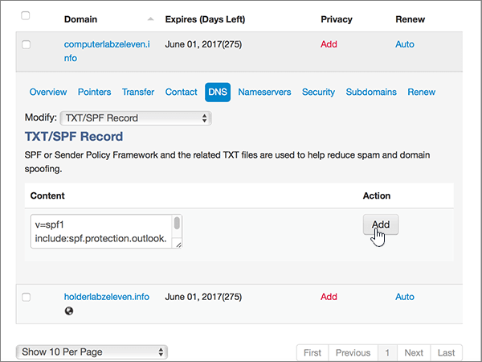

# Crear registros DNS en MiDominio para MicrosoftCreate DNS records at MyDomain for Microsoft

  
 **[Consulte Preguntas más frecuentes acerca de los dominios](../setup/domains-faq.md)** si no encuentra lo que busca.**[Check the Domains FAQ](../setup/domains-faq.md)** if you don't find what you're looking for. 
  
> [!CAUTION]
> El sitio web MyDomain no admite los registros SRV, lo que significa que varias de las características de Skype Empresarial Online y Outlook Web App no funcionarán. No importa qué plan de Microsoft use, si administra sus registros DNS con MyDomain, existen [limitaciones de servicio considerables](https://support.office.com/article/7ae9a655-041d-4724-aa92-60392ee390c2.aspx) y puede que quiera cambiar a un proveedor de host DNS diferente.The MyDomain website doesn't support SRV records, which means several Skype for Business Online and Outlook Web App features won't work. No matter which Microsoft plan you use, if you manage your DNS records at MyDomain, there are [significant service limitations](https://support.office.com/article/7ae9a655-041d-4724-aa92-60392ee390c2.aspx), and you might want to switch to a different DNS hosting provider. 
  
Si decide administrar sus propios registros DNS de Microsoft en MyDomain a pesar de las limitaciones del servicio, siga los pasos de este artículo para configurar los registros DNS para el correo electrónico, Skype Empresarial Online, etc.If you choose to manage your own Microsoft DNS records at MyDomain despite the service limitations, follow the steps in this article to set up your DNS records for email, Skype for Business Online, and so on.
    
Después de agregar estos registros a MyDomain, su dominio estará configurado para trabajar con los servicios de Microsoft.After you add these records at MyDomain, your domain will be set up to work with Microsoft services.
  

  
> [!NOTE]
> Normalmente, se necesitan unos 15 minutos para que los cambios de DNS surtan efecto.Typically it takes about 15 minutes for DNS changes to take effect. Sin embargo, a veces los cambios pueden necesitar más tiempo para aplicarse en todo el sistema DNS de Internet.However, it can occasionally take longer for a change you've made to update across the Internet's DNS system. Si tiene problemas con el flujo de correo u otros problemas después de agregar registros DNS, vea [Encontrar y solucionar problemas después de agregar el dominio o los registros DNS](../get-help-with-domains/find-and-fix-issues.md).If you're having trouble with mail flow or other issues after adding DNS records, see [Find and fix issues after adding your domain or DNS records](../get-help-with-domains/find-and-fix-issues.md). 
  
## Agregar un registro TXT para verificaciónAdd a TXT record for verification

Antes de utilizar el dominio con Microsoft, tenemos que asegurarnos de que sea el propietario. Si puede iniciar sesión en la cuenta en el registrador de dominio y crear el registro DNS, Microsoft sabrá que es el propietario del dominio.Before you use your domain with Microsoft, we have to make sure that you own it. Your ability to log in to your account at your domain registrar and create the DNS record proves to Microsoft that you own the domain.
  
> [!NOTE]
> Este registro se usa exclusivamente para verificar si se es el propietario de un dominio; no afecta a nada más. Puede eliminarlo más adelante, si lo desea.This record is used only to verify that you own your domain; it doesn't affect anything else. You can delete it later, if you like. 
  
1. Para empezar, vaya a su página de dominios en MyDomain a través de [este vínculo](https://www.mydomain.com/controlpanel). Se le pedirá que primero que inicie sesión.To get started, go to your domains page at MyDomain by using [this link](https://www.mydomain.com/controlpanel). You'll be prompted to log in first.
    
2. En la sección **Mis favoritos**, elija **Dominio Central**.In the **My Favorites** section, select **Domain Central**.
    
3. En **Dominio**, elige el nombre del dominio que deseas editar.Under **Domain**, select the name of the domain that you want to edit.
    
4. En la fila **Información general**, elija **DNS**.In the **Overview** row, select **DNS**.
    
5. En la lista desplegable **Modificar**, elija **Registro TXT/SPF**.From the **Modify** drop-down list, choose **TXT/SPF Record**.
    
6. En **Contenido**, en el cuadro del nuevo registro, escriba o copie y pegue el valor de la tabla siguiente.Under **Content**, in the box for the new record, type or copy and paste the value from the following table.
    
    ||
    |:-----|
    |**Contenido****Content**   |
    |MS=ms *XXXXXXXX*MS=ms *XXXXXXXX*    **Nota:** esto es un ejemplo.**Note:** This is an example. Utilice aquí su valor de **Dirección de destino**, desde la tabla.Use your specific **Destination or Points to Address** value here, from the table. [¿Cómo puedo encontrar esto?How do I find this?](../get-help-with-domains/information-for-dns-records.md)          |
   
7. Elija **Agregar**.Select **Add**.
    
8. Espere unos minutos antes de continuar para que el registro que acaba de crear pueda actualizarse en Internet.Wait a few minutes before you continue, so that the record you just created can update across the Internet.
    
Ahora que ha agregado el registro en el sitio de su registrador de dominios, deberá volver a Microsoft y solicitar el registro.Now that you've added the record at your domain registrar's site, you'll go back to Microsoft and request the record.
  
Cuando Microsoft encuentre el registro TXT correcto, se comprobará su dominio.When Microsoft finds the correct TXT record, your domain is verified.
  
1. En el centro de administración de Microsoft, diríjase a la página **Configuración** \> <a href="https://go.microsoft.com/fwlink/p/?linkid=834818" target="_blank">Dominios</a>.In the Microsoft admin center, go to the **Settings** \> <a href="https://go.microsoft.com/fwlink/p/?linkid=834818" target="_blank">Domains</a> page.
    
2. En la página **Dominios**, elija el dominio que está verificando.On the **Domains** page, select the domain that you are verifying. 
    
3. En la página de **Configuración**, elija \*\* Iniciar configuración\*\*.On the **Setup** page, select **Start setup**.
    
4. En la página**Verificar dominio**, elija **Verificar**.On the **Verify domain** page, select **Verify**.
    
> [!NOTE]
> Normalmente, se necesitan unos 15 minutos para que los cambios de DNS surtan efecto.Typically it takes about 15 minutes for DNS changes to take effect. Sin embargo, a veces los cambios pueden necesitar más tiempo para aplicarse en todo el sistema DNS de Internet.However, it can occasionally take longer for a change you've made to update across the Internet's DNS system. Si tiene problemas con el flujo de correo u otros problemas después de agregar registros DNS, vea [Encontrar y solucionar problemas después de agregar el dominio o los registros DNS](../get-help-with-domains/find-and-fix-issues.md).If you're having trouble with mail flow or other issues after adding DNS records, see [Find and fix issues after adding your domain or DNS records](../get-help-with-domains/find-and-fix-issues.md). 
  
## Agregar un registro MX para que el correo electrónico del dominio vaya a MicrosoftAdd an MX record so email for your domain will come to Microsoft

1. Para empezar, vaya a su página de dominios en MyDomain a través de [este vínculo](https://www.mydomain.com/controlpanel). Se le pedirá que primero que inicie sesión.To get started, go to your domains page at MyDomain by using [this link](https://www.mydomain.com/controlpanel). You'll be prompted to log in first.
    
2. En la sección **Mis favoritos**, elija **Dominio Central**.In the **My Favorites** section, select **Domain Central**.
    
3. En **Dominio**, elige el nombre del dominio que deseas editar.Under **Domain**, select the name of the domain that you want to edit.
    
4. En la fila **Información general**, elija **DNS**.In the **Overview** row, select **DNS**.
    
5. En la lista desplegable **Modificar**, elija **Registro MX**.From the **Modify** drop-down list, choose **MX Record**.
    
    
  
6. En los cuadros para el nuevo registro, escriba o copie y pegue los valores de la tabla siguiente.In the boxes for the new record, type or copy and paste the values from the following table.
    
    |**Prioridad****Priority**|**Host****Host**|**Señala a:****Points To:**|
    |:-----|:-----|:-----|
    |00    Para obtener más información sobre la prioridad, consulte [¿Qué es una prioridad de MX?](https://support.office.com/article/2784cc4d-95be-443d-b5f7-bb5dd867ba83.aspx)For more information about priority, see [What is MX priority?](https://support.office.com/article/2784cc4d-95be-443d-b5f7-bb5dd867ba83.aspx)   |@    | *\< clave-de-dominio \>*  . mail.protection.outlook.com    *\<domain-key\>*  .mail.protection.outlook.com    **Nota:** Obtenga la \<*clave-de-dominio*\> desde su cuenta de Microsoft.**Note:** Get your \<*domain-key*\> from your Microsoft account. > [¿Cómo encuentro esto?](../get-help-with-domains/information-for-dns-records.md) > [How do I find this?](../get-help-with-domains/information-for-dns-records.md)          |
   
    
  
7. Elija **Agregar**.Select **Add**.
    
    
  
8. Si existen otros registros MX, seleccione **Quitar** de la columna **Acción** para cada uno que quiera eliminar.If there are any other existing MX records, select **Remove** in the **Action** column for each one to delete it. 
    
    
  
9. Elija **Aceptar**.Select **OK**.
    
    
  
## Agregar los registros CNAME necesarios para MicrosoftAdd the CNAME records that are required for Microsoft

1. Para empezar, vaya a su página de dominios en MyDomain a través de [este vínculo](https://www.mydomain.com/controlpanel). Se le pedirá que primero que inicie sesión.To get started, go to your domains page at MyDomain by using [this link](https://www.mydomain.com/controlpanel). You'll be prompted to log in first.
    
2. En la sección **Mis favoritos**, elija **Dominio Central**.In the **My Favorites** section, select **Domain Central**.
    
3. En **Dominio**, elige el nombre del dominio que deseas editar.Under **Domain**, select the name of the domain that you want to edit.
    
4. En la fila **Información general**, elija **DNS**.In the **Overview** row, select **DNS**.
    
5. En la lista desplegable **Modificar**, elija **Alias CNAME**.From the **Modify** drop-down list, choose **CNAME Alias**.
    
    
  
6. Agregue el primer registro CNAME.Add the first CNAME record.
    
    En los cuadros para el nuevo registro, escriba o copie y pegue los valores de la primera fila de la tabla siguiente.In the boxes for the new record, type or copy and paste the values from the first row of the following table.
    
    |**Host****Host**|**Señala a:****Points To:**|
    |:-----|:-----|
    |autodescubrirautodiscover    |autodiscover.outlook.comautodiscover.outlook.com    |
    |sipsip    |sipdir.online.lync.comsipdir.online.lync.com    |
    |lyncdiscoverlyncdiscover    |webdir.online.lync.comwebdir.online.lync.com    |
    |enterpriseregistrationenterpriseregistration    |enterpriseregistration.windows.netenterpriseregistration.windows.net    |
    |enterpriseenrollmententerpriseenrollment    |enterpriseenrollment-s.manage.microsoft.comenterpriseenrollment-s.manage.microsoft.com    |
   
    
  
7. Elija **Agregar** para agregar el primer registro.Select **Add** to add the first record. 
    
    
  
8. Agregue el segundo registro CNAME.Add the second CNAME record.
    
    Use los valores de la segunda fila de la tabla anterior y, a continuación, elija **Agregar** para agregar el segundo registro.Use the values from the second row of the table above, and then select **Add** to add the second record. 
    
    Agregue los registros restantes de la misma manera, usando los valores de la tercera, la cuarta, la quinta y la sexta fila de la tabla.Add the remaining records in the same way, using the values from the third, fourth, fifth, and sixth rows of the table.
    
## Agregar un registro TXT para SPF para ayudar a evitar el correo no deseadoAdd a TXT record for SPF to help prevent email spam

> [!IMPORTANT]
> No puede tener más de un registro TXT para el SPF de un dominio.You cannot have more than one TXT record for SPF for a domain. Si su dominio tiene más de un registro de SPF, obtendrá errores de correo, así como problemas de clasificación de entrega y de correo no deseado.If your domain has more than one SPF record, you'll get email errors, as well as delivery and spam classification issues. Si ya tiene un registro de SPF para su dominio, no cree uno nuevo para Microsoft.If you already have an SPF record for your domain, don't create a new one for Microsoft. En vez de eso, agregue los valores necesarios de Microsoft para el registro actual, de modo que solo tenga un único registro de SPF que incluya ambos conjuntos de valores.Instead, add the required Microsoft values to the current record so that you have a single SPF record that includes both sets of values. ¿Necesita ejemplos?Need examples? Consulte los [Registros externos del sistema de nombres de dominio para Microsoft](https://support.office.com/article/c0531a6f-9e25-4f2d-ad0e-a70bfef09ac0#bkmk_spfrecords).Check out these [External Domain Name System records for Microsoft](https://support.office.com/article/c0531a6f-9e25-4f2d-ad0e-a70bfef09ac0#bkmk_spfrecords). To validate your SPF record, you can use one of these [SPF validation tools](../setup/domains-faq.md).To validate your SPF record, you can use one of these [SPF validation tools](../setup/domains-faq.md). 
  
1. Para empezar, vaya a su página de dominios en MyDomain a través de [este vínculo](https://www.mydomain.com/controlpanel). Se le pedirá que primero que inicie sesión.To get started, go to your domains page at MyDomain by using [this link](https://www.mydomain.com/controlpanel). You'll be prompted to log in first.
    
2. En la sección **Mis favoritos**, elija **Dominio Central**.In the **My Favorites** section, select **Domain Central**.
    
3. En **Dominio**, elige el nombre del dominio que deseas editar.Under **Domain**, select the name of the domain that you want to edit.
    
4. En la fila **Información general**, elija **DNS**.In the **Overview** row, select **DNS**.
    
5. En la lista desplegable **Modificar**, elija **Registro TXT/SPF**.From the **Modify** drop-down list, choose **TXT/SPF Record**.
    
    
  
6. En **Contenido**, en el cuadro del nuevo registro, escriba o copie y pegue el valor de la tabla siguiente.Under **Content**, in the box for the new record, type or copy and paste the value from the following table.
    
    |**Contenido****Content**|
    |:-----|
    |v=spf1 include:spf.protection.outlook.com -allv=spf1 include:spf.protection.outlook.com -all    **Nota:** recomendamos copiar y pegar esta entrada, para que todo el espacio sea correcto.**Note:** We recommend copying and pasting this entry, so that all of the spacing stays correct.           |
   
    
  
7. Elija **Agregar**.Select **Add**.
    
    
  
## Agregar los dos registros SRV necesarios para MicrosoftAdd the two SRV records that are required for Microsoft

> [!CAUTION]
> El sitio web MyDomain no admite los registros SRV, lo que significa que varias de las características de Skype Empresarial Online y Outlook Web App no funcionarán. No importa qué plan de Microsoft use, si administra sus registros DNS con MyDomain, existen [limitaciones de servicio considerables](https://support.office.com/article/7ae9a655-041d-4724-aa92-60392ee390c2.aspx) y puede que quiera cambiar a un proveedor de host DNS diferente.The MyDomain website doesn't support SRV records, which means several Skype for Business Online and Outlook Web App features won't work. No matter which Microsoft plan you use, if you manage your DNS records at MyDomain, there are [significant service limitations](https://support.office.com/article/7ae9a655-041d-4724-aa92-60392ee390c2.aspx), and you might want to switch to a different DNS hosting provider. 
  
> [!NOTE]
> Normalmente, se necesitan unos 15 minutos para que los cambios de DNS surtan efecto.Typically it takes about 15 minutes for DNS changes to take effect. Sin embargo, a veces los cambios pueden necesitar más tiempo para aplicarse en todo el sistema DNS de Internet.However, it can occasionally take longer for a change you've made to update across the Internet's DNS system. Si tiene problemas con el flujo de correo u otros problemas después de agregar registros DNS, vea [Encontrar y solucionar problemas después de agregar el dominio o los registros DNS](../get-help-with-domains/find-and-fix-issues.md).If you're having trouble with mail flow or other issues after adding DNS records, see [Find and fix issues after adding your domain or DNS records](../get-help-with-domains/find-and-fix-issues.md). 
  
