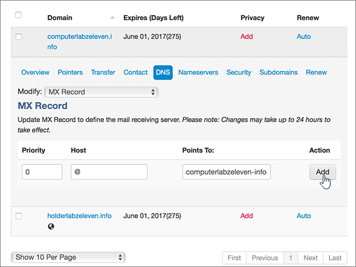

# Crear registros DNS en MiDominio para Microsoft

  
 **[Consulte Preguntas más frecuentes acerca de los dominios](../setup/domains-faq.md)** si no encuentra lo que busca. 
  
> [!CAUTION]
> El sitio web MyDomain no admite los registros SRV, lo que significa que varias de las características de Skype Empresarial Online y Outlook Web App no funcionarán. No importa qué plan de Microsoft use, si administra sus registros DNS con MyDomain, existen [limitaciones de servicio considerables](https://docs.microsoft.com/microsoft-365/admin/setup/domains-faq) y puede que quiera cambiar a un proveedor de host DNS diferente. 
  
Si decide administrar sus propios registros DNS de Microsoft en MyDomain a pesar de las limitaciones del servicio, siga los pasos de este artículo para configurar los registros DNS para el correo electrónico, Skype Empresarial Online, etc.
    
Después de agregar estos registros a MyDomain, su dominio estará configurado para trabajar con los servicios de Microsoft.
  

  
> [!NOTE]
> Normalmente, se necesitan unos 15 minutos para que los cambios de DNS surtan efecto. Sin embargo, a veces los cambios pueden necesitar más tiempo para aplicarse en todo el sistema DNS de Internet. Si tiene problemas con el flujo de correo u otros problemas después de agregar registros DNS, vea [Encontrar y solucionar problemas después de agregar el dominio o los registros DNS](../get-help-with-domains/find-and-fix-issues.md). 
  
## Agregar un registro TXT para verificación

Antes de utilizar el dominio con Microsoft, tenemos que asegurarnos de que sea el propietario. Si puede iniciar sesión en la cuenta en el registrador de dominio y crear el registro DNS, Microsoft sabrá que es el propietario del dominio.
  
> [!NOTE]
> Este registro se usa exclusivamente para verificar si se es el propietario de un dominio; no afecta a nada más. Puede eliminarlo más adelante, si lo desea. 
  
1. Para empezar, vaya a su página de dominios en MyDomain a través de [este vínculo](https://www.mydomain.com/controlpanel). Se le pedirá que primero que inicie sesión.
    
2. En la sección **Mis favoritos**, elija **Dominio Central**.
    
3. En **Dominio**, elige el nombre del dominio que deseas editar.
    
4. En la fila **Información general**, elija **DNS**.
    
5. En la lista desplegable **Modificar**, elija **Registro TXT/SPF**.
    
6. En **Contenido**, en el cuadro del nuevo registro, escriba o copie y pegue el valor de la tabla siguiente.
    
    ||
    |:-----|
    |**Contenido**   |
    |MS=ms *XXXXXXXX*    **Nota:** esto es un ejemplo. Utilice aquí su valor de **Dirección de destino**, desde la tabla. [¿Cómo puedo encontrar esto?](../get-help-with-domains/information-for-dns-records.md)          |
   
7. Elija **Agregar**.
    
8. Espere unos minutos antes de continuar para que el registro que acaba de crear pueda actualizarse en Internet.
    
Ahora que ha agregado el registro en el sitio de su registrador de dominios, deberá volver a Microsoft y solicitar el registro.
  
Cuando Microsoft encuentre el registro TXT correcto, se comprobará su dominio.
  
1. En el centro de administración de Microsoft, diríjase a la página **Configuración** \> <a href="https://go.microsoft.com/fwlink/p/?linkid=834818" target="_blank">Dominios</a>.
    
2. En la página **Dominios**, elija el dominio que está verificando. 
    
3. En la página de **Configuración**, elija ** Iniciar configuración**.
    
4. En la página**Verificar dominio**, elija **Verificar**.
    
> [!NOTE]
> Normalmente, se necesitan unos 15 minutos para que los cambios de DNS surtan efecto. Sin embargo, a veces los cambios pueden necesitar más tiempo para aplicarse en todo el sistema DNS de Internet. Si tiene problemas con el flujo de correo u otros problemas después de agregar registros DNS, vea [Encontrar y solucionar problemas después de agregar el dominio o los registros DNS](../get-help-with-domains/find-and-fix-issues.md). 
  
## Agregar un registro MX para que el correo electrónico del dominio vaya a Microsoft

1. Para empezar, vaya a su página de dominios en MyDomain a través de [este vínculo](https://www.mydomain.com/controlpanel). Se le pedirá que primero que inicie sesión.
    
2. En la sección **Mis favoritos**, elija **Dominio Central**.
    
3. En **Dominio**, elige el nombre del dominio que deseas editar.
    
4. En la fila **Información general**, elija **DNS**.
    
5. En la lista desplegable **Modificar**, elija **Registro MX**.
    
    
  
6. En los cuadros para el nuevo registro, escriba o copie y pegue los valores de la tabla siguiente.
    
    |**Prioridad**|**Host**|**Señala a:**|
    |:-----|:-----|:-----|
    |0    Para obtener más información sobre la prioridad, consulte [¿Qué es una prioridad de MX?](https://docs.microsoft.com/microsoft-365/admin/setup/domains-faq)   |@    | *\<domain-key\>*  .mail.protection.outlook.com    **Nota: **Obtenga la \<*domain-key*\> desde su cuenta de Microsoft. > [¿Cómo encuentro esto?](../get-help-with-domains/information-for-dns-records.md)          |
   
    
  
7. Elija **Agregar**.
    
    
  
8. Si existen otros registros MX, seleccione **Quitar** de la columna **Acción** para cada uno que quiera eliminar. 
    
    
  
9. Elija **Aceptar**.
    
    
  
## Agregar los registros CNAME necesarios para Microsoft

1. Para empezar, vaya a su página de dominios en MyDomain a través de [este vínculo](https://www.mydomain.com/controlpanel). Se le pedirá que primero que inicie sesión.
    
2. En la sección **Mis favoritos**, elija **Dominio Central**.
    
3. En **Dominio**, elige el nombre del dominio que deseas editar.
    
4. En la fila **Información general**, elija **DNS**.
    
5. En la lista desplegable **Modificar**, elija **Alias CNAME**.
    
    
  
6. Agregue el primer registro CNAME.
    
    En los cuadros para el nuevo registro, escriba o copie y pegue los valores de la primera fila de la tabla siguiente.
    
    |**Host**|**Señala a:**|
    |:-----|:-----|
    |autodescubrir    |autodiscover.outlook.com    |
    |sip    |sipdir.online.lync.com    |
    |lyncdiscover    |webdir.online.lync.com    |
    |enterpriseregistration    |enterpriseregistration.windows.net    |
    |enterpriseenrollment    |enterpriseenrollment-s.manage.microsoft.com    |
   
    
  
7. Elija **Agregar** para agregar el primer registro. 
    
    
  
8. Agregue el segundo registro CNAME.
    
    Use los valores de la segunda fila de la tabla anterior y, a continuación, elija **Agregar** para agregar el segundo registro. 
    
    Agregue los registros restantes de la misma manera, usando los valores de la tercera, la cuarta, la quinta y la sexta fila de la tabla.
    
## Agregar un registro TXT para SPF para ayudar a evitar el correo no deseado

> [!IMPORTANT]
> No puede tener más de un registro TXT para el SPF de un dominio. Si su dominio tiene más de un registro de SPF, obtendrá errores de correo, así como problemas de clasificación de entrega y de correo no deseado. Si ya tiene un registro de SPF para su dominio, no cree uno nuevo para Microsoft. En vez de eso, agregue los valores necesarios de Microsoft para el registro actual, de modo que solo tenga un único registro de SPF que incluya ambos conjuntos de valores. ¿Necesita ejemplos? Consulte los [Registros externos del sistema de nombres de dominio para Microsoft](https://docs.microsoft.com/microsoft-365/enterprise/external-domain-name-system-records#bkmk_spfrecords). To validate your SPF record, you can use one of these [SPF validation tools](../setup/domains-faq.md). 
  
1. Para empezar, vaya a su página de dominios en MyDomain a través de [este vínculo](https://www.mydomain.com/controlpanel). Se le pedirá que primero que inicie sesión.
    
2. En la sección **Mis favoritos**, elija **Dominio Central**.
    
3. En **Dominio**, elige el nombre del dominio que deseas editar.
    
4. En la fila **Información general**, elija **DNS**.
    
5. En la lista desplegable **Modificar**, elija **Registro TXT/SPF**.
    
    
  
6. En **Contenido**, en el cuadro del nuevo registro, escriba o copie y pegue el valor de la tabla siguiente.
    
    |**Contenido**|
    |:-----|
    |v=spf1 include:spf.protection.outlook.com -all    **Nota:** recomendamos copiar y pegar esta entrada, para que todo el espacio sea correcto.           |
   
    
  
7. Elija **Agregar**.
    
    
  
## Agregar los dos registros SRV necesarios para Microsoft

> [!CAUTION]
> El sitio web MyDomain no admite los registros SRV, lo que significa que varias de las características de Skype Empresarial Online y Outlook Web App no funcionarán. No importa qué plan de Microsoft use, si administra sus registros DNS con MyDomain, existen [limitaciones de servicio considerables](https://docs.microsoft.com/microsoft-365/admin/setup/domains-faq) y puede que quiera cambiar a un proveedor de host DNS diferente. 
  
> [!NOTE]
> Normalmente, se necesitan unos 15 minutos para que los cambios de DNS surtan efecto. Sin embargo, a veces los cambios pueden necesitar más tiempo para aplicarse en todo el sistema DNS de Internet. Si tiene problemas con el flujo de correo u otros problemas después de agregar registros DNS, vea [Encontrar y solucionar problemas después de agregar el dominio o los registros DNS](../get-help-with-domains/find-and-fix-issues.md). 
  
