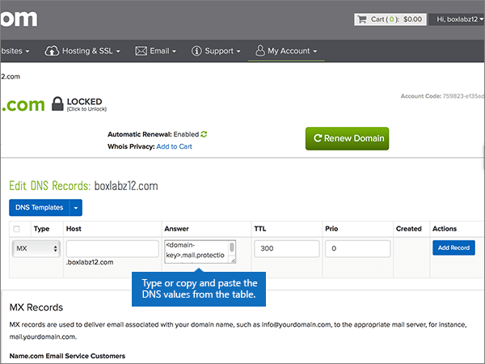

# Crear registros DNS en name.com para Microsoft

 **[Consulte Preguntas más frecuentes acerca de los dominios](../setup/domains-faq.md)** si no encuentra lo que busca. 
  
Si name.com es su proveedor de hosting DNS, siga los pasos de este artículo para comprobar su dominio y configurar los registros DNS para el correo electrónico, Skype Empresarial Online, etc.
  
Después de agregar estos registros a name.com, su dominio estará configurado para funcionar con los servicios de Microsoft.

  
> [!NOTE]
> Por lo general, los cambios de DNS tardan unos 15 minutos en aplicarse. Sin embargo, a veces los cambios pueden necesitar más tiempo para aplicarse en todo el sistema DNS de Internet. Si tiene problemas con el flujo de correo u otros problemas después de agregar registros DNS, consulte [Solucionar problemas después de cambiar el nombre del dominio o los registros DNS](../get-help-with-domains/find-and-fix-issues.md). 
  
## Agregar un registro TXT para verificación

Antes de utilizar el dominio con Microsoft, tenemos que asegurarnos de que sea el propietario. Si puede iniciar sesión en la cuenta en el registrador de dominio y crear el registro DNS, Microsoft sabrá que es el propietario del dominio.
  
> [!NOTE]
> Este registro se usa exclusivamente para verificar si se es el propietario de un dominio; no afecta a nada más. Puede eliminarlo más adelante, si lo desea. 
  
1. Para empezar, vaya a su página de dominios en name.com a través de [este vínculo](https://www.name.com/account/domain). Se le pedirá que primero inicie sesión.
    
    
  
2. En **mis dominios**, seleccione el nombre del dominio que quiera modificar.
    
    
  
3. En la columna **detalles** , seleccione **registros DNS**. 
    
    
  
4. En los cuadros para el nuevo registro, escriba o copie y pegue los valores de la tabla siguiente.
    
    (Choose the **Type** value from the drop-down list.) 
    
    |||||
    |:-----|:-----|:-----|:-----|
    |**Tipo**   |**Host**   |**Respuesta**   |**TTL**   |
    |TXT    |(Leave this field empty.)    |MS=ms *XXXXXXXX*    **Nota:** esto es un ejemplo. Utilice aquí su valor de **Dirección de destino**, desde la tabla.           [¿Cómo puedo encontrar esto?](../get-help-with-domains/information-for-dns-records.md)          |Use the default value (300).    |
   
    
  
5. Seleccione **Agregar registro**.
    
    
  
6. Espere unos minutos antes de continuar para que el registro que acaba de crear pueda actualizarse en Internet.
    
Ahora que ha agregado el registro en el sitio de su registrador de dominios, deberá volver a Microsoft y solicitar el registro.
  
Cuando Microsoft encuentre el registro TXT correcto, se comprobará su dominio.
  
1. En el centro de administración, diríjase a la página **configuración** \> <a href="https://go.microsoft.com/fwlink/p/?linkid=834818" target="_blank">dominios</a>.
    
2. En la página **Dominios**, elija el dominio que está verificando. 
    
    
  
3. En la página de **Configuración**, elija ** Iniciar configuración**.
    
    
  
4. En la página**verificar dominio**, seleccione **verificar**.
    
    
  
> [!NOTE]
> Por lo general, los cambios de DNS tardan unos 15 minutos en aplicarse. Sin embargo, a veces los cambios pueden necesitar más tiempo para aplicarse en todo el sistema DNS de Internet. Si tiene problemas con el flujo de correo u otros problemas después de agregar registros DNS, consulte [Solucionar problemas después de cambiar el nombre del dominio o los registros DNS](../get-help-with-domains/find-and-fix-issues.md). 
  
## Agregar un registro MX para que el correo electrónico del dominio vaya a Microsoft

1. Para empezar, vaya a su página de dominios en name.com a través de [este vínculo](https://www.name.com/account/domain). Se le pedirá que primero inicie sesión.
    
    
  
2. En **mis dominios**, seleccione el nombre del dominio que quiera modificar.
    
    
  
3. En la columna **detalles** , seleccione **registros DNS**. 
    
    
  
4. En los cuadros para el nuevo registro, escriba o copie y pegue los valores de la tabla siguiente.
    
    (Choose the **Type** value from the drop-down list.) 
    
    |**Tipo**|**Host**|**Respuesta**|**TTL**|**Prio**|
    |:-----|:-----|:-----|:-----|:-----|
    |MX    |(Deje este campo en blanco).    | *\<domain-key\>*. mail.protection.outlook.com    **Nota:** Obtén tu *\<domain-key\>* cuenta de Microsoft.           [¿Cómo puedo encontrarla?](../get-help-with-domains/information-for-dns-records.md)          |Use the default value (300).    |comprendi    Para obtener más información sobre la prioridad, consulte [¿Qué es una prioridad de MX?](https://docs.microsoft.com/microsoft-365/admin/setup/domains-faq)   |
   
   
  
5. Seleccione **Agregar registro**.
    
    
  
6. Si existen otros registros MX, elimine cada uno de ellos usando el procedimiento de dos pasos siguiente:
    
    Por cada registro MX, seleccione **eliminar** en la columna **acciones** . 
    
    
  
    Para confirmar cada eliminación, seleccione **eliminar** en la columna **acciones** de nuevo. 
    
    
  
    Repita este procedimiento de dos pasos hasta que haya eliminado cada uno de los demás registros MX.
    
## Agregar los registros CNAME necesarios para Microsoft

1. Para empezar, vaya a su página de dominios en name.com a través de [este vínculo](https://www.name.com/account/domain). Se le pedirá que primero inicie sesión.
    
    
  
2. En **mis dominios**, seleccione el nombre del dominio que quiera modificar.
    
    
  
3. En la columna **detalles** , seleccione **registros DNS**. 
    
    
  
4. Agregue el primer registro CNAME.
    
    En los cuadros para el nuevo registro, escriba o copie y pegue los valores de la primera fila de la tabla siguiente.
    
    (Elija el valor **Tipo** de la lista desplegable). 
    
    |**Tipo**|**Host**|**Respuesta**|**TTL**|
    |:-----|:-----|:-----|:-----|
    |CNAME    |autodescubrir    |autodiscover.outlook.com    |Use el valor predeterminado (300).    |
    |CNAME    |sip    |sipdir.online.lync.com    |Use el valor predeterminado (300).    |
    |CNAME    |lyncdiscover    |webdir.online.lync.com    |Use el valor predeterminado (300).    |
    |CNAME    |enterpriseregistration    |enterpriseregistration.windows.net    |Use el valor predeterminado (300).    |
    |CNAME    |enterpriseenrollment    |EnterpriseEnrollment-s.manage.microsoft.com    |Use el valor predeterminado (300).    |
   
   
  
5. Seleccione **Agregar registro** para agregar el primer registro. 
    
    
  
6. Agregue el segundo registro CNAME.
    
    Use los valores de la segunda fila de la tabla anterior y, después, seleccione **Agregar registro** para agregar el segundo registro. 
    
    Agregue los registros restantes de la misma manera, usando los valores de la tercera, la cuarta, la quinta y la sexta fila de la tabla.
    
## Agregar un registro TXT para SPF para ayudar a evitar el correo no deseado

> [!IMPORTANT]
> No puede tener más de un registro TXT para el SPF de un dominio. Si su dominio tiene más de un registro de SPF, obtendrá errores de correo, así como problemas de clasificación de entrega y de correo no deseado. Si ya tiene un registro de SPF para su dominio, no cree uno nuevo para Microsoft. En su lugar, agregue los valores necesarios de Microsoft al registro activo para que tenga un *único* registro de SPF que incluya ambos conjuntos de valores. 
  
1. Para empezar, vaya a su página de dominios en name.com a través de [este vínculo](https://www.name.com/account/domain). Se le pedirá que primero inicie sesión.
    
    
  
2. En **mis dominios**, seleccione el nombre del dominio que quiera modificar.

    
  
3. En la columna **detalles** , seleccione **registros DNS**. 
    
    
  
4. En los cuadros para el nuevo registro, escriba o copie y pegue los valores de la tabla siguiente.
    
    (Choose the **Type** value from the drop-down list.) 
    
    |**Tipo**|**Host**|**Respuesta**|**TTL**|
    |:-----|:-----|:-----|:-----|
    |TXT    |(Leave this field empty.)    |v=spf1 include:spf.protection.outlook.com -all    **Nota:** recomendamos copiar y pegar esta entrada, para que todo el espacio sea correcto.           |Use the default value (300).    |
   
   
  
5. Seleccione **Agregar registro**.
    
    
  
## Agregar los dos registros SRV necesarios para Microsoft

1. Para empezar, vaya a su página de dominios en name.com a través de [este vínculo](https://www.name.com/account/domain). Se le pedirá que primero inicie sesión.
    
    
  
2. En **mis dominios**, seleccione el nombre del dominio que quiera modificar.
    
    
  
3. En la columna **detalles** , seleccione **registros DNS +**. 
    
    
  
4. Agregue el primer registro SRV.
    
    En los cuadros para el nuevo registro, escriba o copie y pegue los valores de la primera fila de la tabla siguiente.
    
    (Elija el valor **Tipo** de la lista desplegable). 
    
    |**Tipo**|**Servicio**|**Grosor**|**TTL**|**Prio**|**Protocolo**|**Puerto**|**Destino**|
    |:-----|:-----|:-----|:-----|:-----|:-----|:-----|:-----|
    |SRV|sip|1 |Use el valor predeterminado (300).|100|tls|443|sipdir.online.lync.com   **Nota:** recomendamos copiar y pegar esta entrada, para que todo el espacio sea correcto.           |
    |SRV|sipfederationtls|1 |Use el valor predeterminado (300).|100|tcp|5061|sipfed.online.lync.com  **Nota:** recomendamos copiar y pegar esta entrada, para que todo el espacio sea correcto.           |
   
   
  
5. Seleccione **Agregar registro**.

    
  
6. Agregue el segundo registro SRV:

Use los valores de la siguiente fila de la tabla anterior y, a continuación, seleccione **Agregar registro** para agregar el segundo registro.

>[!NOTE]
>Por lo general, los cambios de DNS tardan unos 15 minutos en aplicarse. Sin embargo, a veces los cambios pueden necesitar más tiempo para aplicarse en todo el sistema DNS de Internet. Si tiene problemas con el flujo de correo u otros problemas después de agregar registros DNS, consulte [Solucionar problemas después de cambiar el nombre del dominio o los registros DNS](../get-help-with-domains/find-and-fix-issues.md).
