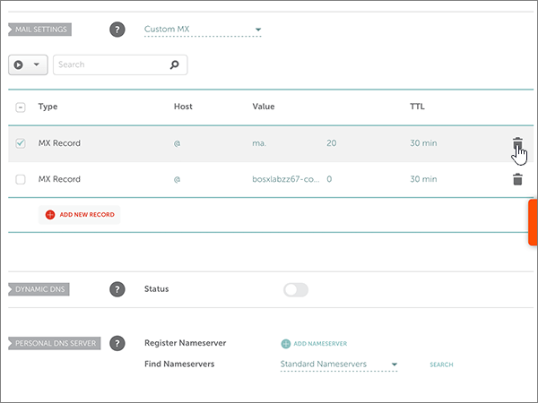

# Crear registros DNS en namecheap para Office 365

 **[Consulte Preguntas más frecuentes acerca de los dominios](../setup/domains-faq.md)** si no encuentra lo que busca. 
  
Si namecheap es su proveedor de host DNS, siga los pasos de este artículo para comprobar su dominio y configurar los registros DNS para el correo electrónico, Skype empresarial online, etc.
  
Después de agregar estos registros a namecheap, su dominio estará configurado para trabajar con los servicios de Office 365.
  
> [!NOTE]
> Por lo general, los cambios de DNS tardan unos 15 minutos en aplicarse. Sin embargo, a veces los cambios pueden necesitar más tiempo para aplicarse en todo el sistema DNS de Internet. Si tiene problemas con el flujo de correo u otros problemas después de agregar registros DNS, consulte [Solucionar problemas después de cambiar el nombre del dominio o los registros DNS](../get-help-with-domains/find-and-fix-issues.md). 
  
## Agregar un registro TXT para verificación

Para que pueda usar el dominio con Office 365, tenemos que asegurarnos de que es de su propiedad. Si puede iniciar sesión en la cuenta en su registrador de dominios y crear el registro DNS, Office 365 sabrá que es el propietario del dominio.
  
> [!NOTE]
> Este registro se usa exclusivamente para verificar si se es el propietario de un dominio; no afecta a nada más. Puede eliminarlo más adelante, si lo desea. 
  
Siga estos pasos.
  
1. Para empezar, vaya a su página de dominios en namecheap a través de [este vínculo](https://www.namecheap.com/myaccount/login.aspx?ReturnUrl=%2f). Se le pedirá que inicie sesión y continúe.
    
    
  
2. En la página de **aterrizaje** , en **cuenta**, elija **lista de dominios** en la lista desplegable. 
    
    
  
3. En la página **lista de dominios** , busque el nombre del dominio que desea editar y, a continuación, seleccione **administrar**.
    
    
  
4. Seleccione **DNS avanzado**.
    
    
  
5. En la sección **registros de host** , seleccione **Agregar nuevo registro**.
    
    
  
6. En la lista desplegable **tipo** , seleccione **registro TXT**.
    
    > [!NOTE]
    > La lista desplegable **tipo** aparece automáticamente cuando se selecciona **Agregar nuevo registro**. 
  
    
  
7. In the boxes for the new record, type or copy and paste the values from the following table.
    
    (Elija el valor **TTL** de la lista desplegable). 
    
    |**Tipo**|**Host**|**Valor**|**TTL**|
    |:-----|:-----|:-----|:-----|
    |TXT    |@    |MS=ms *XXXXXXXX*   **Nota:** Este es un ejemplo. Utilice aquí su valor de **Dirección o puntos de destino**, de la tabla de Office 365.  [¿Cómo puedo encontrarlo?](../get-help-with-domains/information-for-dns-records.md)          |30 minutos    |
       
    
  
8. Seleccione el control **Guardar cambios** (marca de verificación). 
    
    
  
9. Espere unos minutos antes de continuar para que el registro que acaba de crear pueda actualizarse en Internet.
    
Now that you've added the record at your domain registrar's site, you'll go back to Office 365 and request Office 365 to look for the record.
  
When Office 365 finds the correct TXT record, your domain is verified.
  
1. En el centro de administración, vaya a la página **configuración** \> de <a href="https://go.microsoft.com/fwlink/p/?linkid=834818" target="_blank">dominios</a> .
    
2. En la página **dominios** , seleccione el dominio que desea comprobar. 
    
    
  
3. En la página **configuración** , seleccione **Iniciar configuración**.
    
    
  
4. En la página **comprobar dominio** , seleccione **comprobar**.
    
    
  
> [!NOTE]
> Por lo general, los cambios de DNS tardan unos 15 minutos en aplicarse. Sin embargo, a veces los cambios pueden necesitar más tiempo para aplicarse en todo el sistema DNS de Internet. Si tiene problemas con el flujo de correo u otros problemas después de agregar registros DNS, consulte [Solucionar problemas después de cambiar el nombre del dominio o los registros DNS](../get-help-with-domains/find-and-fix-issues.md). 

  
## Agregar un registro MX para que el correo electrónico del dominio vaya a Office 365

Siga estos pasos.
  
1. Para empezar, vaya a su página de dominios en namecheap a través de [este vínculo](https://www.namecheap.com/myaccount/login.aspx?ReturnUrl=%2f). Se le pedirá que inicie sesión y continúe.
    
    
  
2. En la página de **aterrizaje** , en **cuenta**, elija **lista de dominios** en la lista desplegable. 
    
    
  
3. En la página **lista de dominios** , busque el nombre del dominio que desea editar y, a continuación, seleccione **administrar**.
    
    
  
4. Seleccione **DNS avanzado**.
    
    
  
5. En la sección **configuración de correo** , seleccione **mx personalizado** en la lista desplegable **reenvío de correo electrónico** . 
    
    (You may have to scroll down.)
    
    
  
6. Seleccione **Agregar nuevo registro**.
    
    
  
7. En los cuadros para el nuevo registro, escriba (o copie y pegue) los valores de la tabla siguiente.
    
    (El cuadro **prioridad** es el cuadro sin nombre a la derecha del cuadro **valor** . Elija el valor **TTL** de la lista desplegable). 
    
    |**Tipo**|**Host**|**Valor**|**Prioridad**|**TTL**|
    |:-----|:-----|:-----|:-----|:-----|
    |Registro MX    |@    |\<*Domain-Key*\>. mail.Protection.Outlook.com.    **This value MUST end with a period (.)**   **Nota:** Obtenga la * \<clave\> de dominio* de su cuenta de Office 365.  [¿Cómo puedo encontrarla?](../get-help-with-domains/information-for-dns-records.md)          |comprendi    Para obtener más información sobre la prioridad, consulte [¿Qué es una prioridad de MX?](https://support.office.com/article/2784cc4d-95be-443d-b5f7-bb5dd867ba83.aspx)   |30 minutos    |
       
    
  
8. Seleccione el control **Guardar cambios** (marca de verificación). 
    
    
  
9. Si existen otros registros MX, quite cada uno de ellos usando el procedimiento de dos pasos siguiente:
    
    En primer lugar, seleccione el **icono de eliminación** (papelera) para el registro que desea quitar. 
    
    
  
    En segundo lugar, seleccione **sí** para confirmar la eliminación. 
    
    
  
    Quite todos los registros MX excepto el que ha agregado anteriormente en este procedimiento.

  
## Agregar los seis registros CNAME necesarios para Office 365

Siga estos pasos.
  
1. Para empezar, vaya a su página de dominios en namecheap a través de [este vínculo](https://www.namecheap.com/myaccount/login.aspx?ReturnUrl=%2f). Se le pedirá que inicie sesión y continúe.
    
    
  
2. En la página de **aterrizaje** , en **cuenta**, elija **lista de dominios** en la lista desplegable. 
    
    
  
3. En la página **lista de dominios** , busque el nombre del dominio que desea editar y, a continuación, seleccione **administrar**.
    
    
  
4. Seleccione **DNS avanzado**.
    
    
  
5. En la sección **registros de host** , seleccione **Agregar nuevo registro**.
    
    
  
6. En la lista desplegable **tipo** , seleccione **registro CNAME**.
    
    > [!NOTE]
    > La lista desplegable **tipo** aparece automáticamente cuando se selecciona **Agregar nuevo registro**. 
  
    
  
7. En los cuadros vacíos para el nuevo registro, seleccione **CNAME** para el **Tipo de registro** y, a continuación, escriba o copie y pegue los valores de la primera fila de la tabla siguiente.
    
    |**Tipo**|**Host**|**Valor**|**TTL**|
    |:-----|:-----|:-----|:-----|
    |CNAME    |autodiscover    |autodiscover.outlook.com.    **Este valor DEBE terminar en punto (.).**   |3600    |
    |CNAME    |sip    |sipdir.online.lync.com.    **Este valor DEBE terminar en punto (.).**   |3600    |
    |CNAME    |lyncdiscover    |webdir.online.lync.com.    **Este valor DEBE terminar en punto (.).**   |3600    |
    |CNAME    |enterpriseregistration    |enterpriseregistration.windows.net.    **Este valor DEBE terminar en punto (.).**   |3600    |
    |CNAME    |enterpriseenrollment    |enterpriseenrollment-s.manage.microsoft.com.    **Este valor DEBE terminar en punto (.).**   |3600    |
       
    
  
8. Seleccione el control **Guardar cambios** (marca de verificación). 
    
    
  
9. Con los cuatro pasos anteriores y los valores de las otras cinco filas de la tabla, agregue cada uno de los otros cinco registros CNAME.

  
## Agregar un registro TXT para SPF para ayudar a evitar el correo no deseado

> [!IMPORTANT]
> You cannot have more than one TXT record for SPF for a domain. If your domain has more than one SPF record, you'll get email errors, as well as delivery and spam classification issues. If you already have an SPF record for your domain, don't create a new one for Office 365. En vez de eso, agregue los valores necesarios de Office 365 para el registro actual, de modo que solo tenga un  *único*  registro de SPF que incluya ambos conjuntos de valores. 

Siga estos pasos.
  
1. Para empezar, vaya a su página de dominios en namecheap a través de [este vínculo](https://www.namecheap.com/myaccount/login.aspx?ReturnUrl=%2f). Se le pedirá que inicie sesión y continúe.
    
2. En la página de **aterrizaje** , en **cuenta**, elija **lista de dominios** en la lista desplegable. 
    
    
  
3. En la página **lista de dominios** , busque el nombre del dominio que desea editar y, a continuación, seleccione **administrar**.
    
    
  
4. Seleccione **DNS avanzado**.
    
    
  
5. En la sección **registros de host** , seleccione **Agregar nuevo registro**.
    
    
  
6. En la lista desplegable **tipo** , seleccione **registro TXT**.
    
    > [!NOTE]
    > La lista desplegable **tipo** aparece automáticamente cuando se selecciona **Agregar nuevo registro**. 
  
    
  
7. En los cuadros para el nuevo registro, escriba o copie y pegue los valores siguientes de la tabla siguiente.
    
    (Elija el valor **TTL** de la lista desplegable). 
    
    |**Tipo**|**Host**|**Valor**|**TTL**|
    |:-----|:-----|:-----|:-----|
    |TXT    |@    |v=spf1 include:spf.protection.outlook.com -all    **Nota:** Se recomienda copiar y pegar esta entrada para que todo el espaciado sea correcto.           |30 minutos    |
       
    
  
8. Seleccione el control **Guardar cambios** (marca de verificación). 
    
    
  
## Agregar los dos registros SRV necesarios para Office 365

1. Para empezar, vaya a su página de dominios en namecheap a través de [este vínculo](https://www.namecheap.com/myaccount/login.aspx?ReturnUrl=%2f). You'll be prompted to sign in.
    
    
  
2. En la página de **aterrizaje** , en **cuenta**, elija **lista de dominios** en la lista desplegable. 
    
    
  
3. En la página **lista de dominios** , busque el nombre del dominio que desea editar y, a continuación, seleccione **administrar**.
    
    
  
4. Seleccione **DNS avanzado**.
    
    
  
5. En la sección **registros de host** , seleccione **Agregar nuevo registro**.
    
    
  
6. En la lista desplegable **tipo** , seleccione **registro SRV**.
    
    > [!NOTE]
    > La lista desplegable **tipo** aparece automáticamente cuando se selecciona **Agregar nuevo registro**. 
  
    
  
7. En los cuadros vacíos para los nuevos registros, escriba (o copie y pegue) los valores de la primera fila en la tabla siguiente.
    
    |**Servicio**|**Protocolo**|**Prioridad**|**Peso**|**Puerto**|**Destino**|**TTL**|
    |:-----|:-----|:-----|:-----|:-----|:-----|:-----|
    |_sip    |_tls    |100    |1    |443    |sipdir.online.lync.com.    **This value MUST end with a period (.)**   |30 minutos    |
    |_sipfederationtls    |_tcp    |100    |1    |5061    |sipfed.online.lync.com.    **This value MUST end with a period (.)**   |30 minutos    |
       
    
  
8. Seleccione el control **Guardar cambios** (marca de verificación). 
    
    
  
9. Con los cuatro pasos anteriores y los valores de la segunda fila de la tabla, agregue el otro registro SRV.
    
> [!NOTE]
> Por lo general, los cambios de DNS tardan unos 15 minutos en aplicarse. Sin embargo, a veces los cambios pueden necesitar más tiempo para aplicarse en todo el sistema DNS de Internet. Si tiene problemas con el flujo de correo u otros problemas después de agregar registros DNS, consulte [Solucionar problemas después de cambiar el nombre del dominio o los registros DNS](../get-help-with-domains/find-and-fix-issues.md). 
  

  
