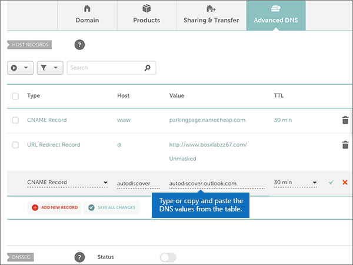

# Crear registros DNS en namecheap para MicrosoftCreate DNS records at Namecheap for Microsoft

 **[Consulte Preguntas más frecuentes acerca de los dominios](../setup/domains-faq.md)** si no encuentra lo que busca.**[Check the Domains FAQ](../setup/domains-faq.md)** if you don't find what you're looking for. 
  
Si namecheap es su proveedor de host DNS, siga los pasos de este artículo para comprobar su dominio y configurar los registros DNS para el correo electrónico, Skype empresarial online, etc.If Namecheap is your DNS hosting provider, follow the steps in this article to verify your domain and set up DNS records for email, Skype for Business Online, and so on.
  
Después de agregar estos registros a namecheap, su dominio estará configurado para funcionar con los servicios de Microsoft.After you add these records at Namecheap, your domain will be set up to work with Microsoft services.
  
> [!NOTE]
> Por lo general, los cambios de DNS tardan unos 15 minutos en aplicarse. Sin embargo, a veces los cambios pueden necesitar más tiempo para aplicarse en todo el sistema DNS de Internet. Si tiene problemas con el flujo de correo u otros problemas después de agregar registros DNS, consulte [Solucionar problemas después de cambiar el nombre del dominio o los registros DNS](../get-help-with-domains/find-and-fix-issues.md).Typically it takes about 15 minutes for DNS changes to take effect. However, it can occasionally take longer for a change you've made to update across the Internet's DNS system. If you're having trouble with mail flow or other issues after adding DNS records, see [Troubleshoot issues after changing your domain name or DNS records](../get-help-with-domains/find-and-fix-issues.md). 
  
## Agregar un registro TXT para verificaciónAdd a TXT record for verification

Antes de utilizar el dominio con Microsoft, tenemos que asegurarnos de que sea el propietario. Si puede iniciar sesión en la cuenta en el registrador de dominio y crear el registro DNS, Microsoft sabrá que es el propietario del dominio.Before you use your domain with Microsoft, we have to make sure that you own it. Your ability to log in to your account at your domain registrar and create the DNS record proves to Microsoft that you own the domain.
  
> [!NOTE]
> Este registro se usa exclusivamente para verificar si se es el propietario de un dominio; no afecta a nada más. Puede eliminarlo más adelante, si lo desea.This record is used only to verify that you own your domain; it doesn't affect anything else. You can delete it later, if you like. 
  
Siga estos pasos.Follow the steps below.
  
1. Para empezar, vaya a su página de dominios en namecheap a través de [este vínculo](https://www.namecheap.com/myaccount/login.aspx?ReturnUrl=%2f).To get started, go to your domains page at Namecheap by using [this link](https://www.namecheap.com/myaccount/login.aspx?ReturnUrl=%2f). Se le pedirá que inicie sesión y continúe.You'll be prompted to Sign in and Continue.
    
    
  
2. En la página de **aterrizaje** , en **cuenta**, elija **lista de dominios** en la lista desplegable.On the **Landing** page, under **Account**, choose **Domain List** from the drop-down list. 
    
    
  
3. En la página **lista de dominios** , busque el nombre del dominio que desea editar y, a continuación, seleccione **administrar**.On the **Domain List** page, find the name of the domain that you want to edit, and then select **Manage**.
    
    
  
4. Seleccione **DNS avanzado**.Select **Advanced DNS**.
    
    
  
5. En la sección **registros de host** , seleccione **Agregar nuevo registro**.In the **HOST RECORDS** section, select **ADD NEW RECORD**.
    
    
  
6. En la lista desplegable **tipo** , seleccione **registro TXT**.In the **Type** drop-down, select **TXT Record**.
    
    > [!NOTE]
    > La lista desplegable **tipo** aparece automáticamente cuando se selecciona **Agregar nuevo registro**.The **Type** drop-down automatically appears when you select **ADD NEW RECORD**. 
  
    
  
7. En los cuadros para el nuevo registro, escriba o copie y pegue los valores de la tabla siguiente.In the boxes for the new record, type or copy and paste the values from the following table.
    
    (Elija el valor **TTL** de la lista desplegable).(Choose the **TTL** value from the drop-down list.) 
    
    |**Tipo****Type**|**Host****Host**|**Valor****Value**|**TTL****TTL**|
    |:-----|:-----|:-----|:-----|
    |TXTTXT    |@    |MS=ms *XXXXXXXX*MS=ms *XXXXXXXX*   **Nota:** esto es un ejemplo.**Note:** This is an example. Utilice aquí su valor de **Dirección de destino**, desde la tabla.Use your specific **Destination or Points to Address** value here, from the table.  [¿Cómo puedo encontrar esto?How do I find this?](../get-help-with-domains/information-for-dns-records.md)          |30 minutos30 min    |
       
    
  
8. Seleccione el control **Guardar cambios** (marca de verificación).Select the **Save Changes** (check mark) control. 
    
    
  
9. Espere unos minutos antes de continuar para que el registro que acaba de crear pueda actualizarse en Internet.Wait a few minutes before you continue, so that the record you just created can update across the Internet.
    
Ahora que ha agregado el registro en el sitio de su registrador de dominios, deberá volver a Microsoft y solicitar el registro.Now that you've added the record at your domain registrar's site, you'll go back to Microsoft and request the record.
  
Cuando Microsoft encuentre el registro TXT correcto, se comprobará su dominio.When Microsoft finds the correct TXT record, your domain is verified.
  
1. En el centro de administración, diríjase a la página **configuración** \> <a href="https://go.microsoft.com/fwlink/p/?linkid=834818" target="_blank">dominios</a>.In the admin center, go to the **Settings** \> <a href="https://go.microsoft.com/fwlink/p/?linkid=834818" target="_blank">Domains</a> page.
    
2. En la página **Dominios**, elija el dominio que está verificando.On the **Domains** page, select the domain that you are verifying. 
    
    
  
3. En la página de **Configuración**, elija \*\* Iniciar configuración\*\*.On the **Setup** page, select **Start setup**.
    
    
  
4. En la página**verificar dominio**, seleccione **verificar**.On the **Verify domain** page, select **Verify**.
    
    
  
> [!NOTE]
> Por lo general, los cambios de DNS tardan unos 15 minutos en aplicarse. Sin embargo, a veces los cambios pueden necesitar más tiempo para aplicarse en todo el sistema DNS de Internet. Si tiene problemas con el flujo de correo u otros problemas después de agregar registros DNS, consulte [Solucionar problemas después de cambiar el nombre del dominio o los registros DNS](../get-help-with-domains/find-and-fix-issues.md).Typically it takes about 15 minutes for DNS changes to take effect. However, it can occasionally take longer for a change you've made to update across the Internet's DNS system. If you're having trouble with mail flow or other issues after adding DNS records, see [Troubleshoot issues after changing your domain name or DNS records](../get-help-with-domains/find-and-fix-issues.md). 

  
## Agregar un registro MX para que el correo electrónico del dominio vaya a MicrosoftAdd an MX record so email for your domain will come to Microsoft

Siga estos pasos.Follow the steps below.
  
1. Para empezar, vaya a su página de dominios en namecheap a través de [este vínculo](https://www.namecheap.com/myaccount/login.aspx?ReturnUrl=%2f).To get started, go to your domains page at Namecheap by using [this link](https://www.namecheap.com/myaccount/login.aspx?ReturnUrl=%2f). Se le pedirá que inicie sesión y continúe.You'll be prompted to Sign in and Continue.
    
    
  
2. En la página de **aterrizaje** , en **cuenta**, elija **lista de dominios** en la lista desplegable.On the **Landing** page, under **Account**, choose **Domain List** from the drop-down list. 
    
    
  
3. En la página **lista de dominios** , busque el nombre del dominio que desea editar y, a continuación, seleccione **administrar**.On the **Domain List** page, find the name of the domain that you want to edit, and then select **Manage**.
    
    
  
4. Seleccione **DNS avanzado**.Select **Advanced DNS**.
    
    
  
5. En la sección **configuración de correo** , seleccione **mx personalizado** en la lista desplegable **reenvío de correo electrónico** .In the **MAIL SETTINGS** section, select **Custom MX** from the **Email Forwarding** drop-down list. 
    
    (You may have to scroll down.)(You may have to scroll down.)
    
    
  
6. Seleccione **Agregar nuevo registro**.Select **Add New Record**.
    
    
  
7. En los cuadros para el nuevo registro, escriba (o copie y pegue) los valores de la tabla siguiente.In the boxes for the new record, type or copy and paste the values, from the following table.
    
    (El cuadro **prioridad** es el cuadro sin nombre a la derecha del cuadro **valor** .(The **Priority** box is the unnamed box to the right of the **Value** box. Elija el valor **TTL** de la lista desplegable).Choose the **TTL** value from the drop-down list.) 
    
    |**Tipo****Type**|**Host****Host**|**Valor****Value**|**Prioridad****Priority**|**TTL****TTL**|
    |:-----|:-----|:-----|:-----|:-----|
    |Registro MXMX Record    |@    |\<*domain-key*\>. mail.protection.outlook.com.\<*domain-key*\>.mail.protection.outlook.com.    **This value MUST end with a period (.)****This value MUST end with a period (.)**   **Nota:** Obtén tu *\<domain-key\>* cuenta de Microsoft.**Note:** Get your  *\<domain-key\>*  from your Microsoft account.  [¿Cómo puedo encontrarla?How do I find this?](../get-help-with-domains/information-for-dns-records.md)          |comprendi0    Para obtener más información sobre la prioridad, consulte [¿Qué es una prioridad de MX?](https://docs.microsoft.com/microsoft-365/admin/setup/domains-faq)For more information about priority, see [What is MX priority?](https://docs.microsoft.com/microsoft-365/admin/setup/domains-faq)   |30 minutos30 min    |
       
    
  
8. Seleccione el control **Guardar cambios** (marca de verificación).Select the **Save Changes** (check mark) control. 
    
    
  
9. Si existen otros registros MX, quite cada uno de ellos usando el procedimiento de dos pasos siguiente:If there are any other MX records, use the following two-step process to remove each of them:
    
    En primer lugar, seleccione el **icono de eliminación** (papelera) para el registro que desea quitar.First, select the **Delete icon** (trash can) for the record that you want to remove. 
    
    
  
    En segundo lugar, seleccione **sí** para confirmar la eliminación.Second, select **Yes** to confirm the deletion. 
    
    
  
    Quite todos los registros MX excepto el que ha agregado anteriormente en este procedimiento.Remove all MX records except for the one that you added earlier in this procedure.

  
## Agregar los seis registros CNAME necesarios para MicrosoftAdd the six CNAME records that are required for Microsoft

Siga estos pasos.Follow the steps below.
  
1. Para empezar, vaya a su página de dominios en namecheap a través de [este vínculo](https://www.namecheap.com/myaccount/login.aspx?ReturnUrl=%2f).To get started, go to your domains page at Namecheap by using [this link](https://www.namecheap.com/myaccount/login.aspx?ReturnUrl=%2f). Se le pedirá que inicie sesión y continúe.You'll be prompted to Sign in and Continue.
    
    
  
2. En la página de **aterrizaje** , en **cuenta**, elija **lista de dominios** en la lista desplegable.On the **Landing** page, under **Account**, choose **Domain List** from the drop-down list. 
    
    
  
3. En la página **lista de dominios** , busque el nombre del dominio que desea editar y, a continuación, seleccione **administrar**.On the **Domain List** page, find the name of the domain that you want to edit, and then select **Manage**.
    
    
  
4. Seleccione **DNS avanzado**.Select **Advanced DNS**.
    
    
  
5. En la sección **registros de host** , seleccione **Agregar nuevo registro**.In the **HOST RECORDS** section, select **ADD NEW RECORD**.
    
    
  
6. En la lista desplegable **tipo** , seleccione **registro CNAME**.In the **Type** drop-down, select **CNAME Record**.
    
    > [!NOTE]
    > La lista desplegable **tipo** aparece automáticamente cuando se selecciona **Agregar nuevo registro**.The **Type** drop-down automatically appears when you select **ADD NEW RECORD**. 
  
    
  
7. En los cuadros vacíos para el nuevo registro, seleccione **CNAME** para el **Tipo de registro** y, a continuación, escriba o copie y pegue los valores de la primera fila de la tabla siguiente.In the empty boxes for the new record, select **CNAME** for the **Record Type**, and then type or copy and paste the values from the first row in the following table.
    
    |**Tipo****Type**|**Host****Host**|**Valor****Value**|**TTL****TTL**|
    |:-----|:-----|:-----|:-----|
    |CNAMECNAME    |autodiscoverautodiscover    |autodiscover.outlook.com.autodiscover.outlook.com.    **Este valor DEBE terminar en punto (.).****This value MUST end with a period (.)**   |36003600    |
    |CNAMECNAME    |sipsip    |sipdir.online.lync.com.sipdir.online.lync.com.    **Este valor DEBE terminar en punto (.).****This value MUST end with a period (.)**   |36003600    |
    |CNAMECNAME    |lyncdiscoverlyncdiscover    |webdir.online.lync.com.webdir.online.lync.com.    **Este valor DEBE terminar en punto (.).****This value MUST end with a period (.)**   |36003600    |
    |CNAMECNAME    |enterpriseregistrationenterpriseregistration    |enterpriseregistration.windows.net.enterpriseregistration.windows.net.    **Este valor DEBE terminar en punto (.).****This value MUST end with a period (.)**   |36003600    |
    |CNAMECNAME    |enterpriseenrollmententerpriseenrollment    |enterpriseenrollment-s.manage.microsoft.com.enterpriseenrollment-s.manage.microsoft.com.    **Este valor DEBE terminar en punto (.).****This value MUST end with a period (.)**   |36003600    |
       
    
  
8. Seleccione el control **Guardar cambios** (marca de verificación).Select the **Save Changes** (check mark) control. 
    
    
  
9. Con los cuatro pasos anteriores y los valores de las otras cinco filas de la tabla, agregue cada uno de los otros cinco registros CNAME.Using the preceding four steps and the values from the other five rows in the table, add each of the other five CNAME records.

  
## Agregar un registro TXT para SPF para ayudar a prevenir el spam de correo electrónicoAdd a TXT record for SPF to help prevent email spam

> [!IMPORTANT]
> No puede tener más de un registro TXT para el SPF de un dominio.You cannot have more than one TXT record for SPF for a domain. Si su dominio tiene más de un registro de SPF, obtendrá errores de correo, así como problemas de clasificación de entrega y de correo no deseado.If your domain has more than one SPF record, you'll get email errors, as well as delivery and spam classification issues. Si ya tiene un registro de SPF para su dominio, no cree uno nuevo para Microsoft.If you already have an SPF record for your domain, don't create a new one for Microsoft. En su lugar, agregue los valores necesarios de Microsoft al registro activo para que tenga un *único* registro de SPF que incluya ambos conjuntos de valores.Instead, add the required Microsoft values to the current record so that you have a  *single*  SPF record that includes both sets of values. 

Siga estos pasos.Follow the steps below.
  
1. Para empezar, vaya a su página de dominios en namecheap a través de [este vínculo](https://www.namecheap.com/myaccount/login.aspx?ReturnUrl=%2f).To get started, go to your domains page at Namecheap by using [this link](https://www.namecheap.com/myaccount/login.aspx?ReturnUrl=%2f). Se le pedirá que inicie sesión y continúe.You'll be prompted to Sign in and Continue.
    
2. En la página de **aterrizaje** , en **cuenta**, elija **lista de dominios** en la lista desplegable.On the **Landing** page, under **Account**, choose **Domain List** from the drop-down list. 
    
    
  
3. En la página **lista de dominios** , busque el nombre del dominio que desea editar y, a continuación, seleccione **administrar**.On the **Domain List** page, find the name of the domain that you want to edit and then select **Manage**.
    
    
  
4. Seleccione **DNS avanzado**.Select **Advanced DNS**.
    
    
  
5. En la sección **registros de host** , seleccione **Agregar nuevo registro**.In the **HOST RECORDS** section, select **ADD NEW RECORD**.
    
    
  
6. En la lista desplegable **tipo** , seleccione **registro TXT**.In the **Type** drop-down, select **TXT Record**.
    
    > [!NOTE]
    > La lista desplegable **tipo** aparece automáticamente cuando se selecciona **Agregar nuevo registro**.The **Type** drop-down automatically appears when you select **ADD NEW RECORD**. 
  
    
  
7. En los cuadros para el nuevo registro, escriba o copie y pegue los valores siguientes de la tabla siguiente.In the boxes for the new record, type or copy and paste the following values from the following table.
    
    (Elija el valor **TTL** de la lista desplegable).(Choose the **TTL** value from the drop-down list.) 
    
    |**Tipo****Type**|**Host****Host**|**Valor****Value**|**TTL****TTL**|
    |:-----|:-----|:-----|:-----|
    |TXTTXT    |@    |v=spf1 include:spf.protection.outlook.com -allv=spf1 include:spf.protection.outlook.com -all    **Nota:** recomendamos copiar y pegar esta entrada, para que todo el espacio sea correcto.**Note:** We recommend copying and pasting this entry, so that all of the spacing stays correct.           |30 minutos30 min    |
       
    
  
8. Seleccione el control **Guardar cambios** (marca de verificación).Select the **Save Changes** (check mark) control. 
    
    
  
## Agregar los dos registros SRV necesarios para MicrosoftAdd the two SRV records that are required for Microsoft

1. Para empezar, vaya a su página de dominios en namecheap a través de [este vínculo](https://www.namecheap.com/myaccount/login.aspx?ReturnUrl=%2f).To get started, go to your domains page at Namecheap by using [this link](https://www.namecheap.com/myaccount/login.aspx?ReturnUrl=%2f). You'll be prompted to sign in.You'll be prompted to sign in.
    
    
  
2. En la página de **aterrizaje** , en **cuenta**, elija **lista de dominios** en la lista desplegable.On the **Landing** page, under **Account**, choose **Domain List** from the drop-down list. 
    
    
  
3. En la página **lista de dominios** , busque el nombre del dominio que desea editar y, a continuación, seleccione **administrar**.On the **Domain List** page, find the name of the domain that you want to edit and then select **Manage**.
    
    
  
4. Seleccione **DNS avanzado**.Select **Advanced DNS**.
    
    
  
5. En la sección **registros de host** , seleccione **Agregar nuevo registro**.In the **HOST RECORDS** section, select **ADD NEW RECORD**.
    
    
  
6. En la lista desplegable **tipo** , seleccione **registro SRV**.In the **Type** drop-down, select **SRV Record**.
    
    > [!NOTE]
    > La lista desplegable **tipo** aparece automáticamente cuando se selecciona **Agregar nuevo registro**.The **Type** drop-down automatically appears when you select **ADD NEW RECORD**. 
  
    
  
7. En los cuadros vacíos para los nuevos registros, escriba (o copie y pegue) los valores de la primera fila en la tabla siguiente.In the empty boxes for the new records, type or copy and paste the values from the first row in the following table.
    
    |**Servicio****Service**|**Protocolo****Protocol**|**Prioridad****Priority**|**Grosor****Weight**|**Puerto****Port**|**Destino****Target**|**TTL****TTL**|
    |:-----|:-----|:-----|:-----|:-----|:-----|:-----|
    |_sip_sip    |_tls_tls    |100100    |1 1    |443443    |sipdir.online.lync.com.sipdir.online.lync.com.    **This value MUST end with a period (.)****This value MUST end with a period (.)**   |30 minutos30 min    |
    |_sipfederationtls_sipfederationtls    |_tcp_tcp    |100100    |1 1    |50615061    |sipfed.online.lync.com.sipfed.online.lync.com.    **This value MUST end with a period (.)****This value MUST end with a period (.)**   |30 minutos30 min    |
       
    
  
8. Seleccione el control **Guardar cambios** (marca de verificación).Select the **Save Changes** (check mark) control. 
    
    
  
9. Con los cuatro pasos anteriores y los valores de la segunda fila de la tabla, agregue el otro registro SRV.Using the preceding four steps and the values from the second row in the table, add the other SRV record.
    
> [!NOTE]
> Por lo general, los cambios de DNS tardan unos 15 minutos en aplicarse. Sin embargo, a veces los cambios pueden necesitar más tiempo para aplicarse en todo el sistema DNS de Internet. Si tiene problemas con el flujo de correo u otros problemas después de agregar registros DNS, consulte [Solucionar problemas después de cambiar el nombre del dominio o los registros DNS](../get-help-with-domains/find-and-fix-issues.md).Typically it takes about 15 minutes for DNS changes to take effect. However, it can occasionally take longer for a change you've made to update across the Internet's DNS system. If you're having trouble with mail flow or other issues after adding DNS records, see [Troubleshoot issues after changing your domain name or DNS records](../get-help-with-domains/find-and-fix-issues.md). 
  

  
