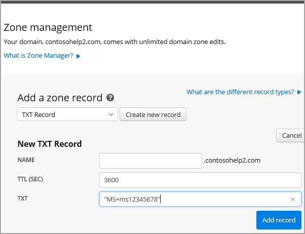
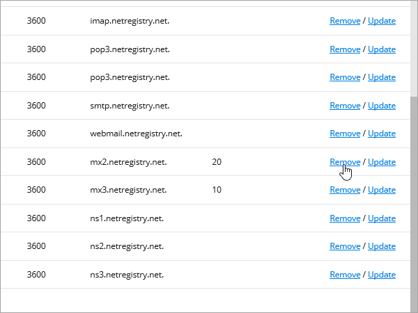
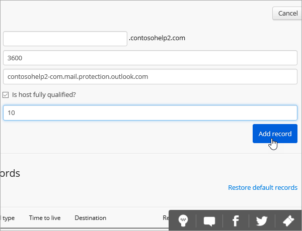

# Crear registros DNS en Netregistry para Microsoft

[Consulte Preguntas más frecuentes acerca de los dominios](../setup/domains-faq.yml) si no encuentra lo que busca. 
  
Si Netregistry es su proveedor de host DNS, siga los pasos de este artículo para comprobar su dominio y configurar registros DNS para correo electrónico, Skype Empresarial Online, entre otros.
  
Estos son los registros principales que se deben agregar.
  
- [Agregar un registro TXT para verificación](#add-a-txt-record-for-verification)
    
- [Agregar un registro MX para que el correo electrónico del dominio vaya a Microsoft](#add-an-mx-record-so-email-for-your-domain-will-come-to-microsoft)

- [Agregar los registros CNAME necesarios para Microsoft](#add-the-cname-records-that-are-required-for-microsoft)
    
- [Agregar un registro TXT para SPF para ayudar a evitar el correo no deseado](#add-a-txt-record-for-spf-to-help-prevent-email-spam)
    
- [Agregar los dos registros SRV necesarios para Microsoft](#add-the-two-srv-records-that-are-required-for-microsoft)
    
Después de agregar estos registros a Netregistry, el dominio estará configurado para funcionar con los servicios Microsoft.
  
  
> [!NOTE]
> Por lo general, los cambios de DNS tardan unos 15 minutos en aplicarse. Sin embargo, a veces los cambios pueden necesitar más tiempo para aplicarse en todo el sistema DNS de Internet. Si tiene problemas con el flujo de correo u otros problemas después de agregar registros DNS, consulte [Solucionar problemas después de cambiar el nombre del dominio o los registros DNS](../get-help-with-domains/find-and-fix-issues.md). 
  
## Agregar un registro TXT para verificación

Antes de utilizar el dominio con Microsoft, tenemos que asegurarnos de que sea el propietario. Si puede iniciar sesión en la cuenta en el registrador de dominio y crear el registro DNS, Microsoft sabrá que es el propietario del dominio.
  
> [!NOTE]
> Este registro se usa exclusivamente para verificar si se es el propietario de un dominio; no afecta a nada más. Puede eliminarlo más adelante, si lo desea. 
  
1. To get started, go to your domains page in Netregistry by using [this link](https://theconsole.netregistry.com.au/). You'll be prompted to log in.
    
    
  
2. Junto al dominio que desea administrar, seleccione **Administrar**.
    
    
  
3. Seleccione **Administrador de zonas.**
    
    
  
4. En **Agregar un registro de zona,** elija Registro **TXT** de la lista y, a continuación, seleccione Crear **nuevo registro.**
    
    
  
    > [!NOTE]
    > Debe usar comillas antes y después de la entrada en el cuadro TXT. 
  
    En el **formulario Nuevo registro TXT,** escriba o copie y pegue los valores de la tabla siguiente. 
    
    |**Nombre**|**TTL (SEC)**|**TXT (apunta a la dirección o al valor)**|
    |:-----|:-----|:-----|
    |(se deja en blanco)    |3600 (segundos)    |"MS=msXXXXXXXX"    **Nota:** esto es un ejemplo. Utilice aquí su valor de **Dirección de destino**, desde la tabla. [¿Cómo puedo encontrar esto?](../get-help-with-domains/information-for-dns-records.md)  |
       
    
  
6. Seleccione **Agregar registro.**
    
Ahora que ha agregado el registro en el sitio de su registrador de dominios, deberá volver a Microsoft y solicitar el registro.
  
Cuando Microsoft encuentre el registro TXT correcto, se comprobará su dominio.
  
1. En el centro de administración, diríjase a la página **configuración** \> <a href="https://go.microsoft.com/fwlink/p/?linkid=834818" target="_blank">dominios</a>.
    
2. En la página **Dominios**, elija el dominio que está verificando. 
    
    
  
3. En la página de **Configuración**, elija **Iniciar configuración**.
    
    
  
4. En la página **verificar dominio**, seleccione **verificar**.
    
    
  
> [!NOTE]
>  Por lo general, los cambios de DNS tardan unos 15 minutos en aplicarse. Sin embargo, a veces los cambios pueden necesitar más tiempo para aplicarse en todo el sistema DNS de Internet. Si tiene problemas con el flujo de correo u otros problemas después de agregar registros DNS, consulte [Solucionar problemas después de cambiar el nombre del dominio o los registros DNS](../get-help-with-domains/find-and-fix-issues.md). 
  
## Agregar un registro MX para que el correo electrónico del dominio vaya a Microsoft

1. To get started, go to your domains page in Netregistry by using [this link](https://theconsole.netregistry.com.au/). You'll be prompted to log in.
    
    
  
2. Junto al dominio que desea administrar, seleccione **Administrar**.
    
    
  
3. Seleccione **Administrador de zonas.**
    
    
  
4. En **Registros de zona actual,** quite los registros MX predeterminados seleccionando Quitar junto a cada registro MX de la lista.  
    
    
  
5. En **Agregar un registro de zona,** elija Registro **MX** en la lista y, a continuación, seleccione Crear **nuevo registro.**
    
    
  
6. En el **formulario Nuevo registro MX,** escriba o copie y pegue los valores de la tabla siguiente. 
    
    |**Nombre**|**TTL (SEC)**|**Exchange (apunta a la dirección o al valor)**|**¿El host está completo?**|**Preferencia (prioridad)**|
    |:-----|:-----|:-----|:-----|:-----|
    |(se deja en blanco)    |3600 (segundos)    | *\<domain-key\>*  .mail.protection.outlook.com    **Nota:** Obtenga su  *\<domain-key\>*  cuenta de Microsoft.  [¿Cómo puedo encontrar esto?](../get-help-with-domains/information-for-dns-records.md)      |(active la casilla)    |10      For more information about priority, see What is MX priority?    |
       
    
  
7. Seleccione **Agregar registro.**
    
    
  
## Agregar los registros CNAME necesarios para Microsoft

1. To get started, go to your domains page in Netregistry by using [this link](https://theconsole.netregistry.com.au/). You'll be prompted to log in.
    
    
  
2. Junto al dominio que desea administrar, seleccione **Administrar**.
    
    
  
3. Seleccione **Administrador de zonas.**
    
    
  
4. En **Agregar un registro de zona,** elija Registro **CNAME** de la lista y, a continuación, **seleccione Crear nuevo registro.**
    
    
  
5. En los cuadros para el nuevo registro, escriba o copie y pegue los valores de la tabla siguiente.
    
    |**Nombre**|**Tipo**|**TTL**|**HOST (puntos a o valor de dirección)**|
    |:-----|:-----|:-----|:-----|
    |autodiscover    |CNAME    |3600 (segundos)    |autodiscover.outlook.com    |
    |sip    |CNAME    |3600 (segundos)    |sipdir.online.lync.com    |
    |lyncdiscover    |CNAME    |3600 (segundos)    |webdir.online.lync.com    |
    |enterpriseregistration    |CNAME    |3600 (segundos)    |enterpriseregistration.windows.net    |
    |enterpriseenrollment    |CNAME    |3600 (segundos)    |enterpriseenrollment-s.manage.microsoft.com    |
       
    
      
6. Seleccione **Agregar registro.**
    
    
  
7. Repita los pasos anteriores para crear los otros cinco registros CNAME.
    
    Para cada registro, escriba o copie y pegue los valores de la siguiente fila de la tabla anterior en los cuadros de ese registro.
    
## Agregar un registro TXT para SPF para ayudar a evitar el correo no deseado

> [!IMPORTANT]
> No puede tener más de un registro TXT para el SPF de un dominio. Si su dominio tiene más de un registro de SPF, obtendrá errores de correo, así como problemas de clasificación de entrega y de correo no deseado. Si ya tiene un registro de SPF para su dominio, no cree uno nuevo para Microsoft. En su lugar, agregue los valores de Microsoft necesarios al registro actual para que tenga un único registro  *de*  SPF que incluya ambos conjuntos de valores.
  
1. To get started, go to your domains page in Netregistry by using [this link](https://theconsole.netregistry.com.au/). You'll be prompted to log in.
    
    
  
2. Junto al dominio que desea administrar, seleccione **Administrar**.
    
    
  
3. Seleccione **Administrador de zonas.**
    
    
  
4. En **Agregar un registro de zona,** elija Registro **TXT** de la lista y, a continuación, seleccione Crear **nuevo registro.**
    
    
  
5. En los cuadros para el nuevo registro, escriba o copie y pegue los valores de la tabla siguiente. 
    
    > [!NOTE]
    > Debe usar comillas antes y después de la entrada en el cuadro TXT. 
  
    |**Nombre**|**Tipo**|**TTL**|**Datos TXT (destino)**|
    |:-----|:-----|:-----|:-----|
    |(se deja en blanco)    |TXT    |3600 (segundos)    |"v=spf1 include:spf.protection.outlook.com -all"    **Nota:** recomendamos copiar y pegar esta entrada, para que todo el espacio sea correcto.           |
   
    
  
6. Seleccione **Agregar registro.**
    
    
  
## Agregar los dos registros SRV necesarios para Microsoft

1. To get started, go to your domains page in Netregistry by using [this link](https://theconsole.netregistry.com.au/). You'll be prompted to log in.
    
    
  
2. Junto al dominio que desea administrar, seleccione  **Administrar**.
    
    
  
3. Seleccione **Administrador de zonas.**
    
    
  
4. En **Agregar un registro de zona,** elija Registro **SRV** de la lista y, a continuación, **seleccione Crear nuevo registro.**
    
    
  
5. En los cuadros para el nuevo registro, escriba o copie y pegue los valores de la tabla siguiente.
    
    > [!NOTE]
    > El campo Nombre es una combinación del servicio (por ejemplo, _sip) y el protocolo (por ejemplo, _tls). 
  
    |**Tipo**|**Nombre**|**TTL (SEC)**|**Prioridad**|**Grosor**|**Puerto**|**Destino**|
    |:-----|:-----|:-----|:-----|:-----|:-----|:-----|
    |SRV (servicio)    |_sip._tls    |3600 (segundos)    |100    |1     |443    |sipdir.online.lync.com    |
    |SRV (servicio)    |_sipfederationtls._tcp    |3600 (segundos)    |100    |1     |5061    |sipfed.online.lync.com    |
       
    
  
6. Seleccione **Agregar registro.**
    
    
  
7. Repita los pasos anteriores para crear el otro registro SRV.
    
    Copie y pegue los valores de la segunda fila de la tabla anterior en los cuadros para el segundo registro.
    
> [!NOTE]
> Por lo general, los cambios de DNS tardan unos 15 minutos en aplicarse. Sin embargo, a veces los cambios pueden necesitar más tiempo para aplicarse en todo el sistema DNS de Internet. Si tiene problemas con el flujo de correo u otros problemas después de agregar registros DNS, consulte [Solucionar problemas después de cambiar el nombre del dominio o los registros DNS](../get-help-with-domains/find-and-fix-issues.md). 
  

