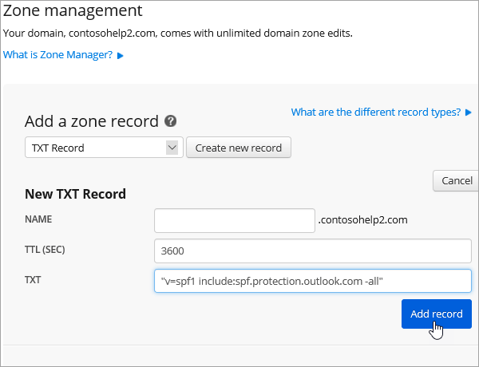

# Crear registros DNS en Netregistry para Office 365Create DNS records at Netregistry for Office 365

[Consulte Preguntas más frecuentes acerca de los dominios](../setup/domains-faq.md) si no encuentra lo que busca.[Check the Domains FAQ](../setup/domains-faq.md) if you don't find what you're looking for. 
  
Si Netregistry es su proveedor de host DNS, siga los pasos de este artículo para comprobar su dominio y configurar los registros DNS para el correo electrónico, Skype empresarial online, etc.If Netregistry is your DNS hosting provider, follow the steps in this article to verify your domain and set up DNS records for email, Skype for Business Online, and so on.
  
Estos son los registros principales que se deben agregar.These are the main records to add.
  
- [Agregar un registro TXT para verificaciónAdd a TXT record for verification](#add-a-txt-record-for-verification)
    
- [Agregar un registro MX para que el correo electrónico del dominio vaya a Office 365Add an MX record so email for your domain will come to Office 365](#add-an-mx-record-so-email-for-your-domain-will-come-to-office-365)

- [Agregar los registros CNAME necesarios para Office 365Add the CNAME records that are required for Office 365](#add-the-cname-records-that-are-required-for-office-365)
    
- [Agregar un registro TXT para SPF para ayudar a evitar el correo no deseadoAdd a TXT record for SPF to help prevent email spam](#add-a-txt-record-for-spf-to-help-prevent-email-spam)
    
- [Agregar los dos registros SRV necesarios para Office 365Add the two SRV records that are required for Office 365](#add-the-two-srv-records-that-are-required-for-office-365)
    
Después de agregar estos registros a Netregistry, su dominio estará configurado para trabajar con los servicios de Office 365.After you add these records at Netregistry, your domain will be set up to work with Office 365 services.
  
Para obtener información acerca del hospedaje web y de DNS para sitios web con Office 365, consulte [Usar un sitio web público con Office 365](https://support.office.com/article/a8178510-501d-4bd8-9921-b04f2e9517a5.aspx).To learn about webhosting and DNS for websites with Office 365, see [Use a public website with Office 365](https://support.office.com/article/a8178510-501d-4bd8-9921-b04f2e9517a5.aspx).
  
> [!NOTE]
> Por lo general, los cambios de DNS tardan unos 15 minutos en aplicarse. Sin embargo, a veces los cambios pueden necesitar más tiempo para aplicarse en todo el sistema DNS de Internet. Si tiene problemas con el flujo de correo u otros problemas después de agregar registros DNS, consulte [Solucionar problemas después de cambiar el nombre del dominio o los registros DNS](../get-help-with-domains/find-and-fix-issues.md).Typically it takes about 15 minutes for DNS changes to take effect. However, it can occasionally take longer for a change you've made to update across the Internet's DNS system. If you're having trouble with mail flow or other issues after adding DNS records, see [Troubleshoot issues after changing your domain name or DNS records](../get-help-with-domains/find-and-fix-issues.md). 
  
## Agregar un registro TXT para verificaciónAdd a TXT record for verification

Para que pueda usar el dominio con Office 365, tenemos que asegurarnos de que es de su propiedad. Si puede iniciar sesión en la cuenta en su registrador de dominios y crear el registro DNS, Office 365 sabrá que es el propietario del dominio.Before you use your domain with Office 365, we have to make sure that you own it. Your ability to log in to your account at your domain registrar and create the DNS record proves to Office 365 that you own the domain.
  
> [!NOTE]
> Este registro se usa exclusivamente para verificar si se es el propietario de un dominio; no afecta a nada más. Puede eliminarlo más adelante, si lo desea.This record is used only to verify that you own your domain; it doesn't affect anything else. You can delete it later, if you like. 
  
1. Para empezar, vaya a su página de dominios en Netregistry a través de [este vínculo](https://theconsole.netregistry.com.au/).To get started, go to your domains page in Netregistry by using [this link](https://theconsole.netregistry.com.au/). You'll be prompted to log in.You'll be prompted to log in.
    
    
  
2. Junto al dominio que quiera administrar, seleccione **administrar**.Next to the domain you want to manage, select **Manage**.
    
    
  
3. Seleccione **Administrador de zonas**.Select **Zone Manager**.
    
    
  
4. En **Agregar un registro de zona**, elija **registro TXT** de la lista y, a continuación, seleccione **crear nuevo registro**.Under **Add a zone record**, choose **TXT Record** from the list, and then select **Create new record**.
    
    
  
    > [!NOTE]
    > Debe usar comillas antes y después de la entrada en el cuadro TXT.You must use quotation marks before and after the entry in the TXT box. 
  
    En el **nuevo formulario de registro TXT** , escriba (o copie y pegue) los valores de la tabla siguiente.In the **New TXT Record** form, type or copy and paste the values from the following table. 
    
    |**Nombre****Name**|**TTL (SEG.)****TTL (SEC)**|**TXT (apunta a la dirección o al valor)****TXT (Points to address or value)**|
    |:-----|:-----|:-----|
    |(se deja en blanco)(leave blank)    |3600 (segundos)3600 (seconds)    |"MS = msXXXXXXXX""MS=msXXXXXXXX"    **Nota:** esto es un ejemplo.**Note:** This is an example. Use su valor **Dirección de destino** específico aquí, de la tabla de Office 365.Use your specific **Destination or Points to Address** value here, from the table in Office 365. [¿Cómo puedo encontrar esto?How do I find this?](../get-help-with-domains/information-for-dns-records.md)  |
       
    
  
6. Seleccione **Agregar registro**.Select **Add record**.
    
Ahora que ha agregado el registro en el sitio de su registrador de dominios, volverá a Office 365 y solicitará que Office 365 lo busque.Now that you've added the record at your domain registrar's site, you'll go back to Office 365 and request Office 365 to look for the record.
  
Cuando Office 365 encuentre el registro TXT correcto, se comprobará su dominio.When Office 365 finds the correct TXT record, your domain is verified.
  
1. En el centro de administración, diríjase a la página **configuración** \> <a href="https://go.microsoft.com/fwlink/p/?linkid=834818" target="_blank">dominios</a>.In the admin center, go to the **Settings** \> <a href="https://go.microsoft.com/fwlink/p/?linkid=834818" target="_blank">Domains</a> page.
    
2. En la página **Dominios**, elija el dominio que está verificando.On the **Domains** page, select the domain that you are verifying. 
    
    
  
3. En la página de **Configuración**, elija \*\* Iniciar configuración\*\*.On the **Setup** page, select **Start setup**.
    
    
  
4. En la página**verificar dominio**, seleccione **verificar**.On the **Verify domain** page, select **Verify**.
    
    
  
> [!NOTE]
>  Por lo general, los cambios de DNS tardan unos 15 minutos en aplicarse. Sin embargo, a veces los cambios pueden necesitar más tiempo para aplicarse en todo el sistema DNS de Internet. Si tiene problemas con el flujo de correo u otros problemas después de agregar registros DNS, consulte [Solucionar problemas después de cambiar el nombre del dominio o los registros DNS](../get-help-with-domains/find-and-fix-issues.md).Typically it takes about 15 minutes for DNS changes to take effect. However, it can occasionally take longer for a change you've made to update across the Internet's DNS system. If you're having trouble with mail flow or other issues after adding DNS records, see [Troubleshoot issues after changing your domain name or DNS records](../get-help-with-domains/find-and-fix-issues.md). 
  
## Agregar un registro MX para que el correo electrónico del dominio vaya a Office 365Add an MX record so email for your domain will come to Office 365

1. Para empezar, vaya a su página de dominios en Netregistry a través de [este vínculo](https://theconsole.netregistry.com.au/).To get started, go to your domains page in Netregistry by using [this link](https://theconsole.netregistry.com.au/). You'll be prompted to log in.You'll be prompted to log in.
    
    
  
2. Junto al dominio que quiera administrar, seleccione **administrar**.Next to the domain you want to manage, select **Manage**.
    
    
  
3. Seleccione **Administrador de zonas**.Select **Zone Manager**.
    
    
  
4. En **registros de la zona actual**, quite los registros MX predeterminados seleccionando **quitar** junto a cada registro MX de la lista.Under **Current zone records**, remove the default MX records by selecting **Remove** next to each MX record in the list. 
    
    
  
5. En **Agregar un registro de zona**, elija **registro MX** de la lista y, después, seleccione **crear nuevo registro**.Under **Add a zone record**, choose **MX Record** from the list, and then select **Create new record**.
    
    
  
6. En el formulario **nuevo registro MX** , escriba (o copie y pegue) los valores de la tabla siguiente.In the **New MX Record** form, type or copy and paste the values from the following table. 
    
    |**Nombre****Name**|**TTL (SEG.)****TTL (SEC)**|**Exchange (apunta a la dirección o al valor)****Exchange (Points to address or value)**|**¿Es el host completo?****Is host fully qualified?**|**Preferencia (prioridad)****Preference (Priority)**|
    |:-----|:-----|:-----|:-----|:-----|
    |(se deja en blanco)(leave blank)    |3600 (segundos)3600 (seconds)    | *\< clave-de-dominio \>*  . mail.protection.outlook.com    *\<domain-key\>*  .mail.protection.outlook.com    **Nota:** Obtenga la \* \<clave\> de dominio\* de su cuenta de Office 365.**Note:** Get your  *\<domain-key\>*  from your Office 365 account.  [¿Cómo puedo encontrar esto?How do I find this?](../get-help-with-domains/information-for-dns-records.md)      |(seleccione la casilla de verificación)(select the checkbox)    |10 10    For more information about priority, see What is MX priority?For more information about priority, see What is MX priority?    |
       
    
  
7. Seleccione **Agregar registro**.Select **Add Record**.
    
    
  
## Agregar los registros CNAME necesarios para Office 365Add the CNAME records that are required for Office 365

1. Para empezar, vaya a su página de dominios en Netregistry a través de [este vínculo](https://theconsole.netregistry.com.au/).To get started, go to your domains page in Netregistry by using [this link](https://theconsole.netregistry.com.au/). You'll be prompted to log in.You'll be prompted to log in.
    
    
  
2. Junto al dominio que quiera administrar, seleccione **administrar**.Next to the domain you want to manage, select **Manage**.
    
    
  
3. Seleccione **Administrador de zonas**.Select **Zone Manager**.
    
    
  
4. En **Agregar un registro de zona**, elija **registro CNAME** de la lista y, después, seleccione **crear nuevo registro**.Under  **Add a zone record**, choose **CNAME Record** from the list, and then select **Create new record**.
    
    
  
5. En los cuadros para el nuevo registro, escriba o copie y pegue los valores de la tabla siguiente.In the boxes for the new record, type or copy and paste the values from the following table.
    
    |**Name****Name**|**Type****Type**|**TTL****TTL**|**HOST (valor de punto o dirección)****HOST (Points to or address value)**|
    |:-----|:-----|:-----|:-----|
    |autodiscoverautodiscover    |CNAMECNAME    |3600 (segundos)3600 (seconds)    |autodiscover.outlook.comautodiscover.outlook.com    |
    |sipsip    |CNAMECNAME    |3600 (segundos)3600 (seconds)    |sipdir.online.lync.comsipdir.online.lync.com    |
    |lyncdiscoverlyncdiscover    |CNAMECNAME    |3600 (segundos)3600 (seconds)    |webdir.online.lync.comwebdir.online.lync.com    |
    |enterpriseregistrationenterpriseregistration    |CNAMECNAME    |3600 (segundos)3600 (seconds)    |enterpriseregistration.windows.netenterpriseregistration.windows.net    |
    |enterpriseenrollmententerpriseenrollment    |CNAMECNAME    |3600 (segundos)3600 (seconds)    |enterpriseenrollment-s.manage.microsoft.comenterpriseenrollment-s.manage.microsoft.com    |
       
    
      
6. Seleccione **Agregar registro**.Select **Add record**.
    
    
  
7. Repita los pasos anteriores para crear los otros cinco registros CNAME.Repeat the previous steps to create the other five CNAME records.
    
    Para cada registro, escriba (o copie y pegue) los valores de la siguiente fila de la tabla anterior en los cuadros para ese registro.For each record, type or copy and paste the values from the next row of the table above into the boxes for that record.
    
## Agregar un registro TXT para SPF para ayudar a evitar el correo no deseadoAdd a TXT record for SPF to help prevent email spam

> [!IMPORTANT]
> No puede tener más de un registro TXT para el SPF de un dominio.You cannot have more than one TXT record for SPF for a domain. Si su dominio tiene más de un registro de SPF, obtendrá errores de correo, así como problemas de clasificación de entrega y de correo no deseado.If your domain has more than one SPF record, you'll get email errors, as well as delivery and spam classification issues. If you already have an SPF record for your domain, don't create a new one for Office 365.If you already have an SPF record for your domain, don't create a new one for Office 365. En vez de eso, agregue los valores necesarios de Office 365 para el registro actual, de modo que solo tenga un  *único*  registro de SPF que incluya ambos conjuntos de valores.Instead, add the required Office 365 values to the current record so that you have a  *single*  SPF record that includes both sets of values.
  
1. Para empezar, vaya a su página de dominios en Netregistry a través de [este vínculo](https://theconsole.netregistry.com.au/).To get started, go to your domains page in Netregistry by using [this link](https://theconsole.netregistry.com.au/). You'll be prompted to log in.You'll be prompted to log in.
    
    
  
2. Junto al dominio que quiera administrar, seleccione **administrar**.Next to the domain you want to manage, select **Manage**.
    
    
  
3. Seleccione **Administrador de zonas**.Select **Zone Manager**.
    
    
  
4. En **Agregar un registro de zona**, elija **registro TXT** de la lista y, a continuación, seleccione **crear nuevo registro**.Under **Add a zone record**, choose **TXT Record** from the list, and then select **Create new record**.
    
    
  
5. En los cuadros para el nuevo registro, escriba o copie y pegue los valores de la tabla siguiente.In the boxes for the new record, type or copy and paste the values from the following table. 
    
    > [!NOTE]
    > Debe usar comillas antes y después de la entrada en el cuadro TXT.You must use quotation marks before and after the entry in the TXT box. 
  
    |**Name****Name**|**Type****Type**|**TTL****TTL**|**Datos TXT (destino)****TXT Data (Target)**|
    |:-----|:-----|:-----|:-----|
    |(se deja en blanco)(leave blank)    |TXTTXT    |3600 (segundos)3600 (seconds)    |"v = spf1 include include SPF. Protection. Outlook. com-All""v=spf1 include:spf.protection.outlook.com -all"    **Nota:** recomendamos copiar y pegar esta entrada, para que todo el espacio sea correcto.**Note:** We recommend copying and pasting this entry, so that all of the spacing stays correct.           |
   
    
  
6. Seleccione **Agregar registro**.Select **Add Record**.
    
    
  
## Agregar los dos registros SRV necesarios para Office 365Add the two SRV records that are required for Office 365

1. Para empezar, vaya a su página de dominios en Netregistry a través de [este vínculo](https://theconsole.netregistry.com.au/).To get started, go to your domains page in Netregistry by using [this link](https://theconsole.netregistry.com.au/). You'll be prompted to log in.You'll be prompted to log in.
    
    
  
2. Junto al dominio que quiera administrar, seleccione **administrar**.Next to the domain you want to manage, select  **Manage**.
    
    
  
3. Seleccione **Administrador de zonas**.Select **Zone Manager**.
    
    
  
4. En **Agregar un registro de zona**, elija **registro SRV** en la lista y, a continuación, seleccione **crear nuevo registro**.Under  **Add a zone record**, choose **SRV Record** from the list, and then select **Create new record**.
    
    
  
5. En los cuadros para el nuevo registro, escriba o copie y pegue los valores de la tabla siguiente.In the boxes for the new record, type or copy and paste the values from the following table.
    
    > [!NOTE]
    > El campo nombre es una combinación del servicio (por ejemplo, _sip) y el protocolo (por ejemplo, _tls).The Name field is a combination of the service (for example, _sip) and protocol (for example, _tls). 
  
    |**Tipo****Type**|**Nombre****Name**|**TTL (SEG.)****TTL (SEC)**|**Prioridad****Priority**|**Grosor****Weight**|**Puerto****Port**|**Destino****Target**|
    |:-----|:-----|:-----|:-----|:-----|:-----|:-----|
    |SRV (servicio)SRV (service)    |_sip. _tls_sip._tls    |3600 (segundos)3600 (seconds)    |100100    |11    |443443    |sipdir.online.lync.comsipdir.online.lync.com    |
    |SRV (servicio)SRV (service)    |_sipfederationtls. _tcp_sipfederationtls._tcp    |3600 (segundos)3600 (seconds)    |100100    |11    |50615061    |sipfed.online.lync.comsipfed.online.lync.com    |
       
    
  
6. Seleccione **Agregar registro**.Select **Add Record**.
    
    
  
7. Repita los pasos anteriores para crear el otro registro SRV.Repeat the previous steps to create the other SRV record.
    
    Copie y pegue los valores de la segunda fila de la tabla anterior en los cuadros para el segundo registro.Type or copy and paste the values from the second row of the table above into the boxes for the second record.
    
> [!NOTE]
> Por lo general, los cambios de DNS tardan unos 15 minutos en aplicarse. Sin embargo, a veces los cambios pueden necesitar más tiempo para aplicarse en todo el sistema DNS de Internet. Si tiene problemas con el flujo de correo u otros problemas después de agregar registros DNS, consulte [Solucionar problemas después de cambiar el nombre del dominio o los registros DNS](../get-help-with-domains/find-and-fix-issues.md).Typically it takes about 15 minutes for DNS changes to take effect. However, it can occasionally take longer for a change you've made to update across the Internet's DNS system. If you're having trouble with mail flow or other issues after adding DNS records, see [Troubleshoot issues after changing your domain name or DNS records](../get-help-with-domains/find-and-fix-issues.md). 
  

