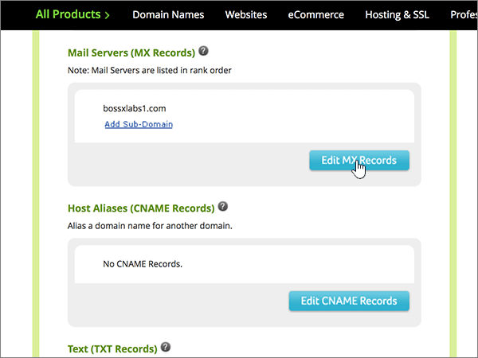
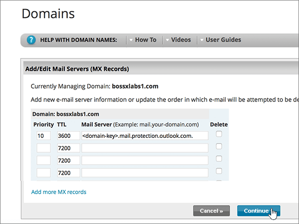

# Crear registros DNS en Network Solutions for Microsoft

 **[Consulte Preguntas más frecuentes acerca de los dominios](../setup/domains-faq.md)** si no encuentra lo que busca. 
  
Si Network Solutions es su proveedor de host DNS, siga los pasos de este artículo para comprobar el dominio y configurar los registros DNS para el correo electrónico, Skype Empresarial Online, etc.
  
Estos son los registros principales que agregar. Siga los pasos siguientes o [vea el vídeo](https://support.microsoft.com/office/c49698c2-6991-47fb-b5ac-18e49a505099). 
  
- [Agregar un registro TXT para verificación](#add-a-txt-record-for-verification)
    
- [Agregar un registro MX para que el correo electrónico del dominio vaya a Microsoft](#add-an-mx-record-so-email-for-your-domain-will-come-to-microsoft)
    
- [Agregar los registros CNAME necesarios para Microsoft](#add-the-cname-records-that-are-required-for-microsoft)
    
- [Agregar un registro TXT para SPF para ayudar a evitar el correo no deseado](#add-a-txt-record-for-spf-to-help-prevent-email-spam)
    
- [Agregar los dos registros SRV necesarios para Microsoft](#add-the-two-srv-records-that-are-required-for-microsoft)
    
Después de agregar estos registros a Network Solutions, el dominio estará configurado para funcionar con los servicios de Microsoft.
  

  
> [!NOTE]
>  Por lo general, los cambios de DNS tardan unos 15 minutos en aplicarse. Sin embargo, a veces los cambios pueden necesitar más tiempo para aplicarse en todo el sistema DNS de Internet. Si tiene problemas con el flujo de correo u otros problemas después de agregar registros DNS, consulte [Solucionar problemas después de cambiar el nombre del dominio o los registros DNS](../get-help-with-domains/find-and-fix-issues.md). 
  
## Agregar un registro TXT para verificación

Antes de utilizar el dominio con Microsoft, tenemos que asegurarnos de que sea el propietario. Si puede iniciar sesión en la cuenta en el registrador de dominio y crear el registro DNS, Microsoft sabrá que es el propietario del dominio.
  
> [!NOTE]
> Este registro se usa exclusivamente para verificar si se es el propietario de un dominio; no afecta a nada más. Puede eliminarlo más adelante, si lo desea. 
  
Siga los pasos siguientes o [vea el vídeo (empieza en 0:47)](https://support.microsoft.com/office/c49698c2-6991-47fb-b5ac-18e49a505099).
  
1. Para empezar, vaya a la página de dominios en Network Solutions mediante [este vínculo](https://www.networksolutions.com/manage-it). Se le pedirá que inicie sesión.
    
    > [!IMPORTANT]
    > Antes de seleccionar el botón de **Inicio de sesión** , elija **Administrar mis nombres de dominio** en la lista desplegable **iniciar sesión en:** . 
  
    
  
2. Seleccione la casilla situada al lado del nombre del dominio que desea modificar.
    
    
  
3. Seleccione **Editar DNS**.
    
    
  
4. Seleccione **administrar registros DNS avanzados**.
    
    (Es posible que tenga que desplazarse hacia abajo).
    
    
  
5. Desplácese hacia abajo hasta la sección **texto (registros txt)** y, a continuación, seleccione **Editar registros txt**.
    
    
  
6. En los cuadros para el nuevo registro, escriba o copie y pegue los valores de la tabla siguiente.
    
    |**Host**|**TTL**|**Texto**|
    |:-----|:-----|:-----|
    |@    (The system will change this value to **@ (None)** when you save the record.)    |3600    |MS=ms *XXXXXXXX*    **Nota:** esto es un ejemplo. Utilice aquí su valor de **Dirección de destino**, desde la tabla.  [¿Cómo puedo encontrar esto?](../get-help-with-domains/information-for-dns-records.md)   |
       
    
  
7. Seleccione **continuar**.
    
    
  
8. Seleccione **Guardar cambios**.
    
    
  
9. Espere unos minutos antes de continuar para que el registro que acaba de crear pueda actualizarse en Internet.
    
Ahora que ha agregado el registro en el sitio de su registrador de dominios, deberá volver a Microsoft y solicitar el registro.
  
Cuando Microsoft encuentre el registro TXT correcto, se comprobará su dominio.

1. En el centro de administración, diríjase a la página **configuración** \> <a href="https://go.microsoft.com/fwlink/p/?linkid=834818" target="_blank">dominios</a>.
    
2. En la página **Dominios**, elija el dominio que está verificando. 
    
    
  
3. En la página de **Configuración**, elija ** Iniciar configuración**.
    
    
  
4. En la página**verificar dominio**, seleccione **verificar**.
    
    
  
> [!NOTE]
>  Por lo general, los cambios de DNS tardan unos 15 minutos en aplicarse. Sin embargo, a veces los cambios pueden necesitar más tiempo para aplicarse en todo el sistema DNS de Internet. Si tiene problemas con el flujo de correo u otros problemas después de agregar registros DNS, consulte [Solucionar problemas después de cambiar el nombre del dominio o los registros DNS](../get-help-with-domains/find-and-fix-issues.md). 
  
## Agregar un registro MX para que el correo electrónico del dominio vaya a Microsoft

Siga los pasos siguientes o [vea el vídeo (empieza en 3:51)](https://support.microsoft.com/office/c49698c2-6991-47fb-b5ac-18e49a505099).
  
1. Para empezar, vaya a la página de dominios en Network Solutions mediante [este vínculo](https://www.networksolutions.com/manage-it). Se le pedirá que inicie sesión.
    
    > [!IMPORTANT]
    > Antes de seleccionar el botón de **Inicio de sesión** , elija **Administrar mis nombres de dominio** en la lista desplegable **iniciar sesión en:** . 
  
    
  
2. Seleccione la casilla situada al lado del nombre del dominio que desea modificar.
    
    
  
3. Seleccione **Editar DNS**.
    
    
  
4. Seleccione **administrar registros DNS avanzados**.
    
    (Es posible que tenga que desplazarse hacia abajo).
    
    
  
5. Desplácese hacia abajo hasta la sección **servidores de correo (registros MX)** y, a continuación, seleccione **Editar registros MX**.
    
    
  
6. En los cuadros para el nuevo registro, escriba o copie y pegue los valores de la tabla siguiente.
    
    |**Prioridad**|**TTL**|**Servidor de correo**|
    |:-----|:-----|:-----|
    |10      Para obtener más información sobre la prioridad, consulte [¿Qué es una prioridad de MX?](https://docs.microsoft.com/microsoft-365/admin/setup/domains-faq)   |3600    | *\<domain-key\>*  . mail.protection.outlook.com.    **Este valor DEBE terminar en punto (.)**   **Nota:** Obtén tu  *\<domain-key\>*  cuenta de Microsoft. [¿Cómo puedo encontrar esto?](../get-help-with-domains/information-for-dns-records.md)          |
       
    
  
7. Seleccione **continuar**.
    
    
  
8. Seleccione **Guardar cambios**.
    
    
  
9. Si hay otros registros MX, elimínelos todos (para hacerlo, seleccione **Eliminar** junto a cada registro). 
    
    
  
10. Cuando estén todos seleccionados, seleccione **continuar**.
    
    
  
11. Seleccione **Guardar cambios**.
    
    
  
## Agregar los registros CNAME necesarios para Microsoft

Siga los pasos siguientes o [vea el vídeo (empieza en 4:43)](https://support.microsoft.com/office/c49698c2-6991-47fb-b5ac-18e49a505099).
  
1. Para empezar, vaya a la página de dominios en Network Solutions mediante [este vínculo](https://www.networksolutions.com/manage-it). Se le pedirá que inicie sesión.
    
    > [!IMPORTANT]
    > Antes de seleccionar el botón de **Inicio de sesión** , elija **Administrar mis nombres de dominio** en la lista desplegable **iniciar sesión en:** . 
  
    
  
2. Seleccione la casilla situada al lado del nombre del dominio que desea modificar.
    
    
  
3. Seleccione **Editar DNS**.
    
    
  
4. Seleccione **administrar registros DNS avanzados**.
    
    (Es posible que tenga que desplazarse hacia abajo).
    
    
  
5. Desplácese hacia abajo hasta la sección **alias de host (registros CNAME)** y, a continuación, seleccione **Editar registros CNAME**.
    
    
  
6. En los cuadros de los cuatro nuevos registros, escriba (o copie y pegue) los valores de la tabla siguiente.
    
    |**Alias**|**TTL**|**Referencia a nombre de host**|**Otro host          (seleccione el botón de opción **Otro host**)**|
    |:-----|:-----|:-----|:-----|
    |autodiscover    |3600    |(Sin configuración)    |autodiscover.outlook.com.    **Este valor DEBE terminar en punto (.)**   |
    |sip    |3600    |(Sin configuración)    |sipdir.online.lync.com.    **Este valor DEBE terminar en punto (.)**   |
    |lyncdiscover    |3600    |(Sin configuración)    |webdir.online.lync.com.    **Este valor DEBE terminar en punto (.)**   |
    |enterpriseregistration    |3600    |(Sin configuración)    |enterpriseregistration.windows.net    **Este valor DEBE terminar en punto (.)**   |
    |enterpriseenrollment    |3600    |(Sin configuración)    |enterpriseenrollment-s.manage.microsoft.com    **Este valor DEBE terminar en punto (.)**   |
    
    
  
7. Una vez que haya agregado todos los registros CNAME que necesita, seleccione **continuar**.
    
    
  
8. Seleccione **Guardar cambios**.
    
    
  
## Agregar un registro TXT para SPF para ayudar a evitar el correo no deseado

> [!IMPORTANT]
> No puede tener más de un registro TXT para el SPF de un dominio. Si su dominio tiene más de un registro de SPF, obtendrá errores de correo, así como problemas de clasificación de entrega y de correo no deseado. Si ya tiene un registro de SPF para su dominio, no cree uno nuevo para Microsoft. En su lugar, agregue los valores necesarios de Microsoft al registro activo para que tenga un  *único*  registro de SPF que incluya ambos conjuntos de valores. 
  
Siga los pasos siguientes o [vea el vídeo (empieza en 5:35)](https://support.microsoft.com/office/c49698c2-6991-47fb-b5ac-18e49a505099).
  
1. Para empezar, vaya a la página de dominios en Network Solutions mediante [este vínculo](https://www.networksolutions.com/manage-it). Se le pedirá que inicie sesión.
    
    > [!IMPORTANT]
    > Antes de seleccionar el botón de **Inicio de sesión** , elija **Administrar mis nombres de dominio** en la lista desplegable **iniciar sesión en:** . 
  
    
  
2. Seleccione la casilla situada al lado del nombre del dominio que desea modificar.
    
    
  
3. Seleccione **Editar DNS**.
    
    
  
4. Seleccione **administrar registros DNS avanzados**.
    
    (Es posible que tenga que desplazarse hacia abajo).
    
    
  
5. Desplácese hacia abajo hasta la sección **texto (registros txt)** y, a continuación, seleccione **Editar registros txt**.
    
    
  
6. En el cuadro para el nuevo registro, escriba o copie y pegue los valores siguientes.
    
    |**Host**|**TTL**|**Texto**|
    |:-----|:-----|:-----|
    |@    (The system will change this value to **@ (None)** when you save the record.)    |3600    |v=spf1 include:spf.protection.outlook.com -all    **Nota:** recomendamos copiar y pegar esta entrada, para que todo el espacio sea correcto. |
       
    
  
7. Seleccione **continuar**.
    
    
  
8. Seleccione **Guardar cambios**.
    
    
  
## Agregar los dos registros SRV necesarios para Microsoft

Siga los pasos siguientes o [vea el vídeo (empieza en 6:18)](https://support.microsoft.com/office/c49698c2-6991-47fb-b5ac-18e49a505099).
  
1. Para empezar, vaya a la página de dominios en Network Solutions mediante [este vínculo](https://www.networksolutions.com/manage-it). Se le pedirá que inicie sesión.
    
    > [!IMPORTANT]
    > Antes de seleccionar el botón de **Inicio de sesión** , elija **Administrar mis nombres de dominio** en la lista desplegable **iniciar sesión en:** . 
  
    
  
2. Seleccione la casilla situada al lado del nombre del dominio que desea modificar.
    
    
  
3. Seleccione **Editar DNS**.
    
    
  
4. Seleccione **administrar registros DNS avanzados**.
    
    (Es posible que tenga que desplazarse hacia abajo).
    
    
  
5. Desplácese hacia abajo hasta la sección **servicio (registros SRV)** y, a continuación, seleccione **Editar registros SRV**.
    
    
  
6. En los cuadros de los dos nuevos registros, escriba (o copie y pegue) los valores de la tabla siguiente.
    
    (Elija los valores **Servicio** y **Protocolo** de las listas desplegables). 
    
    |**Servicio**|**Protocolo**|**TTL**|**Prioridad**|**Grosor**|**Puerto**|**Destino**|
    |:-----|:-----|:-----|:-----|:-----|:-----|:-----|
    |_sip    |_tls    |3600    |100    |1    |443    |sipdir.online.lync.com.    **Este valor DEBE terminar en punto (.)**   |
    |_sipfederationtls    |_tcp    |3600    |100    |1    |5061    |sipfed.online.lync.com.    **Este valor DEBE terminar en punto (.).**   |
       
    
  
7. Seleccione **continuar**.
    
    
  
8. Seleccione **Guardar cambios**.
    
    
  
> [!NOTE]
>  Por lo general, los cambios de DNS tardan unos 15 minutos en aplicarse. Sin embargo, a veces los cambios pueden necesitar más tiempo para aplicarse en todo el sistema DNS de Internet. Si tiene problemas con el flujo de correo u otros problemas después de agregar registros DNS, consulte [Solucionar problemas después de cambiar el nombre del dominio o los registros DNS](../get-help-with-domains/find-and-fix-issues.md). 
  
