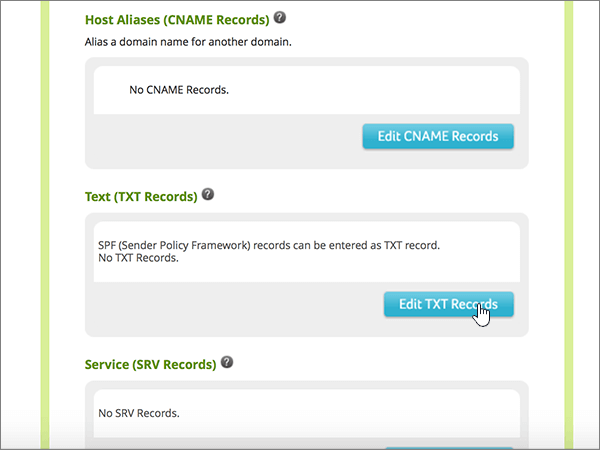

# Crear registros DNS en Network Solutions para Office 365Create DNS records at Network Solutions for Office 365

 **[Consulte Preguntas más frecuentes acerca de los dominios](../setup/domains-faq.md)** si no encuentra lo que busca.**[Check the Domains FAQ](../setup/domains-faq.md)** if you don't find what you're looking for. 
  
Si Network Solutions es su proveedor de host DNS, siga los pasos de este artículo para comprobar el dominio y configurar los registros DNS para el correo electrónico, Skype Empresarial Online, etc.If Network Solutions is your DNS hosting provider, follow the steps in this article to verify your domain and set up DNS records for email, Skype for Business Online, and so on.
  
Estos son los registros principales que agregar.These are the main records to add. Siga los pasos siguientes o [vea el vídeo](https://support.office.com/article/Video-Create-DNS-records-at-Network-Solutions-for-Office-365-c49698c2-6991-47fb-b5ac-18e49a505099?ui=en-US&amp;rs=en-US&amp;ad=US).Follow the steps below or [watch the video](https://support.office.com/article/Video-Create-DNS-records-at-Network-Solutions-for-Office-365-c49698c2-6991-47fb-b5ac-18e49a505099?ui=en-US&amp;rs=en-US&amp;ad=US). 
  
- [Agregar un registro TXT para verificaciónAdd a TXT record for verification](#add-a-txt-record-for-verification)
    
- [Agregar un registro MX para que el correo electrónico del dominio vaya a Office 365Add an MX record so email for your domain will come to Office 365](#add-an-mx-record-so-email-for-your-domain-will-come-to-office-365)
    
- [Agregar los registros CNAME necesarios para Office 365Add the CNAME records that are required for Office 365](#add-the-cname-records-that-are-required-for-office-365)
    
- [Agregar un registro TXT para SPF para ayudar a evitar el correo no deseadoAdd a TXT record for SPF to help prevent email spam](#add-a-txt-record-for-spf-to-help-prevent-email-spam)
    
- [Agregar los dos registros SRV necesarios para Office 365Add the two SRV records that are required for Office 365](#add-the-two-srv-records-that-are-required-for-office-365)
    
Después de agregar estos registros a Network Solutions, el dominio estará configurado para funcionar con los servicios de Office 365.After you add these records at Network Solutions, your domain will be set up to work with Office 365 services.
  
Para obtener información acerca del hospedaje web y de DNS para sitios web con Office 365, consulte [Usar un sitio web público con Office 365](https://support.office.com/article/choose-a-public-website-3325d50e-d131-403c-a278-7f3296fe33a9).To learn about webhosting and DNS for websites with Office 365, see [Use a public website with Office 365](https://support.office.com/article/choose-a-public-website-3325d50e-d131-403c-a278-7f3296fe33a9).
  
> [!NOTE]
>  Por lo general, los cambios de DNS tardan unos 15 minutos en aplicarse. Sin embargo, a veces los cambios pueden necesitar más tiempo para aplicarse en todo el sistema DNS de Internet. Si tiene problemas con el flujo de correo u otros problemas después de agregar registros DNS, consulte [Solucionar problemas después de cambiar el nombre del dominio o los registros DNS](../get-help-with-domains/find-and-fix-issues.md).Typically it takes about 15 minutes for DNS changes to take effect. However, it can occasionally take longer for a change you've made to update across the Internet's DNS system. If you're having trouble with mail flow or other issues after adding DNS records, see [Troubleshoot issues after changing your domain name or DNS records](../get-help-with-domains/find-and-fix-issues.md). 
  
## Agregar un registro TXT para verificaciónAdd a TXT record for verification

Para que pueda usar el dominio con Office 365, tenemos que asegurarnos de que es de su propiedad. Si puede iniciar sesión en la cuenta en su registrador de dominios y crear el registro DNS, Office 365 sabrá que es el propietario del dominio.Before you use your domain with Office 365, we have to make sure that you own it. Your ability to log in to your account at your domain registrar and create the DNS record proves to Office 365 that you own the domain.
  
> [!NOTE]
> Este registro se usa exclusivamente para verificar si se es el propietario de un dominio; no afecta a nada más. Puede eliminarlo más adelante, si lo desea.This record is used only to verify that you own your domain; it doesn't affect anything else. You can delete it later, if you like. 
  
Siga los pasos siguientes o [vea el vídeo (empieza en 0:47)](https://support.office.com/article/Video-Create-DNS-records-at-Network-Solutions-for-Office-365-c49698c2-6991-47fb-b5ac-18e49a505099?ui=en-US&amp;rs=en-US&amp;ad=US).Follow the steps below or [watch the video (start at 0:47)](https://support.office.com/article/Video-Create-DNS-records-at-Network-Solutions-for-Office-365-c49698c2-6991-47fb-b5ac-18e49a505099?ui=en-US&amp;rs=en-US&amp;ad=US).
  
1. Para empezar, vaya a la página de dominios en Network Solutions mediante [este vínculo](https://www.networksolutions.com/manage-it).To get started, go to your domains page at Network Solutions by using [this link](https://www.networksolutions.com/manage-it). Se le pedirá que inicie sesión.You'll be prompted to log in.
    
    > [!IMPORTANT]
    > Antes de seleccionar el botón de **Inicio de sesión** , elija **Administrar mis nombres de dominio** en la lista desplegable **iniciar sesión en:** .Before you select the **Login** button, first choose **Manage My Domain Names** in the **Log In to:** drop-down list. 
  
    
  
2. Seleccione la casilla situada al lado del nombre del dominio que desea modificar.Select the check box next to the name of the domain that you are modifying.
    
    
  
3. Seleccione **Editar DNS**.Select **Edit DNS**.
    
    
  
4. Seleccione **administrar registros DNS avanzados**.Select **Manage Advanced DNS Records**.
    
    (You may have to scroll down.)(You may have to scroll down.)
    
    
  
5. Desplácese hacia abajo hasta la sección **texto (registros txt)** y, a continuación, seleccione **Editar registros txt**.Scroll down to the **Text (TXT Records)** section, and then select **Edit TXT Records**.
    
    
  
6. En los cuadros para el nuevo registro, escriba o copie y pegue los valores de la tabla siguiente.In the boxes for the new record, type or copy and paste the values in the following table.
    
    |**Host****Host**|**TTL****TTL**|**Texto****Text**|
    |:-----|:-----|:-----|
    |@    (The system will change this value to **@ (None)** when you save the record.)(The system will change this value to **@ (None)** when you save the record.)    |36003600    |MS=ms *XXXXXXXX*MS=ms *XXXXXXXX*    **Nota:** esto es un ejemplo.**Note:** This is an example. Use su valor **Dirección de destino** específico aquí, de la tabla de Office 365.Use your specific **Destination or Points to Address** value here, from the table in Office 365.  [¿Cómo puedo encontrar esto?How do I find this?](../get-help-with-domains/information-for-dns-records.md)   |
       
    
  
7. Seleccione **continuar**.Select **Continue**.
    
    
  
8. Seleccione **Guardar cambios**.Select **Save Changes**.
    
    
  
9. Espere unos minutos antes de continuar para que el registro que acaba de crear pueda actualizarse en Internet.Wait a few minutes before you continue, so that the record you just created can update across the Internet.
    
Ahora que ha agregado el registro en el sitio de su registrador de dominios, volverá a Office 365 y solicitará que Office 365 lo busque.Now that you've added the record at your domain registrar's site, you'll go back to Office 365 and request Office 365 to look for the record.
  
Cuando Office 365 encuentre el registro TXT correcto, se comprobará su dominio.When Office 365 finds the correct TXT record, your domain is verified.

1. En el centro de administración, diríjase a la página **configuración** \> <a href="https://go.microsoft.com/fwlink/p/?linkid=834818" target="_blank">dominios</a>.In the admin center, go to the **Settings** \> <a href="https://go.microsoft.com/fwlink/p/?linkid=834818" target="_blank">Domains</a> page.
    
2. En la página **Dominios**, elija el dominio que está verificando.On the **Domains** page, select the domain that you are verifying. 
    
    
  
3. En la página de **Configuración**, elija \*\* Iniciar configuración\*\*.On the **Setup** page, select **Start setup**.
    
    
  
4. En la página**verificar dominio**, seleccione **verificar**.On the **Verify domain** page, select **Verify**.
    
    
  
> [!NOTE]
>  Por lo general, los cambios de DNS tardan unos 15 minutos en aplicarse. Sin embargo, a veces los cambios pueden necesitar más tiempo para aplicarse en todo el sistema DNS de Internet. Si tiene problemas con el flujo de correo u otros problemas después de agregar registros DNS, consulte [Solucionar problemas después de cambiar el nombre del dominio o los registros DNS](../get-help-with-domains/find-and-fix-issues.md).Typically it takes about 15 minutes for DNS changes to take effect. However, it can occasionally take longer for a change you've made to update across the Internet's DNS system. If you're having trouble with mail flow or other issues after adding DNS records, see [Troubleshoot issues after changing your domain name or DNS records](../get-help-with-domains/find-and-fix-issues.md). 
  
## Agregar un registro MX para que el correo electrónico del dominio vaya a Office 365Add an MX record so email for your domain will come to Office 365

Siga los pasos siguientes o [vea el vídeo (empieza en 3:51)](https://support.office.com/article/Video-Create-DNS-records-at-Network-Solutions-for-Office-365-c49698c2-6991-47fb-b5ac-18e49a505099?ui=en-US&amp;rs=en-US&amp;ad=US).Follow the steps below or [watch the video (start at 3:51)](https://support.office.com/article/Video-Create-DNS-records-at-Network-Solutions-for-Office-365-c49698c2-6991-47fb-b5ac-18e49a505099?ui=en-US&amp;rs=en-US&amp;ad=US).
  
1. Para empezar, vaya a la página de dominios en Network Solutions mediante [este vínculo](https://www.networksolutions.com/manage-it).To get started, go to your domains page at Network Solutions by using [this link](https://www.networksolutions.com/manage-it). Se le pedirá que inicie sesión.You'll be prompted to log in.
    
    > [!IMPORTANT]
    > Antes de seleccionar el botón de **Inicio de sesión** , elija **Administrar mis nombres de dominio** en la lista desplegable **iniciar sesión en:** .Before you select the **Login** button, first choose **Manage My Domain Names** in the **Log In to:** drop-down list. 
  
    
  
2. Seleccione la casilla situada al lado del nombre del dominio que desea modificar.Select the check box next to the name of the domain that you are modifying.
    
    
  
3. Seleccione **Editar DNS**.Select **Edit DNS**.
    
    
  
4. Seleccione **administrar registros DNS avanzados**.Select **Manage Advanced DNS Records**.
    
    (You may have to scroll down.)(You may have to scroll down.)
    
    
  
5. Desplácese hacia abajo hasta la sección **servidores de correo (registros MX)** y, a continuación, seleccione **Editar registros MX**.Scroll down to the **Mail Servers (MX Records)** section, and then select **Edit MX Records**.
    
    
  
6. En los cuadros para el nuevo registro, escriba o copie y pegue los valores de la tabla siguiente.In the boxes for the new record, type or copy and paste the values from the following table.
    
    |**Prioridad****Priority**|**TTL****TTL**|**Servidor de correo****Mail Server**|
    |:-----|:-----|:-----|
    |10 10    Para obtener más información sobre la prioridad, consulte [¿Qué es una prioridad de MX?](https://support.office.com/article/2784cc4d-95be-443d-b5f7-bb5dd867ba83.aspx)For more information about priority, see [What is MX priority?](https://support.office.com/article/2784cc4d-95be-443d-b5f7-bb5dd867ba83.aspx)   |36003600    | *\<clave-de-dominio\>*  .mail.protection.outlook.com.*\<domain-key\>*  .mail.protection.outlook.com.    **This value MUST end with a period (.)****This value MUST end with a period (.)**   **Nota:** Obtenga la \* \<clave\> de dominio\* de su cuenta de Office 365.**Note:** Get your  *\<domain-key\>*  from your Office 365 account. [¿Cómo puedo encontrar esto?How do I find this?](../get-help-with-domains/information-for-dns-records.md)          |
       
    
  
7. Seleccione **continuar**.Select **Continue**.
    
    
  
8. Seleccione **Guardar cambios**.Select **Save Changes**.
    
    
  
9. Si hay otros registros MX, elimínelos todos (para hacerlo, seleccione **Eliminar** junto a cada registro).If there are any other MX records, delete all of them by selecting **Delete** for each record. 
    
    
  
10. Cuando estén todos seleccionados, seleccione **continuar**.When they are all selected, select **Continue**.
    
    
  
11. Seleccione **Guardar cambios**.Select **Save Changes**.
    
    
  
## Agregar los registros CNAME necesarios para Office 365Add the CNAME records that are required for Office 365

Siga los pasos siguientes o [vea el vídeo (empieza en 4:43)](https://support.office.com/article/Video-Create-DNS-records-at-Network-Solutions-for-Office-365-c49698c2-6991-47fb-b5ac-18e49a505099?ui=en-US&amp;rs=en-US&amp;ad=US).Follow the steps below or [watch the video (start at 4:43)](https://support.office.com/article/Video-Create-DNS-records-at-Network-Solutions-for-Office-365-c49698c2-6991-47fb-b5ac-18e49a505099?ui=en-US&amp;rs=en-US&amp;ad=US).
  
1. Para empezar, vaya a la página de dominios en Network Solutions mediante [este vínculo](https://www.networksolutions.com/manage-it).To get started, go to your domains page at Network Solutions by using [this link](https://www.networksolutions.com/manage-it). Se le pedirá que inicie sesión.You'll be prompted to log in.
    
    > [!IMPORTANT]
    > Antes de seleccionar el botón de **Inicio de sesión** , elija **Administrar mis nombres de dominio** en la lista desplegable **iniciar sesión en:** .Before you select the **Login** button, first choose **Manage My Domain Names** in the **Log In to:** drop-down list. 
  
    
  
2. Seleccione la casilla situada al lado del nombre del dominio que desea modificar.Select the check box next to the name of the domain that you are modifying.
    
    
  
3. Seleccione **Editar DNS**.Select **Edit DNS**.
    
    
  
4. Seleccione **administrar registros DNS avanzados**.Select **Manage Advanced DNS Records**.
    
    (You may have to scroll down.)(You may have to scroll down.)
    
    
  
5. Desplácese hacia abajo hasta la sección **alias de host (registros CNAME)** y, a continuación, seleccione **Editar registros CNAME**.Scroll down to the **Host Aliases (CNAME Records)** section, and then select **Edit CNAME Records**.
    
    
  
6. En los cuadros de los cuatro nuevos registros, escriba (o copie y pegue) los valores de la tabla siguiente.In the boxes for the four new records, type or copy and paste the values from the following table.
    
    |**Alias****Alias**|**TTL****TTL**|**Referencia a nombre de host****Refers to Host Name**|**Otro host          (seleccione el botón de opción **Otro host**)****Other Host          (select the **Other Host** option button)**|
    |:-----|:-----|:-----|:-----|
    |autodiscoverautodiscover    |36003600    |(Sin configuración)(No setting)    |autodiscover.outlook.com.autodiscover.outlook.com.    **This value MUST end with a period (.)****This value MUST end with a period (.)**   |
    |sipsip    |36003600    |(Sin configuración)(No setting)    |sipdir.online.lync.com.sipdir.online.lync.com.    **Este valor DEBE terminar en punto (.).****This value MUST end with a period (.)**   |
    |lyncdiscoverlyncdiscover    |36003600    |(Sin configuración)(No setting)    |webdir.online.lync.com.webdir.online.lync.com.    **This value MUST end with a period (.)****This value MUST end with a period (.)**   |
    |enterpriseregistrationenterpriseregistration    |36003600    |(Sin configuración)(No setting)    |enterpriseregistration.windows.netenterpriseregistration.windows.net    **Este valor DEBE terminar en punto (.).****This value MUST end with a period (.)**   |
    |enterpriseenrollmententerpriseenrollment    |36003600    |(Sin configuración)(No setting)    |enterpriseenrollment-s.manage.microsoft.comenterpriseenrollment-s.manage.microsoft.com    **This value MUST end with a period (.)****This value MUST end with a period (.)**   |
    
    
  
7. Una vez que haya agregado todos los registros CNAME que necesita, seleccione **continuar**.When you have added all of the CNAME records that you need, select **Continue**.
    
    
  
8. Seleccione **Guardar cambios**.Select **Save Changes**.
    
    
  
## Agregar un registro TXT para SPF para ayudar a evitar el correo no deseadoAdd a TXT record for SPF to help prevent email spam

> [!IMPORTANT]
> No puede tener más de un registro TXT para el SPF de un dominio.You cannot have more than one TXT record for SPF for a domain. Si su dominio tiene más de un registro de SPF, obtendrá errores de correo, así como problemas de clasificación de entrega y de correo no deseado.If your domain has more than one SPF record, you'll get email errors, as well as delivery and spam classification issues. If you already have an SPF record for your domain, don't create a new one for Office 365.If you already have an SPF record for your domain, don't create a new one for Office 365. En vez de eso, agregue los valores necesarios de Office 365 para el registro actual, de modo que solo tenga un  *único*  registro de SPF que incluya ambos conjuntos de valores.Instead, add the required Office 365 values to the current record so that you have a  *single*  SPF record that includes both sets of values. 
  
Siga los pasos siguientes o [vea el vídeo (empieza en 5:35)](https://support.office.com/article/Video-Create-DNS-records-at-Network-Solutions-for-Office-365-c49698c2-6991-47fb-b5ac-18e49a505099?ui=en-US&amp;rs=en-US&amp;ad=US).Follow the steps below or [watch the video (start at 5:35)](https://support.office.com/article/Video-Create-DNS-records-at-Network-Solutions-for-Office-365-c49698c2-6991-47fb-b5ac-18e49a505099?ui=en-US&amp;rs=en-US&amp;ad=US).
  
1. Para empezar, vaya a la página de dominios en Network Solutions mediante [este vínculo](https://www.networksolutions.com/manage-it).To get started, go to your domains page at Network Solutions by using [this link](https://www.networksolutions.com/manage-it). Se le pedirá que inicie sesión.You'll be prompted to log in.
    
    > [!IMPORTANT]
    > Antes de seleccionar el botón de **Inicio de sesión** , elija **Administrar mis nombres de dominio** en la lista desplegable **iniciar sesión en:** .Before you select the **Login** button, first choose **Manage My Domain Names** in the **Log In to:** drop-down list. 
  
    
  
2. Seleccione la casilla situada al lado del nombre del dominio que desea modificar.Select the check box next to the name of the domain that you are modifying.
    
    
  
3. Seleccione **Editar DNS**.Select **Edit DNS**.
    
    
  
4. Seleccione **administrar registros DNS avanzados**.Select **Manage Advanced DNS Records**.
    
    (You may have to scroll down.)(You may have to scroll down.)
    
    
  
5. Desplácese hacia abajo hasta la sección **texto (registros txt)** y, a continuación, seleccione **Editar registros txt**.Scroll down to the **Text (TXT Records)** section, and then select **Edit TXT Records**.
    
    
  
6. En el cuadro para el nuevo registro, escriba o copie y pegue los valores siguientes.In the boxes for the new record, type or copy and paste the following values.
    
    |**Host****Host**|**TTL****TTL**|**Texto****Text**|
    |:-----|:-----|:-----|
    |@    (The system will change this value to **@ (None)** when you save the record.)(The system will change this value to **@ (None)** when you save the record.)    |36003600    |v=spf1 include:spf.protection.outlook.com -allv=spf1 include:spf.protection.outlook.com -all    **Nota:** recomendamos copiar y pegar esta entrada, para que todo el espacio sea correcto.**Note:** We recommend copying and pasting this entry, so that all of the spacing stays correct. |
       
    
  
7. Seleccione **continuar**.Select **Continue**.
    
    
  
8. Seleccione **Guardar cambios**.Select **Save Changes**.
    
    
  
## Agregar los dos registros SRV necesarios para Office 365Add the two SRV records that are required for Office 365

Siga los pasos siguientes o [vea el vídeo (empieza en 6:18)](https://support.office.com/article/Video-Create-DNS-records-at-Network-Solutions-for-Office-365-c49698c2-6991-47fb-b5ac-18e49a505099?ui=en-US&amp;rs=en-US&amp;ad=US).Follow the steps below or [watch the video (start at 6:18)](https://support.office.com/article/Video-Create-DNS-records-at-Network-Solutions-for-Office-365-c49698c2-6991-47fb-b5ac-18e49a505099?ui=en-US&amp;rs=en-US&amp;ad=US).
  
1. Para empezar, vaya a la página de dominios en Network Solutions mediante [este vínculo](https://www.networksolutions.com/manage-it). Se le pedirá que inicie sesión.To get started, go to your domains page at Network Solutions by using [this link](https://www.networksolutions.com/manage-it). You'll be prompted to log in.
    
    > [!IMPORTANT]
    > Antes de seleccionar el botón de **Inicio de sesión** , elija **Administrar mis nombres de dominio** en la lista desplegable **iniciar sesión en:** .Before you select the **Login** button, first choose **Manage My Domain Names** in the **Log In to:** drop-down list. 
  
    
  
2. Seleccione la casilla situada al lado del nombre del dominio que desea modificar.Select the check box next to the name of the domain that you are modifying.
    
    
  
3. Seleccione **Editar DNS**.Select **Edit DNS**.
    
    
  
4. Seleccione **administrar registros DNS avanzados**.Select **Manage Advanced DNS Records**.
    
    (You may have to scroll down.)(You may have to scroll down.)
    
    
  
5. Desplácese hacia abajo hasta la sección **servicio (registros SRV)** y, a continuación, seleccione **Editar registros SRV**.Scroll down to the **Service (SRV Records)** section, and then select **Edit SRV Records**.
    
    
  
6. En los cuadros de los dos nuevos registros, escriba (o copie y pegue) los valores de la tabla siguiente.In the boxes for the two new records, type or copy and paste the values from the following table.
    
    (Elija los valores **Servicio** y **Protocolo** de las listas desplegables).(Choose the **Service** and **Protocol** values from the drop-down lists.) 
    
    |**Servicio****Service**|**Protocolo****Protocol**|**TTL****TTL**|**Prioridad****Priority**|**Grosor****Weight**|**Puerto****Port**|**Destino****Target**|
    |:-----|:-----|:-----|:-----|:-----|:-----|:-----|
    |_sip_sip    |_tls_tls    |36003600    |100100    |11    |443443    |sipdir.online.lync.com.sipdir.online.lync.com.    **Este valor DEBE terminar en punto (.).****This value MUST end with a period (.)**   |
    |_sipfederationtls_sipfederationtls    |_tcp_tcp    |36003600    |100100    |11    |50615061    |sipfed.online.lync.com.sipfed.online.lync.com.    **This value MUST end with a period (.)****This value MUST end with a period (.)**   |
       
    
  
7. Seleccione **continuar**.Select **Continue**.
    
    
  
8. Seleccione **Guardar cambios**.Select **Save Changes**.
    
    
  
> [!NOTE]
>  Por lo general, los cambios de DNS tardan unos 15 minutos en aplicarse. Sin embargo, a veces los cambios pueden necesitar más tiempo para aplicarse en todo el sistema DNS de Internet. Si tiene problemas con el flujo de correo u otros problemas después de agregar registros DNS, consulte [Solucionar problemas después de cambiar el nombre del dominio o los registros DNS](../get-help-with-domains/find-and-fix-issues.md).Typically it takes about 15 minutes for DNS changes to take effect. However, it can occasionally take longer for a change you've made to update across the Internet's DNS system. If you're having trouble with mail flow or other issues after adding DNS records, see [Troubleshoot issues after changing your domain name or DNS records](../get-help-with-domains/find-and-fix-issues.md). 
  
