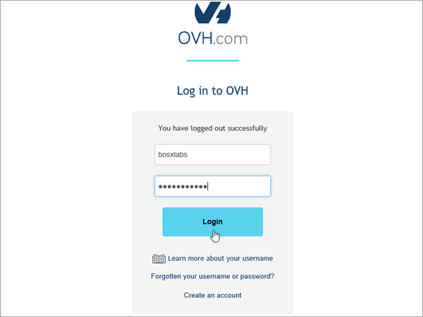

# Crear registros DNS en OVH para MicrosoftCreate DNS records at OVH for Microsoft

[Consulte Preguntas más frecuentes acerca de los dominios](../setup/domains-faq.yml) si no encuentra lo que busca.[Check the Domains FAQ](../setup/domains-faq.yml) if you don't find what you're looking for. 
  
Si OVH es su proveedor de hospedaje DNS, siga los pasos descritos en este artículo para comprobar su dominio y configurar registros DNS para correo electrónico, Skype Empresarial Online, entre otros.If OVH is your DNS hosting provider, follow the steps in this article to verify your domain and set up DNS records for email, Skype for Business Online, and so on.
  
Estos son los registros principales que es necesario agregar.These are the main records to add. 
  
- [Crear registros DNS en OVH para MicrosoftCreate DNS records at OVH for Microsoft](#create-dns-records-at-ovh-for-microsoft)
    
- [Agregar un registro MX para que el correo electrónico del dominio vaya a MicrosoftAdd an MX record so email for your domain will come to Microsoft](#add-an-mx-record-so-email-for-your-domain-will-come-to-microsoft)
    
- [Agregar los registros CNAME necesarios para MicrosoftAdd the CNAME records that are required for Microsoft](#add-the-cname-records-that-are-required-for-microsoft)
    
- [Agregar un registro TXT para SPF para ayudar a evitar el correo no deseadoAdd a TXT record for SPF to help prevent email spam](#add-a-txt-record-for-spf-to-help-prevent-email-spam)
    
- [Agregar los dos registros SRV necesarios para MicrosoftAdd the two SRV records that are required for Microsoft](#add-the-two-srv-records-that-are-required-for-microsoft)
    
Después de agregar estos registros en OVH, el dominio se configurará para que funcione con los servicios de Microsoft.After you add these records at OVH, your domain will be set up to work with Microsoft services.

  
> [!NOTE]
>  Por lo general, los cambios de DNS tardan unos 15 minutos en aplicarse. Sin embargo, a veces los cambios pueden necesitar más tiempo para aplicarse en todo el sistema DNS de Internet. Si tiene problemas con el flujo de correo u otros problemas después de agregar registros DNS, consulte [Solucionar problemas después de cambiar el nombre del dominio o los registros DNS](../get-help-with-domains/find-and-fix-issues.md).Typically it takes about 15 minutes for DNS changes to take effect. However, it can occasionally take longer for a change you've made to update across the Internet's DNS system. If you're having trouble with mail flow or other issues after adding DNS records, see [Troubleshoot issues after changing your domain name or DNS records](../get-help-with-domains/find-and-fix-issues.md). 
  
## Agregar un registro TXT para verificaciónAdd a TXT record for verification

Antes de utilizar el dominio con Microsoft, tenemos que asegurarnos de que sea el propietario. Si puede iniciar sesión en la cuenta en el registrador de dominio y crear el registro DNS, Microsoft sabrá que es el propietario del dominio.Before you use your domain with Microsoft, we have to make sure that you own it. Your ability to log in to your account at your domain registrar and create the DNS record proves to Microsoft that you own the domain.
  
> [!NOTE]
> Este registro se usa exclusivamente para verificar si se es el propietario de un dominio; no afecta a nada más. Puede eliminarlo más adelante, si lo desea.This record is used only to verify that you own your domain; it doesn't affect anything else. You can delete it later, if you like. 
  
1. Para empezar, vaya a la página dominios de OVH mediante [este vínculo](https://www.ovh.com/manager/).To get started, go to your domains page in OVH by using [this link](https://www.ovh.com/manager/). You'll be prompted to log in.You'll be prompted to log in.
    
    
  
2. En **Dominios**, seleccione el nombre del dominio que desea editar.Under **Domains**, select the name of the domain that you want edit.
    
    
  
3. Seleccione **zona DNS**.Select **DNS zone**.
    
    
  
4. Seleccione **Agregar una entrada**.Select **Add an entry**.
    
    
  
5. Seleccionar **TXT**Select **TXT**
    
    
  
6. En los cuadros para el nuevo registro, escriba o copie y pegue los valores de la tabla siguiente.In the boxes for the new record, type or copy and paste the values from the following table. Para asignar un valor TTL, elija **Personalizado** en la lista desplegable y, a continuación, escriba el valor en el cuadro de texto.To assign a TTL value, choose **Personalized** from the drop-down list, and then type the value in the text box. 
    
    |**Tipo de registro****Record type**|**Subdominio****Sub-domain**|**TTL****TTL**|**Valor****Value**|
    |:-----|:-----|:-----|:-----|
    |TXTTXT    |(se deja en blanco)(leave blank)    |3600 (segundos)3600 (seconds)    |MS=msxxxxxxxxMS=msxxxxxxxx    **Nota:** esto es un ejemplo.**Note:** This is an example. Utilice aquí su valor de **Dirección de destino**, desde la tabla.Use your specific **Destination or Points to Address** value here, from the table.           [¿Cómo puedo encontrar esto?How do I find this?](../get-help-with-domains/information-for-dns-records.md)          |
   
7. Seleccione **Confirmar**.Select **Confirm**. 
    
    
  
8. Espere unos minutos antes de continuar para que el registro que acaba de crear pueda actualizarse en Internet.Wait a few minutes before you continue, so that the record you just created can update across the Internet.
    
Ahora que ha agregado el registro en el sitio de su registrador de dominios, deberá volver a Microsoft y solicitar el registro.Now that you've added the record at your domain registrar's site, you'll go back to Microsoft and request the record.
  
Cuando Microsoft encuentre el registro TXT correcto, se comprobará su dominio.When Microsoft finds the correct TXT record, your domain is verified.
  
1. En el centro de administración, diríjase a la página **configuración** \> <a href="https://go.microsoft.com/fwlink/p/?linkid=834818" target="_blank">dominios</a>.In the admin center, go to the **Settings** \> <a href="https://go.microsoft.com/fwlink/p/?linkid=834818" target="_blank">Domains</a> page.
    
2. En la página **Dominios**, elija el dominio que está verificando.On the **Domains** page, select the domain that you are verifying. 
    
    
  
3. En la página de **Configuración**, elija **Iniciar configuración**.On the **Setup** page, select **Start setup**.
    
    
  
4. En la página **verificar dominio**, seleccione **verificar**.On the **Verify domain** page, select **Verify**.
    
    
  
> [!NOTE]
>  Por lo general, los cambios de DNS tardan unos 15 minutos en aplicarse. Sin embargo, a veces los cambios pueden necesitar más tiempo para aplicarse en todo el sistema DNS de Internet. Si tiene problemas con el flujo de correo u otros problemas después de agregar registros DNS, consulte [Solucionar problemas después de cambiar el nombre del dominio o los registros DNS](../get-help-with-domains/find-and-fix-issues.md).Typically it takes about 15 minutes for DNS changes to take effect. However, it can occasionally take longer for a change you've made to update across the Internet's DNS system. If you're having trouble with mail flow or other issues after adding DNS records, see [Troubleshoot issues after changing your domain name or DNS records](../get-help-with-domains/find-and-fix-issues.md). 
  
## Agregar un registro MX para que el correo electrónico del dominio vaya a MicrosoftAdd an MX record so email for your domain will come to Microsoft

1. Para empezar, vaya a la página dominios de OVH mediante [este vínculo](https://www.ovh.com/manager/).To get started, go to your domains page in OVH by using [this link](https://www.ovh.com/manager/). You'll be prompted to log in.You'll be prompted to log in.
    
    
  
2. En **Dominios**, seleccione el nombre del dominio que desea editar.Under **Domains**, select the name of the domain that you want edit.
    
    
  
3. Seleccione **zona DNS**.Select **DNS zone**.
    
    
  
4. Seleccione **Agregar una entrada**.Select **Add an entry**.
    
    
  
5. Seleccione **MX**.Select **MX**.
    
    
  
6. En los cuadros para el nuevo registro, escriba o copie y pegue los valores de la tabla siguiente.In the boxes for the new record, type or copy and paste the values from the following table. Para asignar un valor TTL, elija **Personalizado** en la lista desplegable y, a continuación, escriba el valor en el cuadro de texto.To assign a TTL value, choose **Personalized** from the drop-down list, and then type the value in the text box. 
    
    > [!NOTE]
    > De forma predeterminada, OVH usa notación relativa para el destino, que agrega el nombre de dominio al final del registro de destino.By default OVH uses relative notation for the target, which adds the domain name to the end of the target record. Para usar la notación absoluta en su lugar, agregue un punto al registro de destino como se muestra en la tabla siguiente.To use absolute notation instead, add a dot to the target record as shown in the table below. 
  
    |**Tipo de registro****Record type**|**Subdominio****Sub-domain**|**TTL****TTL**|**Prioridad****Priority**|**Target****Target**|
    |:-----|:-----|:-----|:-----|:-----|
    |MXMX    |(se deja en blanco)(leave blank)    |3600 (segundos)3600 (seconds)    |10  10    Para obtener más información sobre la prioridad, consulte [¿Qué es una prioridad de MX?](../setup/domains-faq.yml)For more information about priority, see [What is MX priority?](../setup/domains-faq.yml)   |\<domain-key\>.mail.protection.outlook.com.\<domain-key\>.mail.protection.outlook.com.    **Nota:** Obtener el  *\<domain-key\>*  de su cuenta de Microsoft.**Note:** Get your  *\<domain-key\>*  from your Microsoft account.  [¿Cómo puedo encontrar esto?How do I find this?](../get-help-with-domains/information-for-dns-records.md)  |
   
    
  
7. Seleccione **Siguiente**.Select **Next**.
    
    
  
8. Seleccione **Confirmar**.Select **Confirm**.
    
    
  
9. Si hay otros registros MX, elimínelos todos en la lista de la página **de zona DNS.**If there are any other MX records, delete them all in the list on the **DNS zone** page. Seleccione cada registro y, a continuación, en la **columna Acciones,** seleccione el icono **eliminar** de la papelera.Select each record and then, in the **Actions** column, select the trash-can **Delete** icon. 
    
    
  
10. Seleccione **Confirmar**.Select **Confirm**.
    
## Agregar los registros CNAME necesarios para MicrosoftAdd the CNAME records that are required for Microsoft

1. Para empezar, vaya a la página dominios de OVH mediante [este vínculo](https://www.ovh.com/manager/).To get started, go to your domains page in OVH by using [this link](https://www.ovh.com/manager/). You'll be prompted to log in.You'll be prompted to log in.
    
    
  
2. En **Dominios**, seleccione el nombre del dominio que desea editar.Under **Domains**, select the name of the domain that you want edit.
    
    
  
3. Seleccione **zona DNS**.Select **DNS zone**.
    
    
  
4. Seleccione **Agregar una entrada**.Select **Add an entry**.
    
    
  
5. Seleccione **CNAME**.Select **CNAME**.
    
    
  
6. Cree el primer registro CNAME.Create the first CNAME record.
    
    En los cuadros para el nuevo registro, escriba o copie y pegue los valores de la primera fila de la tabla siguiente.In the boxes for the new record, type or copy and paste the values from the first row of the following table. Para asignar un valor TTL, elija **Personalizado** en la lista desplegable y, a continuación, escriba el valor en el cuadro de texto.To assign a TTL value, choose **Personalized** from the drop-down list, and then type the value in the text box. 
    
    |**Tipo de registro****Record type**|**Subdominio****Sub-domain**|**Destino****Target**|**TTL****TTL**|
    |:-----|:-----|:-----|:-----|
    |CNAMECNAME    |autodiscoverautodiscover    |autodiscover.outlook.com.autodiscover.outlook.com.    |3600 segundos3600 seconds    |
    |CNAMECNAME    |sipsip    |sipdir.online.lync.com.sipdir.online.lync.com.    |3600 segundos3600 seconds    |
    |CNAMECNAME    |lyncdiscoverlyncdiscover    |webdir.online.lync.com.webdir.online.lync.com.    |3600 segundos3600 seconds    |
    |CNAMECNAME    |enterpriseregistrationenterpriseregistration    |enterpriseregistration.windows.net.enterpriseregistration.windows.net.    |3600 segundos3600 seconds    |
    |CNAMECNAME    |enterpriseenrollmententerpriseenrollment    |enterpriseenrollment-s.manage.microsoft.com.enterpriseenrollment-s.manage.microsoft.com.    |3600 segundos3600 seconds    |
   
    
  
7. Seleccione **Siguiente**.Select **Next**.
    
    
  
8. Seleccione **Confirmar**.Select **Confirm**.
    
9. Repita los pasos anteriores para crear los otros cinco registros CNAME.Repeat the previous steps to create the other five CNAME records.
    
    Para cada registro, escriba o copie y pegue los valores de la siguiente fila de la tabla anterior en los cuadros de ese registro.For each record, type or copy and paste the values from the next row of the table above into the boxes for that record.
    
## Agregar un registro TXT para SPF para ayudar a evitar el correo no deseadoAdd a TXT record for SPF to help prevent email spam

> [!IMPORTANT]
> No puede tener más de un registro TXT para el SPF de un dominio.You cannot have more than one TXT record for SPF for a domain. Si su dominio tiene más de un registro de SPF, obtendrá errores de correo, así como problemas de clasificación de entrega y de correo no deseado.If your domain has more than one SPF record, you'll get email errors, as well as delivery and spam classification issues. Si ya tiene un registro de SPF para su dominio, no cree uno nuevo para Microsoft.If you already have an SPF record for your domain, don't create a new one for Microsoft. En su lugar, agregue los valores de Microsoft necesarios al registro actual para que tenga un único registro  *SPF*  que incluya ambos conjuntos de valores.Instead, add the required Microsoft values to the current record so that you have a  *single*  SPF record that includes both sets of values. 
  
1. Para empezar, vaya a la página dominios de OVH mediante [este vínculo](https://www.ovh.com/manager/).To get started, go to your domains page in OVH by using [this link](https://www.ovh.com/manager/). You'll be prompted to log in.You'll be prompted to log in.
    
    
  
2. En **Dominios**, seleccione el nombre del dominio que desea editar.Under **Domains**, select the name of the domain that you want edit.
    
    
  
3. Seleccione **zona DNS**.Select **DNS zone**.
    
    
  
4. Seleccione **Agregar una entrada**.Select **Add an entry**.
    
    
  
5. Seleccione **TXT**.Select **TXT**.
    
6. In the boxes for the new record, type or copy and paste the following values.In the boxes for the new record, type or copy and paste the following values.
    
    |**Tipo de registro****Record type**|**Subdominio****Sub-domain**|**TTL****TTL**|**Valor TXT****TXT Value**|
    |:-----|:-----|:-----|:-----|
    |TXTTXT    |(se deja en blanco)(leave blank)    |3600 (segundos)3600 (seconds)    |v=spf1 include:spf.protection.outlook.com -allv=spf1 include:spf.protection.outlook.com -all    **Nota:** recomendamos copiar y pegar esta entrada, para que todo el espacio sea correcto.**Note:** We recommend copying and pasting this entry, so that all of the spacing stays correct.           |
   
    
  
7. Seleccione **Siguiente**.Select **Next**.
    
    
  
8. Seleccione **Confirmar**.Select **Confirm**.
    
    
  
## Agregar los dos registros SRV necesarios para MicrosoftAdd the two SRV records that are required for Microsoft

1. Para empezar, vaya a la página dominios de OVH mediante [este vínculo](https://www.ovh.com/manager/).To get started, go to your domains page in OVH by using [this link](https://www.ovh.com/manager/). You'll be prompted to log in.You'll be prompted to log in.
    
    
  
2. En **Dominios**, seleccione el nombre del dominio que desea editar.Under **Domains**, select the name of the domain that you want edit.
    
    
  
3. Seleccione **zona DNS**.Select **DNS zone**.
    
    
  
4. Seleccione **Agregar una entrada**.Select **Add an entry**.
    
    
  
5. Seleccione **SRV**.Select **SRV**.
    
    
  
6. Cree el primer registro SRV.Create the first SRV record.
    
    En los cuadros para el nuevo registro, escriba o copie y pegue los valores de la primera fila de la tabla siguiente.In the boxes for the new record, type or copy and paste the values from the first row of the following table. Para asignar un valor TTL, elija **Personalizado** en la lista desplegable y, a continuación, escriba el valor en el cuadro de texto.To assign a TTL value, choose **Personalized** from the drop-down list, and then type the value in the text box. 
    
    |**Tipo de registro****Record type**|**Subdominio****Sub-domain**|**Prioridad****Priority**|**Grosor****Weight**|**Puerto****Port**|**TTL****TTL**|**Target****Target**|
    |:-----|:-----|:-----|:-----|:-----|:-----|:-----|
    |SRV (servicio)SRV (Service)    |_sip._tls_sip._tls    |100100    |11    |443443    |3600 (segundos)3600 (seconds)    |sipdir.online.lync.com.sipdir.online.lync.com.    |
    |SRV (servicio)SRV (Service)    |_sipfederationtls._tcp_sipfederationtls._tcp    |100100    |11    |50615061    |3600 (segundos)3600 (seconds)    |sipfed.online.lync.com.sipfed.online.lync.com.    |
       
    
  
7. Seleccione **Siguiente**.Select **Next**.
    
    
  
8. Seleccione **Confirmar**.Select **Confirm**.
    
9. Repita los pasos anteriores para crear el otro registro SRV.Repeat the previous steps to create the other SRV record. Copie y pegue los valores de la segunda fila de la tabla anterior en los cuadros para el segundo registro.Type or copy and paste the values from the second row of the table above into the boxes for the second record.
    
> [!NOTE]
>  Por lo general, los cambios de DNS tardan unos 15 minutos en aplicarse. Sin embargo, a veces los cambios pueden necesitar más tiempo para aplicarse en todo el sistema DNS de Internet. Si tiene problemas con el flujo de correo u otros problemas después de agregar registros DNS, consulte [Solucionar problemas después de cambiar el nombre del dominio o los registros DNS](../get-help-with-domains/find-and-fix-issues.md).Typically it takes about 15 minutes for DNS changes to take effect. However, it can occasionally take longer for a change you've made to update across the Internet's DNS system. If you're having trouble with mail flow or other issues after adding DNS records, see [Troubleshoot issues after changing your domain name or DNS records](../get-help-with-domains/find-and-fix-issues.md). 
