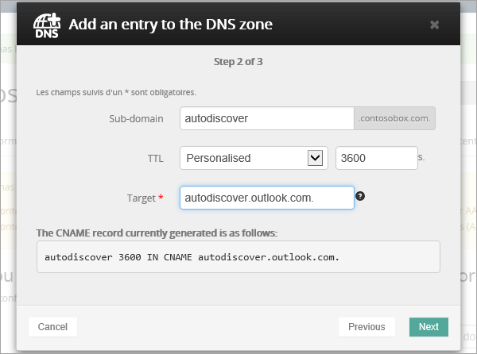

# Crear registros DNS en OVH para Microsoft

[Consulte Preguntas más frecuentes acerca de los dominios](../setup/domains-faq.md) si no encuentra lo que busca. 
  
Si OVH es su proveedor de host DNS, siga los pasos de este artículo para comprobar su dominio y configurar los registros DNS para el correo electrónico, Skype empresarial online, etc.
  
Estos son los registros principales que es necesario agregar. 
  
- [Crear registros DNS en OVH para Microsoft](#create-dns-records-at-ovh-for-microsoft)
    
- [Agregar un registro MX para que el correo electrónico del dominio llegue a Microsoft](#add-an-mx-record-so-email-for-your-domain-will-come-to-microsoft)
    
- [Agregar los registros CNAME necesarios para Microsoft](#add-the-cname-records-that-are-required-for-microsoft)
    
- [Agregar un registro TXT para SPF para ayudar a evitar el correo no deseado](#add-a-txt-record-for-spf-to-help-prevent-email-spam)
    
- [Agregar los dos registros SRV necesarios para Microsoft](#add-the-two-srv-records-that-are-required-for-microsoft)
    
Después de agregar estos registros a OVH, su dominio estará configurado para funcionar con los servicios de Microsoft.
  
Para obtener más información sobre WebHosting y DNS para sitios web con Microsoft, vea [usar un sitio web público con Microsoft](https://support.office.com/article/a8178510-501d-4bd8-9921-b04f2e9517a5.aspx).
  
> [!NOTE]
>  Por lo general, los cambios de DNS tardan unos 15 minutos en aplicarse. Sin embargo, a veces los cambios pueden necesitar más tiempo para aplicarse en todo el sistema DNS de Internet. Si tiene problemas con el flujo de correo u otros problemas después de agregar registros DNS, consulte [Solucionar problemas después de cambiar el nombre del dominio o los registros DNS](../get-help-with-domains/find-and-fix-issues.md). 
  
## Agregar un registro TXT para verificación

Antes de usar el dominio con Microsoft, debemos asegurarnos de que es el propietario. Su capacidad para iniciar sesión en su cuenta en el registrador de dominios y crear el registro DNS es la que se demuestre a Microsoft que es el propietario del dominio.
  
> [!NOTE]
> Este registro se usa exclusivamente para verificar si se es el propietario de un dominio; no afecta a nada más. Puede eliminarlo más adelante, si lo desea. 
  
1. Para empezar, vaya a su página de dominios en OVH a través de [este vínculo](https://www.ovh.com/manager/). You'll be prompted to log in.
    
    
  
2. En **dominios**, seleccione el nombre del dominio que desea editar.
    
    
  
3. Seleccione **zona DNS**.
    
    
  
4. Seleccione **Agregar una entrada**.
    
    
  
5. Seleccionar **txt**
    
    
  
6. En los cuadros para el nuevo registro, escriba o copie y pegue los valores de la tabla siguiente. Para asignar un valor TTL, elija **personalizado** en la lista desplegable y, a continuación, escriba el valor en el cuadro de texto. 
    
    |**Tipo de registro**|**Subdominio**|**TTL**|**Valor**|
    |:-----|:-----|:-----|:-----|
    |TXT    |(se deja en blanco)    |3600 (segundos)    |MS = msxxxxxxxx    **Nota:** esto es un ejemplo. Use aquí su **destino específico o** el valor de dirección de destino de la tabla.           [¿Cómo puedo encontrar esto?](../get-help-with-domains/information-for-dns-records.md)          |
   
7. Seleccione **confirmar**. 
    
    
  
8. Espere unos minutos antes de continuar para que el registro que acaba de crear pueda actualizarse en Internet.
    
Ahora que ha agregado el registro en el sitio del registrador de dominios, volverá a Microsoft y solicitará el registro.
  
Cuando Microsoft encuentre el registro TXT correcto, se comprobará el dominio.
  
1. En el centro de administración, diríjase a la página **configuración** \> <a href="https://go.microsoft.com/fwlink/p/?linkid=834818" target="_blank">dominios</a>.
    
2. En la página **Dominios**, elija el dominio que está verificando. 
    
    
  
3. En la página de **Configuración**, elija ** Iniciar configuración**.
    
    
  
4. En la página**verificar dominio**, seleccione **verificar**.
    
    
  
> [!NOTE]
>  Por lo general, los cambios de DNS tardan unos 15 minutos en aplicarse. Sin embargo, a veces los cambios pueden necesitar más tiempo para aplicarse en todo el sistema DNS de Internet. Si tiene problemas con el flujo de correo u otros problemas después de agregar registros DNS, consulte [Solucionar problemas después de cambiar el nombre del dominio o los registros DNS](../get-help-with-domains/find-and-fix-issues.md). 
  
## Agregar un registro MX para que el correo electrónico del dominio llegue a Microsoft

1. Para empezar, vaya a su página de dominios en OVH a través de [este vínculo](https://www.ovh.com/manager/). You'll be prompted to log in.
    
    
  
2. En **dominios**, seleccione el nombre del dominio que desea editar.
    
    
  
3. Seleccione **zona DNS**.
    
    
  
4. Seleccione **Agregar una entrada**.
    
    
  
5. Seleccione **mx**.
    
    
  
6. En los cuadros para el nuevo registro, escriba o copie y pegue los valores de la tabla siguiente. Para asignar un valor TTL, elija **personalizado** en la lista desplegable y, a continuación, escriba el valor en el cuadro de texto. 
    
    > [!NOTE]
    > De forma predeterminada OVH usa la notación relativa para el destino, que agrega el nombre de dominio al final del registro de destino. Para usar la notación absoluta en su lugar, agregue un punto al registro de destino, como se muestra en la siguiente tabla. 
  
    |**Tipo de registro**|**Subdominio**|**TTL**|**Prioridad**|**Destino**|
    |:-----|:-----|:-----|:-----|:-----|
    |MX    |(se deja en blanco)    |3600 (segundos)    |10     Para obtener más información sobre la prioridad, consulte [¿Qué es una prioridad de MX?](https://support.office.com/article/2784cc4d-95be-443d-b5f7-bb5dd867ba83.aspx)   |\<Domain-Key\>. mail.Protection.Outlook.com.    **Nota:** Obtén tu * \<clave\> de dominio* de tu cuenta de Microsoft.  [¿Cómo puedo encontrar esto?](../get-help-with-domains/information-for-dns-records.md)  |
   
    
  
7. Seleccione **Siguiente**.
    
    
  
8. Seleccione **confirmar**.
    
    
  
9. Si hay otros registros MX, elimínelos en la lista de la página **zona DNS** . Seleccione cada registro y, a continuación, en la columna **acciones** , seleccione el icono de papelera de **eliminación** . 
    
    
  
10. Seleccione **confirmar**.
    
## Agregar los registros CNAME necesarios para Microsoft

1. Para empezar, vaya a su página de dominios en OVH a través de [este vínculo](https://www.ovh.com/manager/). You'll be prompted to log in.
    
    
  
2. En **dominios**, seleccione el nombre del dominio que desea editar.
    
    
  
3. Seleccione **zona DNS**.
    
    
  
4. Seleccione **Agregar una entrada**.
    
    
  
5. Seleccione **CNAME**.
    
    
  
6. Cree el primer registro CNAME.
    
    En los cuadros para el nuevo registro, escriba o copie y pegue los valores de la primera fila de la tabla siguiente. Para asignar un valor TTL, elija **personalizado** en la lista desplegable y, a continuación, escriba el valor en el cuadro de texto. 
    
    |**Tipo de registro**|**Subdominio**|**Destino**|**TTL**|
    |:-----|:-----|:-----|:-----|
    |CNAME    |autodiscover    |autodiscover.outlook.com.    |de 3600 segundos    |
    |CNAME    |sip    |sipdir.online.lync.com.    |de 3600 segundos    |
    |CNAME    |lyncdiscover    |webdir.online.lync.com.    |de 3600 segundos    |
    |CNAME    |enterpriseregistration    |enterpriseregistration.windows.net.    |de 3600 segundos    |
    |CNAME    |enterpriseenrollment    |enterpriseenrollment-s.manage.microsoft.com.    |de 3600 segundos    |
   
    
  
7. Seleccione **Siguiente**.
    
    
  
8. Seleccione **confirmar**.
    
9. Repita los pasos anteriores para crear los otros cinco registros CNAME.
    
    Para cada registro, escriba (o copie y pegue) los valores de la siguiente fila de la tabla anterior en los cuadros para ese registro.
    
## Agregar un registro TXT para SPF para ayudar a prevenir el spam de correo electrónico

> [!IMPORTANT]
> No puede tener más de un registro TXT para el SPF de un dominio. Si su dominio tiene más de un registro de SPF, obtendrá errores de correo, así como problemas de clasificación de entrega y de correo no deseado. Si ya tiene un registro de SPF para su dominio, no cree uno nuevo para Microsoft. En su lugar, agregue los valores necesarios de Microsoft al registro activo para que tenga un *único* registro de SPF que incluya ambos conjuntos de valores. 
  
1. Para empezar, vaya a su página de dominios en OVH a través de [este vínculo](https://www.ovh.com/manager/). You'll be prompted to log in.
    
    
  
2. En **dominios**, seleccione el nombre del dominio que desea editar.
    
    
  
3. Seleccione **zona DNS**.
    
    
  
4. Seleccione **Agregar una entrada**.
    
    
  
5. Seleccione **txt**.
    
6. In the boxes for the new record, type or copy and paste the following values.
    
    |**Tipo de registro**|**Subdominio**|**TTL**|**Valor TXT**|
    |:-----|:-----|:-----|:-----|
    |TXT    |(se deja en blanco)    |3600 (segundos)    |v=spf1 include:spf.protection.outlook.com -all    **Nota:** recomendamos copiar y pegar esta entrada, para que todo el espacio sea correcto.           |
   
    
  
7. Seleccione **Siguiente**.
    
    
  
8. Seleccione **confirmar**.
    
    
  
## Agregar los dos registros SRV necesarios para Microsoft

1. Para empezar, vaya a su página de dominios en OVH a través de [este vínculo](https://www.ovh.com/manager/). You'll be prompted to log in.
    
    
  
2. En **dominios**, seleccione el nombre del dominio que desea editar.
    
    
  
3. Seleccione **zona DNS**.
    
    
  
4. Seleccione **Agregar una entrada**.
    
    
  
5. Seleccione **SRV**.
    
    
  
6. Cree el primer registro SRV.
    
    En los cuadros para el nuevo registro, escriba o copie y pegue los valores de la primera fila de la tabla siguiente. Para asignar un valor TTL, elija **personalizado** en la lista desplegable y, a continuación, escriba el valor en el cuadro de texto. 
    
    |**Tipo de registro**|**Subdominio**|**Prioridad**|**Grosor**|**Puerto**|**TTL**|**Destino**|
    |:-----|:-----|:-----|:-----|:-----|:-----|:-----|
    |SRV (servicio)    |_sip. _tls    |100    |1    |443    |3600 (segundos)    |sipdir.online.lync.com.    |
    |SRV (servicio)    |_sipfederationtls. _tcp    |100    |1    |5061    |3600 (segundos)    |sipfed.online.lync.com.    |
       
    
  
7. Seleccione **Siguiente**.
    
    
  
8. Seleccione **confirmar**.
    
9. Repita los pasos anteriores para crear el otro registro SRV. Copie y pegue los valores de la segunda fila de la tabla anterior en los cuadros para el segundo registro.
    
> [!NOTE]
>  Por lo general, los cambios de DNS tardan unos 15 minutos en aplicarse. Sin embargo, a veces los cambios pueden necesitar más tiempo para aplicarse en todo el sistema DNS de Internet. Si tiene problemas con el flujo de correo u otros problemas después de agregar registros DNS, consulte [Solucionar problemas después de cambiar el nombre del dominio o los registros DNS](../get-help-with-domains/find-and-fix-issues.md). 
  
