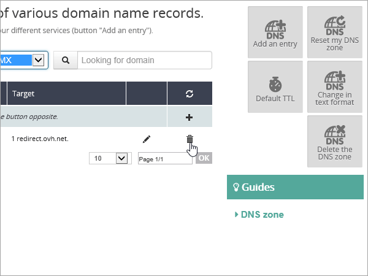

# Conexión de los registros DNS en OVH a Microsoft 365

[Consulte Preguntas más frecuentes acerca de los dominios](../setup/domains-faq.yml) si no encuentra lo que busca.

Si OVH es el proveedor de hospedaje dns, siga los pasos de este artículo para comprobar su dominio y configurar registros DNS para correo electrónico, Skype Empresarial en línea, etc.

Después de agregar estos registros en OVH, el dominio se configurará para trabajar con servicios de Microsoft.

> [!NOTE]
> Typically it takes about 15 minutes for DNS changes to take effect. However, it can occasionally take longer for a change you've made to update across the Internet's DNS system. If you're having trouble with mail flow or other issues after adding DNS records, see [Troubleshoot issues after changing your domain name or DNS records](../get-help-with-domains/find-and-fix-issues.md).

## Agregar un registro TXT para verificación

Before you use your domain with Microsoft, we have to make sure that you own it. Your ability to log in to your account at your domain registrar and create the DNS record proves to Microsoft that you own the domain.

> [!NOTE]
> This record is used only to verify that you own your domain; it doesn't affect anything else. You can delete it later, if you like.

1. Para empezar, vaya a la página dominios en OVH mediante [este vínculo](https://www.ovh.com/manager/). You'll be prompted to log in.

    

1. En la página de aterrizaje del panel, en **Ver toda mi actividad**, seleccione el nombre del dominio que desea editar.

1. Seleccione **Zona DNS**.

    

1. Seleccione **Agregar una entrada**.

    

1. Seleccione **TXT.**

    

1. En los cuadros para el nuevo registro, escriba o copie y pegue los valores de la tabla siguiente. Para asignar un valor TTL, elija **Personalizado** en la lista desplegable y escriba el valor en el cuadro de texto.

   |Tipo de registro|Subdominio|TTL|Valor|
   |---|---|---|---|
   |TXT|(se deja en blanco)|3600 (segundos)|MS=msxxxxxxxx    **Nota:** esto es un ejemplo. Utilice aquí su valor de **Dirección de destino**, desde la tabla.  [¿Cómo puedo encontrar esto?](../get-help-with-domains/information-for-dns-records.md)|

1. Seleccione **Siguiente**.

1. Seleccione **Confirmar**.

    

1. Espere unos minutos antes de continuar para que el registro que acaba de crear pueda actualizarse en Internet.

Ahora que ha agregado el registro en el sitio de su registrador de dominios, deberá volver a Microsoft y solicitar el registro. Cuando Microsoft encuentre el registro TXT correcto, se comprobará su dominio.

Para comprobar el registro en Microsoft 365:

1. En el centro de administración, vaya a **Dominios de configuración**\>.

1. En la página Dominios, seleccione el dominio que está comprobando y seleccione **Iniciar configuración**.

    :::image type="content" source="../../media/dns-IONOS/IONOS-DomainConnects-2.png" alt-text="Seleccione Iniciar configuración.":::

1. Seleccione **Continuar**.

1. En la página **Verificar dominio**, elija **Verificar**.

> [!NOTE]
>  Typically it takes about 15 minutes for DNS changes to take effect. However, it can occasionally take longer for a change you've made to update across the Internet's DNS system. If you're having trouble with mail flow or other issues after adding DNS records, see [Troubleshoot issues after changing your domain name or DNS records](../get-help-with-domains/find-and-fix-issues.md).

## Agregar un registro MX para que el correo electrónico del dominio vaya a Microsoft

1. Para empezar, vaya a la página dominios en OVH mediante [este vínculo](https://www.ovh.com/manager/). You'll be prompted to log in.

    

1. En la página de aterrizaje del panel, en **Ver toda mi actividad**, seleccione el nombre del dominio que desea editar.

1. Seleccione **Zona DNS**.

    

1. Seleccione **Agregar una entrada**.

    

1. Seleccione **MX**.

    

1. En los cuadros para el nuevo registro, escriba o copie y pegue los valores de la tabla siguiente. Para asignar un valor TTL, elija **Personalizado** en la lista desplegable y escriba el valor en el cuadro de texto.

    > [!NOTE]
    > De forma predeterminada, OVH usa la notación relativa para el destino, que agrega el nombre de dominio al final del registro de destino. Para usar la notación absoluta en su lugar, agregue un punto al registro de destino, como se muestra en la tabla siguiente.

   |Subdominio|TTL|Prioridad|Target|
   |---|---|---|---|
   |(se deja en blanco)|3600 (segundos)|0    Para obtener más información sobre la prioridad, consulte [¿Qué es una prioridad de MX?](../setup/domains-faq.yml)|\<domain-key\>.mail.protection.outlook.com.    **Nota:** Obtenga su *\<domain-key\>* de su cuenta Microsoft. [¿Cómo puedo encontrar esto?](../get-help-with-domains/information-for-dns-records.md)|

    

1. Seleccione **Siguiente**.

    

1. Seleccione **Confirmar**.

    

1. Elimine cualquier otro registro MX de la lista en la página **de zona DNS** . Seleccione cada registro y, en la columna **Acciones** , seleccione el icono **Eliminar** de papelera.

    

1. Seleccione **Confirmar**.

## Agregar el registro CNAME necesario para Microsoft

1. Para empezar, vaya a la página dominios en OVH mediante [este vínculo](https://www.ovh.com/manager/). You'll be prompted to log in.

    

1. En la página de aterrizaje del panel, en **Ver toda mi actividad**, seleccione el nombre del dominio que desea editar.

1. Seleccione **Zona DNS**.

    

1. Seleccione **Agregar una entrada**.

    

1. Seleccione **CNAME**.

    

1. En los cuadros para el nuevo registro, escriba o copie y pegue los valores de la primera fila de la tabla siguiente. Para asignar un valor TTL, elija **Personalizado** en la lista desplegable y escriba el valor en el cuadro de texto.

   |Subdominio|TTL|Target|
   |---|---|---|
   |autodescubrir|3600 (segundos)|autodiscover.outlook.com.|

    

1. Seleccione **Siguiente**.

    

1. Seleccione **Confirmar**.

## Agregar un registro TXT para SPF para ayudar a prevenir el spam de correo electrónico

> [!IMPORTANT]
> No puede tener más de un registro TXT para el SPF de un dominio. Si su dominio tiene más de un registro de SPF, obtendrá errores de correo, así como problemas de clasificación de entrega y de correo no deseado. Si ya tiene un registro de SPF para su dominio, no cree uno nuevo para Microsoft. En su lugar, agregue los valores de Microsoft necesarios al registro actual para que tenga un  *único*  registro SPF que incluya ambos conjuntos de valores.

1. Para empezar, vaya a la página dominios en OVH mediante [este vínculo](https://www.ovh.com/manager/). You'll be prompted to log in.

    

1. En la página de aterrizaje del panel, en **Ver toda mi actividad**, seleccione el nombre del dominio que desea editar.

1. Seleccione **Zona DNS**.

    

1. Seleccione **Agregar una entrada**.

    

1. Seleccione **TXT**.

1. In the boxes for the new record, type or copy and paste the following values. Para asignar un valor TTL, elija **Personalizado** en la lista desplegable y escriba el valor en el cuadro de texto.

   |Subdominio|TTL|Valor|
   |---|---|---|
   |(se deja en blanco)|3600 (segundos)|v=spf1 include:spf.protection.outlook.com -all <br/**Note:** Se recomienda copiar y pegar esta entrada para que todo el espaciado permanezca correcto.|

    

1. Seleccione **Siguiente**.

    

1. Seleccione **Confirmar**.

    

## Opción avanzada: Skype Empresarial

Solo seleccione esta opción si su organización usa Skype Empresarial para servicios de comunicación en línea, como chat, llamadas de conferencia y videollamadas, además de Microsoft Teams. Skype necesita 4 registros: 2 registros SRV para la comunicación de usuario a usuario y 2 registros CNAME para iniciar sesión y conectar usuarios al servicio.

### Agregar los dos registros SRV necesarios

1. Para empezar, vaya a la página dominios en OVH mediante [este vínculo](https://www.ovh.com/manager/). You'll be prompted to log in.

    

1. En la página de aterrizaje del panel, en **Ver toda mi actividad**, seleccione el nombre del dominio que desea editar.

1. Seleccione **Zona DNS**.

    

1. Seleccione **Agregar una entrada**.

    

1. Seleccione **SRV**.

1. In the boxes for the new record, type or copy and paste the following values. Para asignar un valor TTL, elija **Personalizado** en la lista desplegable y escriba el valor en el cuadro de texto.

   |Subdominio|TTL (Seconds)|Prioridad|Peso|Puerto|Target|
   |---|---|---|---|---|---|
   |_sip._tls|3600 (s.)|100|1|443|sipdir.online.lync.com. **Este valor DEBE terminar con un punto (.)**>  **Nota:** recomendamos copiar y pegar esta entrada, para que todo el espacio sea correcto.|
   |_sipfederationtls._tcp|3600 (s.)|100|1|5061|sipfed.online.lync.com. **Este valor DEBE terminar en punto (.)**  **Nota:** recomendamos copiar y pegar esta entrada, para que todo el espacio sea correcto.|

1. Para agregar el otro registro SRV, seleccione **Agregar otro registro**, cree un registro con los valores de la fila siguiente de la tabla y, a continuación, seleccione **Crear registros**.

> [!NOTE]
> Normalmente, se necesitan unos 15 minutos para que los cambios de DNS surtan efecto. Sin embargo, a veces los cambios pueden necesitar más tiempo para aplicarse en todo el sistema DNS de Internet. Si tiene problemas con el flujo de correo u otros problemas después de agregar registros DNS, vea [Encontrar y solucionar problemas después de agregar el dominio o los registros DNS](../get-help-with-domains/find-and-fix-issues.md).

### Agregue los dos registros CNAME necesarios para Skype Empresarial

1. Para empezar, vaya a la página dominios en OVH mediante [este vínculo](https://www.ovh.com/manager/). You'll be prompted to log in.

    

1. En la página de aterrizaje del panel, en **Ver toda mi actividad**, seleccione el nombre del dominio que desea editar.

1. Seleccione **Zona DNS**.

    

1. Seleccione **Agregar una entrada**.

    

1. Seleccione **CNAME**.

    

1. En los cuadros para el nuevo registro, escriba o copie y pegue los valores de la primera fila de la tabla siguiente. Para asignar un valor TTL, elija **Personalizado** en la lista desplegable y escriba el valor en el cuadro de texto.

   |Subdominio|TTL|Target|
   |---|---|---|
   |sip|3600 (s.)|sipdir.online.lync.com.    **Este valor DEBE terminar en punto (.)**|
   |lyncdiscover|3600 (s.)|webdir.online.lync.com.    **Este valor DEBE terminar en punto (.)**|

1. Seleccione **Siguiente**.

    

1. Seleccione **Confirmar**.

1. Agregue el otro registro CNAME.

> [!NOTE]
> Typically it takes about 15 minutes for DNS changes to take effect. However, it can occasionally take longer for a change you've made to update across the Internet's DNS system. If you're having trouble with mail flow or other issues after adding DNS records, see [Troubleshoot issues after changing your domain name or DNS records](../get-help-with-domains/find-and-fix-issues.md).

## Opción avanzada: Intune y mobile Administración de dispositivos para Microsoft 365

Este servicio le ayuda a proteger y administrar de forma remota los dispositivos móviles que se conectan a su dominio. Mobile Administración de dispositivos necesita dos registros CNAME para que los usuarios puedan inscribir dispositivos en el servicio.

### Agregue los dos registros CNAME necesarios para Mobile Administración de dispositivos

1. Para empezar, vaya a la página dominios en OVH mediante [este vínculo](https://www.ovh.com/manager/). You'll be prompted to log in.

    

1. En la página de aterrizaje del panel, en **Ver toda mi actividad**, seleccione el nombre del dominio que desea editar.

1. Seleccione **Zona DNS**.

    

1. Seleccione **Agregar una entrada**.

    

1. Seleccione **CNAME**.

    

1. En los cuadros para el nuevo registro, escriba o copie y pegue los valores de la primera fila de la tabla siguiente. Para asignar un valor TTL, elija **Personalizado** en la lista desplegable y escriba el valor en el cuadro de texto.

   |Subdominio|TTL|Target|
   |---|---|---|
   |enterpriseregistration   |3600 (s.)|enterpriseregistration.windows.net.    **Este valor DEBE terminar en punto (.)**|
   |enterpriseenrollment|3600 (s.)|enterpriseenrollment-s.manage.microsoft.com.    **Este valor DEBE terminar en punto (.).**|

1. Seleccione **Siguiente**.

    

1. Seleccione **Confirmar**.

1. Agregue el otro registro CNAME.

> [!NOTE]
> Typically it takes about 15 minutes for DNS changes to take effect. However, it can occasionally take longer for a change you've made to update across the Internet's DNS system. If you're having trouble with mail flow or other issues after adding DNS records, see [Troubleshoot issues after changing your domain name or DNS records](../get-help-with-domains/find-and-fix-issues.md).