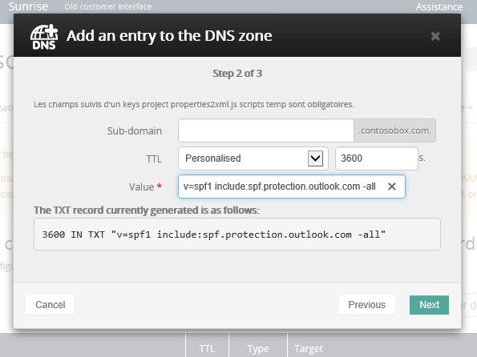

# Crear registros DNS en OVH para Microsoft

[Consulte Preguntas más frecuentes acerca de los dominios](../setup/domains-faq.yml) si no encuentra lo que busca. 
  
Si OVH es su proveedor de hospedaje DNS, siga los pasos descritos en este artículo para comprobar su dominio y configurar registros DNS para correo electrónico, Skype Empresarial Online, entre otros.
  
Estos son los registros principales que es necesario agregar. 
  
- [Crear registros DNS en OVH para Microsoft](#create-dns-records-at-ovh-for-microsoft)
    
- [Agregar un registro MX para que el correo electrónico del dominio vaya a Microsoft](#add-an-mx-record-so-email-for-your-domain-will-come-to-microsoft)
    
- [Agregar los registros CNAME necesarios para Microsoft](#add-the-cname-records-that-are-required-for-microsoft)
    
- [Agregar un registro TXT para SPF para ayudar a evitar el correo no deseado](#add-a-txt-record-for-spf-to-help-prevent-email-spam)
    
- [Agregar los dos registros SRV necesarios para Microsoft](#add-the-two-srv-records-that-are-required-for-microsoft)
    
Después de agregar estos registros en OVH, el dominio se configurará para que funcione con los servicios de Microsoft.

  
> [!NOTE]
>  Por lo general, los cambios de DNS tardan unos 15 minutos en aplicarse. Sin embargo, a veces los cambios pueden necesitar más tiempo para aplicarse en todo el sistema DNS de Internet. Si tiene problemas con el flujo de correo u otros problemas después de agregar registros DNS, consulte [Solucionar problemas después de cambiar el nombre del dominio o los registros DNS](../get-help-with-domains/find-and-fix-issues.md). 
  
## Agregar un registro TXT para verificación

Antes de utilizar el dominio con Microsoft, tenemos que asegurarnos de que sea el propietario. Si puede iniciar sesión en la cuenta en el registrador de dominio y crear el registro DNS, Microsoft sabrá que es el propietario del dominio.
  
> [!NOTE]
> Este registro se usa exclusivamente para verificar si se es el propietario de un dominio; no afecta a nada más. Puede eliminarlo más adelante, si lo desea. 
  
1. Para empezar, vaya a la página dominios de OVH mediante [este vínculo](https://www.ovh.com/manager/). You'll be prompted to log in.
    
    
  
2. En **Dominios**, seleccione el nombre del dominio que desea editar.
    
    
  
3. Seleccione **zona DNS**.
    
    
  
4. Seleccione **Agregar una entrada**.
    
    
  
5. Seleccionar **TXT**
    
    
  
6. En los cuadros para el nuevo registro, escriba o copie y pegue los valores de la tabla siguiente. Para asignar un valor TTL, elija **Personalizado** en la lista desplegable y, a continuación, escriba el valor en el cuadro de texto. 
    
    |**Tipo de registro**|**Subdominio**|**TTL**|**Valor**|
    |:-----|:-----|:-----|:-----|
    |TXT    |(se deja en blanco)    |3600 (segundos)    |MS=msxxxxxxxx    **Nota:** esto es un ejemplo. Utilice aquí su valor de **Dirección de destino**, desde la tabla.           [¿Cómo puedo encontrar esto?](../get-help-with-domains/information-for-dns-records.md)          |
   
7. Seleccione **Confirmar**. 
    
    
  
8. Espere unos minutos antes de continuar para que el registro que acaba de crear pueda actualizarse en Internet.
    
Ahora que ha agregado el registro en el sitio de su registrador de dominios, deberá volver a Microsoft y solicitar el registro.
  
Cuando Microsoft encuentre el registro TXT correcto, se comprobará su dominio.
  
1. En el centro de administración, diríjase a la página **configuración** \> <a href="https://go.microsoft.com/fwlink/p/?linkid=834818" target="_blank">dominios</a>.
    
2. En la página **Dominios**, elija el dominio que está verificando. 
    
    
  
3. En la página de **Configuración**, elija **Iniciar configuración**.
    
    
  
4. En la página **verificar dominio**, seleccione **verificar**.
    
    
  
> [!NOTE]
>  Por lo general, los cambios de DNS tardan unos 15 minutos en aplicarse. Sin embargo, a veces los cambios pueden necesitar más tiempo para aplicarse en todo el sistema DNS de Internet. Si tiene problemas con el flujo de correo u otros problemas después de agregar registros DNS, consulte [Solucionar problemas después de cambiar el nombre del dominio o los registros DNS](../get-help-with-domains/find-and-fix-issues.md). 
  
## Agregar un registro MX para que el correo electrónico del dominio vaya a Microsoft

1. Para empezar, vaya a la página dominios de OVH mediante [este vínculo](https://www.ovh.com/manager/). You'll be prompted to log in.
    
    
  
2. En **Dominios**, seleccione el nombre del dominio que desea editar.
    
    
  
3. Seleccione **zona DNS**.
    
    
  
4. Seleccione **Agregar una entrada**.
    
    
  
5. Seleccione **MX**.
    
    
  
6. En los cuadros para el nuevo registro, escriba o copie y pegue los valores de la tabla siguiente. Para asignar un valor TTL, elija **Personalizado** en la lista desplegable y, a continuación, escriba el valor en el cuadro de texto. 
    
    > [!NOTE]
    > De forma predeterminada, OVH usa notación relativa para el destino, que agrega el nombre de dominio al final del registro de destino. Para usar la notación absoluta en su lugar, agregue un punto al registro de destino como se muestra en la tabla siguiente. 
  
    |**Tipo de registro**|**Subdominio**|**TTL**|**Prioridad**|**Target**|
    |:-----|:-----|:-----|:-----|:-----|
    |MX    |(se deja en blanco)    |3600 (segundos)    |10      Para obtener más información sobre la prioridad, consulte [¿Qué es una prioridad de MX?](../setup/domains-faq.yml)   |\<domain-key\>.mail.protection.outlook.com.    **Nota:** Obtener el  *\<domain-key\>*  de su cuenta de Microsoft.  [¿Cómo puedo encontrar esto?](../get-help-with-domains/information-for-dns-records.md)  |
   
    
  
7. Seleccione **Siguiente**.
    
    
  
8. Seleccione **Confirmar**.
    
    
  
9. Si hay otros registros MX, elimínelos todos en la lista de la página **de zona DNS.** Seleccione cada registro y, a continuación, en la **columna Acciones,** seleccione el icono **eliminar** de la papelera. 
    
    
  
10. Seleccione **Confirmar**.
    
## Agregar los registros CNAME necesarios para Microsoft

1. Para empezar, vaya a la página dominios de OVH mediante [este vínculo](https://www.ovh.com/manager/). You'll be prompted to log in.
    
    
  
2. En **Dominios**, seleccione el nombre del dominio que desea editar.
    
    
  
3. Seleccione **zona DNS**.
    
    
  
4. Seleccione **Agregar una entrada**.
    
    
  
5. Seleccione **CNAME**.
    
    
  
6. Cree el primer registro CNAME.
    
    En los cuadros para el nuevo registro, escriba o copie y pegue los valores de la primera fila de la tabla siguiente. Para asignar un valor TTL, elija **Personalizado** en la lista desplegable y, a continuación, escriba el valor en el cuadro de texto. 
    
    |**Tipo de registro**|**Subdominio**|**Destino**|**TTL**|
    |:-----|:-----|:-----|:-----|
    |CNAME    |autodiscover    |autodiscover.outlook.com.    |3600 segundos    |
    |CNAME    |sip    |sipdir.online.lync.com.    |3600 segundos    |
    |CNAME    |lyncdiscover    |webdir.online.lync.com.    |3600 segundos    |
    |CNAME    |enterpriseregistration    |enterpriseregistration.windows.net.    |3600 segundos    |
    |CNAME    |enterpriseenrollment    |enterpriseenrollment-s.manage.microsoft.com.    |3600 segundos    |
   
    
  
7. Seleccione **Siguiente**.
    
    
  
8. Seleccione **Confirmar**.
    
9. Repita los pasos anteriores para crear los otros cinco registros CNAME.
    
    Para cada registro, escriba o copie y pegue los valores de la siguiente fila de la tabla anterior en los cuadros de ese registro.
    
## Agregar un registro TXT para SPF para ayudar a evitar el correo no deseado

> [!IMPORTANT]
> No puede tener más de un registro TXT para el SPF de un dominio. Si su dominio tiene más de un registro de SPF, obtendrá errores de correo, así como problemas de clasificación de entrega y de correo no deseado. Si ya tiene un registro de SPF para su dominio, no cree uno nuevo para Microsoft. En su lugar, agregue los valores de Microsoft necesarios al registro actual para que tenga un único registro  *SPF*  que incluya ambos conjuntos de valores. 
  
1. Para empezar, vaya a la página dominios de OVH mediante [este vínculo](https://www.ovh.com/manager/). You'll be prompted to log in.
    
    
  
2. En **Dominios**, seleccione el nombre del dominio que desea editar.
    
    
  
3. Seleccione **zona DNS**.
    
    
  
4. Seleccione **Agregar una entrada**.
    
    
  
5. Seleccione **TXT**.
    
6. In the boxes for the new record, type or copy and paste the following values.
    
    |**Tipo de registro**|**Subdominio**|**TTL**|**Valor TXT**|
    |:-----|:-----|:-----|:-----|
    |TXT    |(se deja en blanco)    |3600 (segundos)    |v=spf1 include:spf.protection.outlook.com -all    **Nota:** recomendamos copiar y pegar esta entrada, para que todo el espacio sea correcto.           |
   
    
  
7. Seleccione **Siguiente**.
    
    
  
8. Seleccione **Confirmar**.
    
    
  
## Agregar los dos registros SRV necesarios para Microsoft

1. Para empezar, vaya a la página dominios de OVH mediante [este vínculo](https://www.ovh.com/manager/). You'll be prompted to log in.
    
    
  
2. En **Dominios**, seleccione el nombre del dominio que desea editar.
    
    
  
3. Seleccione **zona DNS**.
    
    
  
4. Seleccione **Agregar una entrada**.
    
    
  
5. Seleccione **SRV**.
    
    
  
6. Cree el primer registro SRV.
    
    En los cuadros para el nuevo registro, escriba o copie y pegue los valores de la primera fila de la tabla siguiente. Para asignar un valor TTL, elija **Personalizado** en la lista desplegable y, a continuación, escriba el valor en el cuadro de texto. 
    
    |**Tipo de registro**|**Subdominio**|**Prioridad**|**Grosor**|**Puerto**|**TTL**|**Target**|
    |:-----|:-----|:-----|:-----|:-----|:-----|:-----|
    |SRV (servicio)    |_sip._tls    |100    |1    |443    |3600 (segundos)    |sipdir.online.lync.com.    |
    |SRV (servicio)    |_sipfederationtls._tcp    |100    |1    |5061    |3600 (segundos)    |sipfed.online.lync.com.    |
       
    
  
7. Seleccione **Siguiente**.
    
    
  
8. Seleccione **Confirmar**.
    
9. Repita los pasos anteriores para crear el otro registro SRV. Copie y pegue los valores de la segunda fila de la tabla anterior en los cuadros para el segundo registro.
    
> [!NOTE]
>  Por lo general, los cambios de DNS tardan unos 15 minutos en aplicarse. Sin embargo, a veces los cambios pueden necesitar más tiempo para aplicarse en todo el sistema DNS de Internet. Si tiene problemas con el flujo de correo u otros problemas después de agregar registros DNS, consulte [Solucionar problemas después de cambiar el nombre del dominio o los registros DNS](../get-help-with-domains/find-and-fix-issues.md). 
