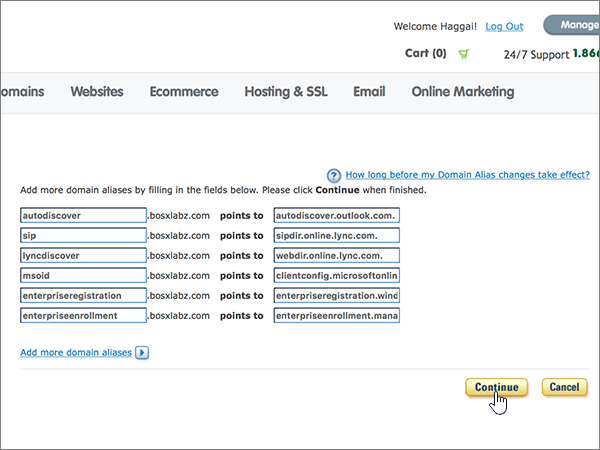

# Crear registros DNS en Register.com para MicrosoftCreate DNS records at Register.com for Microsoft

 **[Consulte Preguntas más frecuentes acerca de los dominios](../setup/domains-faq.yml)** si no encuentra lo que busca.**[Check the Domains FAQ](../setup/domains-faq.yml)** if you don't find what you're looking for. 
  
Si Register.com es su proveedor de host DNS, siga los pasos de este artículo para comprobar el dominio y configurar los registros DNS para el correo electrónico, Skype Empresarial Online, etc.If Register.com is your DNS hosting provider, follow the steps in this article to verify your domain and set up DNS records for email, Skype for Business Online, and so on.
  
Estos son los registros principales que agregar.These are the main records to add. Siga los pasos siguientes o [vea el vídeo](https://support.microsoft.com/office/7448dd9e-c0e7-4d5e-a7e9-f0e4715433c4).Follow the steps below or [watch the video](https://support.microsoft.com/office/7448dd9e-c0e7-4d5e-a7e9-f0e4715433c4).
  
- [Agregar un registro TXT en Register.com para comprobar que es el propietario del dominioAdd a TXT record at Register.com to verify that you own the domain](#add-a-txt-record-at-registercom-to-verify-that-you-own-the-domain)
    
- [Agregar un registro MX para que el correo electrónico del dominio vaya a MicrosoftAdd an MX record so email for your domain will come to Microsoft](#add-an-mx-record-so-email-for-your-domain-will-come-to-microsoft)
    
- [Agregar los registros CNAME necesarios para MicrosoftAdd the CNAME records that are required for Microsoft](#add-the-cname-records-that-are-required-for-microsoft)
    
- [Agregar un registro TXT para SPF para ayudar a evitar el correo no deseadoAdd a TXT record for SPF to help prevent email spam](#add-a-txt-record-for-spf-to-help-prevent-email-spam)

- [Agregar los dos registros SRV necesarios para MicrosoftAdd the two SRV records that are required for Microsoft](#add-the-two-srv-records-that-are-required-for-microsoft)
    
Después de agregar estos registros a Register.com, el dominio se configurará para funcionar con los servicios Microsoft.After you add these records at Register.com, your domain will be set up to work with Microsoft services.
  

  
> [!NOTE]
> Normalmente, se necesitan unos 15 minutos para que los cambios de DNS surtan efecto.Typically it takes about 15 minutes for DNS changes to take effect. Sin embargo, a veces los cambios pueden necesitar más tiempo para aplicarse en todo el sistema DNS de Internet.However, it can occasionally take longer for a change you've made to update across the Internet's DNS system. Si tiene problemas con el flujo de correo u otros problemas después de agregar registros DNS, vea [Encontrar y solucionar problemas después de agregar el dominio o los registros DNS](../get-help-with-domains/find-and-fix-issues.md).If you're having trouble with mail flow or other issues after adding DNS records, see [Find and fix issues after adding your domain or DNS records](../get-help-with-domains/find-and-fix-issues.md). 
  
## Agregar un registro TXT en Register.com para comprobar que es el propietario del dominioAdd a TXT record at Register.com to verify that you own the domain

Antes de utilizar el dominio con Microsoft, tenemos que asegurarnos de que sea el propietario. Si puede iniciar sesión en la cuenta en el registrador de dominio y crear el registro DNS, Microsoft sabrá que es el propietario del dominio.Before you use your domain with Microsoft, we have to make sure that you own it. Your ability to log in to your account at your domain registrar and create the DNS record proves to Microsoft that you own the domain.
  
> [!NOTE]
> Este registro se usa exclusivamente para verificar si se es el propietario de un dominio; no afecta a nada más. Puede eliminarlo más adelante, si lo desea.This record is used only to verify that you own your domain; it doesn't affect anything else. You can delete it later, if you like. 
  
Siga los pasos siguientes o [vea el vídeo (empieza en 0:44)](https://support.microsoft.com/office/7448dd9e-c0e7-4d5e-a7e9-f0e4715433c4).Follow the steps below or [watch the video (start at 0:44)](https://support.microsoft.com/office/7448dd9e-c0e7-4d5e-a7e9-f0e4715433c4).
  
1. Para empezar, vaya a su página de dominios en Register.com a través de [este vínculo](https://www.register.com/myaccount/). Se le pedirá que inicie sesión en primer lugar.To get started, go to your domains page at Register.com by using [this link](https://www.register.com/myaccount/). You'll be prompted to sign in.
    
2. Seleccione **Dominios**.Select **Domains**.
    
3. Seleccione **Administrar**.Select **Manage**.
    
4. Busque la fila que contiene el nombre del dominio que desea modificar; y, a continuación, en esa fila, seleccione **Administrar**.Find the row that contains the name of the domain that you want to modify; and then, in that row, select **Manage**.
    
5. Desplácese hacia abajo hasta la **sección Configuración** técnica avanzada y, a continuación, seleccione Editar registros **TXT (SPF).**Scroll down to the **Advanced Technical Settings** section, and then select **Edit TXT Records (SPF)**.
    
6. In the boxes for the new record, type or copy and paste the values from the following table.In the boxes for the new record, type or copy and paste the values from the following table.
    
    |||
    |:-----|:-----|
    |**Host Name****Host Name**   |**TXT Record****TXT Record**   |
    |@    |MS=ms *XXXXXXXX*MS=ms *XXXXXXXX*    **Nota:** esto es un ejemplo.**Note:** This is an example. Utilice aquí su valor de **Dirección de destino**, desde la tabla.Use your specific **Destination or Points to Address** value here, from the table. [¿Cómo puedo encontrar esto?How do I find this?](../get-help-with-domains/information-for-dns-records.md)          |
   
7. Seleccione **Continuar**.Select **Continue**.
    
8. En la página siguiente, seleccione **Continuar de** nuevo para confirmar los cambios.On the next page, select **Continue** again to confirm your changes. 
    
9. Espere unos minutos antes de continuar para que el registro que acaba de crear pueda actualizarse en Internet.Wait a few minutes before you continue, so that the record you just created can update across the Internet.
    
Ahora que ha agregado el registro en el sitio de su registrador de dominios, deberá volver a Microsoft y solicitar el registro.Now that you've added the record at your domain registrar's site, you'll go back to Microsoft and request the record.
  
Cuando Microsoft encuentre el registro TXT correcto, se comprobará su dominio.When Microsoft finds the correct TXT record, your domain is verified.
  
1. En el centro de administración, diríjase a la página **configuración** \> <a href="https://go.microsoft.com/fwlink/p/?linkid=834818" target="_blank">dominios</a>.In the admin center, go to the **Settings** \> <a href="https://go.microsoft.com/fwlink/p/?linkid=834818" target="_blank">Domains</a> page.
    
2. En la página **Dominios**, elija el dominio que está verificando.On the **Domains** page, select the domain that you are verifying. 
    
3. En la página de **Configuración**, elija **Iniciar configuración**.On the **Setup** page, select **Start setup**.
    
4. En la página **Verificar dominio**, elija **Verificar**.On the **Verify domain** page, select **Verify**.
    
> [!NOTE]
> Normalmente, se necesitan unos 15 minutos para que los cambios de DNS surtan efecto.Typically it takes about 15 minutes for DNS changes to take effect. Sin embargo, a veces los cambios pueden necesitar más tiempo para aplicarse en todo el sistema DNS de Internet.However, it can occasionally take longer for a change you've made to update across the Internet's DNS system. Si tiene problemas con el flujo de correo u otros problemas después de agregar registros DNS, vea [Encontrar y solucionar problemas después de agregar el dominio o los registros DNS](../get-help-with-domains/find-and-fix-issues.md).If you're having trouble with mail flow or other issues after adding DNS records, see [Find and fix issues after adding your domain or DNS records](../get-help-with-domains/find-and-fix-issues.md). 
  
## Agregar un registro MX para que el correo electrónico del dominio vaya a MicrosoftAdd an MX record so email for your domain will come to Microsoft

Siga los pasos siguientes o [vea el vídeo (empieza en 3:32)](https://support.microsoft.com/office/7448dd9e-c0e7-4d5e-a7e9-f0e4715433c4).Follow the steps below or [watch the video (start at 3:32)](https://support.microsoft.com/office/7448dd9e-c0e7-4d5e-a7e9-f0e4715433c4).
  
1. Para empezar, vaya a su página de dominios en Register.com a través de [este vínculo](https://www.register.com/myaccount/). Se le pedirá que inicie sesión en primer lugar.To get started, go to your domains page at Register.com by using [this link](https://www.register.com/myaccount/). You'll be prompted to sign in.
    
2. Seleccione **Dominios**.Select **Domains**.
    
3. Seleccione **Administrar**.Select **Manage**.
    
4. Busque la fila que contiene el nombre del dominio que desea modificar; y, a continuación, en esa fila, seleccione **Administrar**.Find the row that contains the name of the domain that you want to modify; and then, in that row, select **Manage**.
    
5. Desplácese hasta la **sección Configuración técnica** avanzada y, a continuación, seleccione Editar registros de intercambio de **correo.**Scroll to the **Advanced Technical Settings** section, and then select **Edit Mail Exchanger Records**.
    
    
  
6. En los cuadros para el nuevo registro, escriba o copie y pegue los valores de la tabla siguiente.In the boxes for the new record, type or copy and paste the values from the following table.
    
    (Elija el **valor prioridad** de la lista desplegable).(Choose the **Priority** value from the drop-down list.) 
    
    |\*\*\*\*Nombre de host\*\*\*\*\*\*\*\*Host Name\*\*\*\*|\*\*\*\*Prioridad\*\*\*\*\*\*\*\*Priority\*\*\*\*|\*\*\*\*Servidor de correo\*\*\*\*\*\*\*\*Mail Server\*\*\*\*|
    |:-----|:-----|:-----|
    |@    |MáximoHigh    Para obtener más información sobre la prioridad, consulte [¿Qué es una prioridad de MX?](https://docs.microsoft.com/microsoft-365/admin/setup/domains-faq)For more information about priority, see [What is MX priority?](https://docs.microsoft.com/microsoft-365/admin/setup/domains-faq)   | *\<domain-key\>*  .mail.protection.outlook.com*\<domain-key\>*  .mail.protection.outlook.com      **Nota:** Obtenga la \<*domain-key*\> desde su cuenta de Microsoft.**Note:** Get your \<*domain-key*\> from your Microsoft account.   [¿Cómo puedo encontrar esto?How do I find this?](../get-help-with-domains/information-for-dns-records.md)          |
   
    
  
7. Si se muestran otros registros MX en la lista, seleccione todos los registros que quiera eliminar.If there were any other MX records already listed, select each of those records to be deleted.
    
    
  
8. Seleccione **Continuar**.Select **Continue**.
    
    
  
9. En la página siguiente, seleccione **Continuar de** nuevo para confirmar y guardar los cambios.On the next page, select **Continue** again to confirm and save your changes. 
    
    
  
## Agregar los registros CNAME necesarios para MicrosoftAdd the CNAME records that are required for Microsoft

Siga los pasos siguientes o [vea el vídeo (empieza en 4:23)](https://support.microsoft.com/office/7448dd9e-c0e7-4d5e-a7e9-f0e4715433c4).Follow the steps below or [watch the video (start at 4:23)](https://support.microsoft.com/office/7448dd9e-c0e7-4d5e-a7e9-f0e4715433c4).
  
1. Para empezar, vaya a su página de dominios en Register.com a través de [este vínculo](https://www.register.com/myaccount/). Se le pedirá que inicie sesión en primer lugar.To get started, go to your domains page at Register.com by using [this link](https://www.register.com/myaccount/). You'll be prompted to sign in.
    
2. Seleccione **Dominios**.Select **Domains**.
    
3. Seleccione **Administrar**.Select **Manage**.
    
4. Busque la fila que contiene el nombre del dominio que desea modificar; y, a continuación, en esa fila, seleccione **Administrar**.Find the row that contains the name of the domain that you want to modify; and then, in that row, select **Manage**.
    
5. Desplácese hasta la **sección Configuración técnica** avanzada y, a continuación, seleccione Editar registros de alias de **dominio.**Scroll to the **Advanced Technical Settings** section, and then select **Edit Domain Aliases Records**.
    
    
  
6. Seleccione **Agregar más alias de dominio.**Select **Add more domain aliases**.
    
    
  
7. Agregar los registros CNAME necesarios.Add the required CNAME records.
    
    En los cuadros para el nuevo registro, escriba o copie y pegue los valores de la primera fila de la tabla siguiente.In the boxes for the new record, type or copy and paste the values from the first row of the following table.
    
    |\*\*\*\*Primer campo (sin etiqueta)\*\*\*\*\*\*\*\*First field (unlabeled)\*\*\*\*|\*\*\*\*Señala a\*\*\*\*\*\*\*\*Points to\*\*\*\*|
    |:-----|:-----|
    |autodescubrirautodiscover    |autodiscover.outlook.comautodiscover.outlook.com       |
    |sipsip    |sipdir.online.lync.comsipdir.online.lync.com       |
    |lyncdiscoverlyncdiscover    |webdir.online.lync.comwebdir.online.lync.com      |
    |enterpriseregistrationenterpriseregistration    |enterpriseregistration.windows.netenterpriseregistration.windows.net       |
    |enterpriseenrollmententerpriseenrollment    |enterpriseenrollment-s.manage.microsoft.comenterpriseenrollment-s.manage.microsoft.com       |
   
     
  
8. Cuando haya agregado todos los registros CNAME que necesita, seleccione **Continuar**.When you have added all of the CNAME records that you need, select **Continue**.
    
    
  
9. En la página siguiente, seleccione **Continuar de** nuevo para confirmar y guardar los cambios.On the next page, select **Continue** again to confirm and save your changes. 
    
    
  
## Agregar un registro TXT para SPF para ayudar a evitar el correo no deseadoAdd a TXT record for SPF to help prevent email spam

> [!IMPORTANT]
> No puede tener más de un registro TXT para el SPF de un dominio.You cannot have more than one TXT record for SPF for a domain. Si su dominio tiene más de un registro de SPF, obtendrá errores de correo, así como problemas de clasificación de entrega y de correo no deseado.If your domain has more than one SPF record, you'll get email errors, as well as delivery and spam classification issues. Si ya tiene un registro de SPF para su dominio, no cree uno nuevo para Microsoft.If you already have an SPF record for your domain, don't create a new one for Microsoft. En vez de eso, agregue los valores necesarios de Microsoft para el registro actual, de modo que solo tenga un único registro de SPF que incluya ambos conjuntos de valores.Instead, add the required Microsoft values to the current record so that you have a single SPF record that includes both sets of values.  
  
Siga los pasos siguientes o [vea el vídeo (empieza en 5:12)](https://support.microsoft.com/office/7448dd9e-c0e7-4d5e-a7e9-f0e4715433c4).Follow the steps below or [watch the video (start at 5:12)](https://support.microsoft.com/office/7448dd9e-c0e7-4d5e-a7e9-f0e4715433c4).
  
1. Para empezar, vaya a su página de dominios en Register.com a través de [este vínculo](https://www.register.com/myaccount/). Se le pedirá que inicie sesión en primer lugar.To get started, go to your domains page at Register.com by using [this link](https://www.register.com/myaccount/). You'll be prompted to sign in.
    
2. Seleccione **Dominios**.Select **Domains**.
    
3. Seleccione **Administrar**.Select **Manage**.
    
4. Busque la fila que contiene el nombre del dominio que desea modificar; y, a continuación, en esa fila, seleccione **Administrar**.Find the row that contains the name of the domain that you want to modify; and then, in that row, select **Manage**.
    
5. Desplácese hasta la **sección Configuración técnica** avanzada y, a continuación, seleccione Editar registros TXT **(SPF).**Scroll to the **Advanced Technical Settings** section, and then select **Edit TXT Records (SPF)**.
    
    
  
6. En los cuadros para el nuevo registro, escriba o copie y pegue los valores de la tabla siguiente.In the boxes for the new record, type or copy and paste the values from the following table.
    
    |\*\*\*\*Nombre de host\*\*\*\*\*\*\*\*Host Name\*\*\*\*|\*\*\*\*Registro TXT\*\*\*\*\*\*\*\*TXT Record\*\*\*\*|
    |:-----|:-----|
    |@    |v=spf1 include:spf.protection.outlook.com -allv=spf1 include:spf.protection.outlook.com -all    **Nota:** recomendamos copiar y pegar esta entrada, para que todo el espacio sea correcto.**Note:** We recommend copying and pasting this entry, so that all of the spacing stays correct.  |
   
     
  
7. Seleccione **Continuar**.Select **Continue**.
    
    
  
8. En la página siguiente, seleccione **Continuar de** nuevo para confirmar y guardar los cambios.On the next page, select **Continue** again to confirm and save your changes. 
    
    
  
## Agregar los dos registros SRV necesarios para MicrosoftAdd the two SRV records that are required for Microsoft

Siga los pasos siguientes o [vea el vídeo (empieza en 5:55)](https://support.microsoft.com/office/7448dd9e-c0e7-4d5e-a7e9-f0e4715433c4).Follow the steps below or [watch the video (start at 5:55)](https://support.microsoft.com/office/7448dd9e-c0e7-4d5e-a7e9-f0e4715433c4).
  
1. Para empezar, vaya a su página de dominios en Register.com a través de [este vínculo](https://www.register.com/myaccount/). Se le pedirá que inicie sesión en primer lugar.To get started, go to your domains page at Register.com by using [this link](https://www.register.com/myaccount/). You'll be prompted to sign in.
    
2. Seleccione **Dominios**.Select **Domains**.
    
3. Seleccione **Administrar**.Select **Manage**.
    
4. Busque la fila que contiene el nombre del dominio que desea modificar; y, a continuación, en esa fila, seleccione **Administrar**.Find the row that contains the name of the domain that you want to modify; and then, in that row, select **Manage**.
    
5. Desplácese a la **sección Configuración técnica** avanzada y, a continuación, seleccione Editar registros **SRV.**Scroll to the **Advanced Technical Settings** section, and then select **Edit SRV Records**.
    
    
  
6. Agregue el primero de los dos registros SRV:Add the first of the two SRV records:
    
    En los cuadros para el nuevo registro, escriba o copie y pegue los valores de la primera fila de la tabla siguiente.In the boxes for the new record, type or copy and paste the values from the first row of the following table.
    
    (Elija el **valor prioridad** de la lista desplegable).(Choose the **Priority** value from the drop-down list.) 
    
    |\*\*\*\*Servicio\*\*\*\*\*\*\*\*Service\*\*\*\*|\*\*\*\*Puerto\*\*\*\*\*\*\*\*Proto\*\*\*\*|\*\*\*\*Nombre\*\*\*\*\*\*\*\*Name\*\*\*\*|\*\*\*\*Prioridad\*\*\*\*\*\*\*\*Priority\*\*\*\*|\*\*\*\*Grosor\*\*\*\*\*\*\*\*Weight\*\*\*\*|\*\*\*\*Puerto\*\*\*\*\*\*\*\*Port\*\*\*\*|\*\*\*\*Destino\*\*\*\*\*\*\*\*Target\*\*\*\*|
    |:-----|:-----|:-----|:-----|:-----|:-----|:-----|
    |_sip_sip    |_tls_tls    |@    |MáximoHigh    |1 1    |443443    |sipdir.online.lync.comsipdir.online.lync.com       |
    |_sipfederationtls_sipfederationtls    |_tcp_tcp    |@    |MáximoHigh    |1 1    |50615061    |sipfed.online.lync.comsipfed.online.lync.com       |
   
    
  
7. Seleccione **Agregar más registros SRV.**Select **Add more SRV records**.
    
    
  
8. Agregue el segundo registro SRV:Add the second SRV record:
    
    Copie y pegue los valores de la segunda fila de la tabla anterior en los cuadros para el segundo registro.Type or copy and paste the values from the second row of the table above into the boxes for the second record.
    
9. Cuando haya agregado ambos registros SRV, seleccione **Continuar**.When you have added both of the SRV records, select **Continue**.
    
    
  
10. En la página siguiente, seleccione **Continuar de** nuevo para confirmar y guardar los cambios.On the next page, select **Continue** again to confirm and save your changes. 
    
    
  
> [!NOTE]
> Normalmente, se necesitan unos 15 minutos para que los cambios de DNS surtan efecto.Typically it takes about 15 minutes for DNS changes to take effect. Sin embargo, a veces los cambios pueden necesitar más tiempo para aplicarse en todo el sistema DNS de Internet.However, it can occasionally take longer for a change you've made to update across the Internet's DNS system. Si tiene problemas con el flujo de correo u otros problemas después de agregar registros DNS, vea [Encontrar y solucionar problemas después de agregar el dominio o los registros DNS](../get-help-with-domains/find-and-fix-issues.md).If you're having trouble with mail flow or other issues after adding DNS records, see [Find and fix issues after adding your domain or DNS records](../get-help-with-domains/find-and-fix-issues.md). 
  
