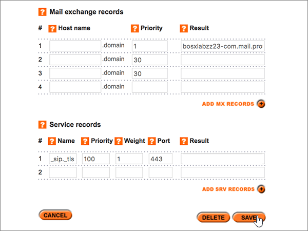

# Crear registros DNS en Register365 para Microsoft

 **[Consulte Preguntas más frecuentes acerca de los dominios](../setup/domains-faq.md)** si no encuentra lo que busca. 
  
Si Register365 es su proveedor de host DNS, siga los pasos de este artículo para comprobar el dominio y configurar los registros DNS para el correo electrónico, Skype Empresarial Online, etc. 
  
Estos son los registros principales que es necesario agregar.  
  
- [Agregar un registro TXT para verificación](#add-a-txt-record-for-verification)
    
- [Agregar un registro MX para que el correo electrónico del dominio vaya a Microsoft](#add-an-mx-record-so-email-for-your-domain-will-come-to-microsoft)
    
- [Agregar los seis registros CNAME necesarios para Microsoft](#add-the-six-cname-records-that-are-required-for-microsoft)
    
- [Agregar un registro TXT para SPF para ayudar a evitar el correo no deseado](#add-a-txt-record-for-spf-to-help-prevent-email-spam)
    
- [Agregar los dos registros SRV necesarios para Microsoft](#add-the-two-srv-records-that-are-required-for-microsoft)
    
Después de agregar estos registros a Microsoft, su dominio estará configurado para trabajar con los servicios de Microsoft.
  
> [!NOTE]
>  Por lo general, los cambios de DNS tardan unos 15 minutos en aplicarse. Sin embargo, a veces los cambios pueden necesitar más tiempo para aplicarse en todo el sistema DNS de Internet. Si tiene problemas con el flujo de correo u otros problemas después de agregar registros DNS, consulte [Solucionar problemas después de cambiar el nombre del dominio o los registros DNS](../get-help-with-domains/find-and-fix-issues.md). 
  
## Agregar un registro TXT para verificación

Antes de utilizar el dominio con Microsoft, tenemos que asegurarnos de que sea el propietario. Si puede iniciar sesión en la cuenta en el registrador de dominio y crear el registro DNS, Microsoft sabrá que es el propietario del dominio.
  
> [!NOTE]
> Este registro se usa exclusivamente para verificar si se es el propietario de un dominio; no afecta a nada más. Puede eliminarlo más adelante, si lo desea. 
  
1. Para empezar, vaya a su página de dominios en Register365 a través de [este vínculo](https://admin.register365.com/dns/). Se le pedirá que inicie sesión primero .
    
    
  
2. En la página **Panel**, busque el nombre del dominio que vaya a actualizar y, a continuación, elija **Configuración DNS** en la lista desplegable. 
    
    (You may have to scroll down.)
    
    
  
3. On the **Add/Modify DNS Zone** page, in the **A, CNAME, AAAA, TXT and NS records** section, in the boxes for the new record, type or copy and paste the values from the following table. 
    
    (Choose the **Type** value from the drop-down list.) 
    
    (Si necesita agregar una fila, seleccione **agregar registros a/CNAME (+)**).
    
    (You may have to scroll down.)
    
    |**Nombre de host**|**Tipo**|**Resultado**|
    |:-----|:-----|:-----|
    |(Leave this field empty.)    |TXT    |MS=ms *XXXXXXXX*    **Nota:** esto es un ejemplo. Utilice aquí su valor de **Dirección de destino**, desde la tabla.           [¿Cómo puedo encontrar esto?](../get-help-with-domains/information-for-dns-records.md)          |
   
    
  
4. Haga clic en **Guardar**.
    
    (You may have to scroll down.)
    
    
  
5. Espere unos minutos antes de continuar para que el registro que acaba de crear pueda actualizarse en Internet.
    
Ahora que ha agregado el registro en el sitio de su registrador de dominios, deberá volver a Microsoft y solicitar el registro.
  
Cuando Microsoft encuentre el registro TXT correcto, se comprobará su dominio.
  
1. En el centro de administración, diríjase a la página **configuración** \> <a href="https://go.microsoft.com/fwlink/p/?linkid=834818" target="_blank">dominios</a>.
    
2. En la página **Dominios**, elija el dominio que está verificando. 
    
    
  
3. En la página de **Configuración**, elija ** Iniciar configuración**.
    
    
  
4. En la página**verificar dominio**, seleccione **verificar**.
    
    
  
> [!NOTE]
>  Por lo general, los cambios de DNS tardan unos 15 minutos en aplicarse. Sin embargo, a veces los cambios pueden necesitar más tiempo para aplicarse en todo el sistema DNS de Internet. Si tiene problemas con el flujo de correo u otros problemas después de agregar registros DNS, consulte [Solucionar problemas después de cambiar el nombre del dominio o los registros DNS](../get-help-with-domains/find-and-fix-issues.md). 
  
## Agregar un registro MX para que el correo electrónico del dominio vaya a Microsoft

1. Para empezar, vaya a su página de dominios en Register365 a través de [este vínculo](https://admin.register365.com/dns/). Se le pedirá que inicie sesión primero .
    
    
  
2. En la página **Panel**, busque el nombre del dominio que vaya a actualizar y, a continuación, elija **Configuración DNS** en la lista desplegable. 
    
    (You may have to scroll down.)
    
    
  
3. En la página **Add/Modify DNS Zone** (Agregar o modificar zona DNS), en la sección **Mail exchange records** (Registros Mail eXchange), en los cuadros del nuevo registro, escriba o copie y pegue los valores de la tabla siguiente. 
    
    (You may have to scroll down.)
    
    |**Nombre de host**|**Prioridad**|**Resultado**|
    |:-----|:-----|:-----|
    |(Deje este campo en blanco).    |1     Para obtener más información sobre la prioridad, consulte [¿Qué es una prioridad de MX?](https://docs.microsoft.com/microsoft-365/admin/setup/domains-faq)   | *\<domain-key\>*. mail.protection.outlook.com    **Nota:** Obtén tu *\<domain-key\>* cuenta de Microsoft.  [¿Cómo puedo encontrar esto?](../get-help-with-domains/information-for-dns-records.md)     |
   
    
  
4. Haga clic en **Guardar**.
    
    (You may have to scroll down.)
    
    
  
5. Si hay otros registros MX en la sección **Mail exchange records** (Registros Mail eXchange), elimínelos. Para hacerlo, selecciónelos y, después, pulse la tecla **Suprimir** en el teclado. 
    
    
  
6. Haga clic en **Guardar**.
    
    (You may have to scroll down.)
    
    
  
## Agregar los seis registros CNAME necesarios para Microsoft

1. Para empezar, vaya a su página de dominios en Register365 a través de [este vínculo](https://admin.register365.com/dns/). Se le pedirá que inicie sesión primero .
    
    
  
2. En la página **Panel**, busque el nombre del dominio que vaya a actualizar y, a continuación, elija **Configuración DNS** en la lista desplegable. 
    
    (You may have to scroll down.)
    
    
  
3. En la página **Add/Modify DNS Zone** (Agregar o modificar zona DNS), en la sección **A, CNAME, AAAA, TXT and NS records** (Registros A, CNAME, AAAA, TXT y NS), en los cuadros para los registros nuevos, escriba o copie y pegue los valores de la tabla siguiente. 
    
    (Choose the **Type** value from the drop-down list.) 
    
    (Si necesita agregar una fila, seleccione **agregar registros a/CNAME (+)**).
    
    (Es posible que tenga que desplazarse hacia abajo).
    
    |****Nombre de host****|****Tipo****|****Resultado****|
    |:-----|:-----|:-----|
    |autodiscover    |CNAME    |autodiscover.outlook.com    |
    |sip    |CNAME    |sipdir.online.lync.com    |
    |lyncdiscover    |CNAME    |webdir.online.lync.com    |
    |enterpriseregistration    |CNAME    |enterpriseregistration.windows.net    |
    |enterpriseenrollment    |CNAME    |EnterpriseEnrollment-s.manage.microsoft.com    |
   
    
  
4. Haga clic en **Guardar**.
    
    
  
## Agregar un registro TXT para SPF para ayudar a prevenir el spam de correo electrónico

> [!IMPORTANT]
> No puede tener más de un registro TXT para el SPF de un dominio. Si su dominio tiene más de un registro de SPF, obtendrá errores de correo, así como problemas de clasificación de entrega y de correo no deseado. Si ya tiene un registro de SPF para su dominio, no cree uno nuevo para Microsoft. En su lugar, agregue los valores necesarios de Microsoft al registro activo para que tenga un *único* registro de SPF que incluya ambos conjuntos de valores. 
  
1. Para empezar, vaya a su página de dominios en Register365 a través de [este vínculo](https://admin.register365.com/dns/). Se le pedirá que inicie sesión primero .
    
    
  
2. En la página **Panel**, busque el nombre del dominio que vaya a actualizar y, a continuación, elija **Configuración DNS** en la lista desplegable. 
    
    (You may have to scroll down.)
    
    
  
3. On the **Add/Modify DNS Zone** page, in the **A, CNAME, AAAA, TXT and NS records** section, in the boxes for the new record, type or copy and paste the values from the following table. 
    
    (Choose the **Type** value from the drop-down list.) 
    
    (Si necesita agregar una fila, seleccione **agregar registros a/CNAME (+)**).
    
    (You may have to scroll down.)
    
    |**Nombre de host**|**Tipo**|**Resultado**|
    |:-----|:-----|:-----|
    |(Leave this field empty.)    |TXT    |v=spf1 include:spf.protection.outlook.com -all   **Nota:** recomendamos copiar y pegar esta entrada, para que todo el espacio sea correcto.           |
   
    
  
4. Haga clic en **Guardar**.
    
    (You may have to scroll down.)
    
    
  
## Agregar los dos registros SRV necesarios para Microsoft

1. Para empezar, vaya a su página de dominios en Register365 a través de [este vínculo](https://admin.register365.com/dns/). Se le pedirá que inicie sesión primero .
    
    
  
2. En la página **Panel**, busque el nombre del dominio que vaya a actualizar y, a continuación, elija **Configuración DNS** en la lista desplegable. 
    
    (You may have to scroll down.)
    
    
  
3. En la página **Add/Modify DNS Zone** (Agregar o modificar zona DNS), en la sección **Service records** (Registros de servicio), en los cuadros de los registros nuevos, escriba o copie y pegue los valores de la tabla siguiente. 
    
    (Es posible que tenga que desplazarse hacia abajo).
    
    |**Nombre**|**Prioridad**|**Grosor**|**Puerto**|**Resultado**|
    |:-----|:-----|:-----|:-----|:-----|
    |_sip. _tls    |100    |1     |443    |sipdir.online.lync.com    |
    |_sipfederationtls. _tcp    |100    |1     |5061    |sipfed.online.lync.com    |
   
    
  
4. Haga clic en **Guardar**.
    
    (You may have to scroll down.)
    
    
  
> [!NOTE]
>  Por lo general, los cambios de DNS tardan unos 15 minutos en aplicarse. Sin embargo, a veces los cambios pueden necesitar más tiempo para aplicarse en todo el sistema DNS de Internet. Si tiene problemas con el flujo de correo u otros problemas después de agregar registros DNS, consulte [Solucionar problemas después de cambiar el nombre del dominio o los registros DNS](../get-help-with-domains/find-and-fix-issues.md). 
  
