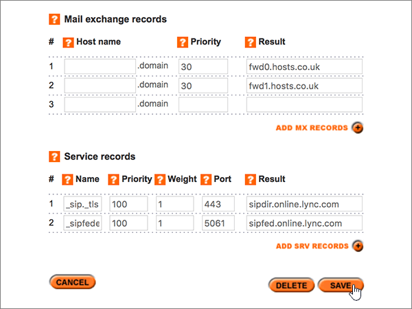

# Crear registros DNS en Register365 para MicrosoftCreate DNS records at Register365 for Microsoft

 **[Consulte Preguntas más frecuentes acerca de los dominios](../setup/domains-faq.md)** si no encuentra lo que busca.**[Check the Domains FAQ](../setup/domains-faq.md)** if you don't find what you're looking for. 
  
Si Register365 es su proveedor de host DNS, siga los pasos de este artículo para comprobar el dominio y configurar los registros DNS para el correo electrónico, Skype Empresarial Online, etc.If Register365 is your DNS hosting provider, follow the steps in this article to verify your domain and set up DNS records for email, Skype for Business Online, and so on. 
  
Estos son los registros principales que es necesario agregar.These are the main records to add.  
  
- [Agregar un registro TXT para verificaciónAdd a TXT record for verification](#add-a-txt-record-for-verification)
    
- [Agregar un registro MX para que el correo electrónico del dominio llegue a MicrosoftAdd an MX record so email for your domain will come to Microsoft](#add-an-mx-record-so-email-for-your-domain-will-come-to-microsoft)
    
- [Agregar los seis registros CNAME necesarios para MicrosoftAdd the six CNAME records that are required for Microsoft](#add-the-six-cname-records-that-are-required-for-microsoft)
    
- [Agregar un registro TXT para SPF para ayudar a evitar el correo no deseadoAdd a TXT record for SPF to help prevent email spam](#add-a-txt-record-for-spf-to-help-prevent-email-spam)
    
- [Agregar los dos registros SRV necesarios para MicrosoftAdd the two SRV records that are required for Microsoft](#add-the-two-srv-records-that-are-required-for-microsoft)
    
Después de agregar estos registros a Microsoft, su dominio estará configurado para trabajar con los servicios de Microsoft.After you add these records at Microsoft, your domain will be set up to work with Microsoft services.
  
Para obtener más información sobre WebHosting y DNS para sitios web con Microsoft, vea [usar un sitio web público con Microsoft](https://support.office.com/article/choose-a-public-website-3325d50e-d131-403c-a278-7f3296fe33a9).To learn about webhosting and DNS for websites with Microsoft, see [Use a public website with Microsoft](https://support.office.com/article/choose-a-public-website-3325d50e-d131-403c-a278-7f3296fe33a9).
  
> [!NOTE]
>  Por lo general, los cambios de DNS tardan unos 15 minutos en aplicarse. Sin embargo, a veces los cambios pueden necesitar más tiempo para aplicarse en todo el sistema DNS de Internet. Si tiene problemas con el flujo de correo u otros problemas después de agregar registros DNS, consulte [Solucionar problemas después de cambiar el nombre del dominio o los registros DNS](../get-help-with-domains/find-and-fix-issues.md).Typically it takes about 15 minutes for DNS changes to take effect. However, it can occasionally take longer for a change you've made to update across the Internet's DNS system. If you're having trouble with mail flow or other issues after adding DNS records, see [Troubleshoot issues after changing your domain name or DNS records](../get-help-with-domains/find-and-fix-issues.md). 
  
## Agregar un registro TXT para verificaciónAdd a TXT record for verification

Antes de usar el dominio con Microsoft, debemos asegurarnos de que es el propietario.Before you use your domain with Microsoft, we have to make sure that you own it. Su capacidad para iniciar sesión en su cuenta en el registrador de dominios y crear el registro DNS es la que se demuestre a Microsoft que es el propietario del dominio.Your ability to log in to your account at your domain registrar and create the DNS record proves to Microsoft that you own the domain.
  
> [!NOTE]
> Este registro se usa exclusivamente para verificar si se es el propietario de un dominio; no afecta a nada más. Puede eliminarlo más adelante, si lo desea.This record is used only to verify that you own your domain; it doesn't affect anything else. You can delete it later, if you like. 
  
1. Para empezar, vaya a su página de dominios en Register365 a través de [este vínculo](https://admin.register365.com/dns/). Se le pedirá que inicie sesión primero .To get started, go to your domains page at Register365 by using [this link](https://admin.register365.com/dns/). You'll be prompted to log in first.
    
    
  
2. En la página **Panel**, busque el nombre del dominio que vaya a actualizar y, a continuación, elija **Configuración DNS** en la lista desplegable.On the **Dashboard** page, find the name of the domain that you're updating, and then choose **DNS Settings** from the drop-down list. 
    
    (You may have to scroll down.)(You may have to scroll down.)
    
    
  
3. On the **Add/Modify DNS Zone** page, in the **A, CNAME, AAAA, TXT and NS records** section, in the boxes for the new record, type or copy and paste the values from the following table.On the **Add/Modify DNS Zone** page, in the **A, CNAME, AAAA, TXT and NS records** section, in the boxes for the new record, type or copy and paste the values from the following table. 
    
    (Choose the **Type** value from the drop-down list.)(Choose the **Type** value from the drop-down list.) 
    
    (Si necesita agregar una fila, seleccione **agregar registros a/CNAME (+)**).(If you need to add a row, select **ADD A/CNAME RECORDS (+)**.)
    
    (You may have to scroll down.)(You may have to scroll down.)
    
    |**Nombre de host****Host name**|**Tipo****Type**|**Resultado****Result**|
    |:-----|:-----|:-----|
    |(Leave this field empty.)(Leave this field empty.)    |TXTTXT    |MS=ms *XXXXXXXX*MS=ms *XXXXXXXX*    **Nota:** esto es un ejemplo.**Note:** This is an example. Use aquí su **destino específico o** el valor de dirección de destino de la tabla.Use your specific **Destination or Points to Address** value here, from the table.           [¿Cómo puedo encontrar esto?How do I find this?](../get-help-with-domains/information-for-dns-records.md)          |
   
    
  
4. Seleccione **Guardar**.Select **Save**.
    
    (You may have to scroll down.)(You may have to scroll down.)
    
    
  
5. Espere unos minutos antes de continuar para que el registro que acaba de crear pueda actualizarse en Internet.Wait a few minutes before you continue, so that the record you just created can update across the Internet.
    
Ahora que ha agregado el registro en el sitio del registrador de dominios, volverá a Microsoft y solicitará el registro.Now that you've added the record at your domain registrar's site, you'll go back to Microsoft and request the record.
  
Cuando Microsoft encuentre el registro TXT correcto, se comprobará el dominio.When Microsoft finds the correct TXT record, your domain is verified.
  
1. En el centro de administración, diríjase a la página **configuración** \> <a href="https://go.microsoft.com/fwlink/p/?linkid=834818" target="_blank">dominios</a>.In the admin center, go to the **Settings** \> <a href="https://go.microsoft.com/fwlink/p/?linkid=834818" target="_blank">Domains</a> page.
    
2. En la página **Dominios**, elija el dominio que está verificando.On the **Domains** page, select the domain that you are verifying. 
    
    
  
3. En la página de **Configuración**, elija \*\* Iniciar configuración\*\*.On the **Setup** page, select **Start setup**.
    
    
  
4. En la página**verificar dominio**, seleccione **verificar**.On the **Verify domain** page, select **Verify**.
    
    
  
> [!NOTE]
>  Por lo general, los cambios de DNS tardan unos 15 minutos en aplicarse. Sin embargo, a veces los cambios pueden necesitar más tiempo para aplicarse en todo el sistema DNS de Internet. Si tiene problemas con el flujo de correo u otros problemas después de agregar registros DNS, consulte [Solucionar problemas después de cambiar el nombre del dominio o los registros DNS](../get-help-with-domains/find-and-fix-issues.md).Typically it takes about 15 minutes for DNS changes to take effect. However, it can occasionally take longer for a change you've made to update across the Internet's DNS system. If you're having trouble with mail flow or other issues after adding DNS records, see [Troubleshoot issues after changing your domain name or DNS records](../get-help-with-domains/find-and-fix-issues.md). 
  
## Agregar un registro MX para que el correo electrónico del dominio llegue a MicrosoftAdd an MX record so email for your domain will come to Microsoft

1. Para empezar, vaya a su página de dominios en Register365 a través de [este vínculo](https://admin.register365.com/dns/). Se le pedirá que inicie sesión primero .To get started, go to your domains page at Register365 by using [this link](https://admin.register365.com/dns/). You'll be prompted to log in first.
    
    
  
2. En la página **Panel**, busque el nombre del dominio que vaya a actualizar y, a continuación, elija **Configuración DNS** en la lista desplegable.On the **Dashboard** page, find the name of the domain that you're updating, and then choose **DNS Settings** from the drop-down list. 
    
    (You may have to scroll down.)(You may have to scroll down.)
    
    
  
3. En la página **Add/Modify DNS Zone** (Agregar o modificar zona DNS), en la sección **Mail exchange records** (Registros Mail eXchange), en los cuadros del nuevo registro, escriba o copie y pegue los valores de la tabla siguiente.On the **Add/Modify DNS Zone** page, in the **Mail exchange records** section, in the boxes for the new record, type or copy and paste the values from the following table. 
    
    (Es posible que tenga que desplazarse hacia abajo).(You may have to scroll down.)
    
    |**Nombre de host****Host name**|**Prioridad****Priority**|**Resultado****Result**|
    |:-----|:-----|:-----|
    |(Deje este campo en blanco).(Leave this field empty.)    |11    Para obtener más información sobre la prioridad, consulte [¿Qué es una prioridad de MX?](https://support.office.com/article/2784cc4d-95be-443d-b5f7-bb5dd867ba83.aspx)For more information about priority, see [What is MX priority?](https://support.office.com/article/2784cc4d-95be-443d-b5f7-bb5dd867ba83.aspx)   | *\< clave-de-dominio \>*  . mail.protection.outlook.com    *\<domain-key\>*  .mail.protection.outlook.com    **Nota:** Obtén tu \* \<clave\> de dominio\* de tu cuenta de Microsoft.**Note:** Get your  *\<domain-key\>*  from your Microsoft account.  [¿Cómo puedo encontrar esto?How do I find this?](../get-help-with-domains/information-for-dns-records.md)     |
   
    
  
4. Seleccione **Guardar**.Select **Save**.
    
    (You may have to scroll down.)(You may have to scroll down.)
    
    
  
5. Si hay otros registros MX en la sección **Mail exchange records** (Registros Mail eXchange), elimínelos. Para hacerlo, selecciónelos y, después, pulse la tecla **Suprimir** en el teclado.If there are any other MX records in the **Mail exchange records** section, delete each one by selecting it and then pressing the **Delete** key on your keyboard. 
    
    
  
6. Seleccione **Guardar**.Select **Save**.
    
    (You may have to scroll down.)(You may have to scroll down.)
    
    
  
## Agregar los seis registros CNAME necesarios para MicrosoftAdd the six CNAME records that are required for Microsoft

1. Para empezar, vaya a su página de dominios en Register365 a través de [este vínculo](https://admin.register365.com/dns/). Se le pedirá que inicie sesión primero .To get started, go to your domains page at Register365 by using [this link](https://admin.register365.com/dns/). You'll be prompted to log in first.
    
    
  
2. En la página **Panel**, busque el nombre del dominio que vaya a actualizar y, a continuación, elija **Configuración DNS** en la lista desplegable.On the **Dashboard** page, find the name of the domain that you're updating, and then choose **DNS Settings** from the drop-down list. 
    
    (You may have to scroll down.)(You may have to scroll down.)
    
    
  
3. En la página **Add/Modify DNS Zone** (Agregar o modificar zona DNS), en la sección **A, CNAME, AAAA, TXT and NS records** (Registros A, CNAME, AAAA, TXT y NS), en los cuadros para los registros nuevos, escriba o copie y pegue los valores de la tabla siguiente.On the **Add/Modify DNS Zone** page, in the **A, CNAME, AAAA, TXT and NS records** section, in the boxes for the new records, type or copy and paste the values from the following table. 
    
    (Choose the **Type** value from the drop-down list.)(Choose the **Type** value from the drop-down list.) 
    
    (Si necesita agregar una fila, seleccione **agregar registros a/CNAME (+)**).(If you need to add a row, select **ADD A/CNAME RECORDS (+)**.)
    
    (Es posible que tenga que desplazarse hacia abajo).(You may have to scroll down.)
    
    |\*\*\*\*Nombre de host\*\*\*\*\*\*\*\*Host name\*\*\*\*|\*\*\*\*Tipo\*\*\*\*\*\*\*\*Type\*\*\*\*|\*\*\*\*Resultado\*\*\*\*\*\*\*\*Result\*\*\*\*|
    |:-----|:-----|:-----|
    |autodiscoverautodiscover    |CNAMECNAME    |autodiscover.outlook.comautodiscover.outlook.com    |
    |sipsip    |CNAMECNAME    |sipdir.online.lync.comsipdir.online.lync.com    |
    |lyncdiscoverlyncdiscover    |CNAMECNAME    |webdir.online.lync.comwebdir.online.lync.com    |
    |enterpriseregistrationenterpriseregistration    |CNAMECNAME    |enterpriseregistration.windows.netenterpriseregistration.windows.net    |
    |enterpriseenrollmententerpriseenrollment    |CNAMECNAME    |EnterpriseEnrollment-s.manage.microsoft.comenterpriseenrollment-s.manage.microsoft.com    |
   
    
  
4. Seleccione **Guardar**.Select **Save**.
    
    
  
## Agregar un registro TXT para SPF para ayudar a prevenir el spam de correo electrónicoAdd a TXT record for SPF to help prevent email spam

> [!IMPORTANT]
> No puede tener más de un registro TXT para el SPF de un dominio.You cannot have more than one TXT record for SPF for a domain. Si su dominio tiene más de un registro de SPF, obtendrá errores de correo, así como problemas de clasificación de entrega y de correo no deseado.If your domain has more than one SPF record, you'll get email errors, as well as delivery and spam classification issues. Si ya tiene un registro de SPF para su dominio, no cree uno nuevo para Microsoft.If you already have an SPF record for your domain, don't create a new one for Microsoft. En su lugar, agregue los valores necesarios de Microsoft al registro activo para que tenga un *único* registro de SPF que incluya ambos conjuntos de valores.Instead, add the required Microsoft values to the current record so that you have a  *single*  SPF record that includes both sets of values. 
  
1. Para empezar, vaya a su página de dominios en Register365 a través de [este vínculo](https://admin.register365.com/dns/). Se le pedirá que inicie sesión primero .To get started, go to your domains page at Register365 by using [this link](https://admin.register365.com/dns/). You'll be prompted to log in first.
    
    
  
2. En la página **Panel**, busque el nombre del dominio que vaya a actualizar y, a continuación, elija **Configuración DNS** en la lista desplegable.On the **Dashboard** page, find the name of the domain that you're updating, and then choose **DNS Settings** from the drop-down list. 
    
    (You may have to scroll down.)(You may have to scroll down.)
    
    
  
3. On the **Add/Modify DNS Zone** page, in the **A, CNAME, AAAA, TXT and NS records** section, in the boxes for the new record, type or copy and paste the values from the following table.On the **Add/Modify DNS Zone** page, in the **A, CNAME, AAAA, TXT and NS records** section, in the boxes for the new record, type or copy and paste the values from the following table. 
    
    (Choose the **Type** value from the drop-down list.)(Choose the **Type** value from the drop-down list.) 
    
    (Si necesita agregar una fila, seleccione **agregar registros a/CNAME (+)**).(If you need to add a row, select **ADD A/CNAME RECORDS (+)**.)
    
    (You may have to scroll down.)(You may have to scroll down.)
    
    |**Nombre de host****Host name**|**Tipo****Type**|**Resultado****Result**|
    |:-----|:-----|:-----|
    |(Leave this field empty.)(Leave this field empty.)    |TXTTXT    |v=spf1 include:spf.protection.outlook.com -allv=spf1 include:spf.protection.outlook.com -all   **Nota:** recomendamos copiar y pegar esta entrada, para que todo el espacio sea correcto.**Note:** We recommend copying and pasting this entry, so that all of the spacing stays correct.           |
   
    
  
4. Seleccione **Guardar**.Select **Save**.
    
    (You may have to scroll down.)(You may have to scroll down.)
    
    
  
## Agregar los dos registros SRV necesarios para MicrosoftAdd the two SRV records that are required for Microsoft

1. Para empezar, vaya a su página de dominios en Register365 a través de [este vínculo](https://admin.register365.com/dns/). Se le pedirá que inicie sesión primero .To get started, go to your domains page at Register365 by using [this link](https://admin.register365.com/dns/). You'll be prompted to log in first.
    
    
  
2. En la página **Panel**, busque el nombre del dominio que vaya a actualizar y, a continuación, elija **Configuración DNS** en la lista desplegable.On the **Dashboard** page, find the name of the domain that you're updating, and then choose **DNS Settings** from the drop-down list. 
    
    (You may have to scroll down.)(You may have to scroll down.)
    
    
  
3. En la página **Add/Modify DNS Zone** (Agregar o modificar zona DNS), en la sección **Service records** (Registros de servicio), en los cuadros de los registros nuevos, escriba o copie y pegue los valores de la tabla siguiente.On the **Add/Modify DNS Zone** page, in the **Service records** section, in the boxes for the new records, type or copy and paste the values from the following table. 
    
    (Es posible que tenga que desplazarse hacia abajo).(You may have to scroll down.)
    
    |**Nombre****Name**|**Prioridad****Priority**|**Grosor****Weight**|**Puerto****Port**|**Resultado****Result**|
    |:-----|:-----|:-----|:-----|:-----|
    |_sip. _tls_sip._tls    |100100    |11    |443443    |sipdir.online.lync.comsipdir.online.lync.com    |
    |_sipfederationtls. _tcp_sipfederationtls._tcp    |100100    |11    |50615061    |sipfed.online.lync.comsipfed.online.lync.com    |
   
    
  
4. Seleccione **Guardar**.Select **Save**.
    
    (You may have to scroll down.)(You may have to scroll down.)
    
    
  
> [!NOTE]
>  Por lo general, los cambios de DNS tardan unos 15 minutos en aplicarse. Sin embargo, a veces los cambios pueden necesitar más tiempo para aplicarse en todo el sistema DNS de Internet. Si tiene problemas con el flujo de correo u otros problemas después de agregar registros DNS, consulte [Solucionar problemas después de cambiar el nombre del dominio o los registros DNS](../get-help-with-domains/find-and-fix-issues.md).Typically it takes about 15 minutes for DNS changes to take effect. However, it can occasionally take longer for a change you've made to update across the Internet's DNS system. If you're having trouble with mail flow or other issues after adding DNS records, see [Troubleshoot issues after changing your domain name or DNS records](../get-help-with-domains/find-and-fix-issues.md). 
  
