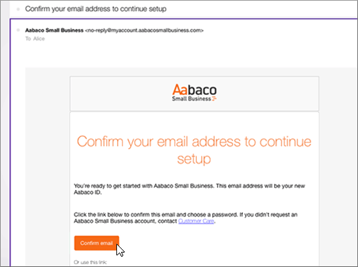

# Crear registros DNS en Yahoo! Small Business para Office 365

 **[Consulte Preguntas más frecuentes acerca de los dominios](../setup/domains-faq.md)** si no encuentra lo que busca. 
  
Si Yahoo! Small Business era su proveedor de host DNS, es importante que conozca que ahora su proveedor es Aabaco Small Business.
  
Siga los pasos que se indican en este artículo para crear una cuenta en Aabaco, donde puede realizar cambios en la configuración DNS y renovar sus dominios.
  
Debe crear una cuenta de Aabaco antes de poder [crear registros DNS](../get-help-with-domains/create-dns-records-at-any-dns-hosting-provider.md).

  
## Crear una cuenta de Aabaco Small Business

1. Para empezar, vaya a su página de dominios en Aabaco con [este vínculo](https://www.luminate.com/services/)y seleccione **configurar la cuenta de Aabaco Small Business**.
    
    
  
2. Proporcionar a su Yahoo! Correo electrónico de pequeña empresa **/identificador de Yahoo**y, a continuación, seleccione **no soy un robot**.
    
    
  
3. Seleccione **Introducción**.
    
    
  
4. Inicie sesión en su cuenta de correo electrónico de Yahoo! Small Business y abra el nuevo correo electrónico de Aabaco Small Business.
    
    > [!NOTE]
    > Si necesita volver a enviar el mensaje, elija el vínculo **Reenviar correo electrónico** en la página **Tienes correo**. 
  
    
  
5. En el mensaje de correo electrónico **confirmar su dirección de correo electrónico para continuar** con la instalación, seleccione **Confirmar correo electrónico**.
    
    
  
6. En la página **Elija la contraseña**, escriba (o copie y pegue) la contraseña que quiera usar para su cuenta de Aabaco. 
    
    > [!NOTE]
    > Puede usar la misma contraseña que usó con su cuenta de Yahoo! Small Business. 
  
    
  
7. Seleccione Acepto **los términos y condiciones**y, a continuación, seleccione **Crear contraseña**.
    
    
  
8. Inicie sesión en su cuenta de correo electrónico de Yahoo! Small Business y, después, abra el mensaje de Aabaco Small Business.
    
    > [!NOTE]
    > Si necesita volver a enviar el mensaje, elija el vínculo **Reenviar correo electrónico** en la página **Casi ha terminado**. 
  
    
  
9. En el mensaje de correo electrónico **casi ha terminado** de Aabaco, seleccione **activar mi cuenta**.
    
    
  
10. Inicie sesión en su cuenta de Aabaco Small Business.
    
    
  
Después de crear su cuenta de Aabaco, puede [crear registros DNS en Aabaco Small Business para Office 365](../get-help-with-domains/create-dns-records-at-any-dns-hosting-provider.md).
  
